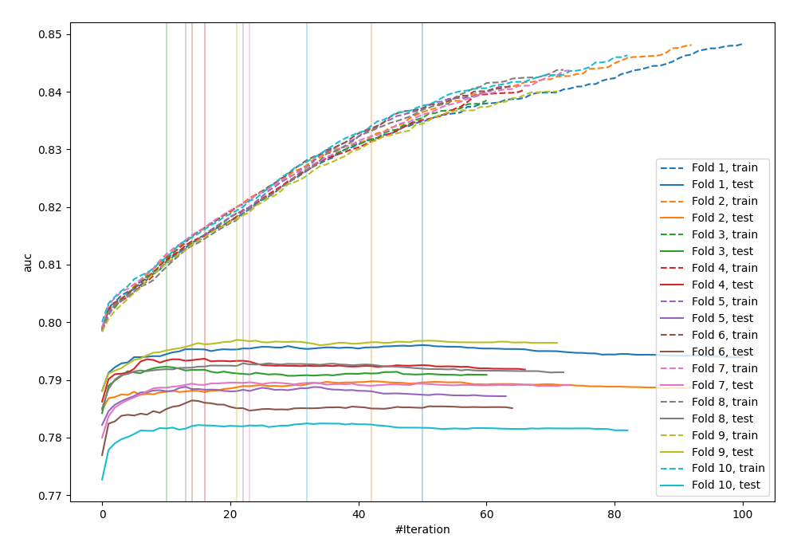
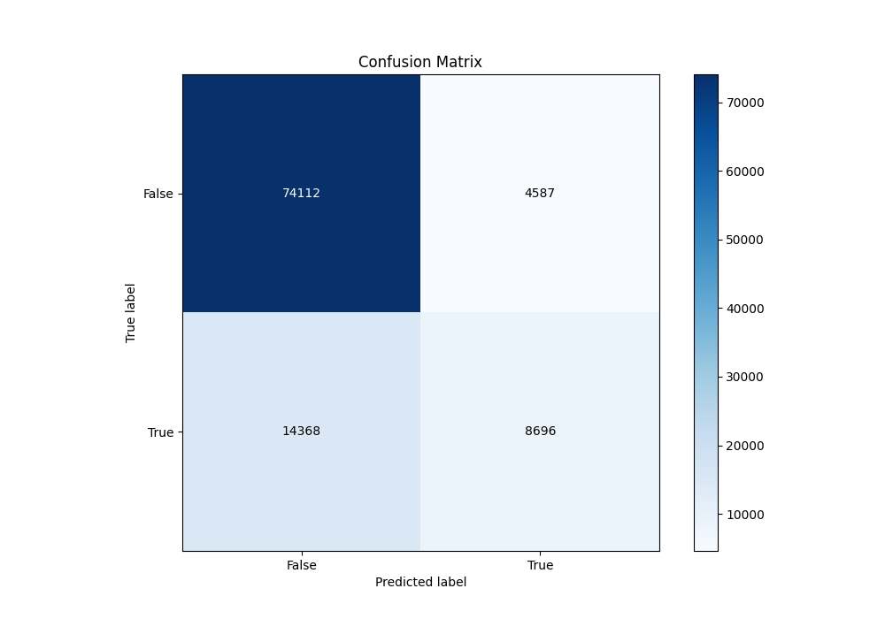
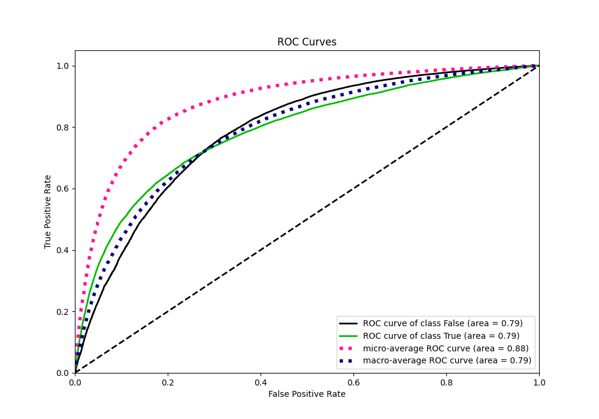
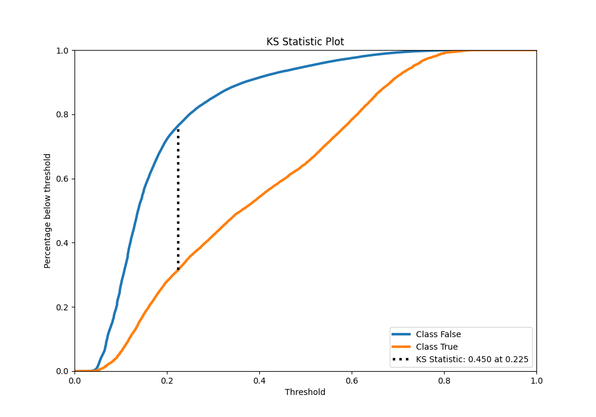
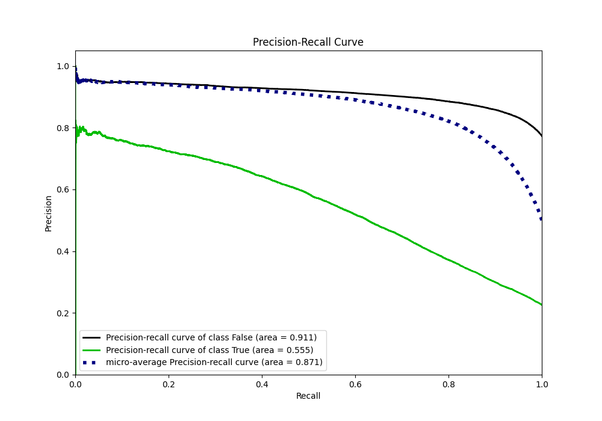
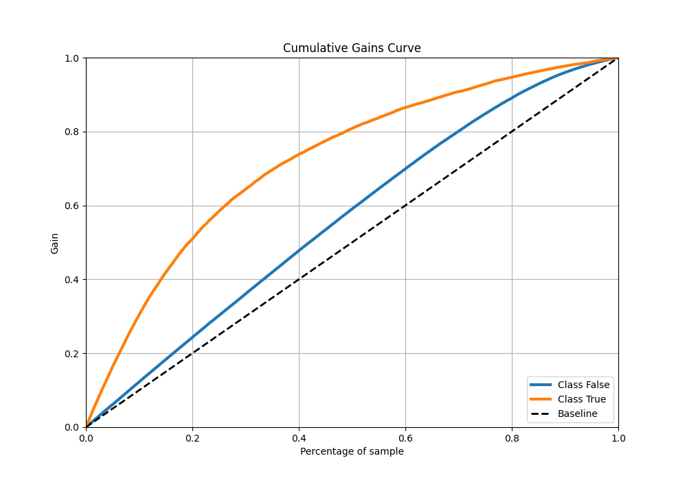
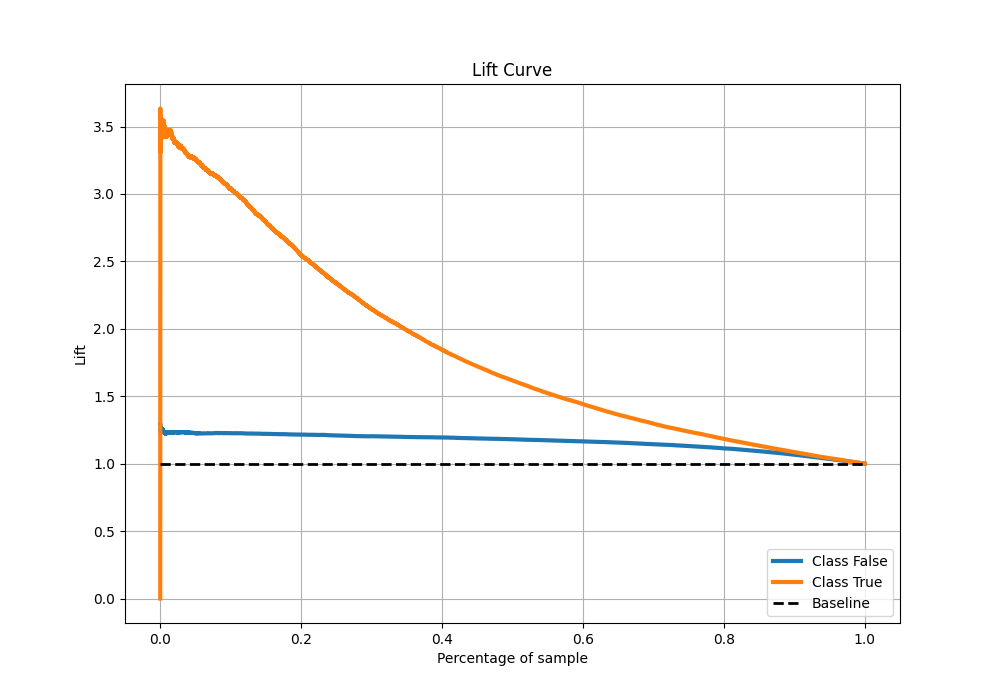

# Summary of 11_Xgboost

[<< Go back](../README.md)

## Extreme Gradient Boosting (Xgboost)
- **n_jobs**: -1
- **objective**: binary:logistic
- **eta**: 0.1
- **max_depth**: 8
- **min_child_weight**: 1
- **subsample**: 1.0
- **colsample_bytree**: 1.0
- **eval_metric**: auc
- **explain_level**: 0

## Validation
 - **validation_type**: kfold
 - **shuffle**: True
 - **stratify**: True
 - **k_folds**: 10

## Optimized metric
auc

## Training time

28.4 seconds

## Metric details
|           |    score |   threshold |
|:----------|---------:|------------:|
| logloss   | 0.433186 | nan         |
| auc       | 0.788099 | nan         |
| f1        | 0.557122 |   0.275313  |
| accuracy  | 0.813734 |   0.47777   |
| precision | 0.780352 |   0.749941  |
| recall    | 1        |   0.0256967 |
| mcc       | 0.421182 |   0.325394  |

## Metric details with threshold from accuracy metric
|           |    score |   threshold |
|:----------|---------:|------------:|
| logloss   | 0.433186 |   nan       |
| auc       | 0.788099 |   nan       |
| f1        | 0.478499 |     0.47777 |
| accuracy  | 0.813734 |     0.47777 |
| precision | 0.654671 |     0.47777 |
| recall    | 0.377038 |     0.47777 |
| mcc       | 0.396127 |     0.47777 |

## Confusion matrix (at threshold=0.47777)
|                  |   Predicted as False |   Predicted as True |
|:-----------------|---------------------:|--------------------:|
| Labeled as False |                74112 |                4587 |
| Labeled as True  |                14368 |                8696 |

## Learning curves

## Confusion Matrix

## Normalized Confusion Matrix

## ROC Curve

## Kolmogorov-Smirnov Statistic

## Precision-Recall Curve

## Calibration Curve

## Cumulative Gains Curve

## Lift Curve

[<< Go back](../README.md)
