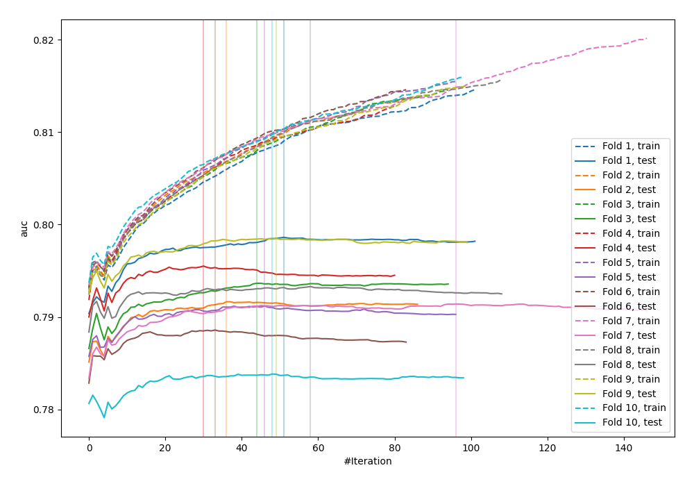
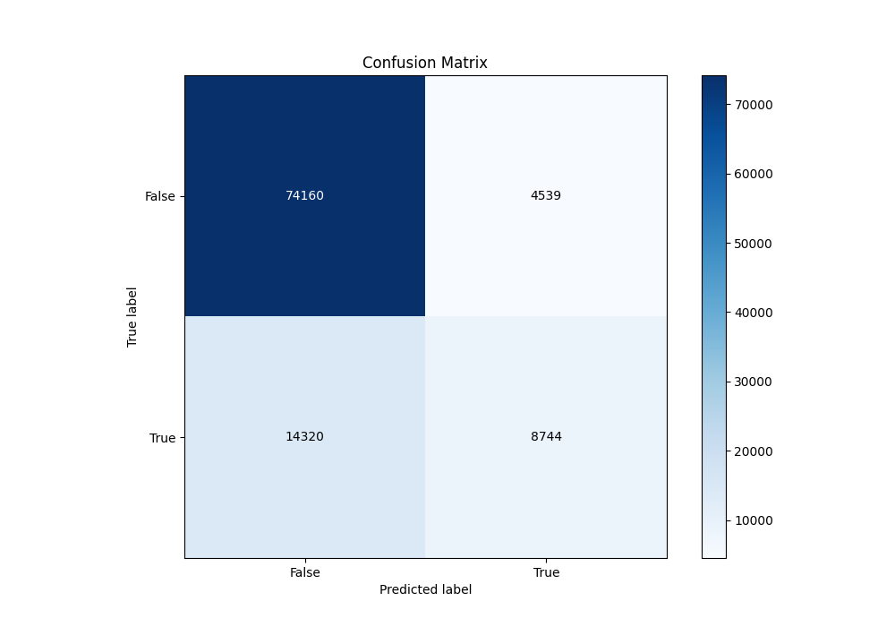
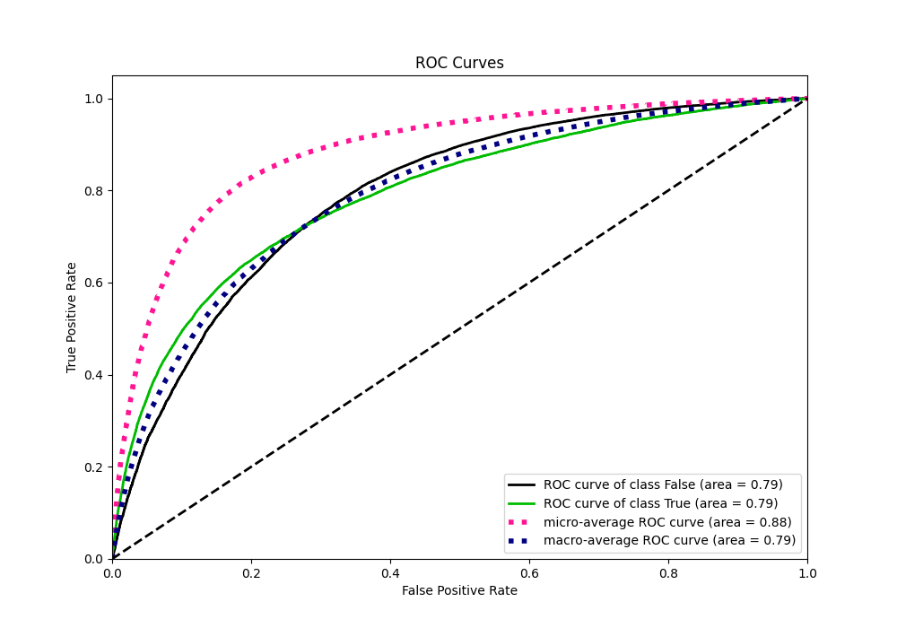
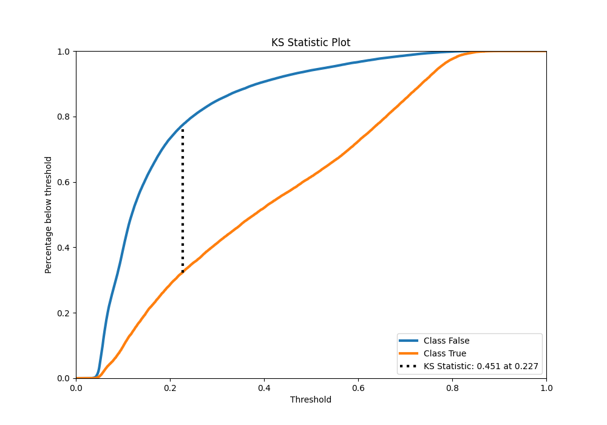
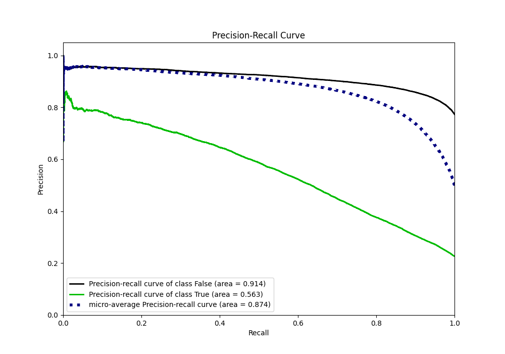
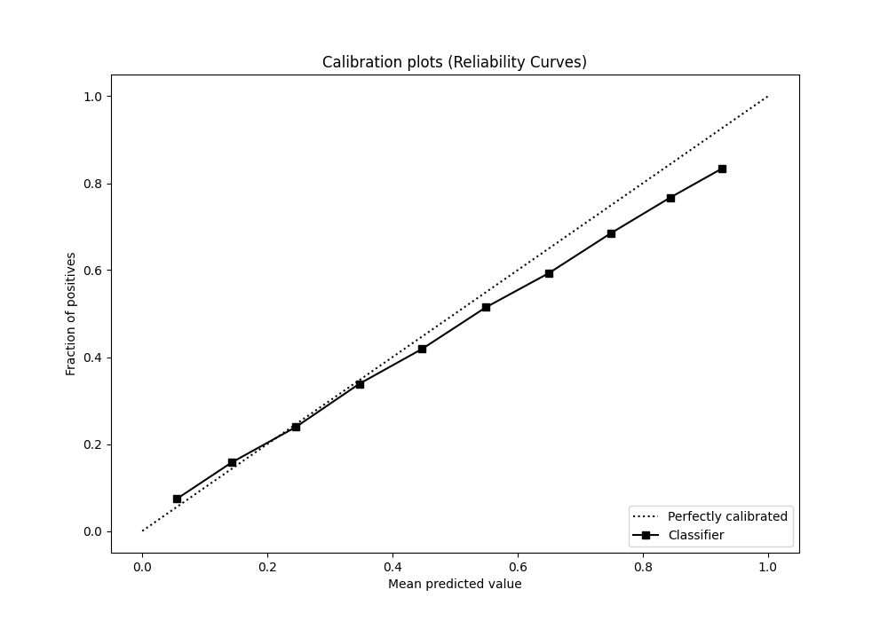
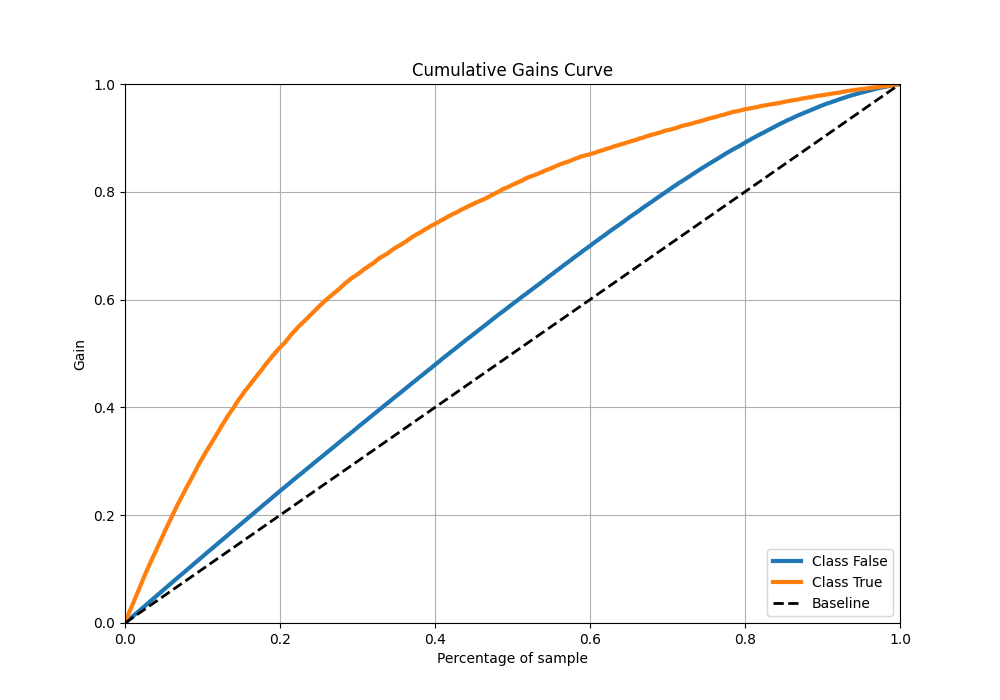
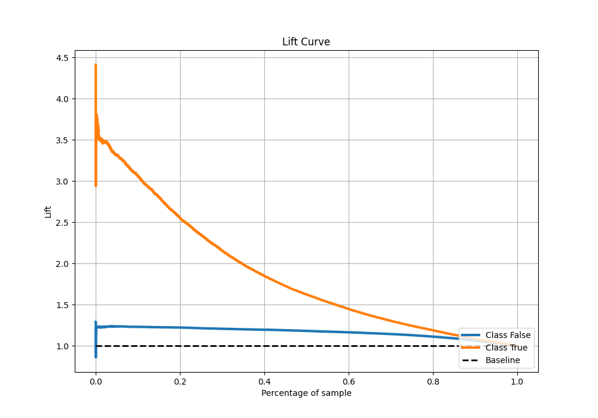

# Summary of 12_Xgboost

[<< Go back](../README.md)

## Extreme Gradient Boosting (Xgboost)
- **n_jobs**: -1
- **objective**: binary:logistic
- **eta**: 0.1
- **max_depth**: 7
- **min_child_weight**: 25
- **subsample**: 0.9
- **colsample_bytree**: 0.6
- **eval_metric**: auc
- **explain_level**: 0

## Validation
 - **validation_type**: kfold
 - **shuffle**: True
 - **stratify**: True
 - **k_folds**: 10

## Optimized metric
auc

## Training time

40.8 seconds

## Metric details
|           |    score |   threshold |
|:----------|---------:|------------:|
| logloss   | 0.428801 |  nan        |
| auc       | 0.792478 |  nan        |
| f1        | 0.559009 |    0.268307 |
| accuracy  | 0.814677 |    0.505664 |
| precision | 0.790547 |    0.78495  |
| recall    | 1        |    0.026805 |
| mcc       | 0.422654 |    0.338363 |

## Metric details with threshold from accuracy metric
|           |    score |   threshold |
|:----------|---------:|------------:|
| logloss   | 0.428801 |  nan        |
| auc       | 0.792478 |  nan        |
| f1        | 0.48114  |    0.505664 |
| accuracy  | 0.814677 |    0.505664 |
| precision | 0.658285 |    0.505664 |
| recall    | 0.379119 |    0.505664 |
| mcc       | 0.399472 |    0.505664 |

## Confusion matrix (at threshold=0.505664)
|                  |   Predicted as False |   Predicted as True |
|:-----------------|---------------------:|--------------------:|
| Labeled as False |                74160 |                4539 |
| Labeled as True  |                14320 |                8744 |

## Learning curves

## Confusion Matrix

## Normalized Confusion Matrix

## ROC Curve

## Kolmogorov-Smirnov Statistic

## Precision-Recall Curve

## Calibration Curve

## Cumulative Gains Curve

## Lift Curve

[<< Go back](../README.md)
