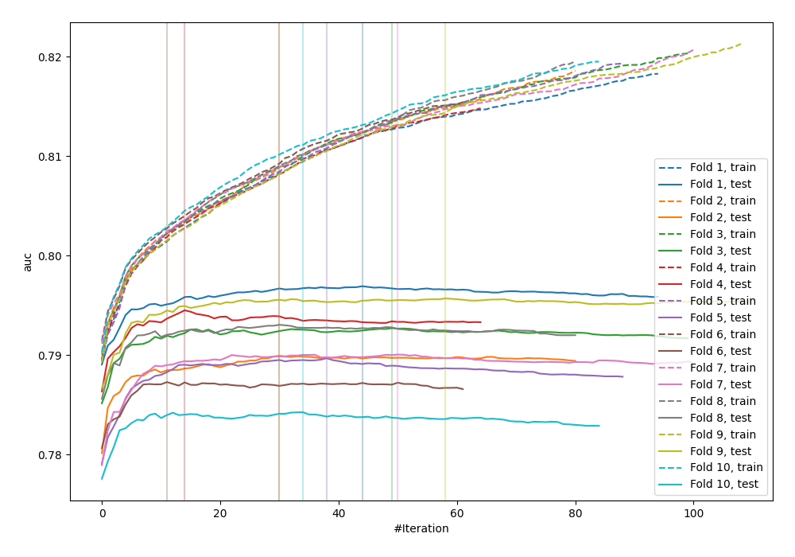
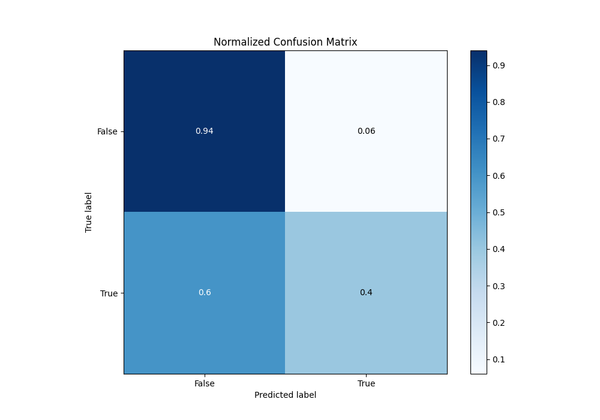
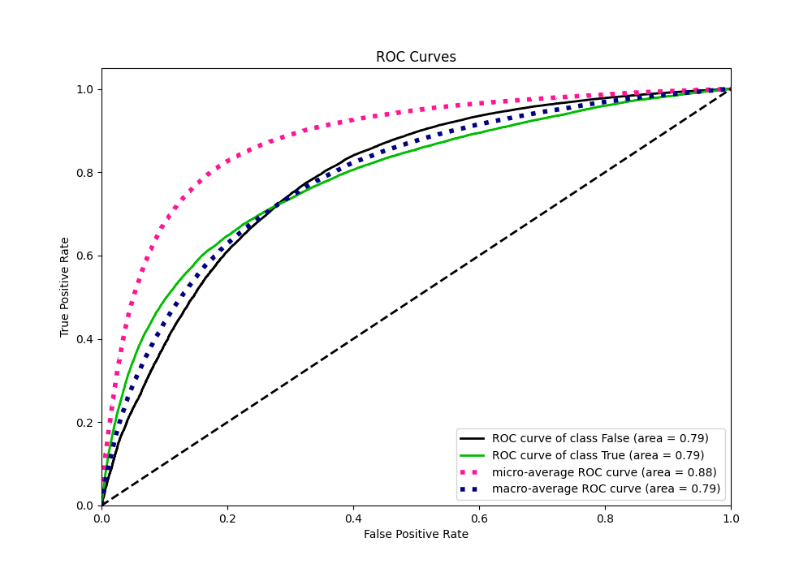
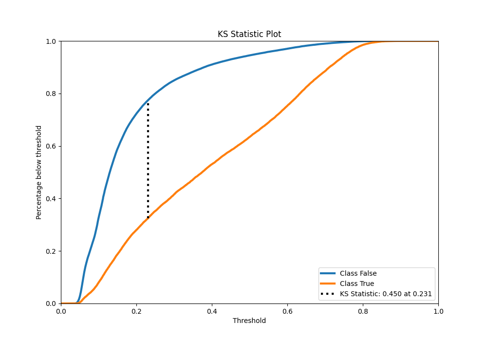
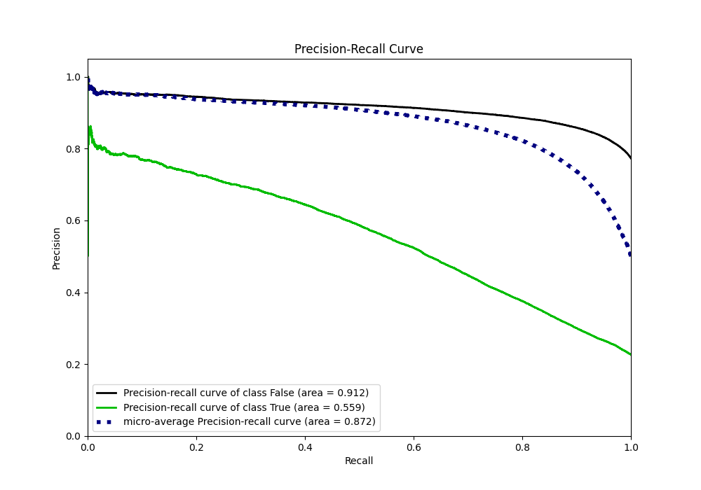
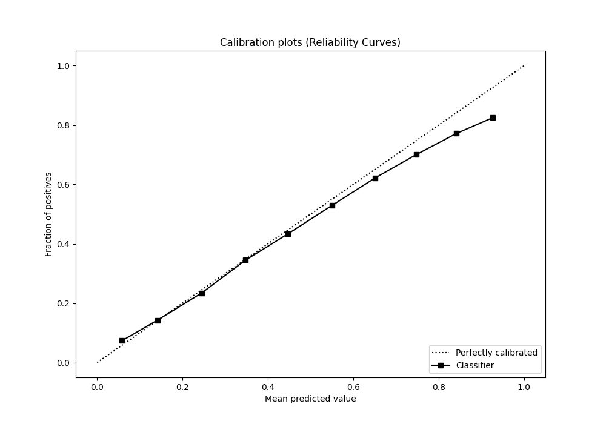
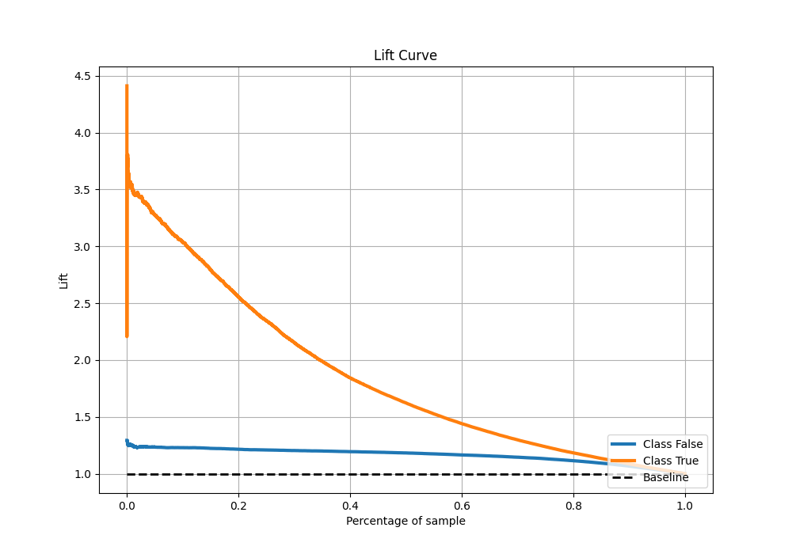

# Summary of 12_Xgboost_KMeansFeatures

[<< Go back](../README.md)

## Extreme Gradient Boosting (Xgboost)
- **n_jobs**: -1
- **objective**: binary:logistic
- **eta**: 0.1
- **max_depth**: 7
- **min_child_weight**: 25
- **subsample**: 0.9
- **colsample_bytree**: 0.6
- **eval_metric**: auc
- **explain_level**: 0

## Validation
 - **validation_type**: kfold
 - **shuffle**: True
 - **stratify**: True
 - **k_folds**: 10

## Optimized metric
auc

## Training time

51.5 seconds

## Metric details
|           |    score |   threshold |
|:----------|---------:|------------:|
| logloss   | 0.431162 | nan         |
| auc       | 0.789208 | nan         |
| f1        | 0.559312 |   0.28748   |
| accuracy  | 0.813999 |   0.468138  |
| precision | 0.7924   |   0.769569  |
| recall    | 1        |   0.0274544 |
| mcc       | 0.421722 |   0.322659  |

## Metric details with threshold from accuracy metric
|           |    score |   threshold |
|:----------|---------:|------------:|
| logloss   | 0.431162 |  nan        |
| auc       | 0.789208 |  nan        |
| f1        | 0.493416 |    0.468138 |
| accuracy  | 0.813999 |    0.468138 |
| precision | 0.644615 |    0.468138 |
| recall    | 0.39967  |    0.468138 |
| mcc       | 0.403683 |    0.468138 |

## Confusion matrix (at threshold=0.468138)
|                  |   Predicted as False |   Predicted as True |
|:-----------------|---------------------:|--------------------:|
| Labeled as False |                73617 |                5082 |
| Labeled as True  |                13846 |                9218 |

## Learning curves

## Confusion Matrix

## Normalized Confusion Matrix

## ROC Curve

## Kolmogorov-Smirnov Statistic

## Precision-Recall Curve

## Calibration Curve

## Cumulative Gains Curve

## Lift Curve

[<< Go back](../README.md)
