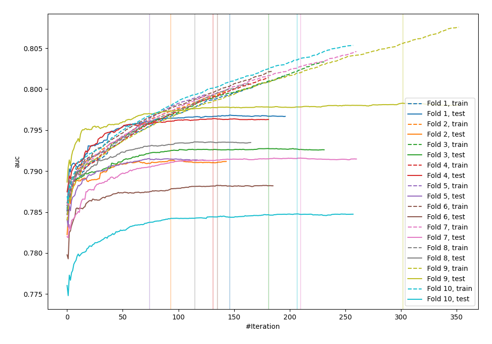
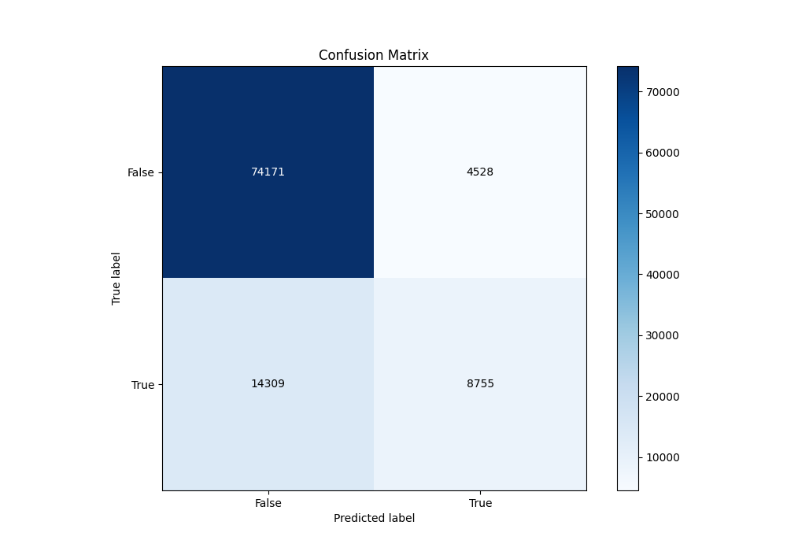
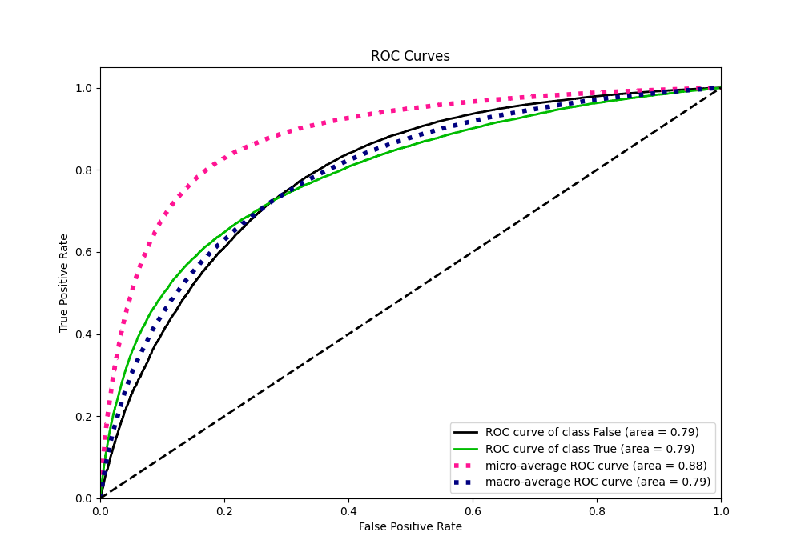
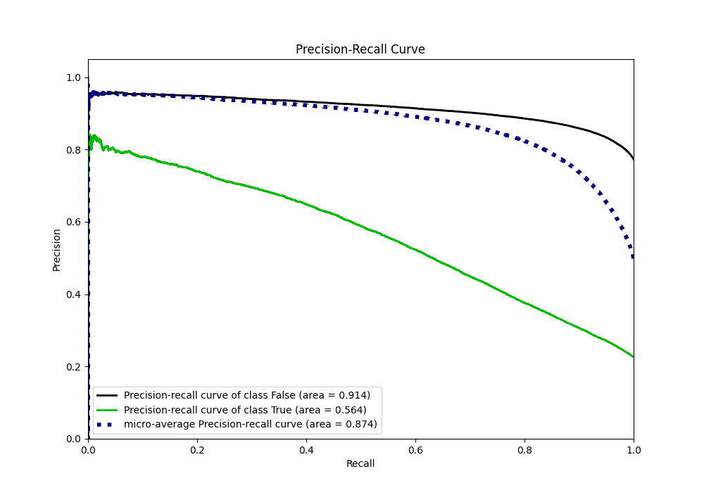
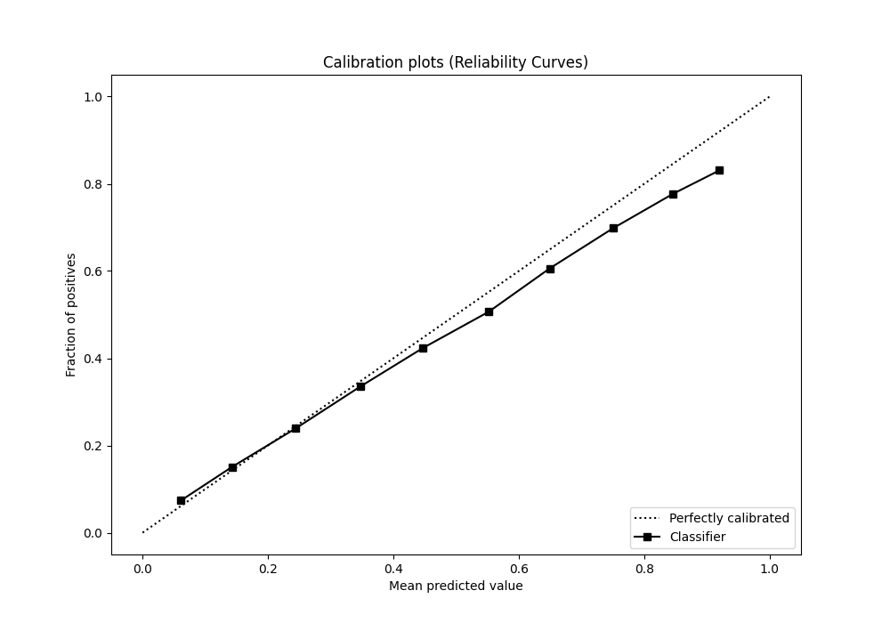
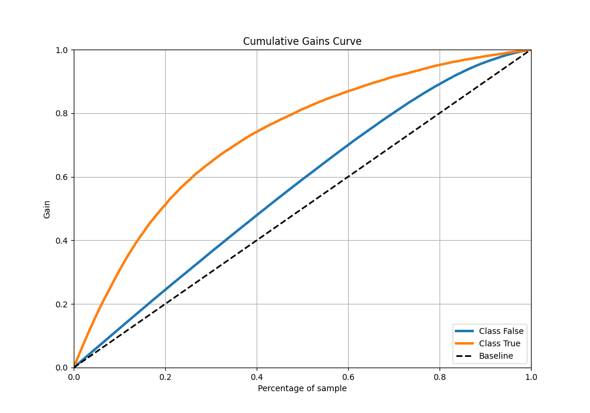
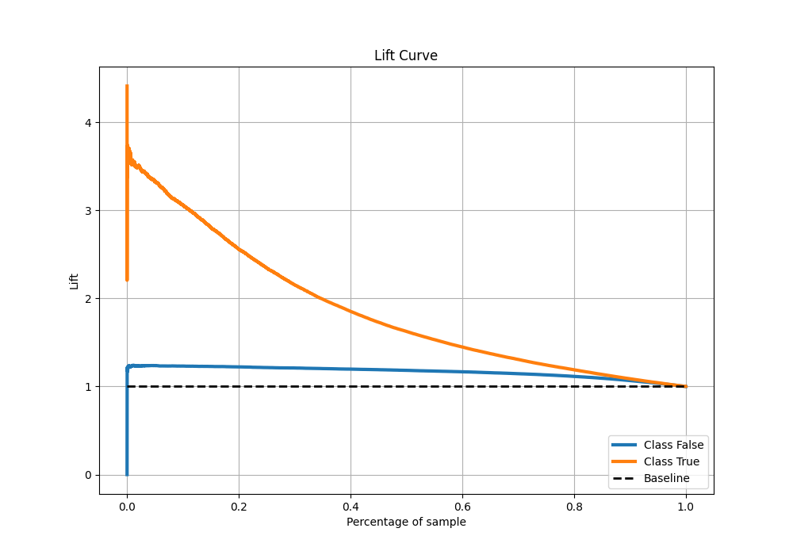

# Summary of 19_LightGBM

[<< Go back](../README.md)

## LightGBM
- **n_jobs**: -1
- **objective**: binary
- **num_leaves**: 15
- **learning_rate**: 0.05
- **feature_fraction**: 0.8
- **bagging_fraction**: 0.5
- **min_data_in_leaf**: 50
- **metric**: auc
- **custom_eval_metric_name**: None
- **explain_level**: 0

## Validation
 - **validation_type**: kfold
 - **shuffle**: True
 - **stratify**: True
 - **k_folds**: 10

## Optimized metric
auc

## Training time

25.2 seconds

## Metric details
|           |    score |   threshold |
|:----------|---------:|------------:|
| logloss   | 0.428698 | nan         |
| auc       | 0.792378 | nan         |
| f1        | 0.559296 |   0.278844  |
| accuracy  | 0.814893 |   0.513639  |
| precision | 0.798888 |   0.783627  |
| recall    | 1        |   0.0196053 |
| mcc       | 0.424269 |   0.352434  |

## Metric details with threshold from accuracy metric
|           |    score |   threshold |
|:----------|---------:|------------:|
| logloss   | 0.428698 |  nan        |
| auc       | 0.792378 |  nan        |
| f1        | 0.481745 |    0.513639 |
| accuracy  | 0.814893 |    0.513639 |
| precision | 0.659113 |    0.513639 |
| recall    | 0.379596 |    0.513639 |
| mcc       | 0.400238 |    0.513639 |

## Confusion matrix (at threshold=0.513639)
|                  |   Predicted as False |   Predicted as True |
|:-----------------|---------------------:|--------------------:|
| Labeled as False |                74171 |                4528 |
| Labeled as True  |                14309 |                8755 |

## Learning curves

## Confusion Matrix

## Normalized Confusion Matrix

## ROC Curve

## Kolmogorov-Smirnov Statistic

## Precision-Recall Curve

## Calibration Curve

## Cumulative Gains Curve

## Lift Curve

[<< Go back](../README.md)
