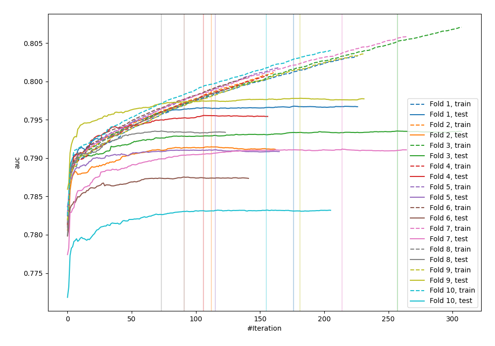
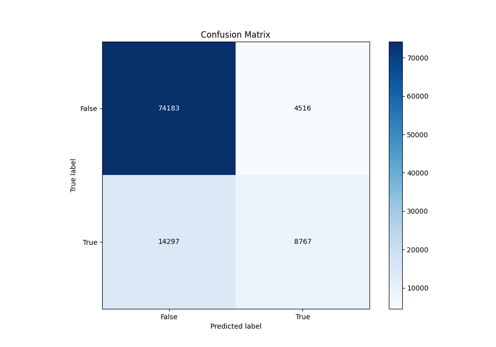
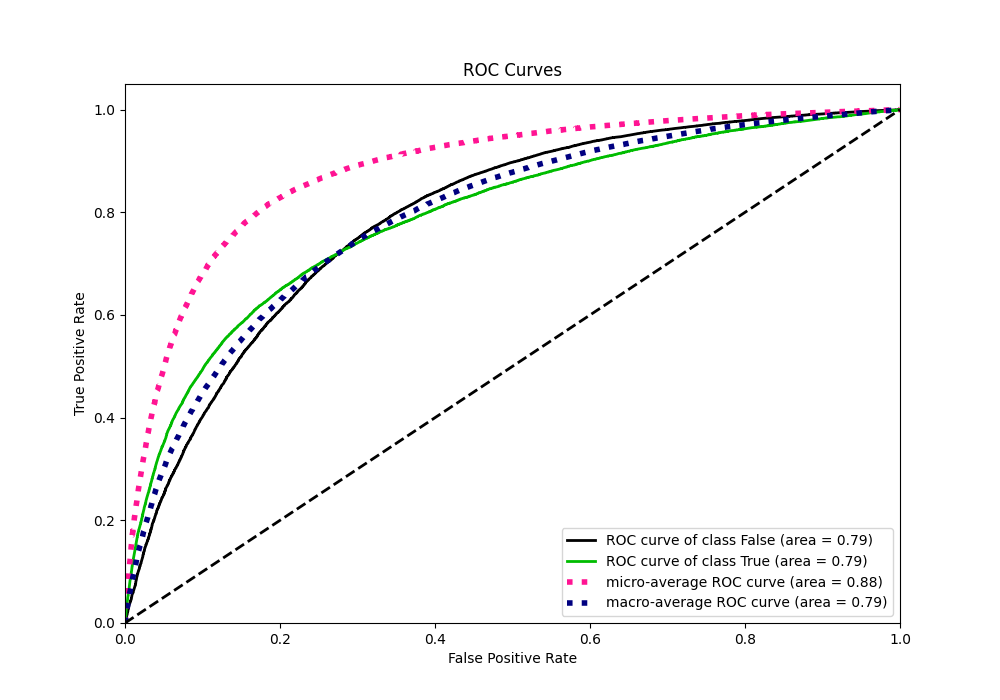
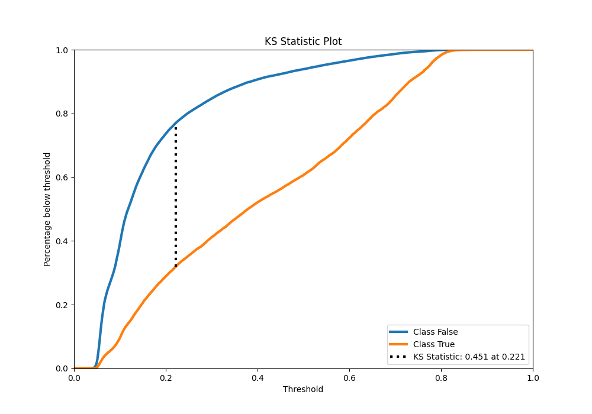
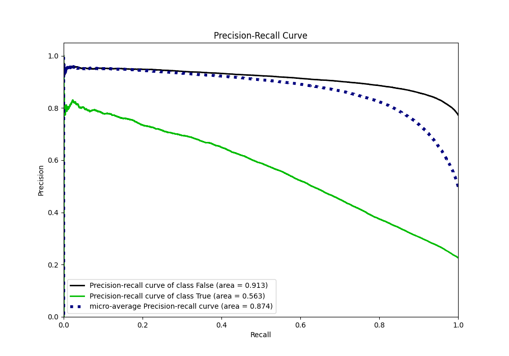
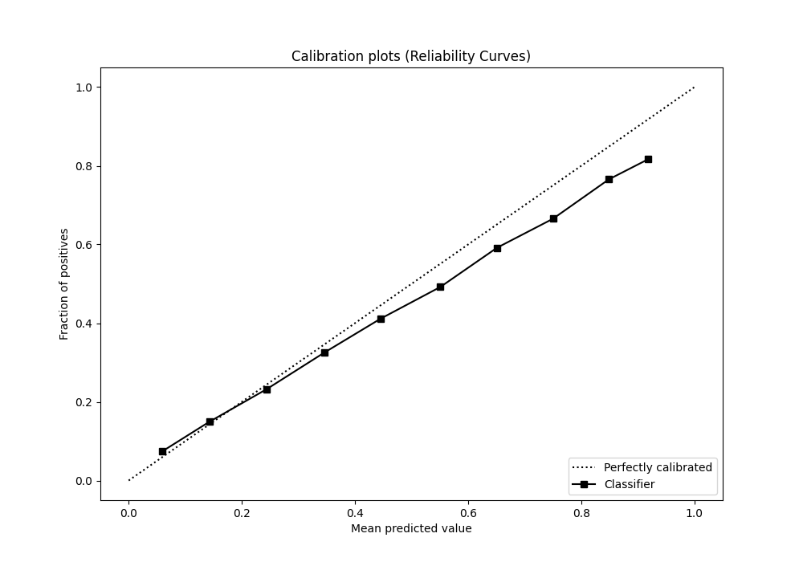
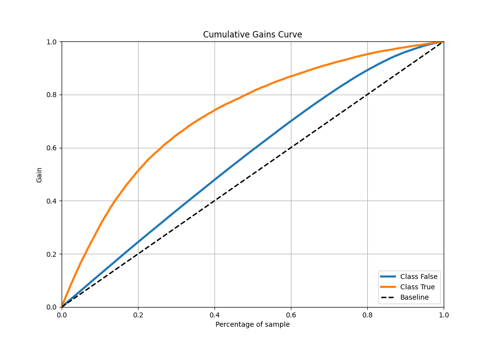
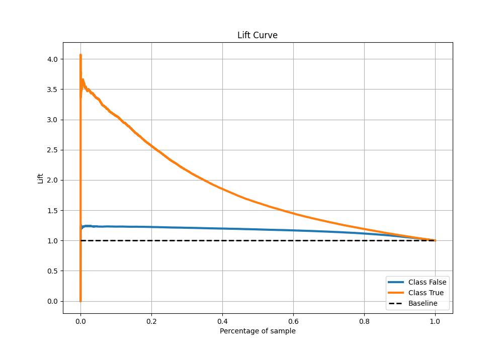

# Summary of 19_LightGBM_GoldenFeatures

[<< Go back](../README.md)

## LightGBM
- **n_jobs**: -1
- **objective**: binary
- **num_leaves**: 15
- **learning_rate**: 0.05
- **feature_fraction**: 0.8
- **bagging_fraction**: 0.5
- **min_data_in_leaf**: 50
- **metric**: auc
- **custom_eval_metric_name**: None
- **explain_level**: 0

## Validation
 - **validation_type**: kfold
 - **shuffle**: True
 - **stratify**: True
 - **k_folds**: 10

## Optimized metric
auc

## Training time

50.5 seconds

## Metric details
|           |    score |   threshold |
|:----------|---------:|------------:|
| logloss   | 0.428856 | nan         |
| auc       | 0.792034 | nan         |
| f1        | 0.559019 |   0.280646  |
| accuracy  | 0.815129 |   0.513059  |
| precision | 0.810009 |   0.782031  |
| recall    | 1        |   0.0225962 |
| mcc       | 0.424749 |   0.338421  |

## Metric details with threshold from accuracy metric
|           |    score |   threshold |
|:----------|---------:|------------:|
| logloss   | 0.428856 |  nan        |
| auc       | 0.792034 |  nan        |
| f1        | 0.482406 |    0.513059 |
| accuracy  | 0.815129 |    0.513059 |
| precision | 0.660017 |    0.513059 |
| recall    | 0.380116 |    0.513059 |
| mcc       | 0.401074 |    0.513059 |

## Confusion matrix (at threshold=0.513059)
|                  |   Predicted as False |   Predicted as True |
|:-----------------|---------------------:|--------------------:|
| Labeled as False |                74183 |                4516 |
| Labeled as True  |                14297 |                8767 |

## Learning curves

## Confusion Matrix

## Normalized Confusion Matrix

## ROC Curve

## Kolmogorov-Smirnov Statistic

## Precision-Recall Curve

## Calibration Curve

## Cumulative Gains Curve

## Lift Curve

[<< Go back](../README.md)
