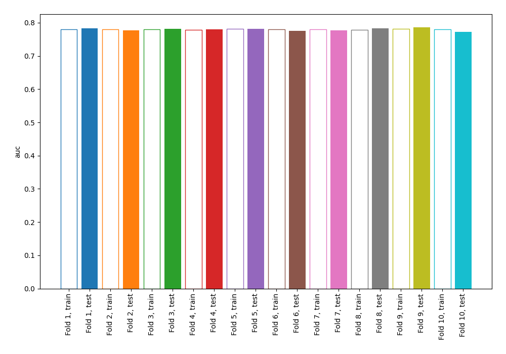
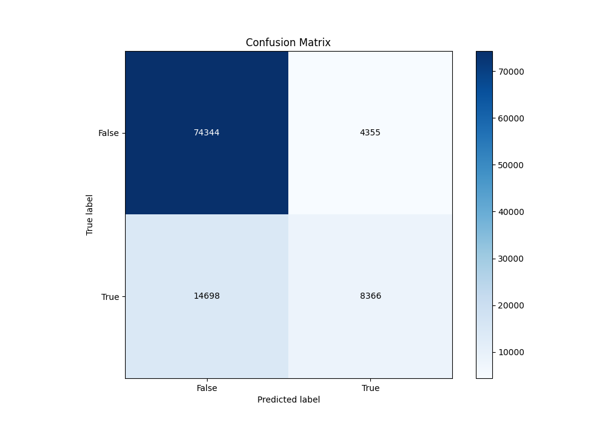
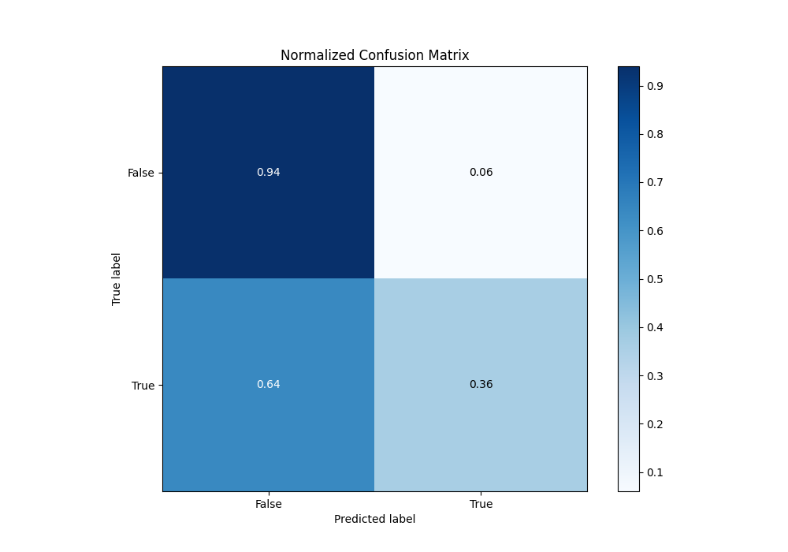
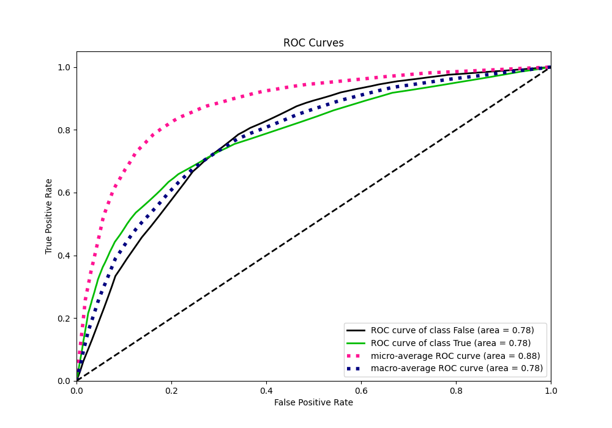
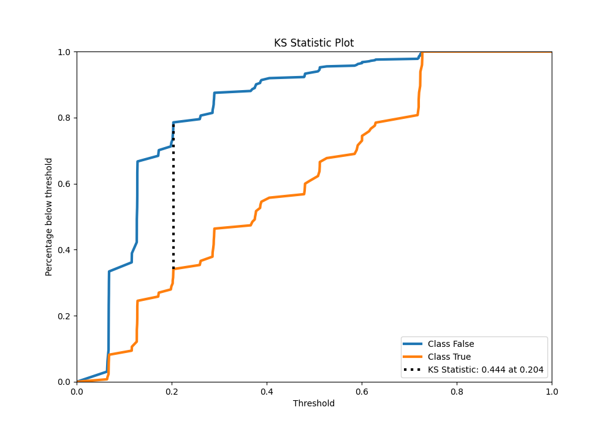
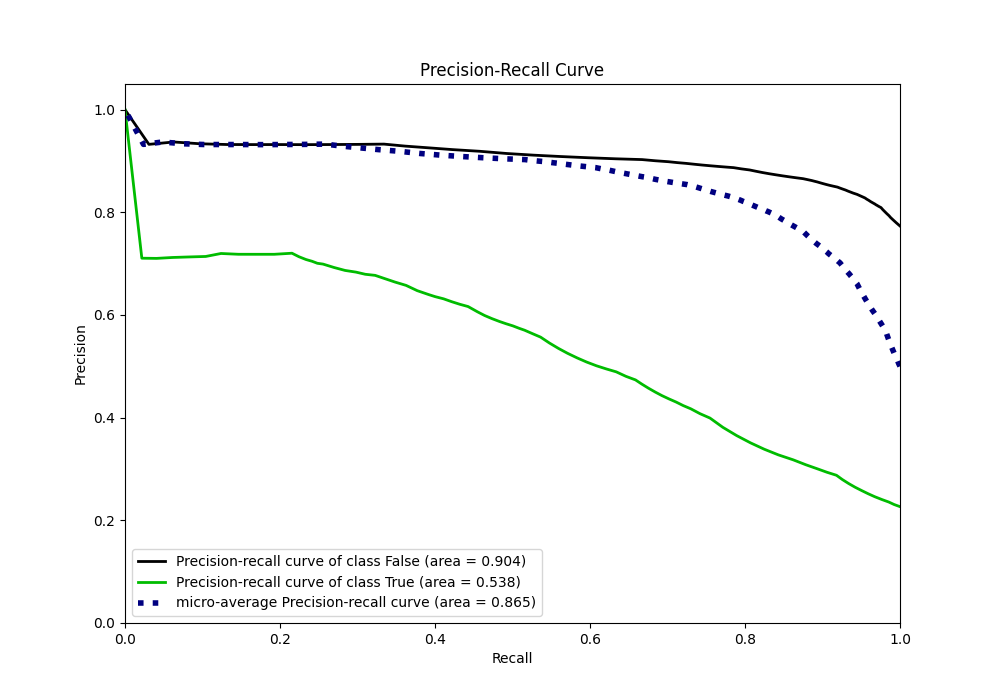
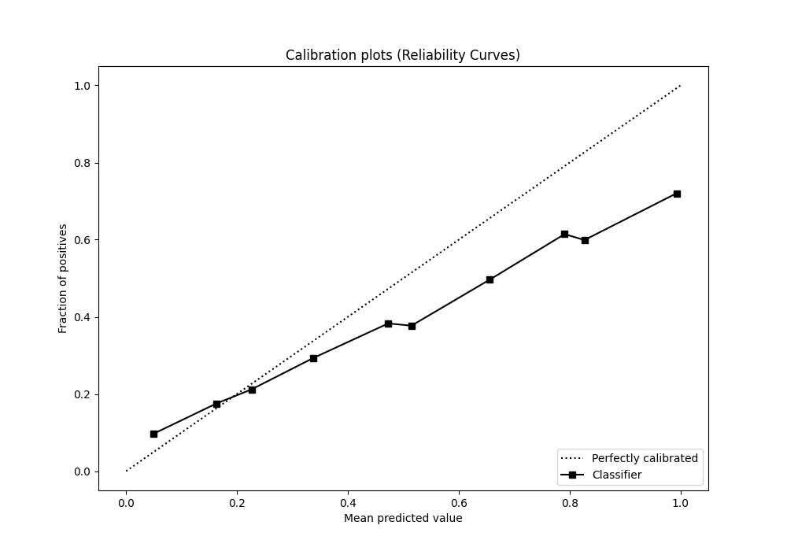
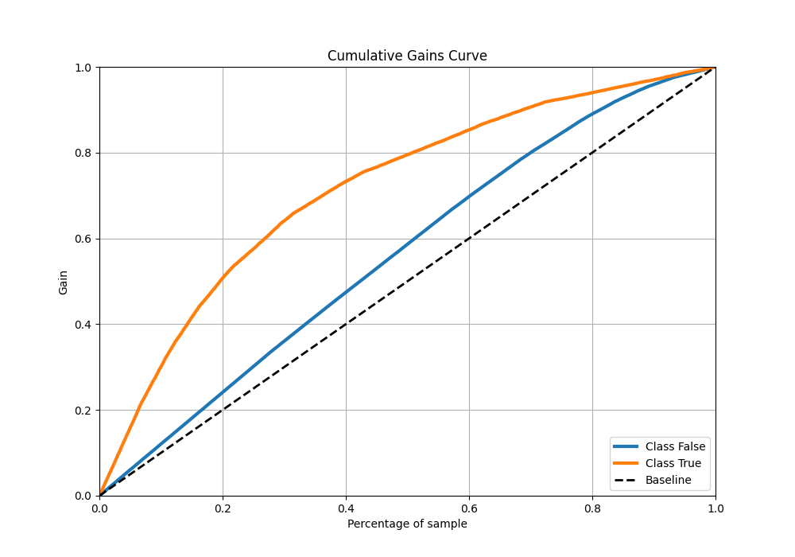
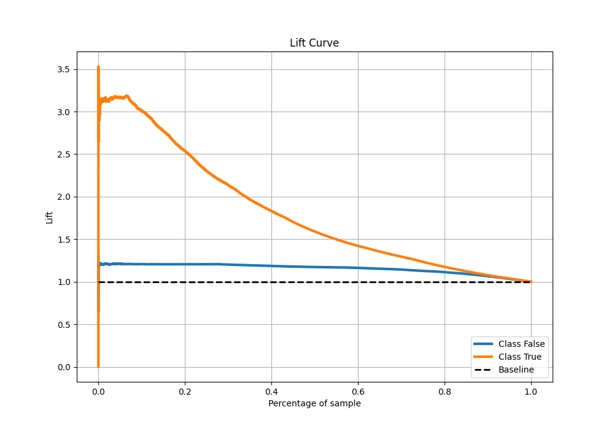

# Summary of 1_DecisionTree

[<< Go back](../README.md)

## Decision Tree
- **n_jobs**: -1
- **criterion**: gini
- **max_depth**: 3
- **explain_level**: 0

## Validation
 - **validation_type**: kfold
 - **shuffle**: True
 - **stratify**: True
 - **k_folds**: 10

## Optimized metric
auc

## Training time

15.6 seconds

## Metric details
|           |    score |   threshold |
|:----------|---------:|------------:|
| logloss   | 0.434895 | nan         |
| auc       | 0.780351 | nan         |
| f1        | 0.55225  |   0.261169  |
| accuracy  | 0.812771 |   0.511172  |
| precision | 0.720354 |   0.629435  |
| recall    | 1        |   0.0576142 |
| mcc       | 0.416783 |   0.290052  |

## Metric details with threshold from accuracy metric
|           |    score |   threshold |
|:----------|---------:|------------:|
| logloss   | 0.434895 |  nan        |
| auc       | 0.780351 |  nan        |
| f1        | 0.46757  |    0.511172 |
| accuracy  | 0.812771 |    0.511172 |
| precision | 0.657653 |    0.511172 |
| recall    | 0.36273  |    0.511172 |
| mcc       | 0.389123 |    0.511172 |

## Confusion matrix (at threshold=0.511172)
|                  |   Predicted as False |   Predicted as True |
|:-----------------|---------------------:|--------------------:|
| Labeled as False |                74344 |                4355 |
| Labeled as True  |                14698 |                8366 |

## Learning curves

## Confusion Matrix

## Normalized Confusion Matrix

## ROC Curve

## Kolmogorov-Smirnov Statistic

## Precision-Recall Curve

## Calibration Curve

## Cumulative Gains Curve

## Lift Curve

[<< Go back](../README.md)
