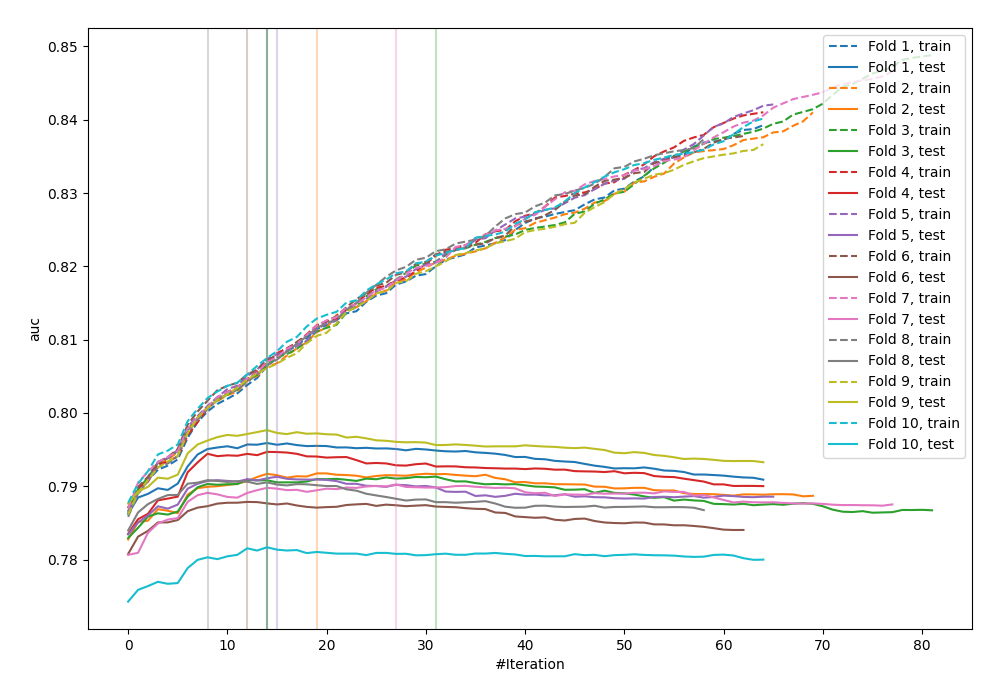
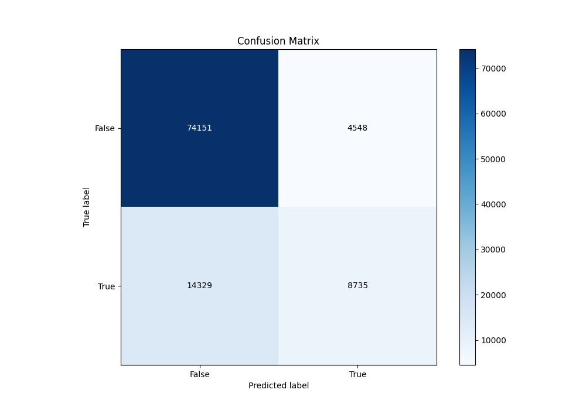
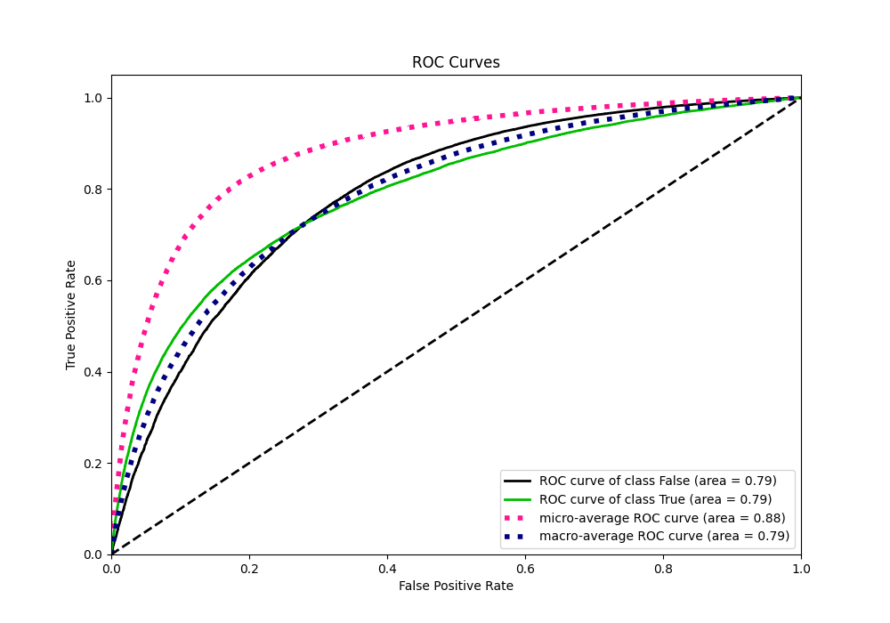
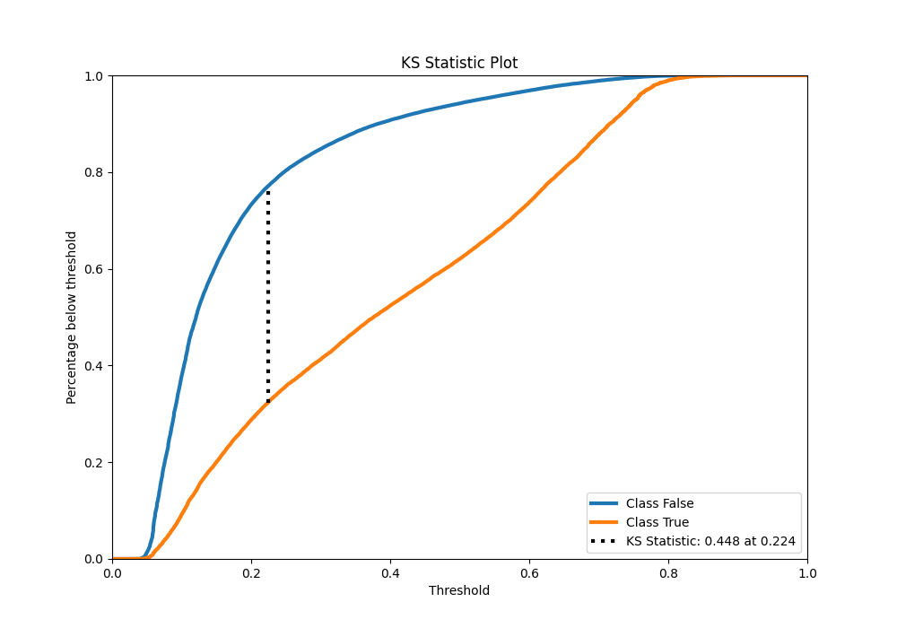
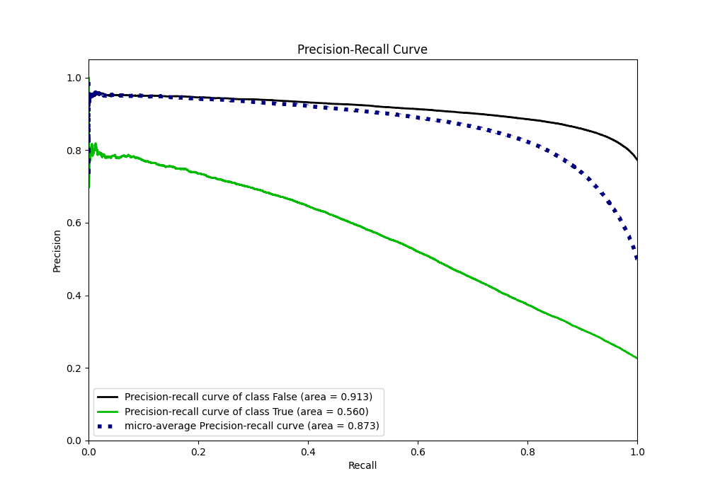
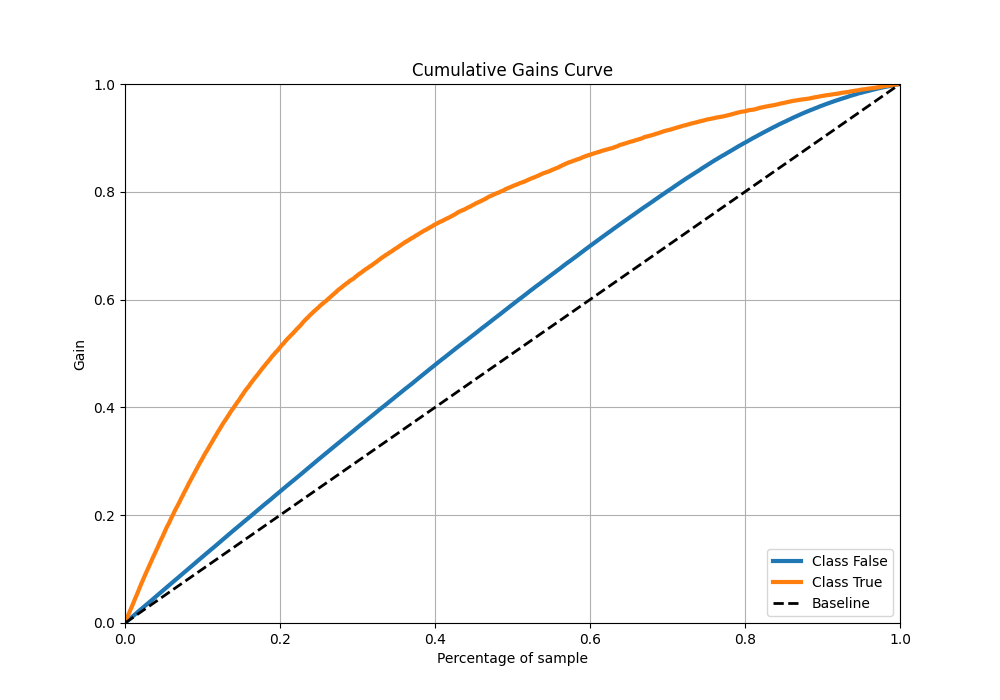
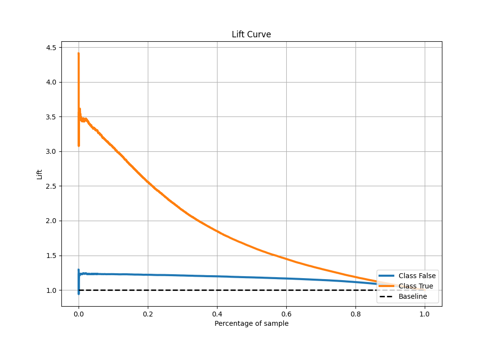

# Summary of 20_LightGBM

[<< Go back](../README.md)

## LightGBM
- **n_jobs**: -1
- **objective**: binary
- **num_leaves**: 63
- **learning_rate**: 0.2
- **feature_fraction**: 0.5
- **bagging_fraction**: 1.0
- **min_data_in_leaf**: 10
- **metric**: auc
- **custom_eval_metric_name**: None
- **explain_level**: 0

## Validation
 - **validation_type**: kfold
 - **shuffle**: True
 - **stratify**: True
 - **k_folds**: 10

## Optimized metric
auc

## Training time

20.6 seconds

## Metric details
|           |    score |   threshold |
|:----------|---------:|------------:|
| logloss   | 0.430099 | nan         |
| auc       | 0.790772 | nan         |
| f1        | 0.557873 |   0.277685  |
| accuracy  | 0.8145   |   0.50094   |
| precision | 0.784726 |   0.7386    |
| recall    | 1        |   0.0249751 |
| mcc       | 0.422335 |   0.324538  |

## Metric details with threshold from accuracy metric
|           |    score |   threshold |
|:----------|---------:|------------:|
| logloss   | 0.430099 |   nan       |
| auc       | 0.790772 |   nan       |
| f1        | 0.480645 |     0.50094 |
| accuracy  | 0.8145   |     0.50094 |
| precision | 0.657607 |     0.50094 |
| recall    | 0.378729 |     0.50094 |
| mcc       | 0.398845 |     0.50094 |

## Confusion matrix (at threshold=0.50094)
|                  |   Predicted as False |   Predicted as True |
|:-----------------|---------------------:|--------------------:|
| Labeled as False |                74151 |                4548 |
| Labeled as True  |                14329 |                8735 |

## Learning curves

## Confusion Matrix

## Normalized Confusion Matrix

## ROC Curve

## Kolmogorov-Smirnov Statistic

## Precision-Recall Curve

## Calibration Curve

## Cumulative Gains Curve

## Lift Curve

[<< Go back](../README.md)
