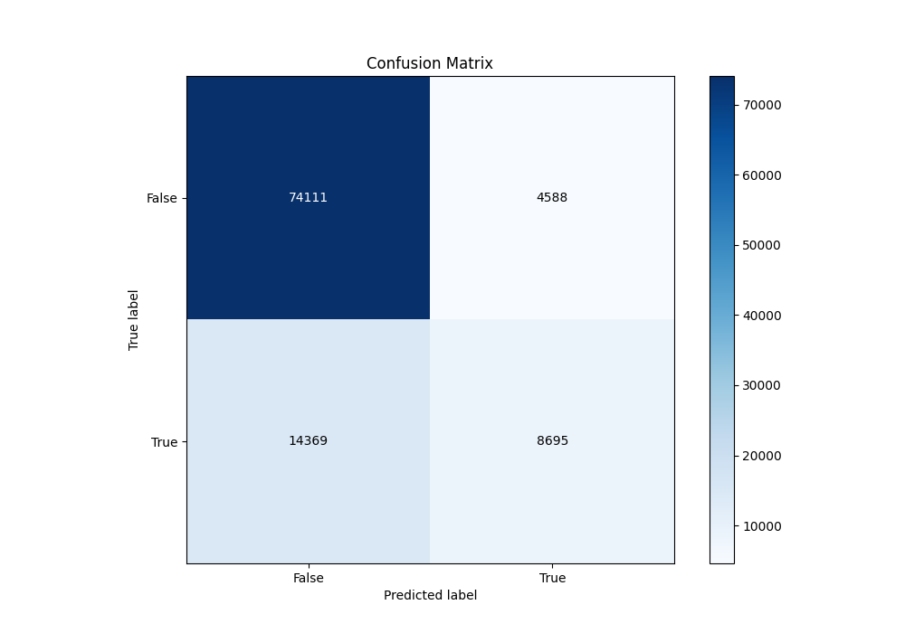
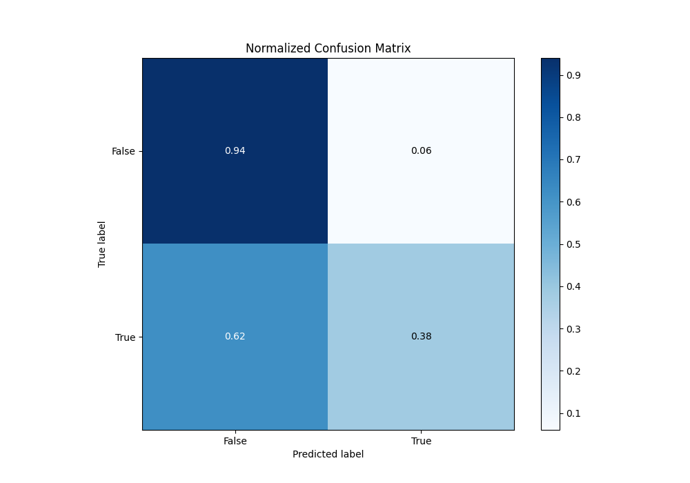
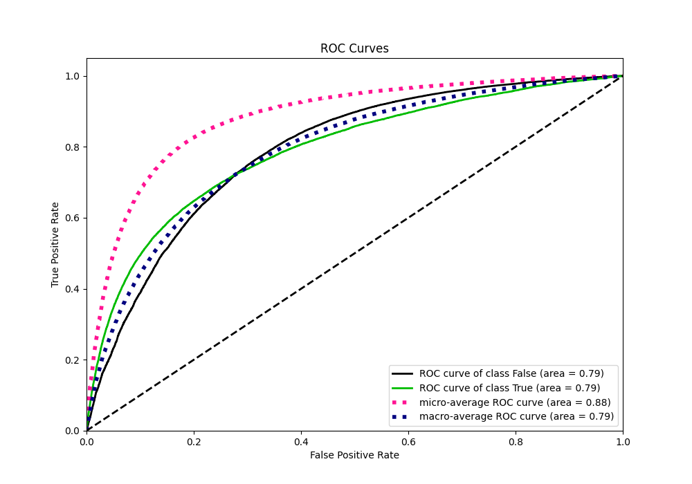
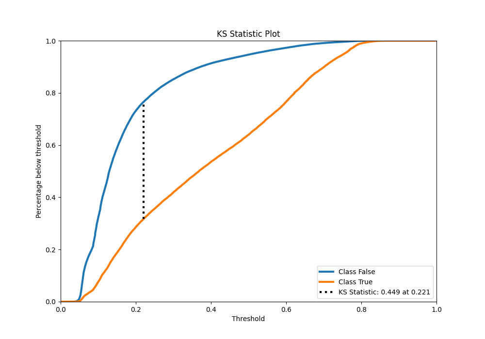
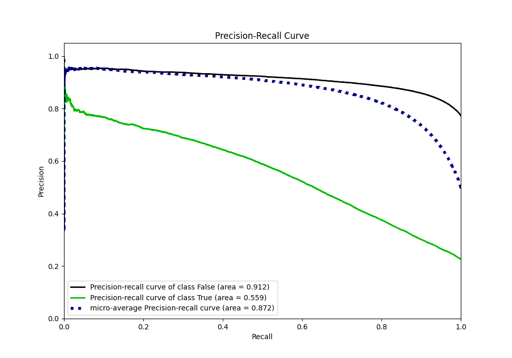
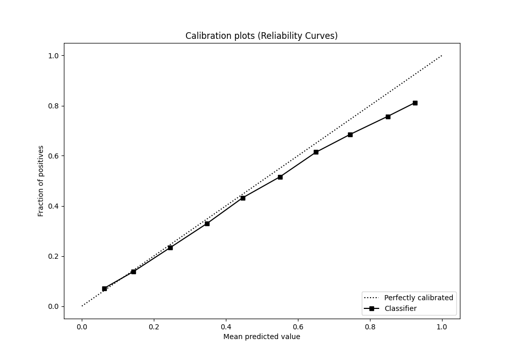
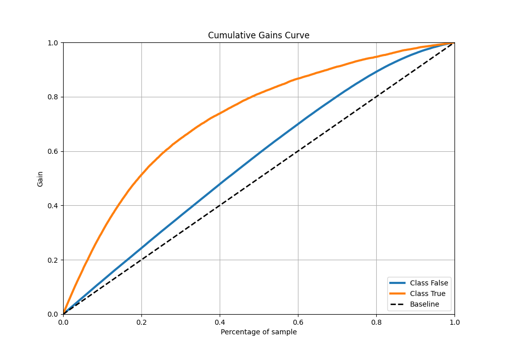
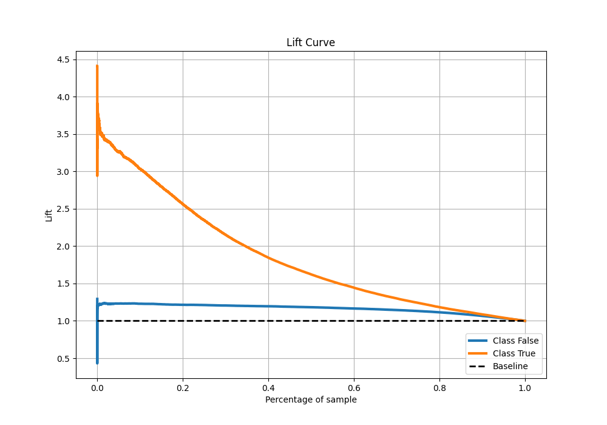

# Summary of 21_LightGBM

[<< Go back](../README.md)

## LightGBM
- **n_jobs**: -1
- **objective**: binary
- **num_leaves**: 63
- **learning_rate**: 0.05
- **feature_fraction**: 0.9
- **bagging_fraction**: 1.0
- **min_data_in_leaf**: 20
- **metric**: auc
- **custom_eval_metric_name**: None
- **explain_level**: 0

## Validation
 - **validation_type**: kfold
 - **shuffle**: True
 - **stratify**: True
 - **k_folds**: 10

## Optimized metric
auc

## Training time

38.6 seconds

## Metric details
|           |    score |   threshold |
|:----------|---------:|------------:|
| logloss   | 0.431154 | nan         |
| auc       | 0.789811 | nan         |
| f1        | 0.558544 |   0.265012  |
| accuracy  | 0.813714 |   0.484673  |
| precision | 0.796108 |   0.76717   |
| recall    | 1        |   0.0253524 |
| mcc       | 0.424466 |   0.32954   |

## Metric details with threshold from accuracy metric
|           |    score |   threshold |
|:----------|---------:|------------:|
| logloss   | 0.431154 |  nan        |
| auc       | 0.789811 |  nan        |
| f1        | 0.478444 |    0.484673 |
| accuracy  | 0.813714 |    0.484673 |
| precision | 0.654596 |    0.484673 |
| recall    | 0.376994 |    0.484673 |
| mcc       | 0.396058 |    0.484673 |

## Confusion matrix (at threshold=0.484673)
|                  |   Predicted as False |   Predicted as True |
|:-----------------|---------------------:|--------------------:|
| Labeled as False |                74111 |                4588 |
| Labeled as True  |                14369 |                8695 |

## Learning curves

## Confusion Matrix

## Normalized Confusion Matrix

## ROC Curve

## Kolmogorov-Smirnov Statistic

## Precision-Recall Curve

## Calibration Curve

## Cumulative Gains Curve

## Lift Curve

[<< Go back](../README.md)
