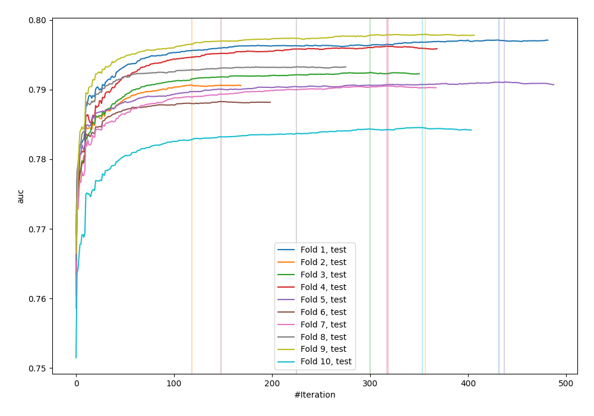
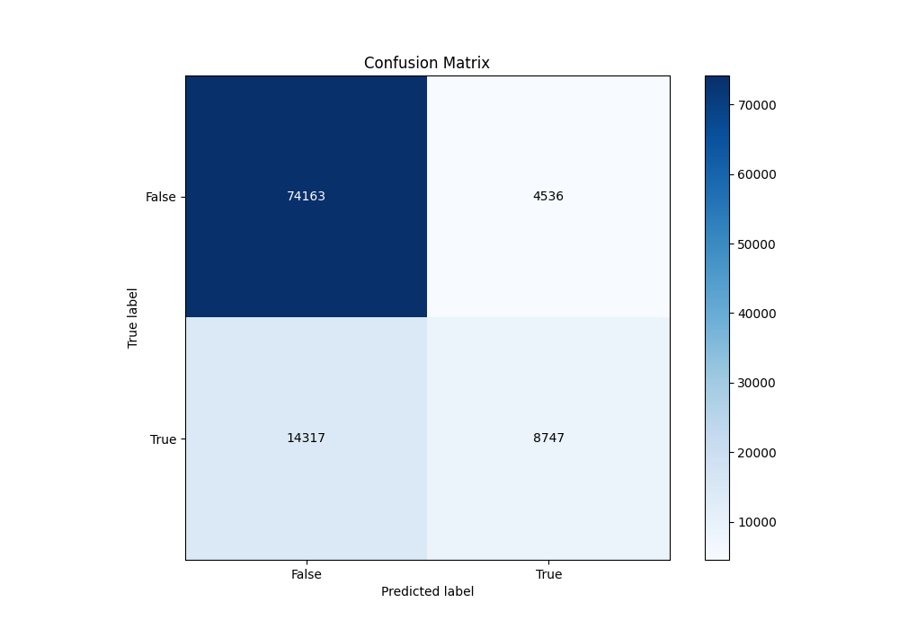
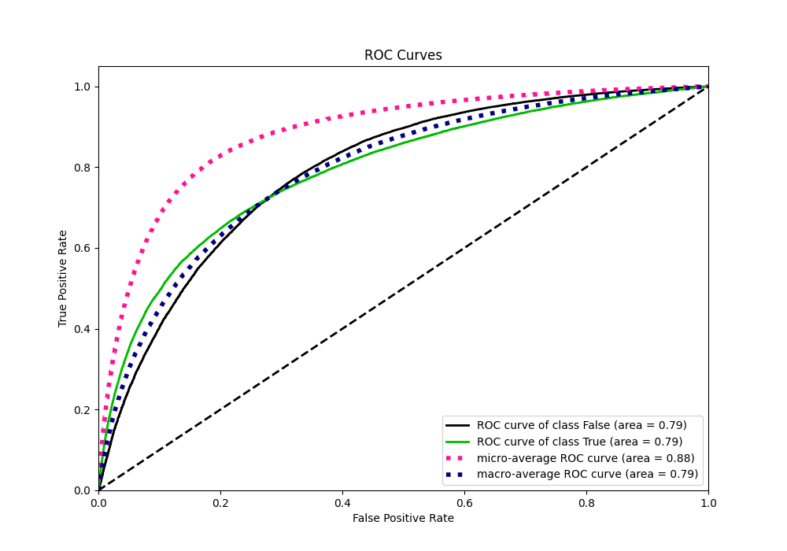
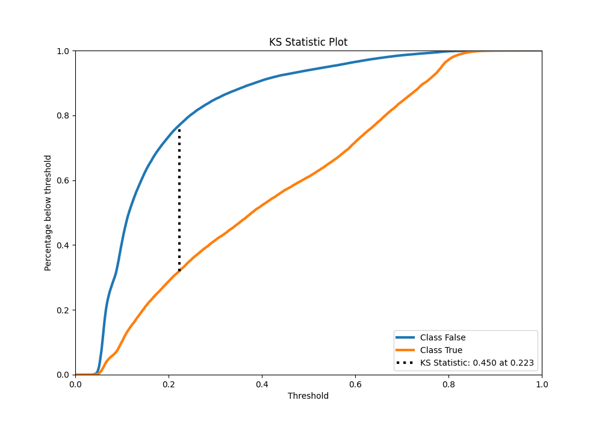
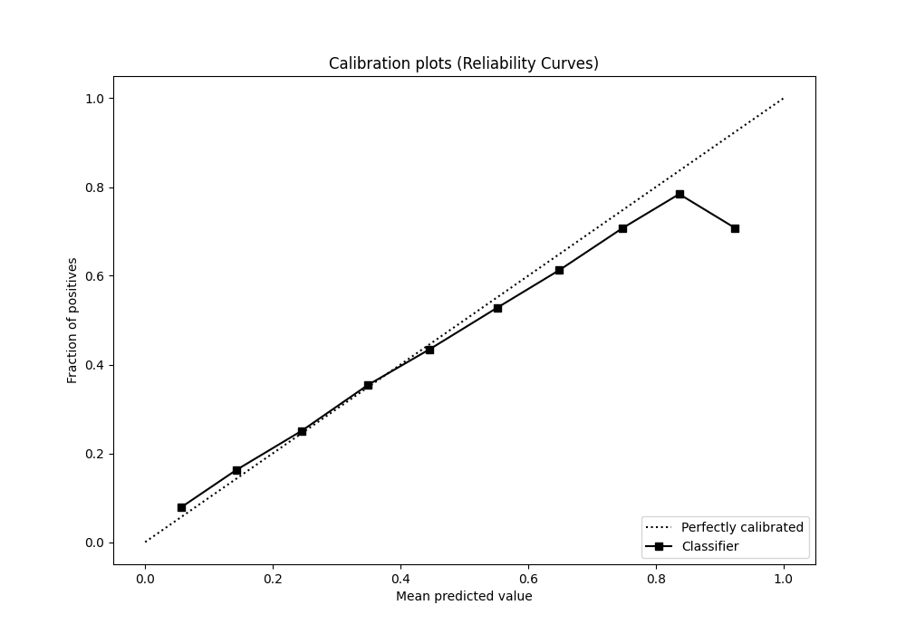
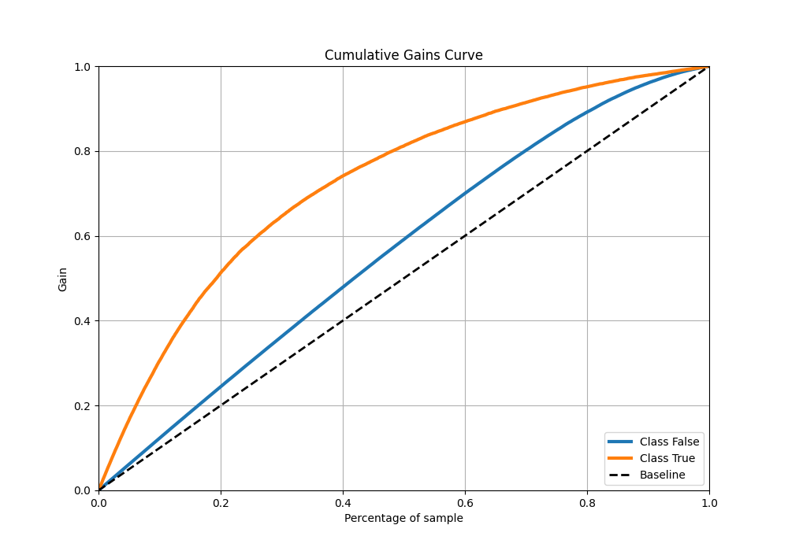
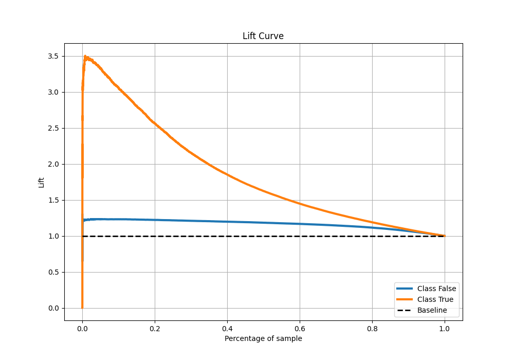

# Summary of 28_CatBoost

[<< Go back](../README.md)

## CatBoost
- **n_jobs**: -1
- **learning_rate**: 0.05
- **depth**: 8
- **rsm**: 0.8
- **loss_function**: Logloss
- **eval_metric**: AUC
- **explain_level**: 0

## Validation
 - **validation_type**: kfold
 - **shuffle**: True
 - **stratify**: True
 - **k_folds**: 10

## Optimized metric
auc

## Training time

100.1 seconds

## Metric details
|           |    score |   threshold |
|:----------|---------:|------------:|
| logloss   | 0.429058 | nan         |
| auc       | 0.792188 | nan         |
| f1        | 0.558183 |   0.286929  |
| accuracy  | 0.814736 |   0.511674  |
| precision | 0.784828 |   0.772545  |
| recall    | 1        |   0.0258341 |
| mcc       | 0.425177 |   0.324243  |

## Metric details with threshold from accuracy metric
|           |    score |   threshold |
|:----------|---------:|------------:|
| logloss   | 0.429058 |  nan        |
| auc       | 0.792188 |  nan        |
| f1        | 0.481305 |    0.511674 |
| accuracy  | 0.814736 |    0.511674 |
| precision | 0.658511 |    0.511674 |
| recall    | 0.379249 |    0.511674 |
| mcc       | 0.399681 |    0.511674 |

## Confusion matrix (at threshold=0.511674)
|                  |   Predicted as False |   Predicted as True |
|:-----------------|---------------------:|--------------------:|
| Labeled as False |                74163 |                4536 |
| Labeled as True  |                14317 |                8747 |

## Learning curves

## Confusion Matrix

## Normalized Confusion Matrix

## ROC Curve

## Kolmogorov-Smirnov Statistic

## Precision-Recall Curve

## Calibration Curve

## Cumulative Gains Curve

## Lift Curve

[<< Go back](../README.md)
