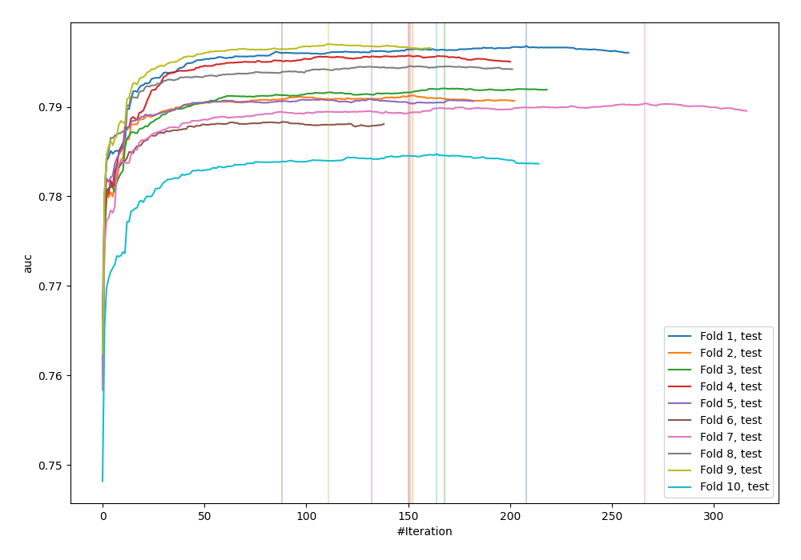
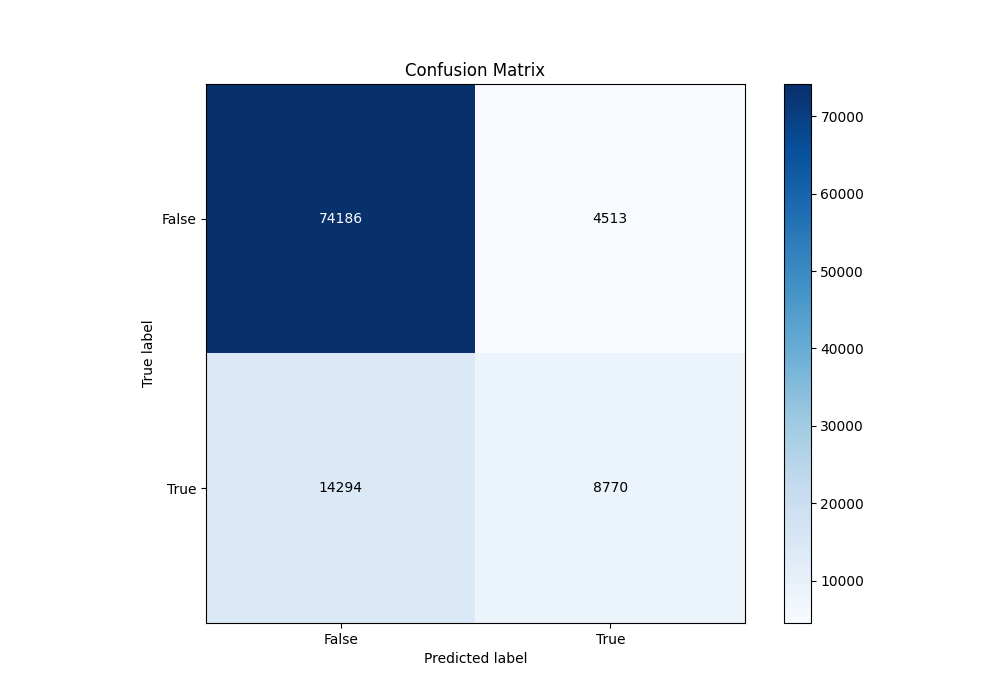
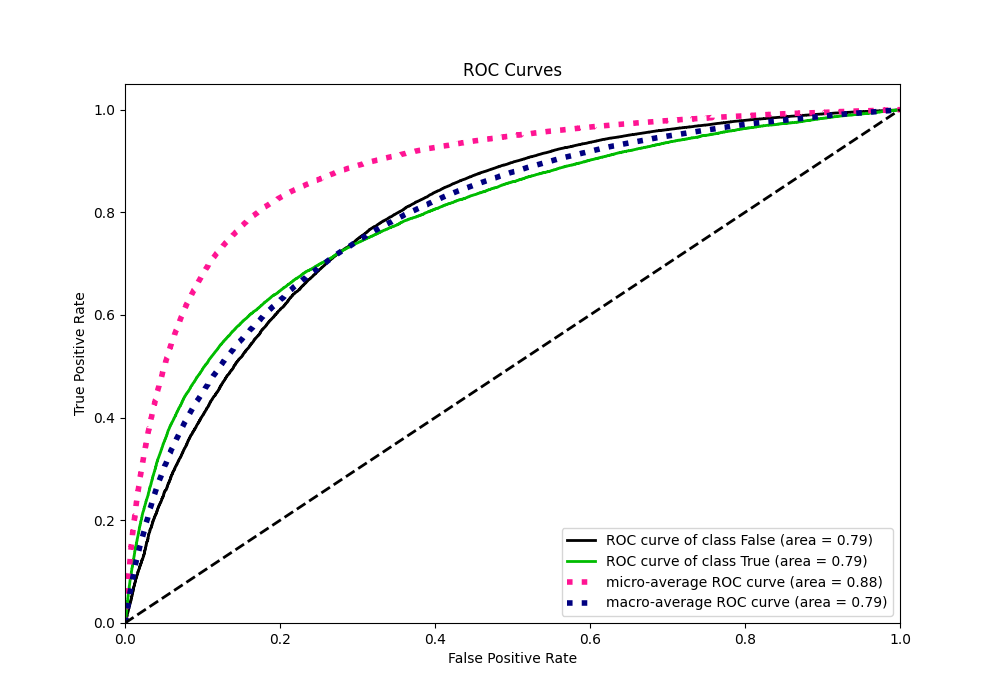
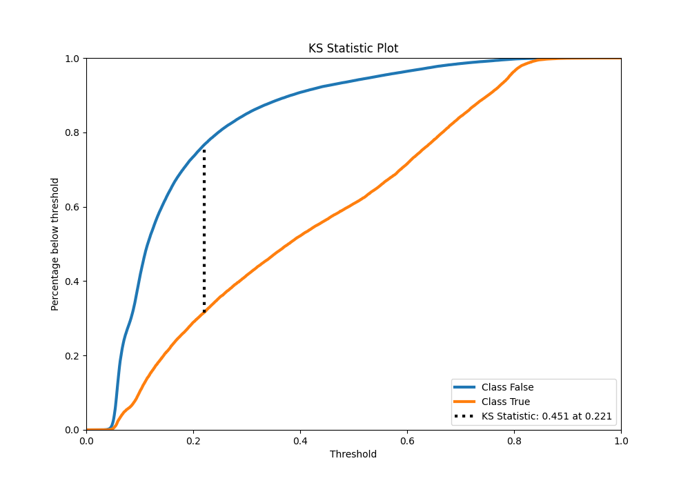
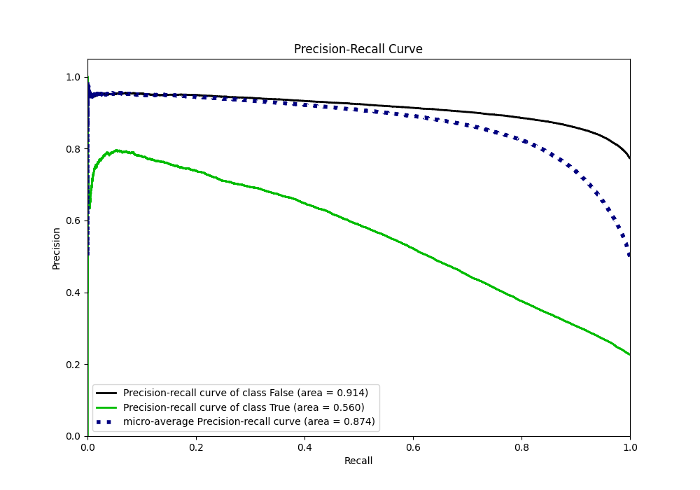
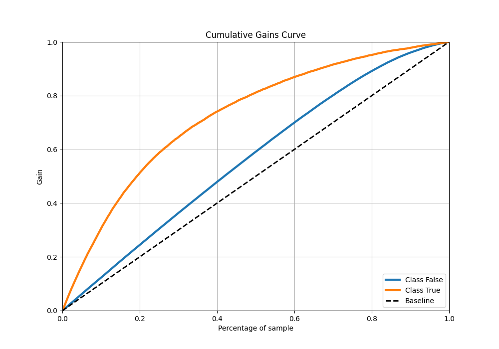
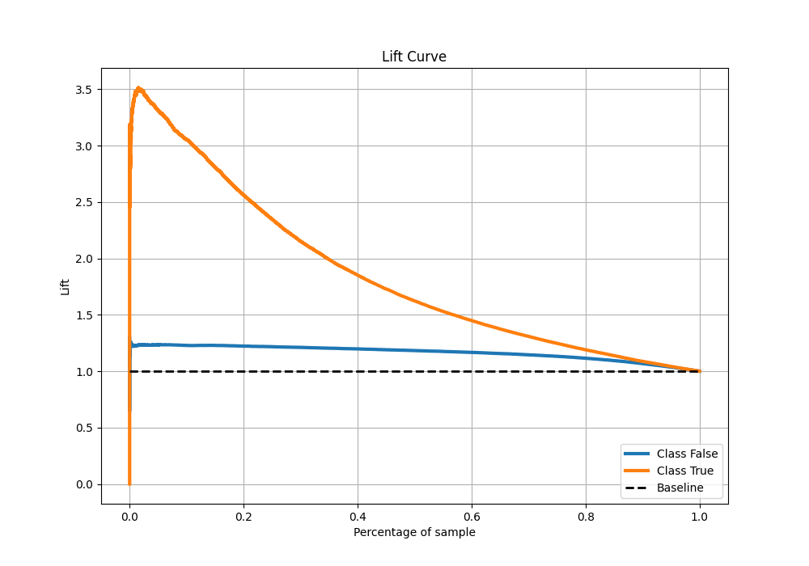

# Summary of 29_CatBoost

[<< Go back](../README.md)

## CatBoost
- **n_jobs**: -1
- **learning_rate**: 0.1
- **depth**: 8
- **rsm**: 1.0
- **loss_function**: Logloss
- **eval_metric**: AUC
- **explain_level**: 0

## Validation
 - **validation_type**: kfold
 - **shuffle**: True
 - **stratify**: True
 - **k_folds**: 10

## Optimized metric
auc

## Training time

56.7 seconds

## Metric details
|           |    score |   threshold |
|:----------|---------:|------------:|
| logloss   | 0.429217 | nan         |
| auc       | 0.792061 | nan         |
| f1        | 0.558586 |   0.286819  |
| accuracy  | 0.815188 |   0.513692  |
| precision | 0.791985 |   0.775328  |
| recall    | 1        |   0.0198592 |
| mcc       | 0.4239   |   0.336016  |

## Metric details with threshold from accuracy metric
|           |    score |   threshold |
|:----------|---------:|------------:|
| logloss   | 0.429217 |  nan        |
| auc       | 0.792061 |  nan        |
| f1        | 0.482571 |    0.513692 |
| accuracy  | 0.815188 |    0.513692 |
| precision | 0.660242 |    0.513692 |
| recall    | 0.380246 |    0.513692 |
| mcc       | 0.401283 |    0.513692 |

## Confusion matrix (at threshold=0.513692)
|                  |   Predicted as False |   Predicted as True |
|:-----------------|---------------------:|--------------------:|
| Labeled as False |                74186 |                4513 |
| Labeled as True  |                14294 |                8770 |

## Learning curves

## Confusion Matrix

## Normalized Confusion Matrix

## ROC Curve

## Kolmogorov-Smirnov Statistic

## Precision-Recall Curve

## Calibration Curve

## Cumulative Gains Curve

## Lift Curve

[<< Go back](../README.md)
