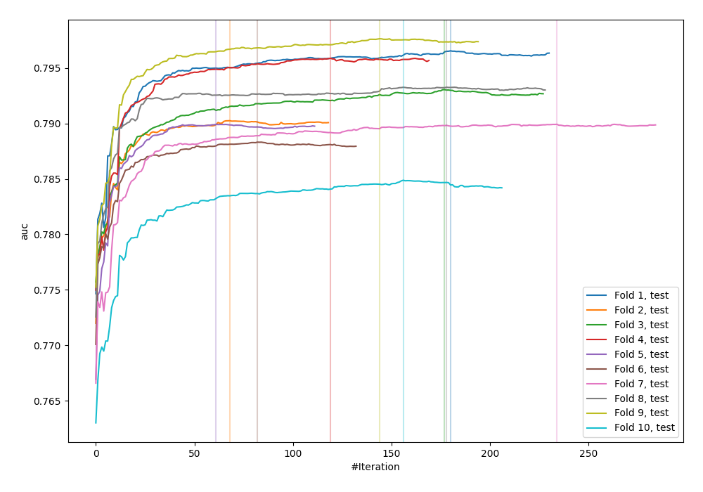
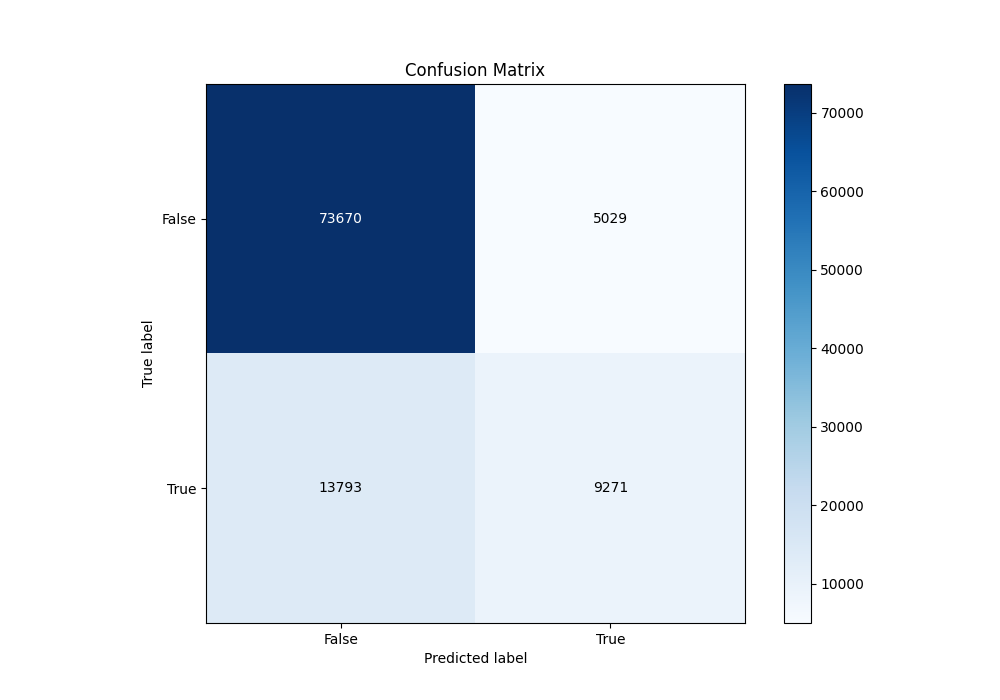
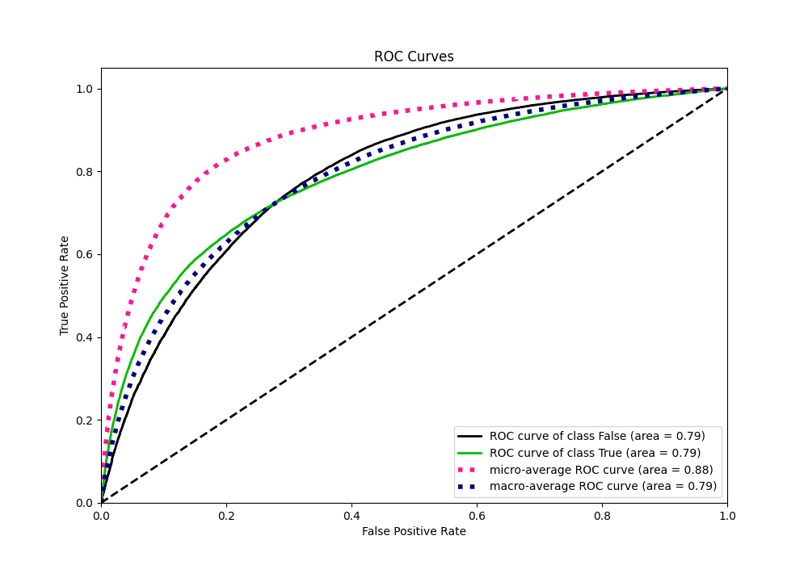
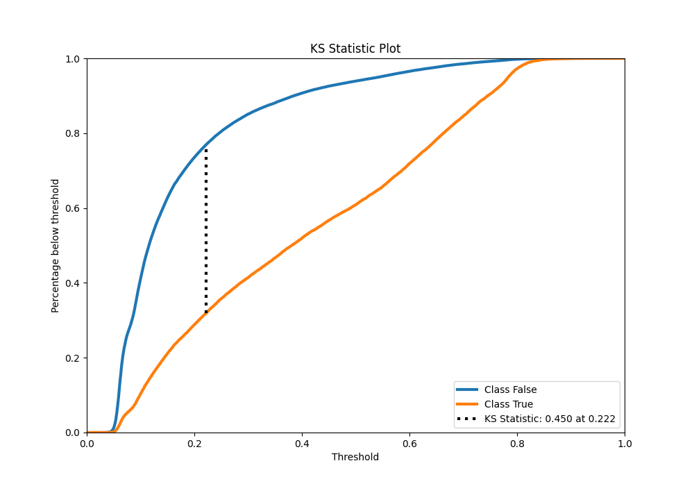
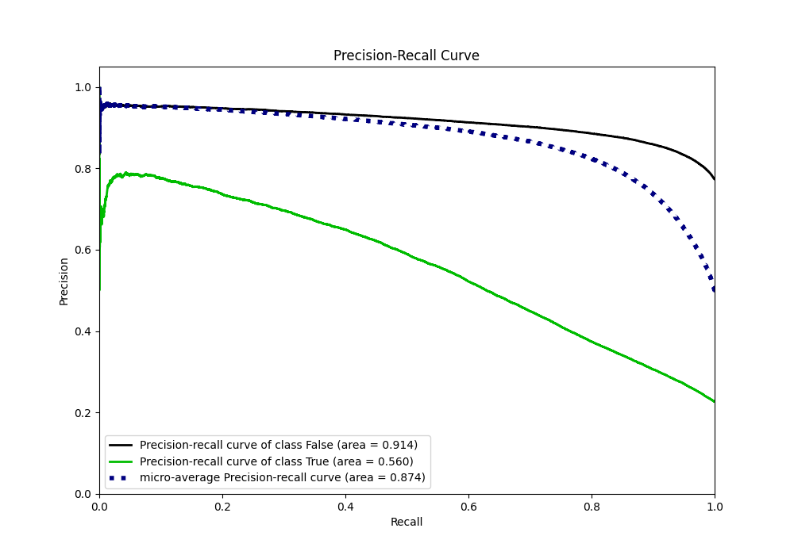
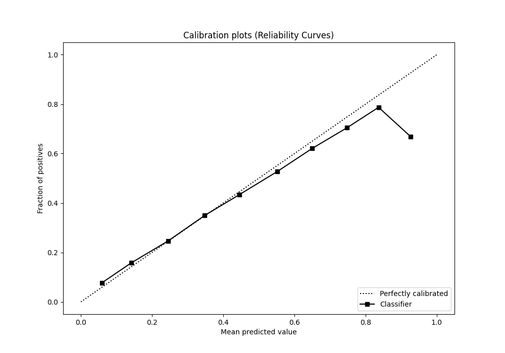
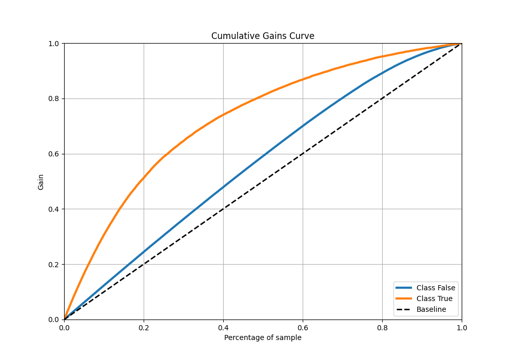
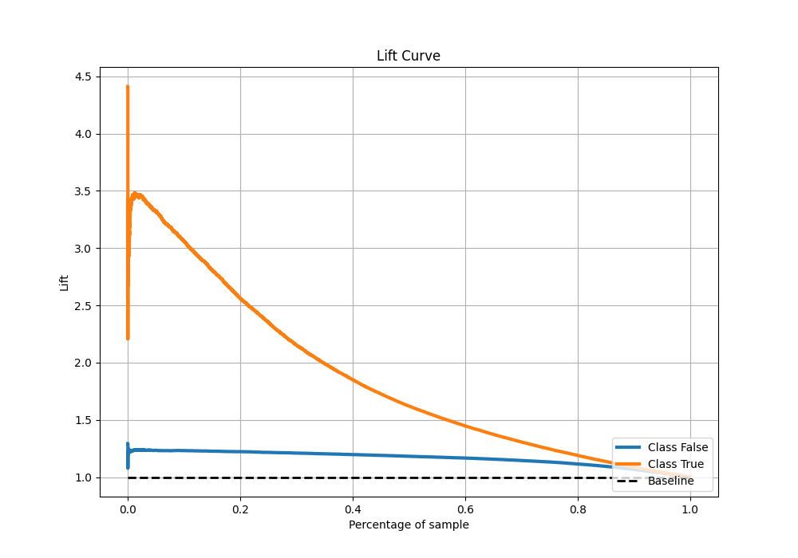

# Summary of 30_CatBoost

[<< Go back](../README.md)

## CatBoost
- **n_jobs**: -1
- **learning_rate**: 0.1
- **depth**: 7
- **rsm**: 1.0
- **loss_function**: Logloss
- **eval_metric**: AUC
- **explain_level**: 0

## Validation
 - **validation_type**: kfold
 - **shuffle**: True
 - **stratify**: True
 - **k_folds**: 10

## Optimized metric
auc

## Training time

64.9 seconds

## Metric details
|           |    score |   threshold |
|:----------|---------:|------------:|
| logloss   | 0.429143 | nan         |
| auc       | 0.791918 | nan         |
| f1        | 0.559082 |   0.29727   |
| accuracy  | 0.815041 |   0.487605  |
| precision | 0.781966 |   0.770645  |
| recall    | 1        |   0.0223771 |
| mcc       | 0.425145 |   0.338185  |

## Metric details with threshold from accuracy metric
|           |    score |   threshold |
|:----------|---------:|------------:|
| logloss   | 0.429143 |  nan        |
| auc       | 0.791918 |  nan        |
| f1        | 0.496253 |    0.487605 |
| accuracy  | 0.815041 |    0.487605 |
| precision | 0.648322 |    0.487605 |
| recall    | 0.401968 |    0.487605 |
| mcc       | 0.407262 |    0.487605 |

## Confusion matrix (at threshold=0.487605)
|                  |   Predicted as False |   Predicted as True |
|:-----------------|---------------------:|--------------------:|
| Labeled as False |                73670 |                5029 |
| Labeled as True  |                13793 |                9271 |

## Learning curves

## Confusion Matrix

## Normalized Confusion Matrix

## ROC Curve

## Kolmogorov-Smirnov Statistic

## Precision-Recall Curve

## Calibration Curve

## Cumulative Gains Curve

## Lift Curve

[<< Go back](../README.md)
