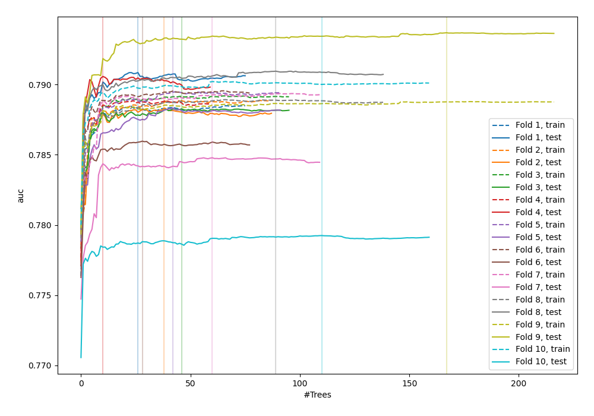
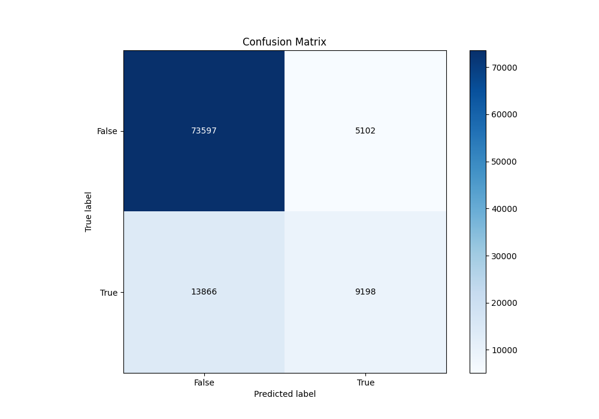
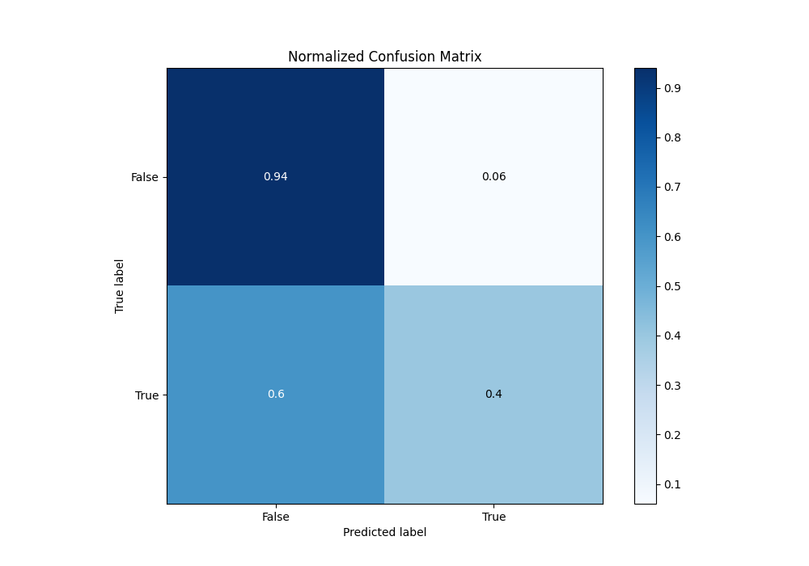
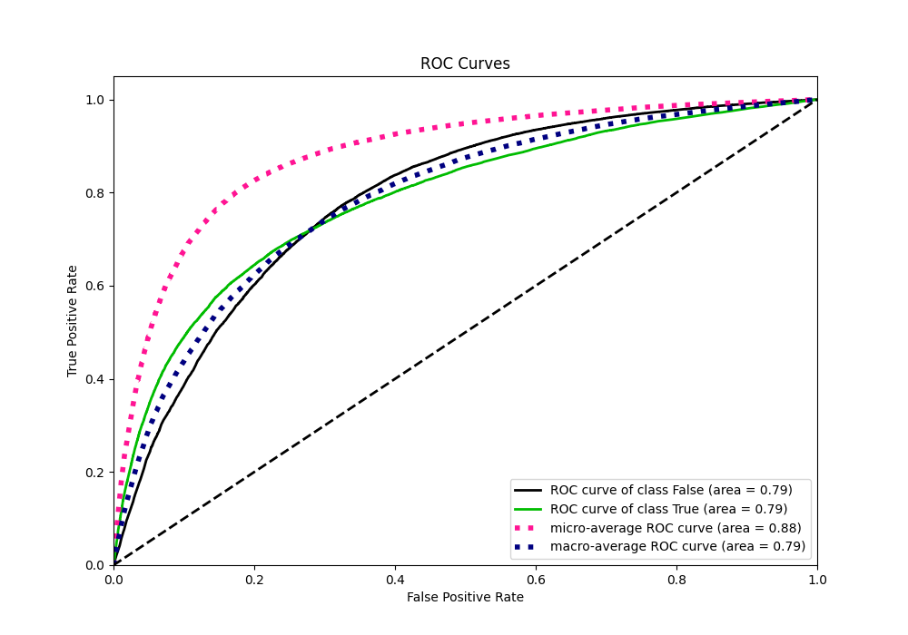
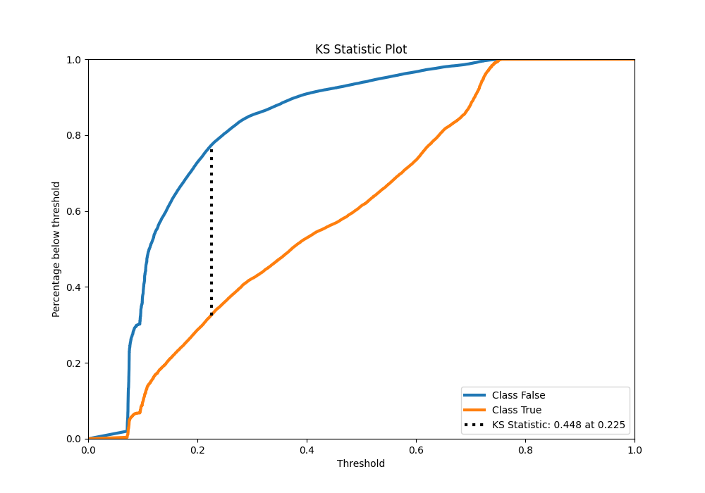
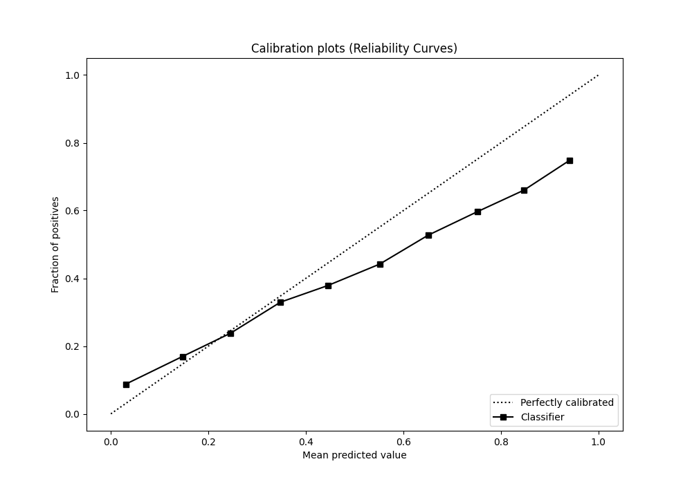
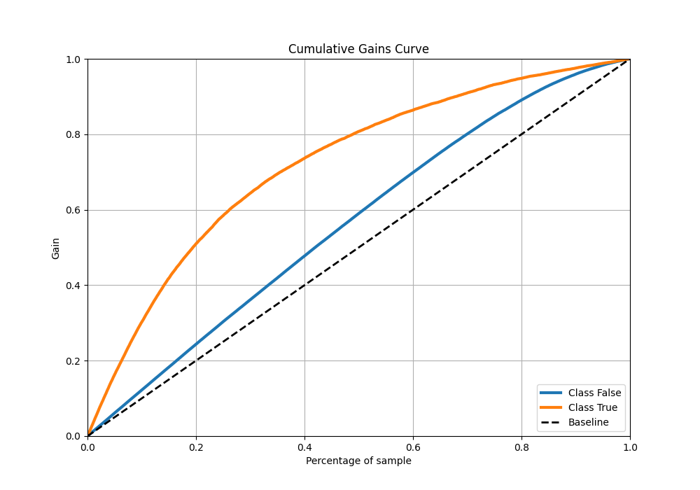

# Summary of 37_RandomForest

[<< Go back](../README.md)

## Random Forest
- **n_jobs**: -1
- **criterion**: gini
- **max_features**: 0.5
- **min_samples_split**: 20
- **max_depth**: 4
- **eval_metric_name**: auc
- **explain_level**: 0

## Validation
 - **validation_type**: kfold
 - **shuffle**: True
 - **stratify**: True
 - **k_folds**: 10

## Optimized metric
auc

## Training time

72.7 seconds

## Metric details
|           |    score |   threshold |
|:----------|---------:|------------:|
| logloss   | 0.432463 | nan         |
| auc       | 0.787705 | nan         |
| f1        | 0.55673  |   0.2811    |
| accuracy  | 0.813606 |   0.48897   |
| precision | 0.765409 |   0.717381  |
| recall    | 1        |   0.0643138 |
| mcc       | 0.419902 |   0.307283  |

## Metric details with threshold from accuracy metric
|           |    score |   threshold |
|:----------|---------:|------------:|
| logloss   | 0.432463 |   nan       |
| auc       | 0.787705 |   nan       |
| f1        | 0.492346 |     0.48897 |
| accuracy  | 0.813606 |     0.48897 |
| precision | 0.643217 |     0.48897 |
| recall    | 0.398803 |     0.48897 |
| mcc       | 0.402332 |     0.48897 |

## Confusion matrix (at threshold=0.48897)
|                  |   Predicted as False |   Predicted as True |
|:-----------------|---------------------:|--------------------:|
| Labeled as False |                73597 |                5102 |
| Labeled as True  |                13866 |                9198 |

## Learning curves

## Confusion Matrix

## Normalized Confusion Matrix

## ROC Curve

## Kolmogorov-Smirnov Statistic

## Precision-Recall Curve

## Calibration Curve

## Cumulative Gains Curve

## Lift Curve

[<< Go back](../README.md)
