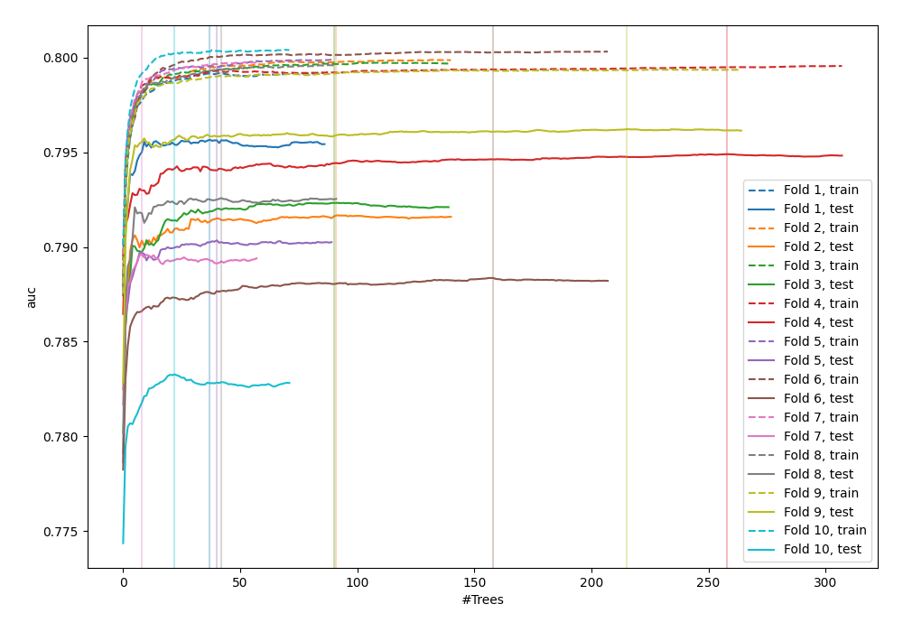
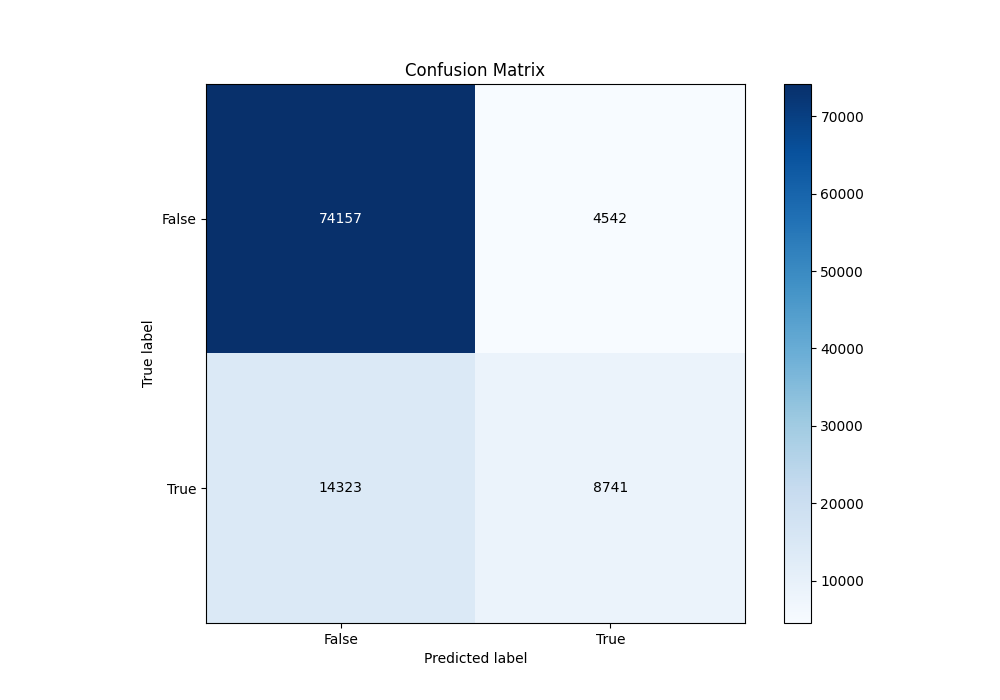
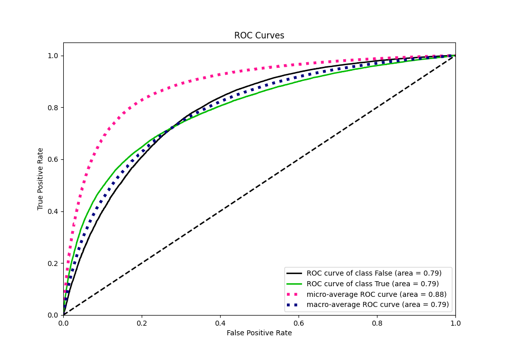
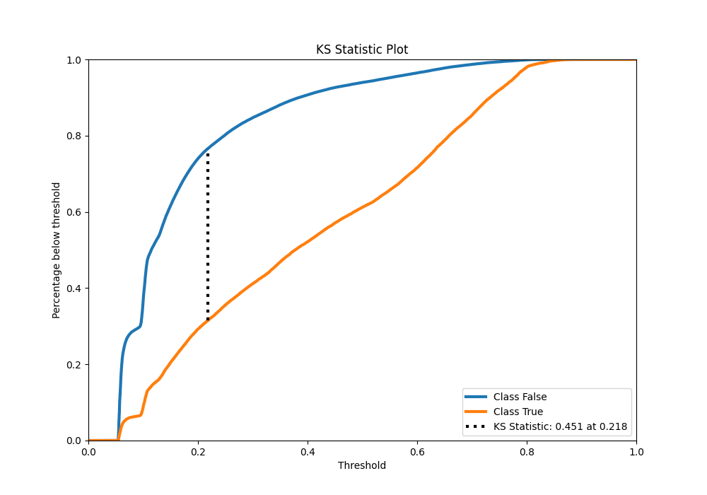
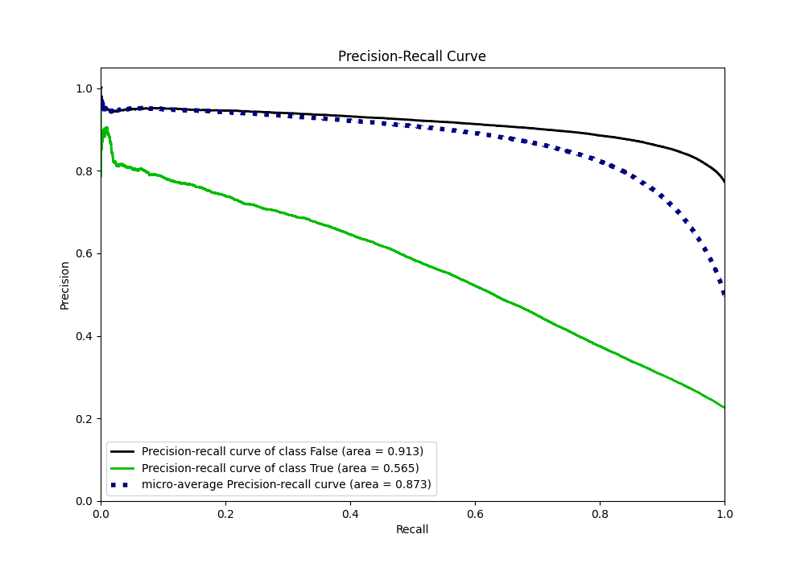
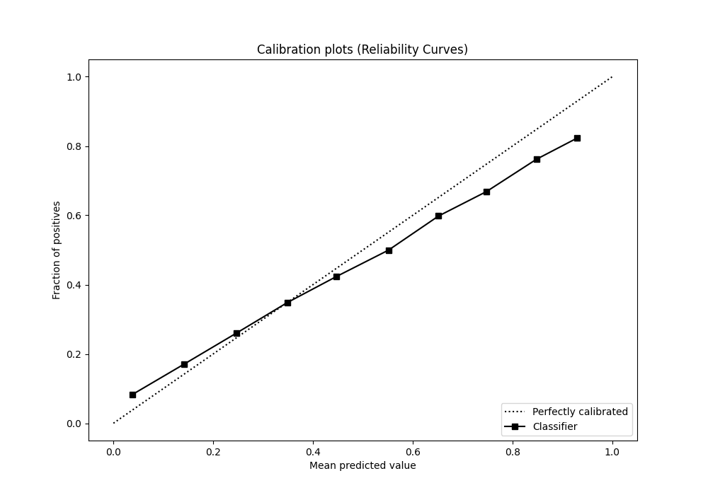
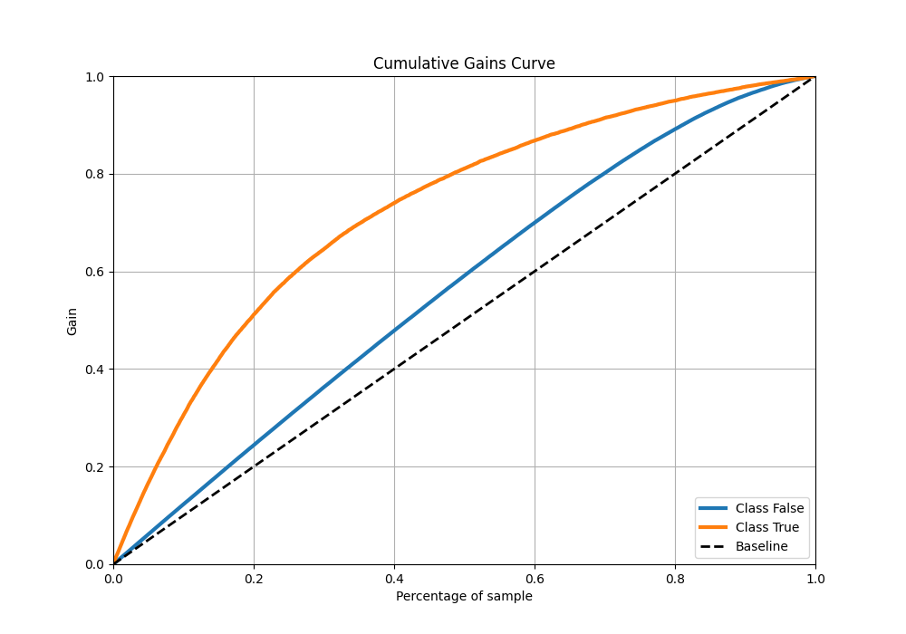
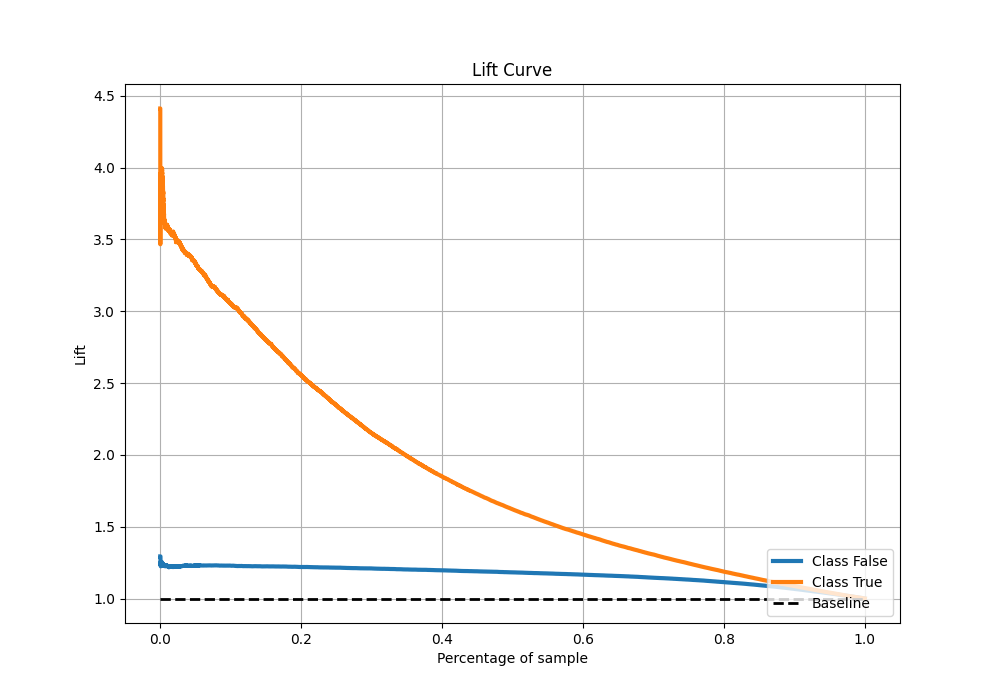

# Summary of 38_RandomForest

[<< Go back](../README.md)

## Random Forest
- **n_jobs**: -1
- **criterion**: gini
- **max_features**: 0.7
- **min_samples_split**: 30
- **max_depth**: 7
- **eval_metric_name**: auc
- **explain_level**: 0

## Validation
 - **validation_type**: kfold
 - **shuffle**: True
 - **stratify**: True
 - **k_folds**: 10

## Optimized metric
auc

## Training time

126.7 seconds

## Metric details
|           |    score |   threshold |
|:----------|---------:|------------:|
| logloss   | 0.429358 | nan         |
| auc       | 0.791212 | nan         |
| f1        | 0.558229 |   0.277826  |
| accuracy  | 0.814618 |   0.512649  |
| precision | 0.813716 |   0.78489   |
| recall    | 1        |   0.0476102 |
| mcc       | 0.423449 |   0.328379  |

## Metric details with threshold from accuracy metric
|           |    score |   threshold |
|:----------|---------:|------------:|
| logloss   | 0.429358 |  nan        |
| auc       | 0.791212 |  nan        |
| f1        | 0.480975 |    0.512649 |
| accuracy  | 0.814618 |    0.512649 |
| precision | 0.658059 |    0.512649 |
| recall    | 0.378989 |    0.512649 |
| mcc       | 0.399263 |    0.512649 |

## Confusion matrix (at threshold=0.512649)
|                  |   Predicted as False |   Predicted as True |
|:-----------------|---------------------:|--------------------:|
| Labeled as False |                74157 |                4542 |
| Labeled as True  |                14323 |                8741 |

## Learning curves

## Confusion Matrix

## Normalized Confusion Matrix

## ROC Curve

## Kolmogorov-Smirnov Statistic

## Precision-Recall Curve

## Calibration Curve

## Cumulative Gains Curve

## Lift Curve

[<< Go back](../README.md)
