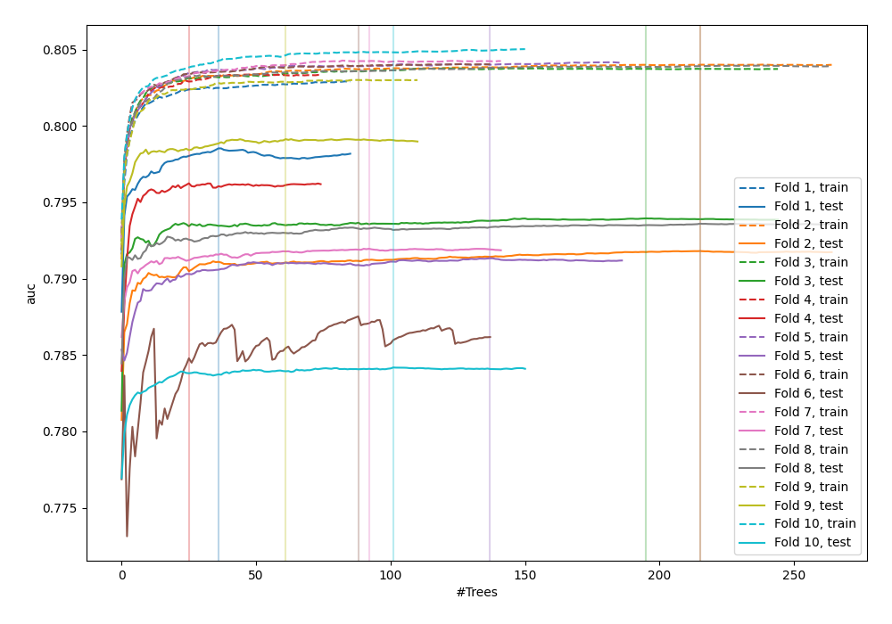
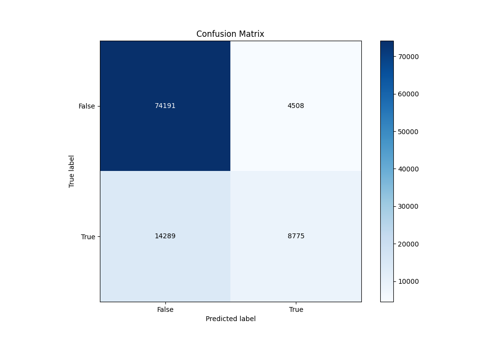
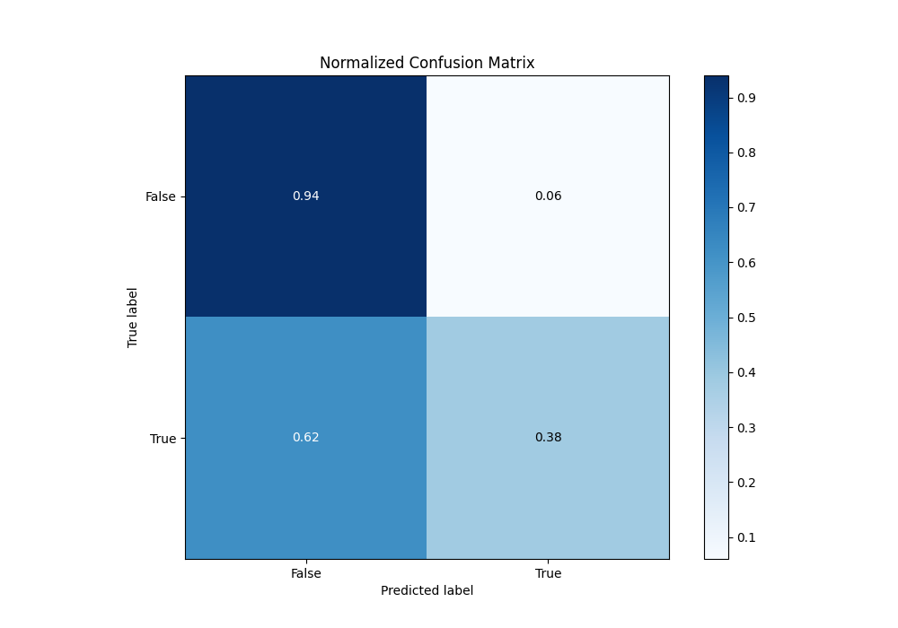
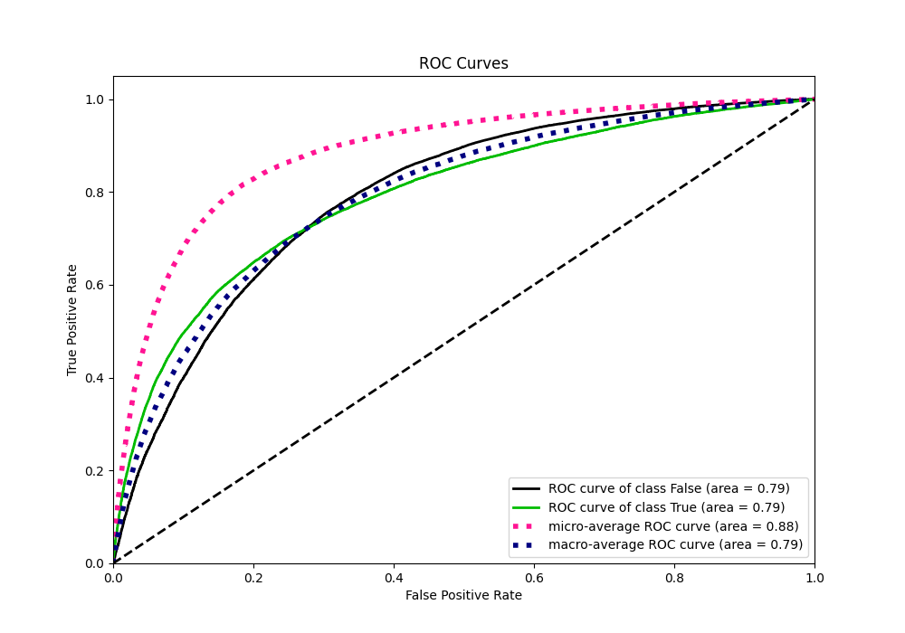
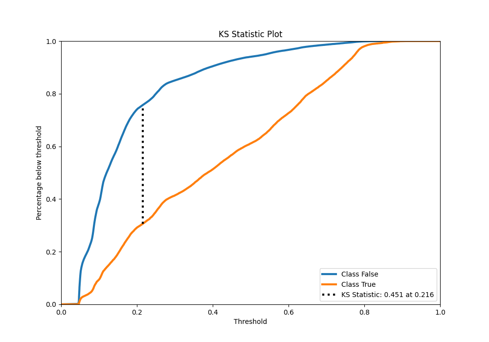
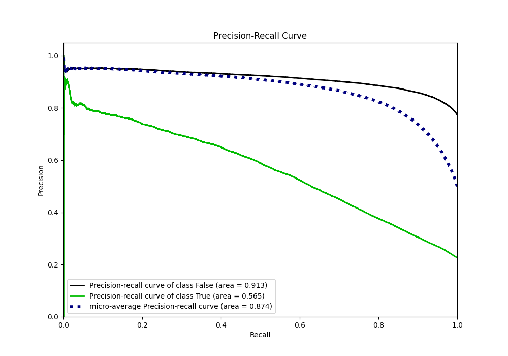
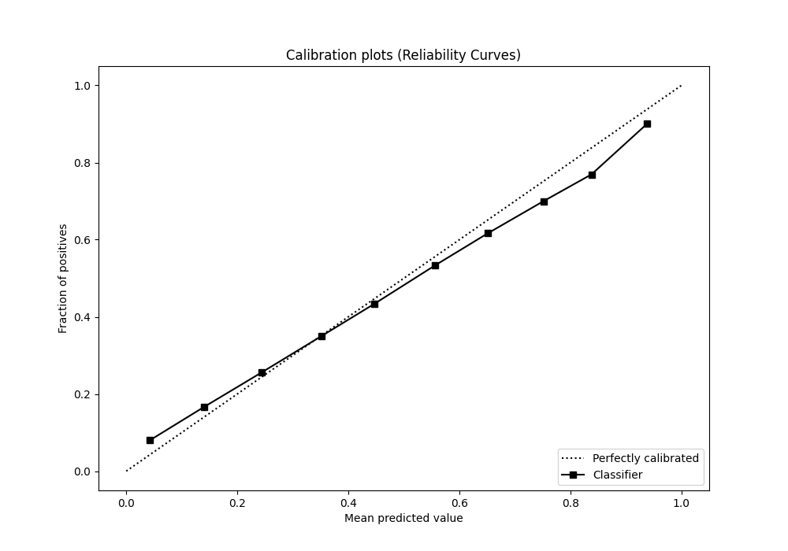
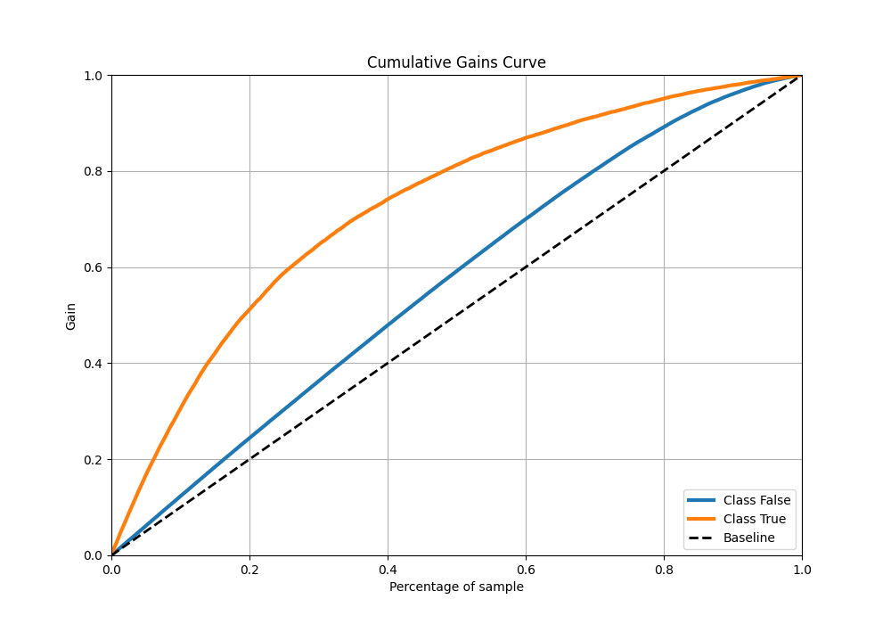
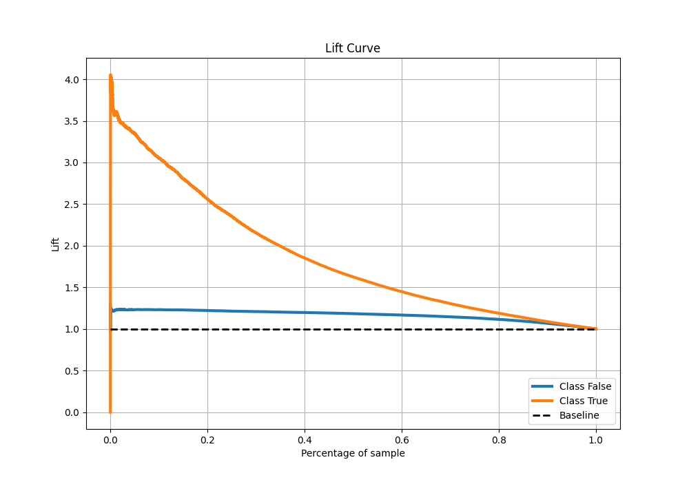

# Summary of 38_RandomForest_Stacked

[<< Go back](../README.md)

## Random Forest
- **n_jobs**: -1
- **criterion**: gini
- **max_features**: 0.7
- **min_samples_split**: 30
- **max_depth**: 7
- **eval_metric_name**: auc
- **explain_level**: 0

## Validation
 - **validation_type**: kfold
 - **shuffle**: True
 - **stratify**: True
 - **k_folds**: 10

## Optimized metric
auc

## Training time

677.4 seconds

## Metric details
|           |    score |   threshold |
|:----------|---------:|------------:|
| logloss   | 0.428618 | nan         |
| auc       | 0.791996 | nan         |
| f1        | 0.559329 |   0.296479  |
| accuracy  | 0.815286 |   0.511837  |
| precision | 0.813716 |   0.782896  |
| recall    | 1        |   0.0408731 |
| mcc       | 0.423838 |   0.314983  |

## Metric details with threshold from accuracy metric
|           |    score |   threshold |
|:----------|---------:|------------:|
| logloss   | 0.428618 |  nan        |
| auc       | 0.791996 |  nan        |
| f1        | 0.482846 |    0.511837 |
| accuracy  | 0.815286 |    0.511837 |
| precision | 0.660619 |    0.511837 |
| recall    | 0.380463 |    0.511837 |
| mcc       | 0.401632 |    0.511837 |

## Confusion matrix (at threshold=0.511837)
|                  |   Predicted as False |   Predicted as True |
|:-----------------|---------------------:|--------------------:|
| Labeled as False |                74191 |                4508 |
| Labeled as True  |                14289 |                8775 |

## Learning curves

## Confusion Matrix

## Normalized Confusion Matrix

## ROC Curve

## Kolmogorov-Smirnov Statistic

## Precision-Recall Curve

## Calibration Curve

## Cumulative Gains Curve

## Lift Curve

[<< Go back](../README.md)
