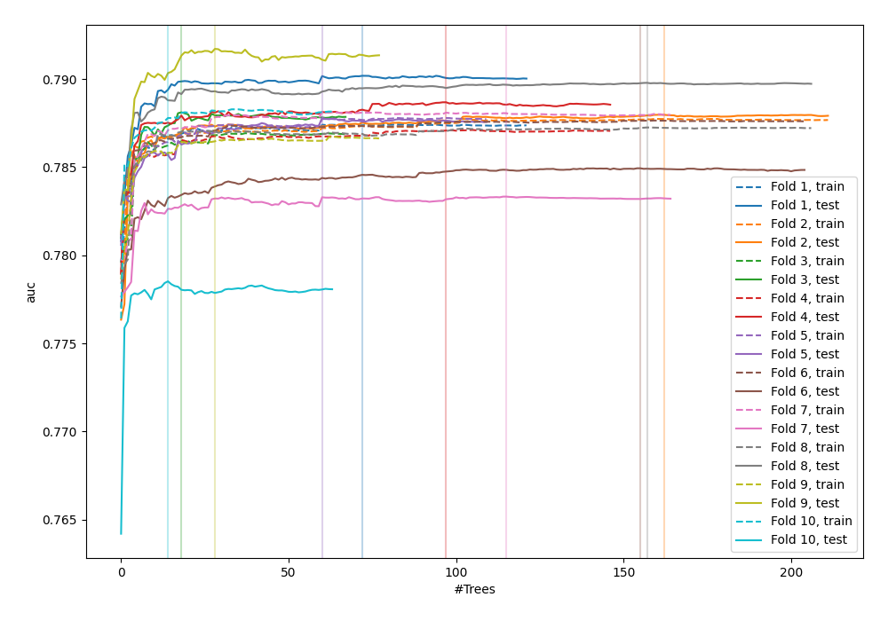
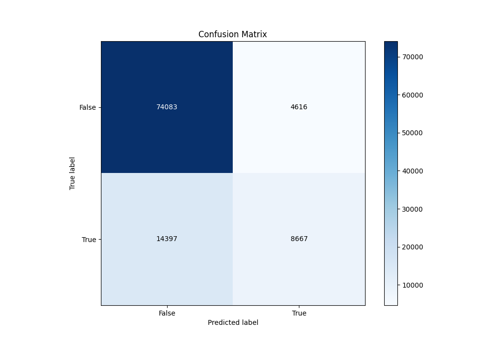
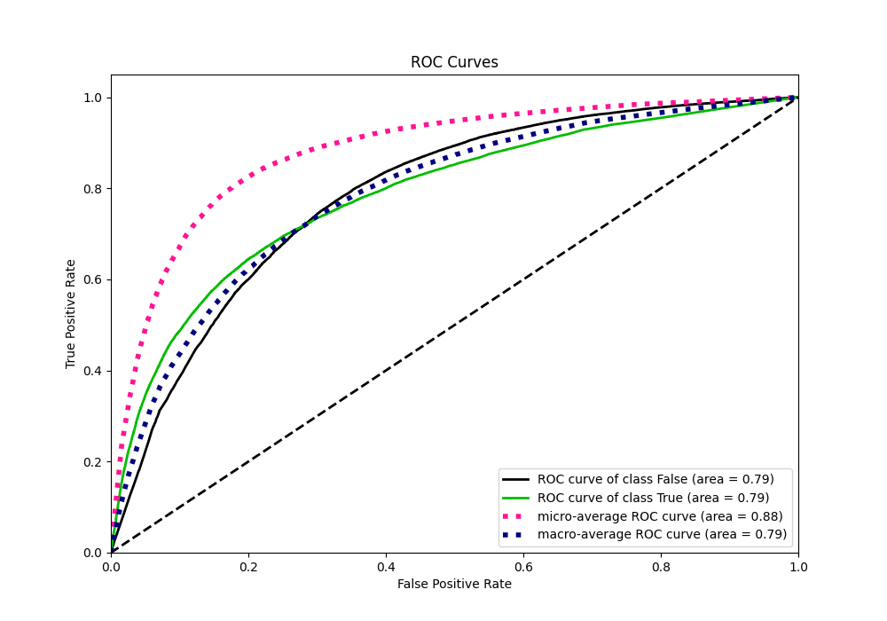
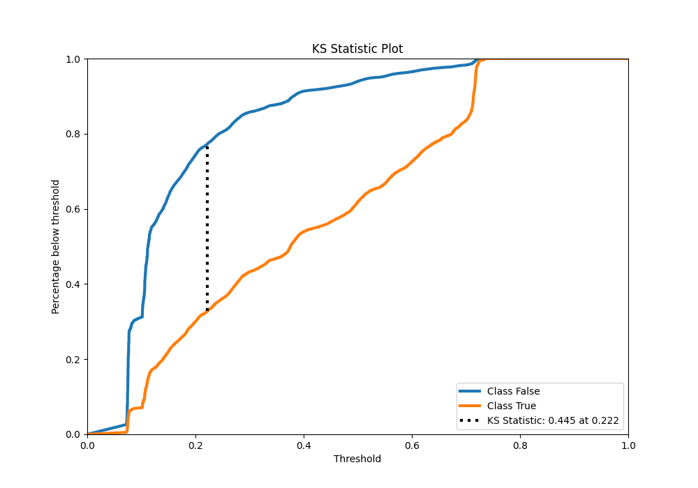
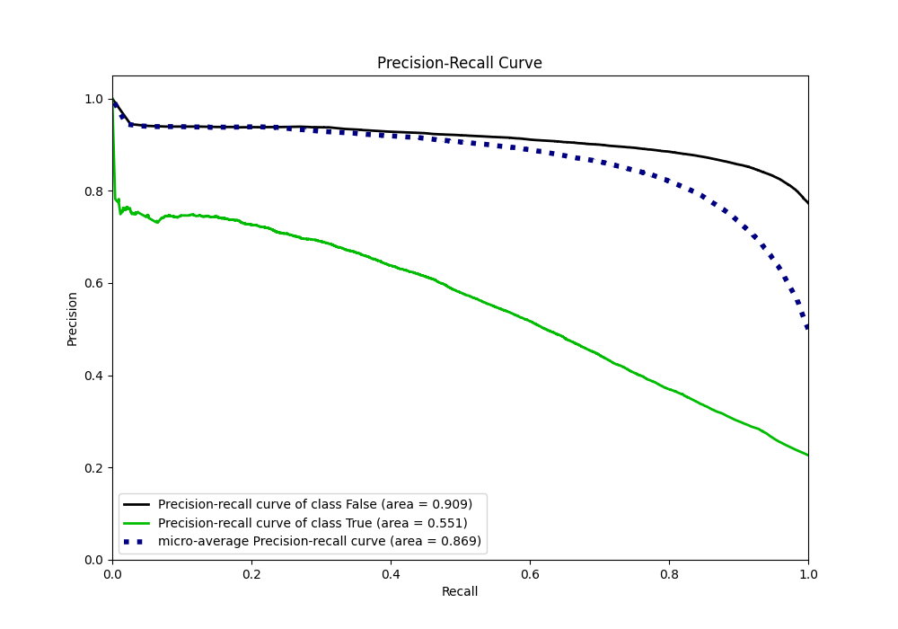
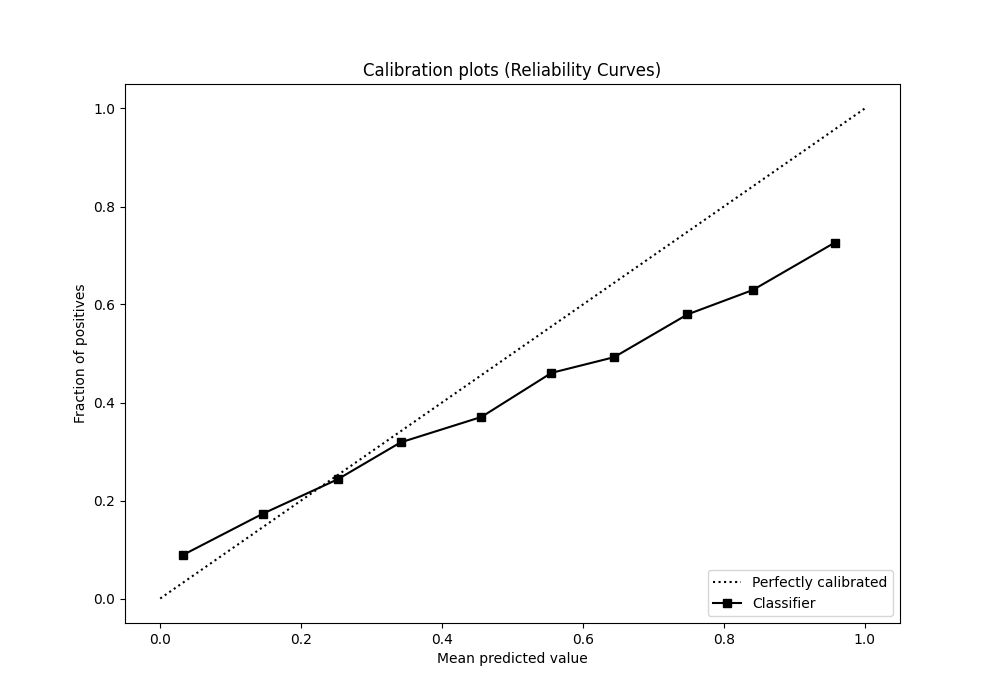
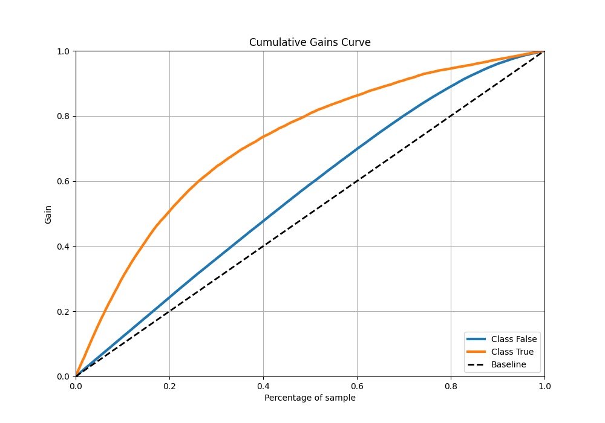
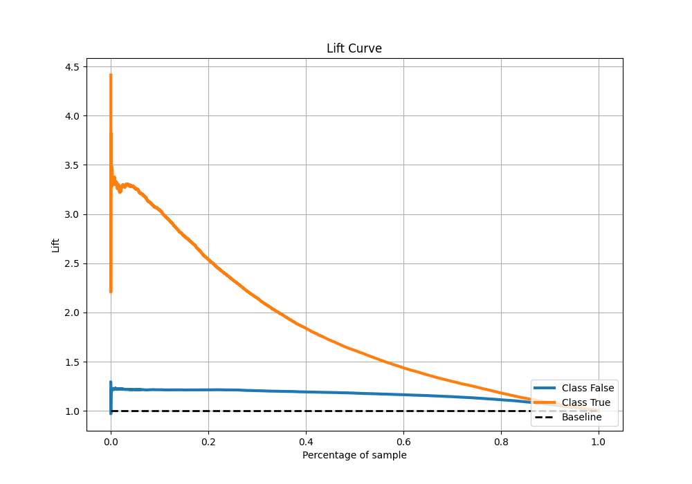

# Summary of 39_RandomForest

[<< Go back](../README.md)

## Random Forest
- **n_jobs**: -1
- **criterion**: gini
- **max_features**: 0.8
- **min_samples_split**: 40
- **max_depth**: 3
- **eval_metric_name**: auc
- **explain_level**: 0

## Validation
 - **validation_type**: kfold
 - **shuffle**: True
 - **stratify**: True
 - **k_folds**: 10

## Optimized metric
auc

## Training time

126.6 seconds

## Metric details
|           |    score |   threshold |
|:----------|---------:|------------:|
| logloss   | 0.432998 | nan         |
| auc       | 0.786385 | nan         |
| f1        | 0.555612 |   0.276883  |
| accuracy  | 0.813164 |   0.504344  |
| precision | 0.75164  |   0.718446  |
| recall    | 1        |   0.0654242 |
| mcc       | 0.417322 |   0.361023  |

## Metric details with threshold from accuracy metric
|           |    score |   threshold |
|:----------|---------:|------------:|
| logloss   | 0.432998 |  nan        |
| auc       | 0.786385 |  nan        |
| f1        | 0.476903 |    0.504344 |
| accuracy  | 0.813164 |    0.504344 |
| precision | 0.652488 |    0.504344 |
| recall    | 0.37578  |    0.504344 |
| mcc       | 0.394107 |    0.504344 |

## Confusion matrix (at threshold=0.504344)
|                  |   Predicted as False |   Predicted as True |
|:-----------------|---------------------:|--------------------:|
| Labeled as False |                74083 |                4616 |
| Labeled as True  |                14397 |                8667 |

## Learning curves

## Confusion Matrix

## Normalized Confusion Matrix

## ROC Curve

## Kolmogorov-Smirnov Statistic

## Precision-Recall Curve

## Calibration Curve

## Cumulative Gains Curve

## Lift Curve

[<< Go back](../README.md)
