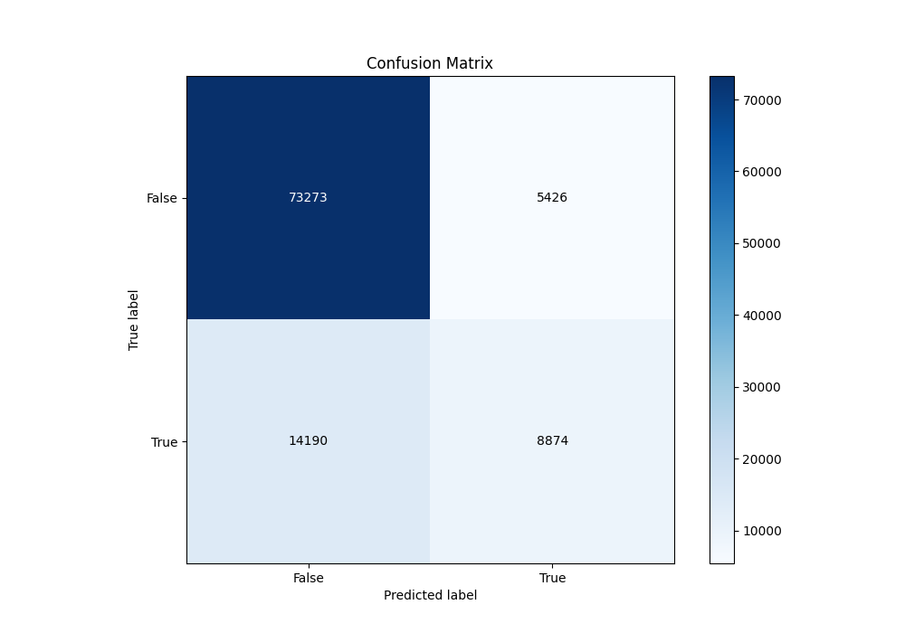
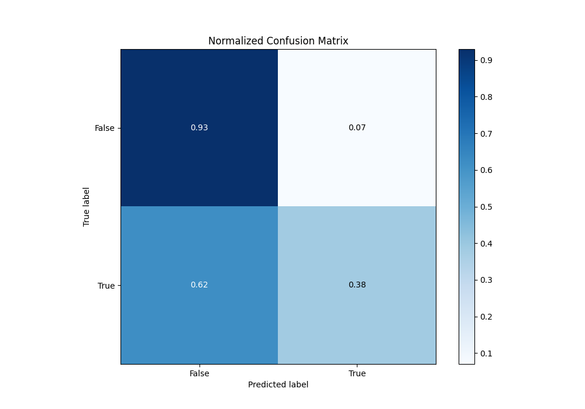
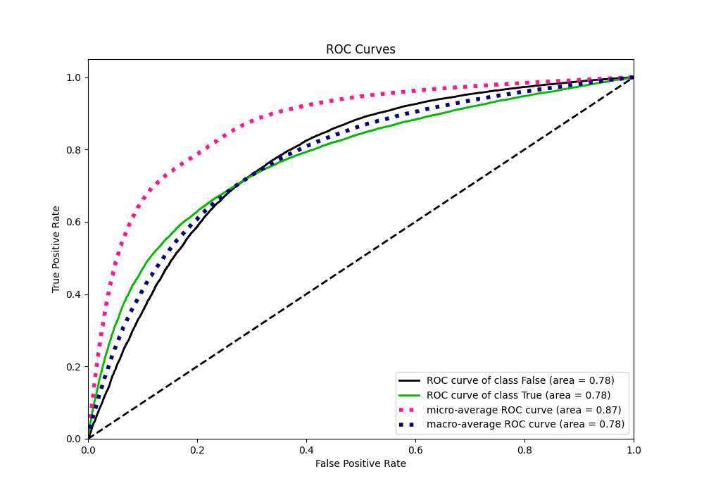
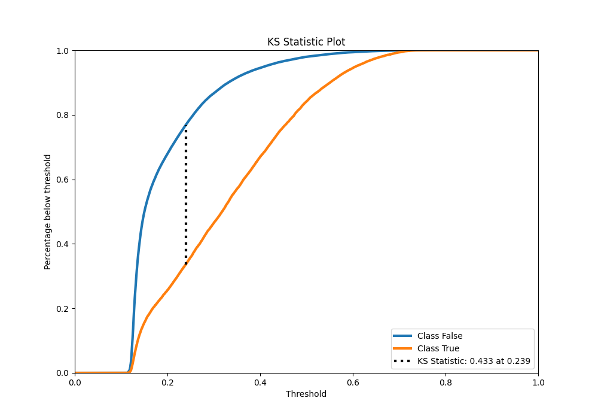
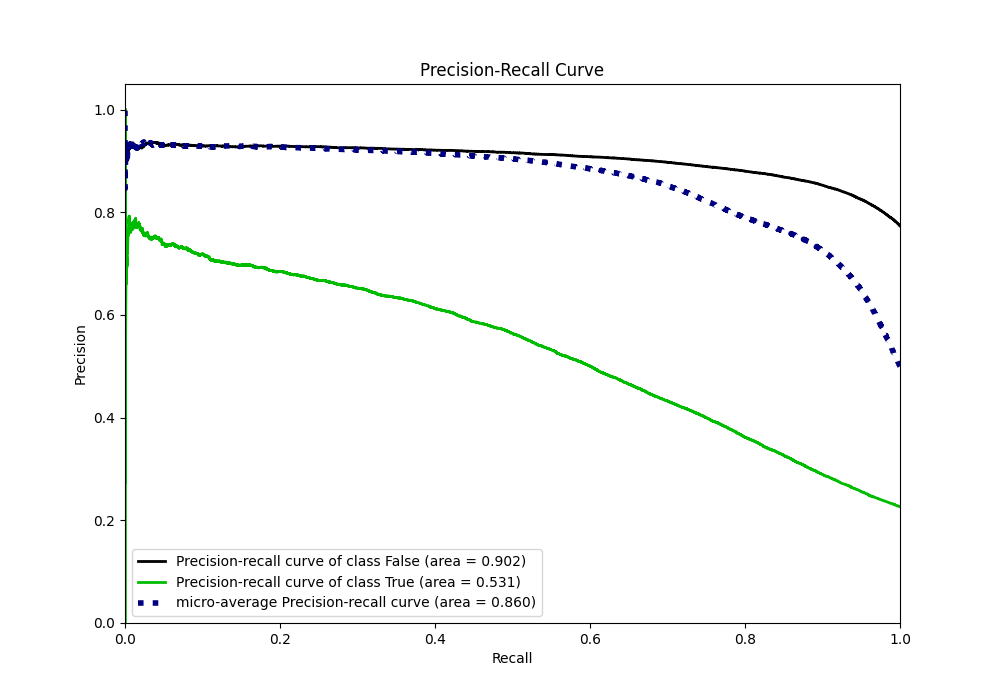
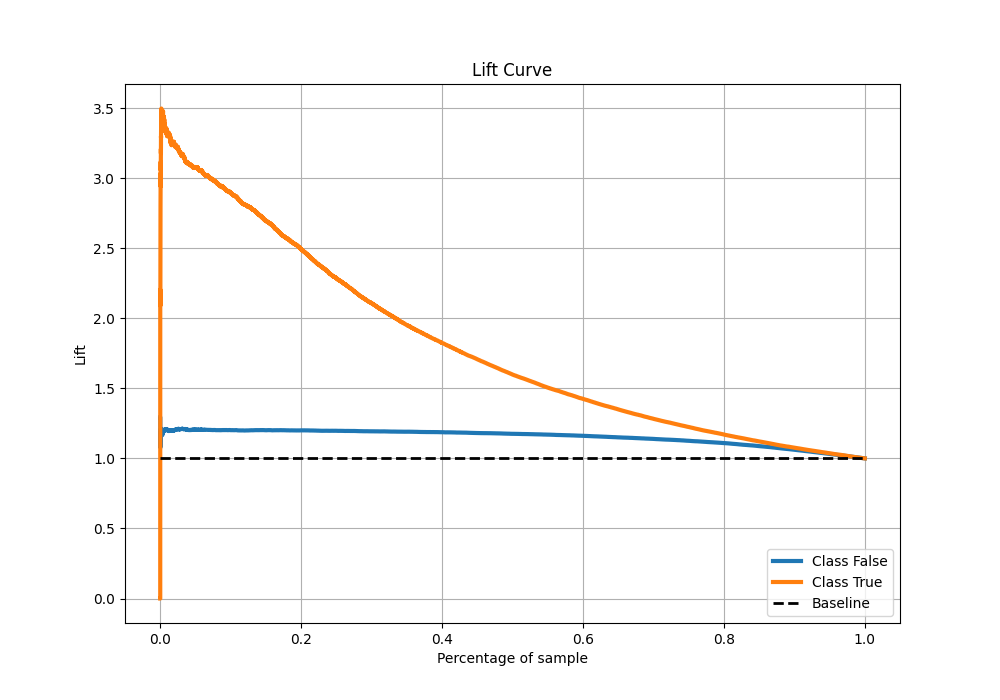

# Summary of 46_ExtraTrees

[<< Go back](../README.md)

## Extra Trees Classifier (Extra Trees)
- **n_jobs**: -1
- **criterion**: gini
- **max_features**: 0.5
- **min_samples_split**: 20
- **max_depth**: 4
- **eval_metric_name**: auc
- **explain_level**: 0

## Validation
 - **validation_type**: kfold
 - **shuffle**: True
 - **stratify**: True
 - **k_folds**: 10

## Optimized metric
auc

## Training time

63.5 seconds

## Metric details
|           |    score |   threshold |
|:----------|---------:|------------:|
| logloss   | 0.452974 |  nan        |
| auc       | 0.775643 |  nan        |
| f1        | 0.545616 |    0.270198 |
| accuracy  | 0.807238 |    0.372792 |
| precision | 0.747915 |    0.630325 |
| recall    | 1        |    0.101178 |
| mcc       | 0.404231 |    0.310563 |

## Metric details with threshold from accuracy metric
|           |    score |   threshold |
|:----------|---------:|------------:|
| logloss   | 0.452974 |  nan        |
| auc       | 0.775643 |  nan        |
| f1        | 0.475003 |    0.372792 |
| accuracy  | 0.807238 |    0.372792 |
| precision | 0.620559 |    0.372792 |
| recall    | 0.384755 |    0.372792 |
| mcc       | 0.380449 |    0.372792 |

## Confusion matrix (at threshold=0.372792)
|                  |   Predicted as False |   Predicted as True |
|:-----------------|---------------------:|--------------------:|
| Labeled as False |                73273 |                5426 |
| Labeled as True  |                14190 |                8874 |

## Learning curves

## Confusion Matrix

## Normalized Confusion Matrix

## ROC Curve

## Kolmogorov-Smirnov Statistic

## Precision-Recall Curve

## Calibration Curve

## Cumulative Gains Curve

## Lift Curve

[<< Go back](../README.md)
