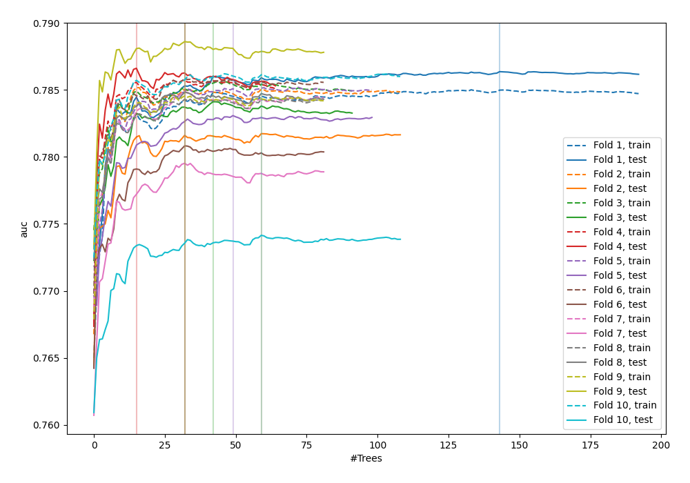
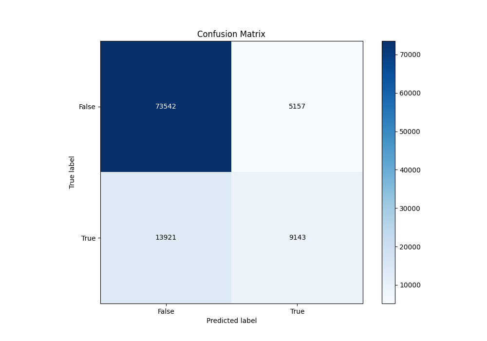
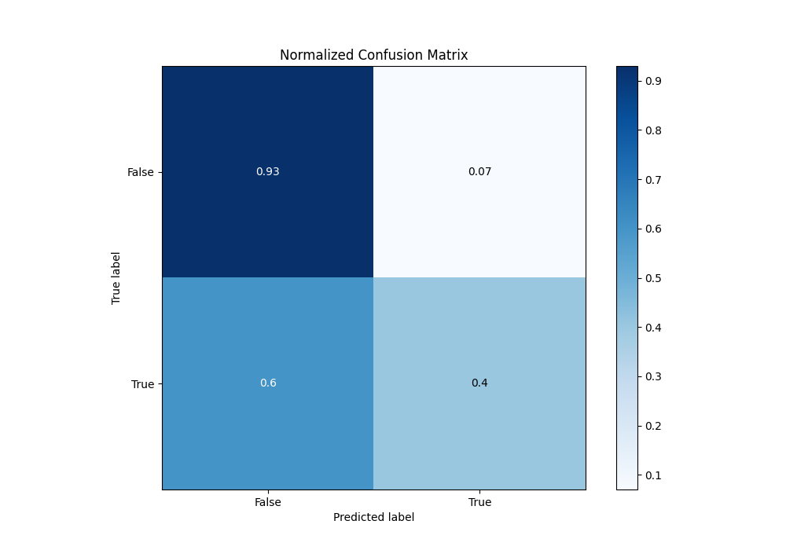
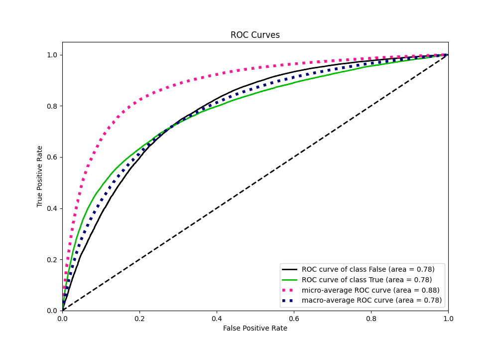
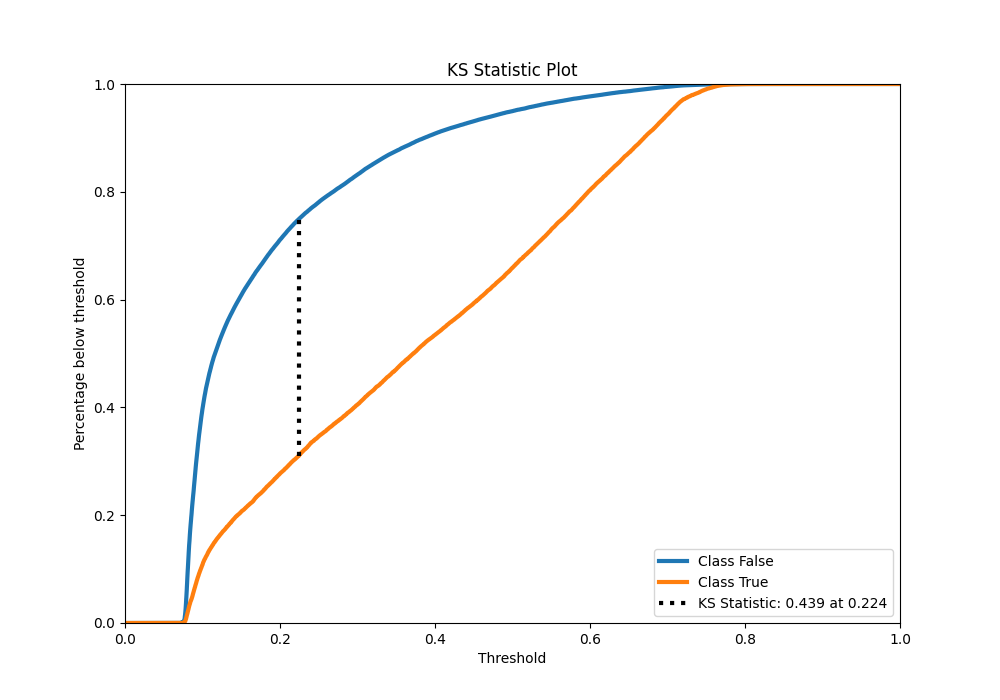
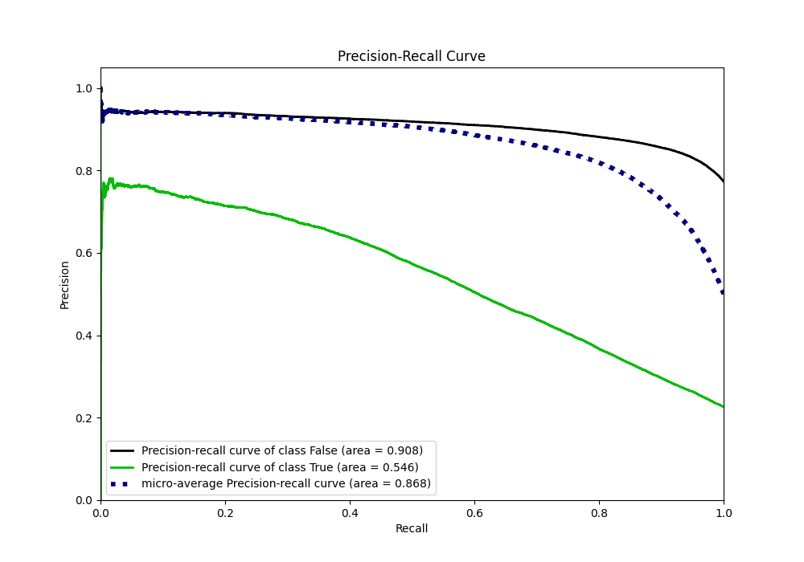
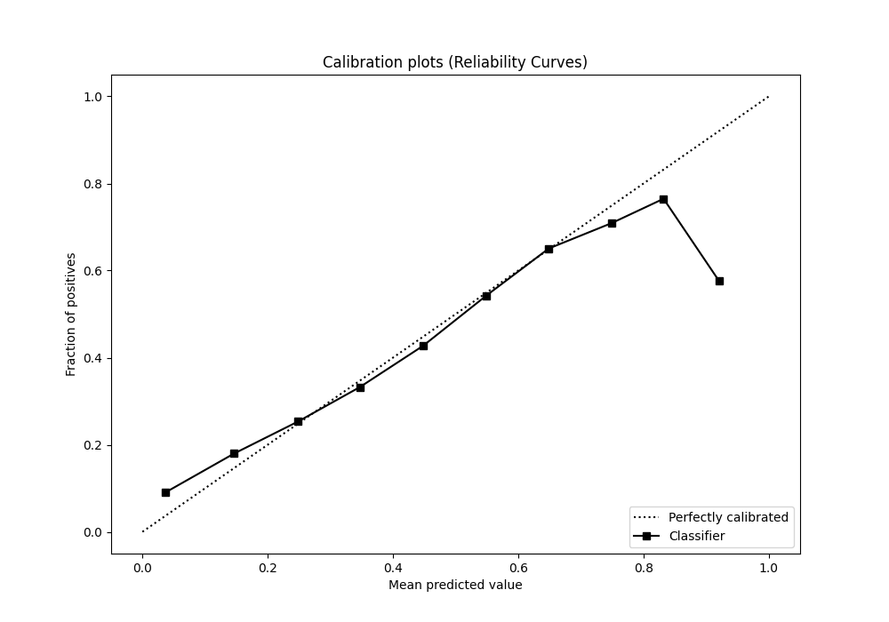
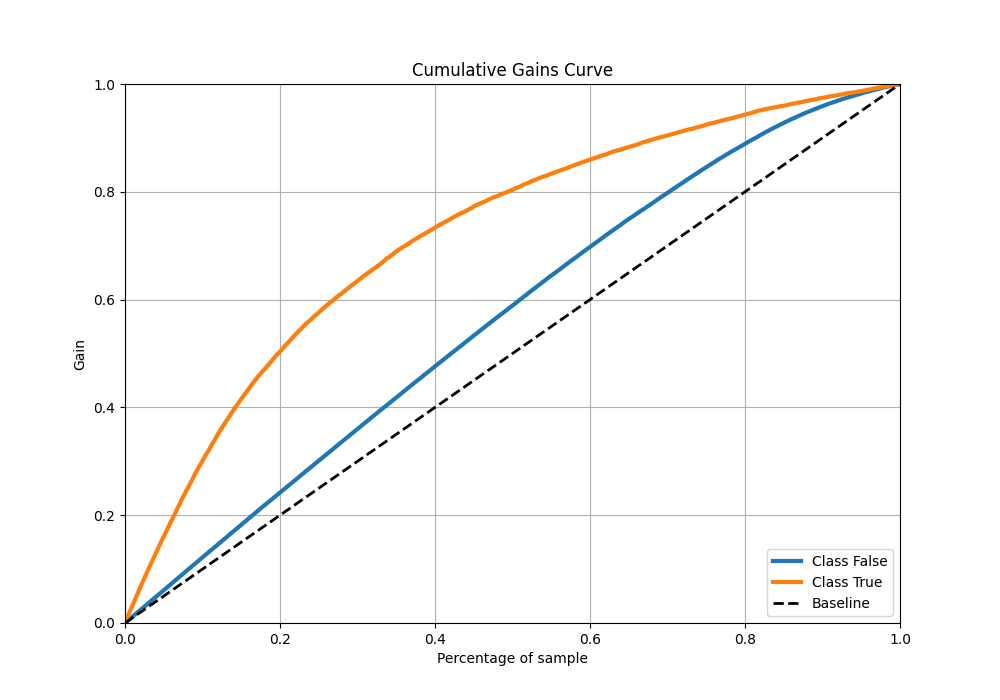
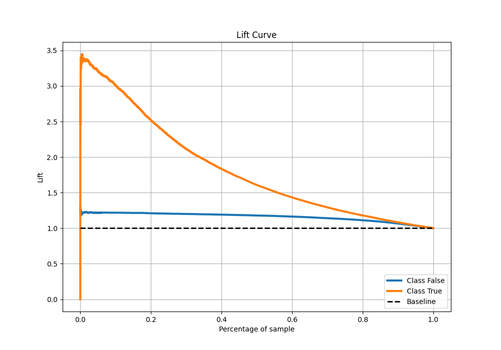

# Summary of 47_ExtraTrees

[<< Go back](../README.md)

## Extra Trees Classifier (Extra Trees)
- **n_jobs**: -1
- **criterion**: gini
- **max_features**: 0.7
- **min_samples_split**: 30
- **max_depth**: 7
- **eval_metric_name**: auc
- **explain_level**: 0

## Validation
 - **validation_type**: kfold
 - **shuffle**: True
 - **stratify**: True
 - **k_folds**: 10

## Optimized metric
auc

## Training time

94.9 seconds

## Metric details
|           |    score |   threshold |
|:----------|---------:|------------:|
| logloss   | 0.436699 | nan         |
| auc       | 0.782846 | nan         |
| f1        | 0.548539 |   0.304088  |
| accuracy  | 0.812525 |   0.458393  |
| precision | 0.762743 |   0.71451   |
| recall    | 1        |   0.0625446 |
| mcc       | 0.41201  |   0.344656  |

## Metric details with threshold from accuracy metric
|           |    score |   threshold |
|:----------|---------:|------------:|
| logloss   | 0.436699 |  nan        |
| auc       | 0.782846 |  nan        |
| f1        | 0.489402 |    0.458393 |
| accuracy  | 0.812525 |    0.458393 |
| precision | 0.639371 |    0.458393 |
| recall    | 0.396419 |    0.458393 |
| mcc       | 0.398617 |    0.458393 |

## Confusion matrix (at threshold=0.458393)
|                  |   Predicted as False |   Predicted as True |
|:-----------------|---------------------:|--------------------:|
| Labeled as False |                73542 |                5157 |
| Labeled as True  |                13921 |                9143 |

## Learning curves

## Confusion Matrix

## Normalized Confusion Matrix

## ROC Curve

## Kolmogorov-Smirnov Statistic

## Precision-Recall Curve

## Calibration Curve

## Cumulative Gains Curve

## Lift Curve

[<< Go back](../README.md)
