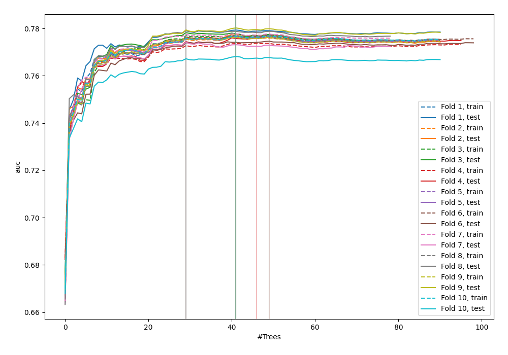
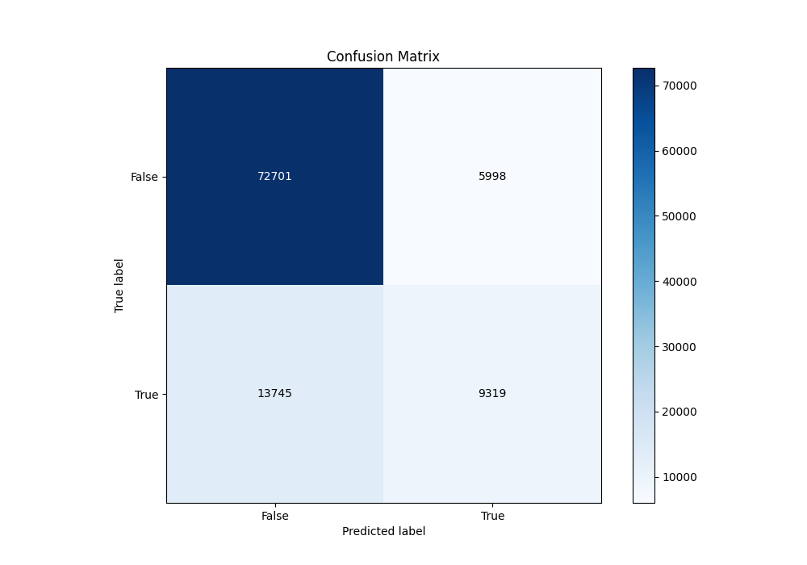
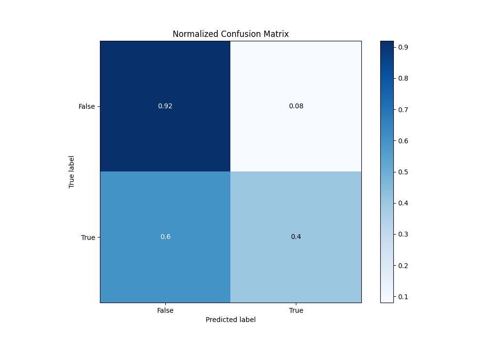
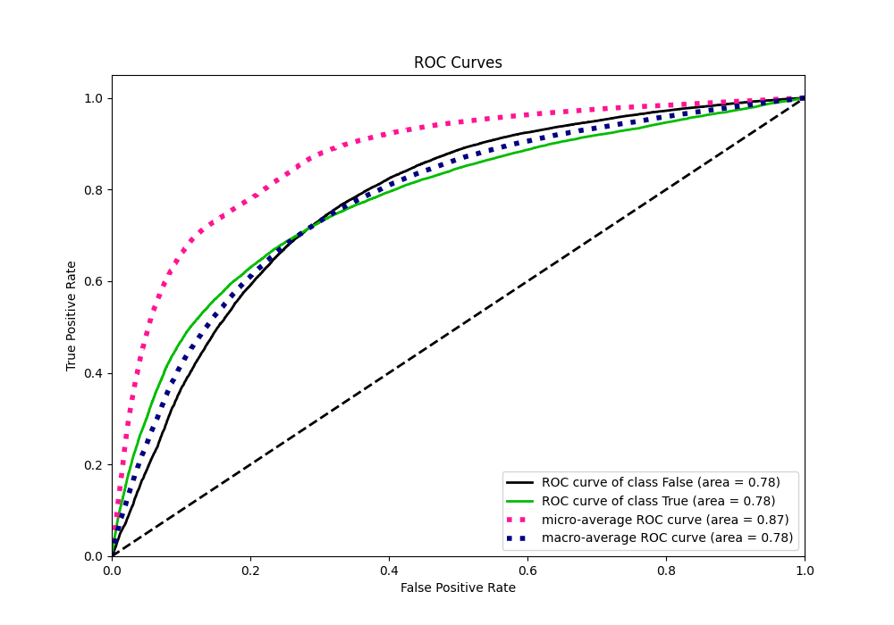
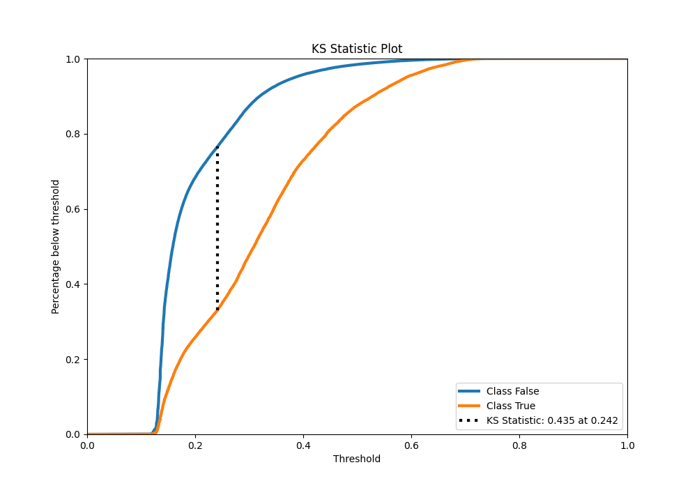
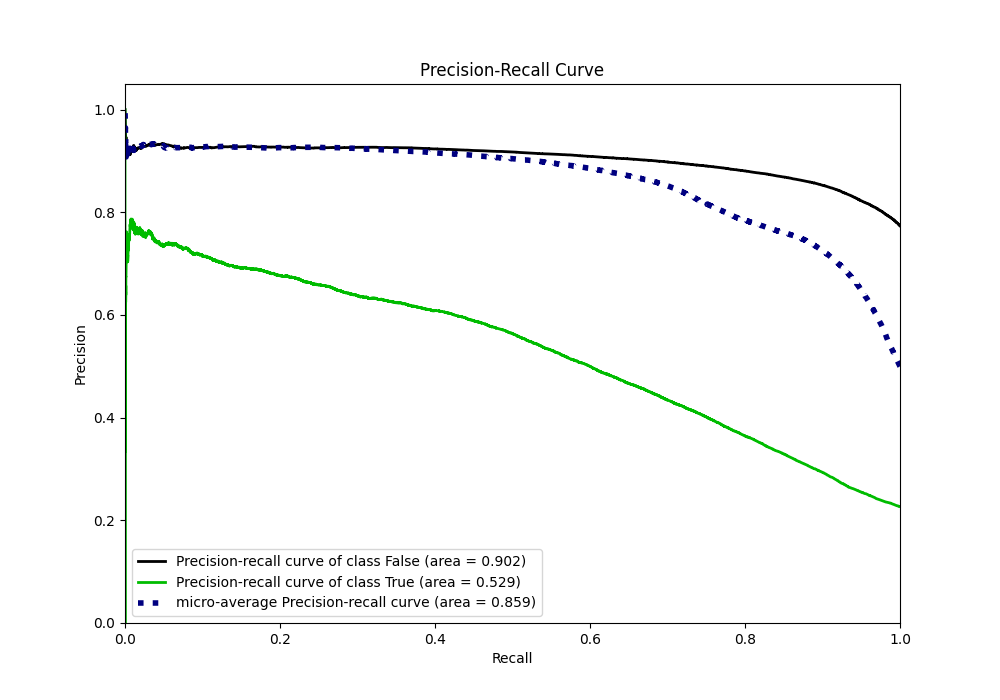
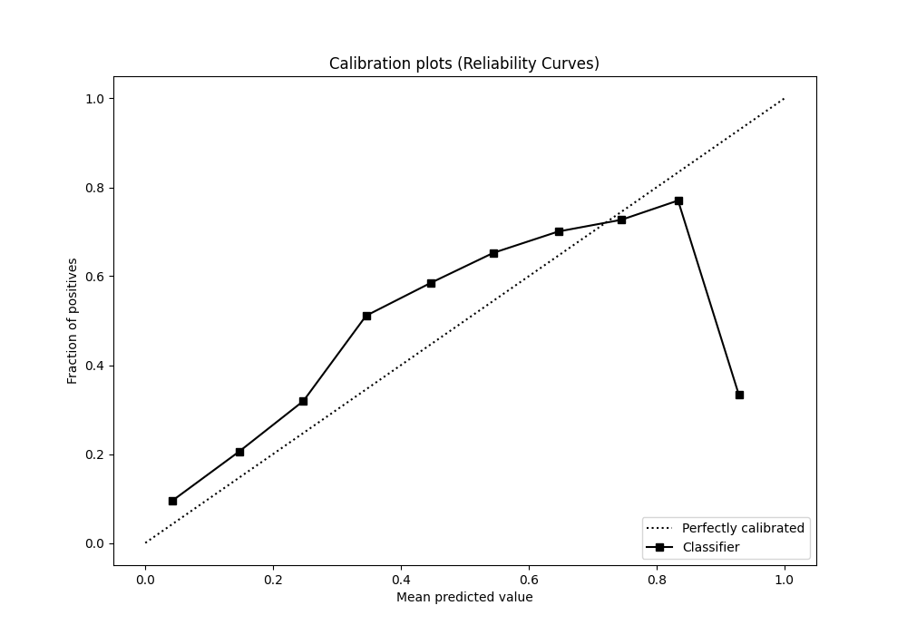
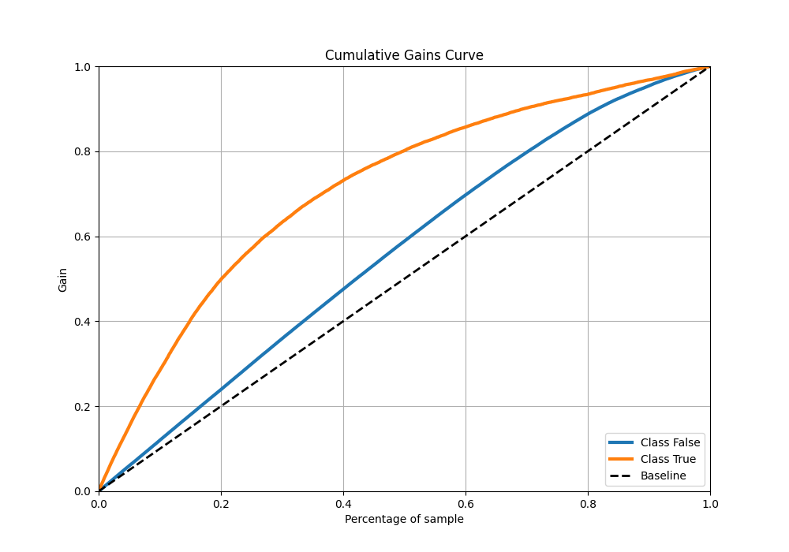
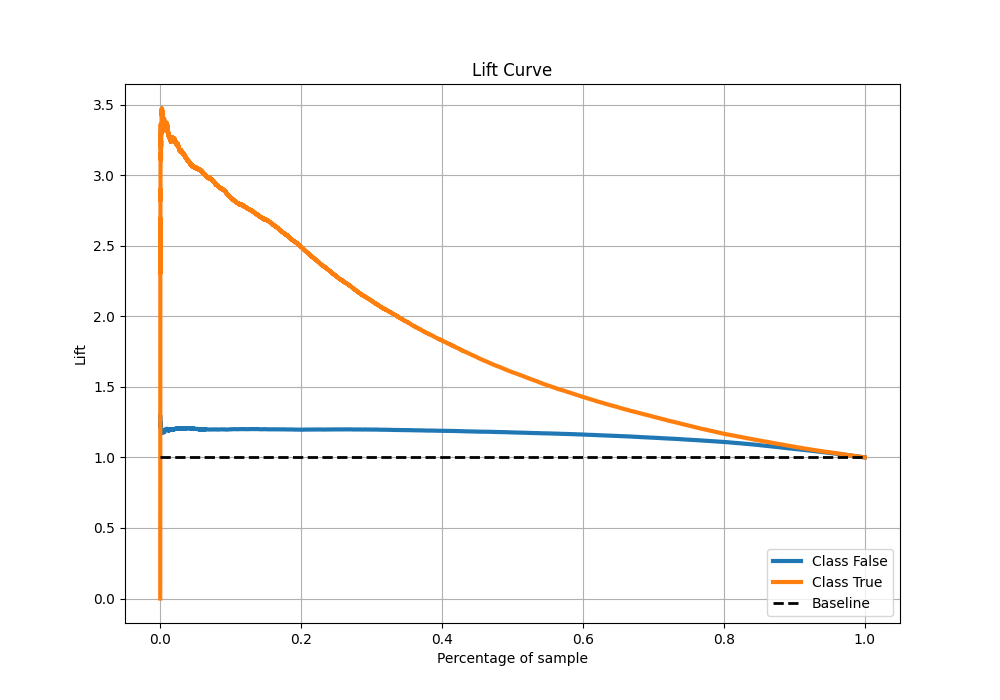

# Summary of 48_ExtraTrees

[<< Go back](../README.md)

## Extra Trees Classifier (Extra Trees)
- **n_jobs**: -1
- **criterion**: gini
- **max_features**: 0.8
- **min_samples_split**: 40
- **max_depth**: 3
- **eval_metric_name**: auc
- **explain_level**: 0

## Validation
 - **validation_type**: kfold
 - **shuffle**: True
 - **stratify**: True
 - **k_folds**: 10

## Optimized metric
auc

## Training time

64.8 seconds

## Metric details
|           |    score |   threshold |
|:----------|---------:|------------:|
| logloss   | 0.457442 |  nan        |
| auc       | 0.776056 |  nan        |
| f1        | 0.545577 |    0.273412 |
| accuracy  | 0.80599  |    0.344445 |
| precision | 0.752549 |    0.61841  |
| recall    | 1        |    0.106292 |
| mcc       | 0.404112 |    0.309419 |

## Metric details with threshold from accuracy metric
|           |    score |   threshold |
|:----------|---------:|------------:|
| logloss   | 0.457442 |  nan        |
| auc       | 0.776056 |  nan        |
| f1        | 0.485605 |    0.344445 |
| accuracy  | 0.80599  |    0.344445 |
| precision | 0.608409 |    0.344445 |
| recall    | 0.40405  |    0.344445 |
| mcc       | 0.383838 |    0.344445 |

## Confusion matrix (at threshold=0.344445)
|                  |   Predicted as False |   Predicted as True |
|:-----------------|---------------------:|--------------------:|
| Labeled as False |                72701 |                5998 |
| Labeled as True  |                13745 |                9319 |

## Learning curves

## Confusion Matrix

## Normalized Confusion Matrix

## ROC Curve

## Kolmogorov-Smirnov Statistic

## Precision-Recall Curve

## Calibration Curve

## Cumulative Gains Curve

## Lift Curve

[<< Go back](../README.md)
