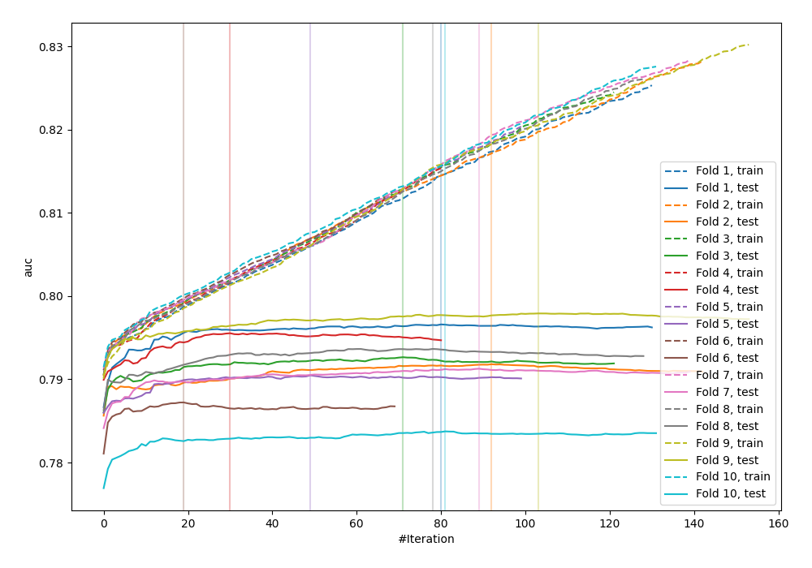
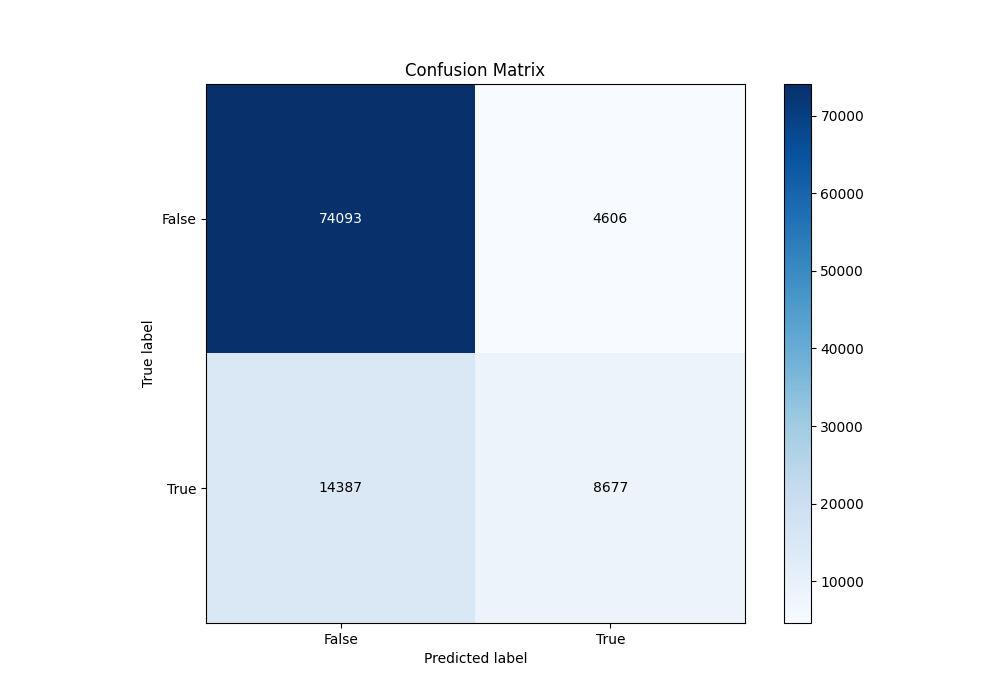
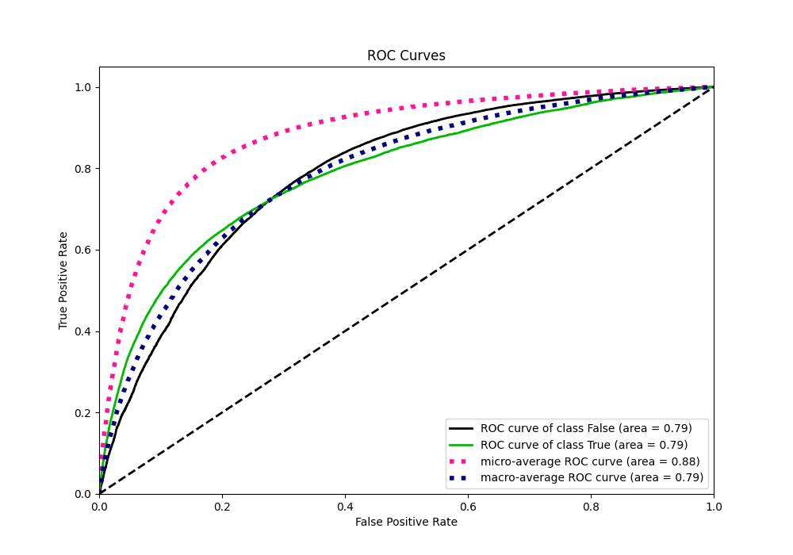
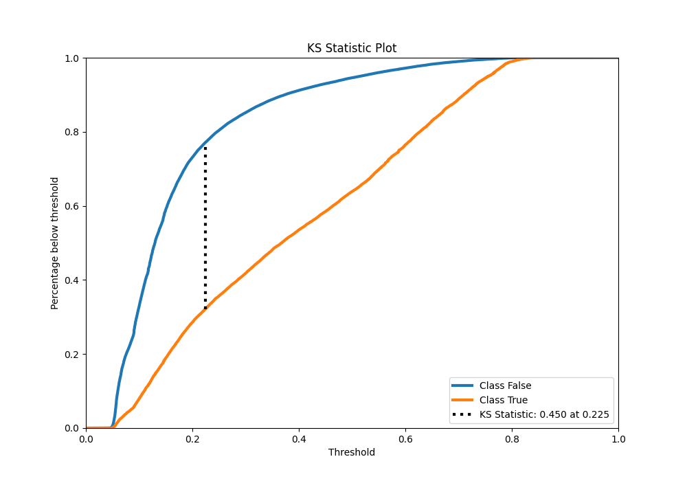
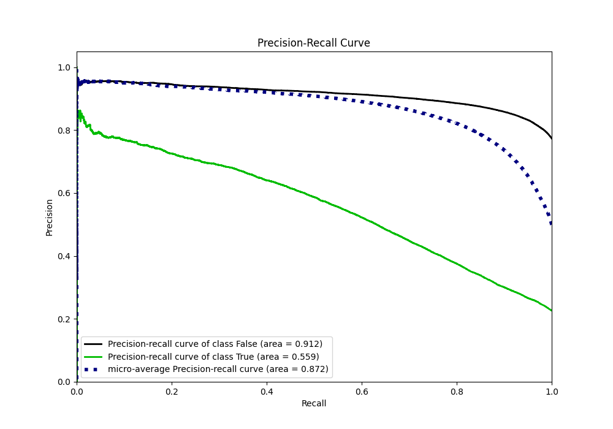
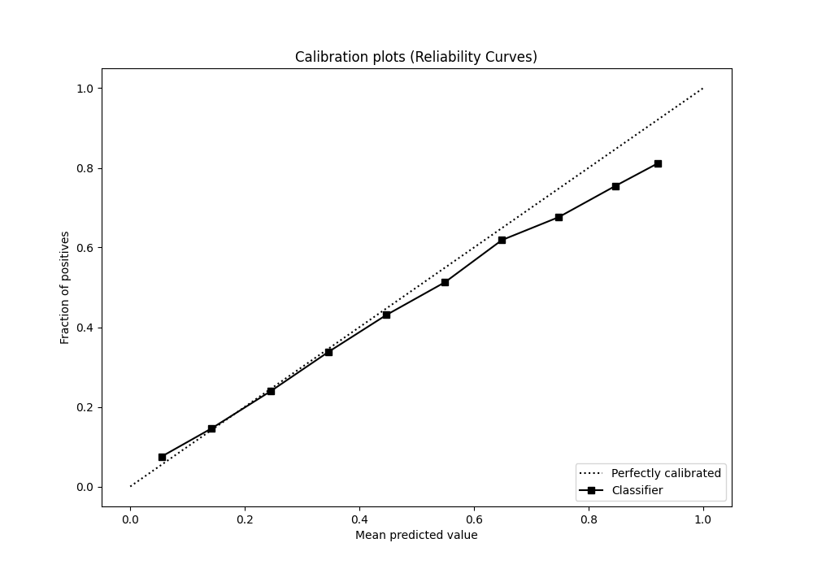
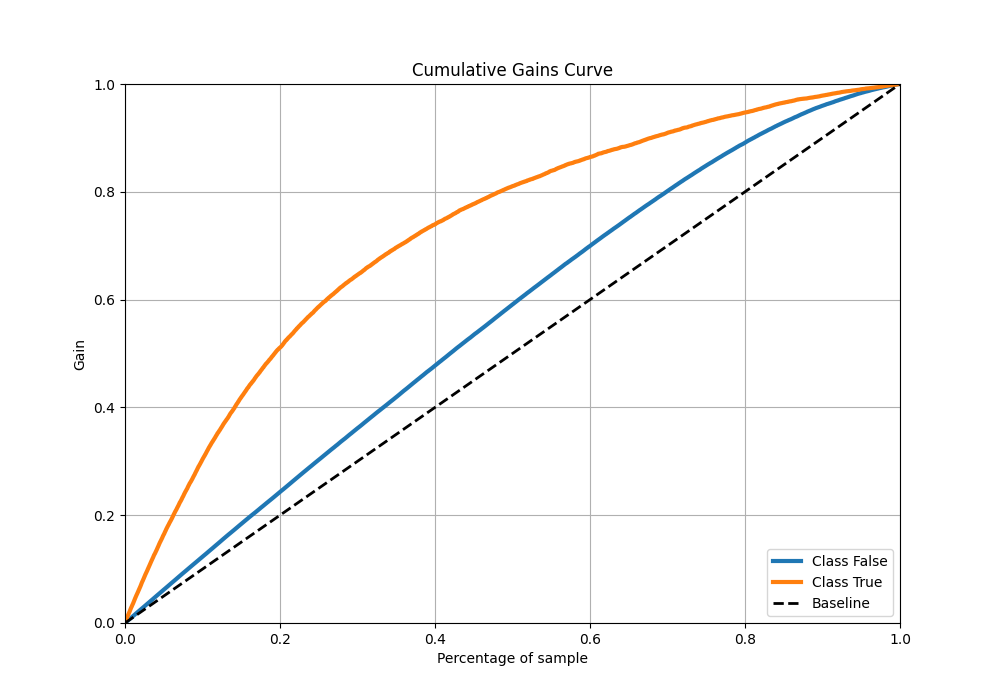
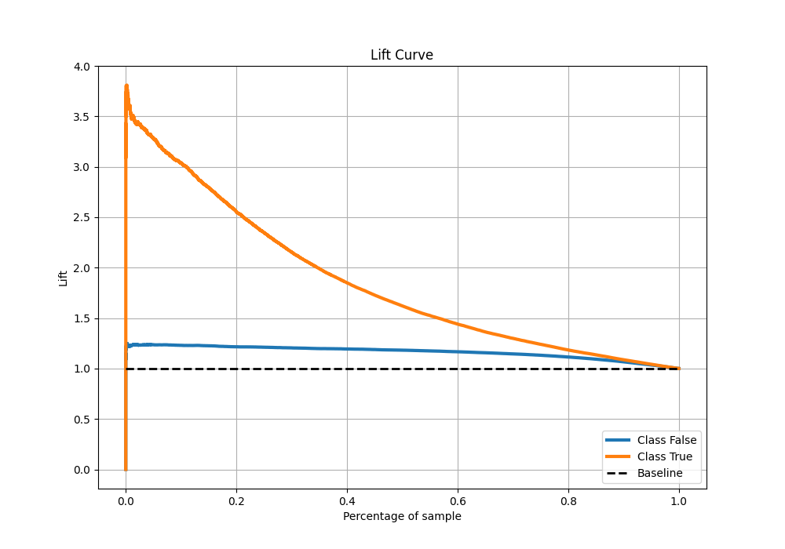

# Summary of 4_Default_LightGBM

[<< Go back](../README.md)

## LightGBM
- **n_jobs**: -1
- **objective**: binary
- **num_leaves**: 63
- **learning_rate**: 0.05
- **feature_fraction**: 0.9
- **bagging_fraction**: 0.9
- **min_data_in_leaf**: 10
- **metric**: auc
- **custom_eval_metric_name**: None
- **explain_level**: 0

## Validation
 - **validation_type**: kfold
 - **shuffle**: True
 - **stratify**: True
 - **k_folds**: 10

## Optimized metric
auc

## Training time

23.7 seconds

## Metric details
|           |    score |   threshold |
|:----------|---------:|------------:|
| logloss   | 0.431173 | nan         |
| auc       | 0.789536 | nan         |
| f1        | 0.558703 |   0.274317  |
| accuracy  | 0.81336  |   0.485381  |
| precision | 0.78962  |   0.769675  |
| recall    | 1        |   0.0340211 |
| mcc       | 0.422599 |   0.342241  |

## Metric details with threshold from accuracy metric
|           |    score |   threshold |
|:----------|---------:|------------:|
| logloss   | 0.431173 |  nan        |
| auc       | 0.789536 |  nan        |
| f1        | 0.477453 |    0.485381 |
| accuracy  | 0.81336  |    0.485381 |
| precision | 0.653241 |    0.485381 |
| recall    | 0.376214 |    0.485381 |
| mcc       | 0.394804 |    0.485381 |

## Confusion matrix (at threshold=0.485381)
|                  |   Predicted as False |   Predicted as True |
|:-----------------|---------------------:|--------------------:|
| Labeled as False |                74093 |                4606 |
| Labeled as True  |                14387 |                8677 |

## Learning curves

## Confusion Matrix

## Normalized Confusion Matrix

## ROC Curve

## Kolmogorov-Smirnov Statistic

## Precision-Recall Curve

## Calibration Curve

## Cumulative Gains Curve

## Lift Curve

[<< Go back](../README.md)
