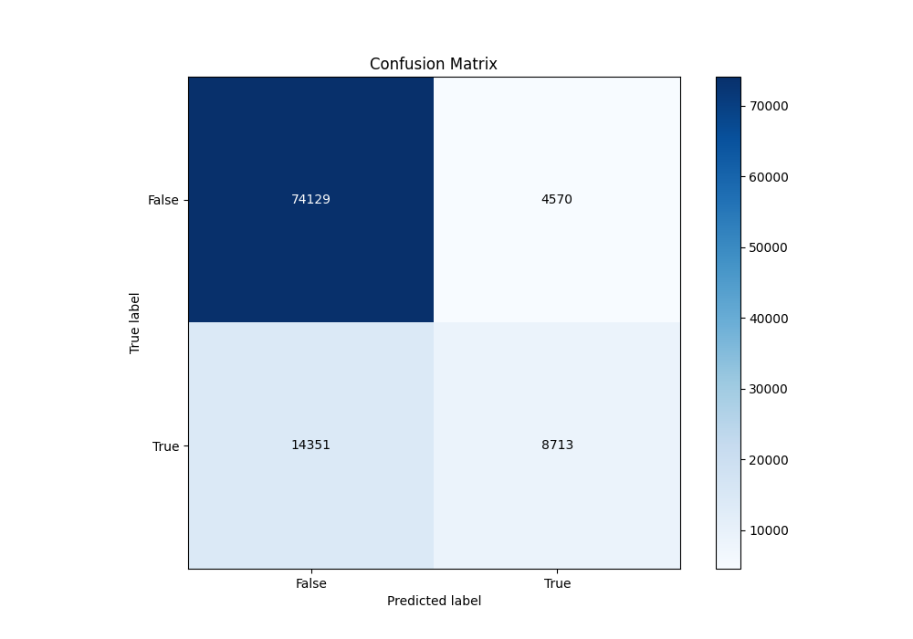
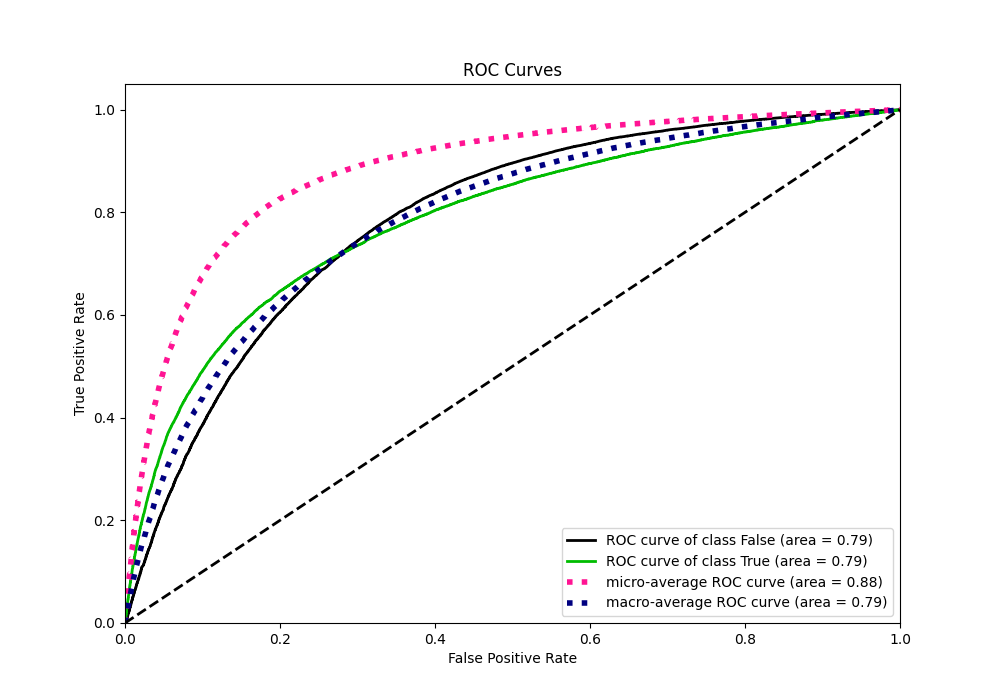
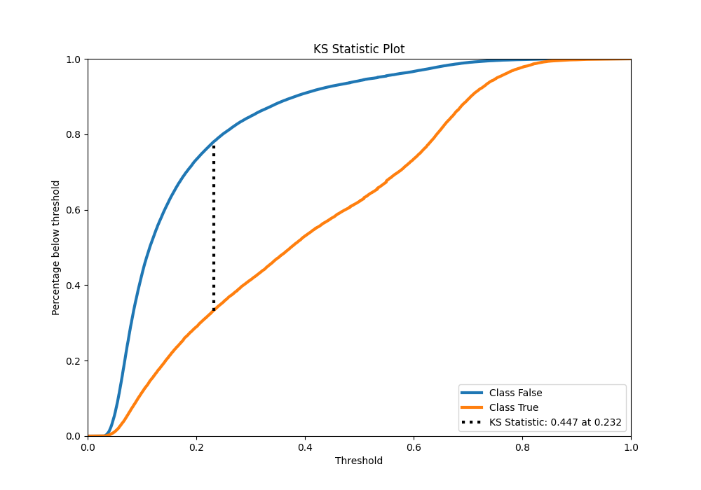
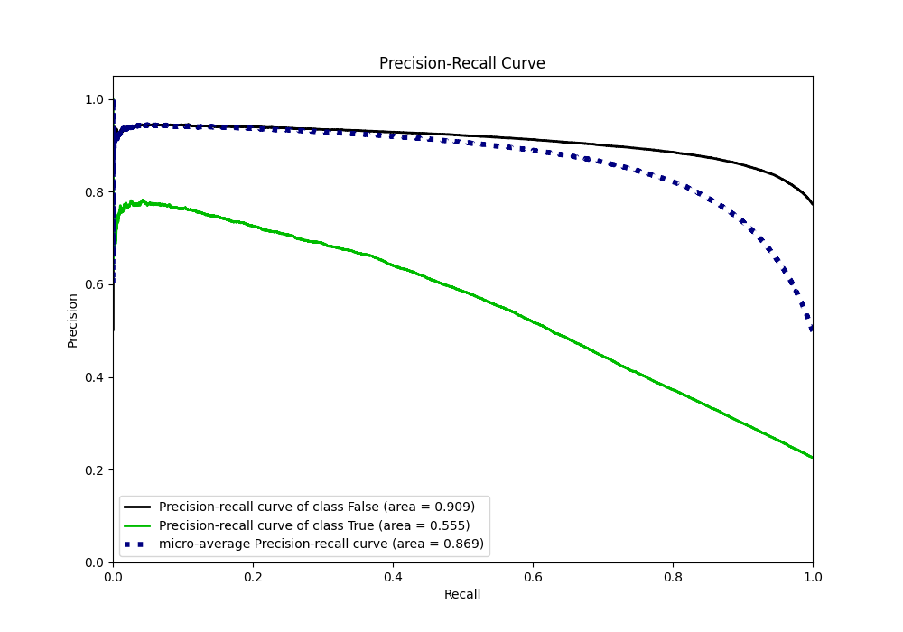
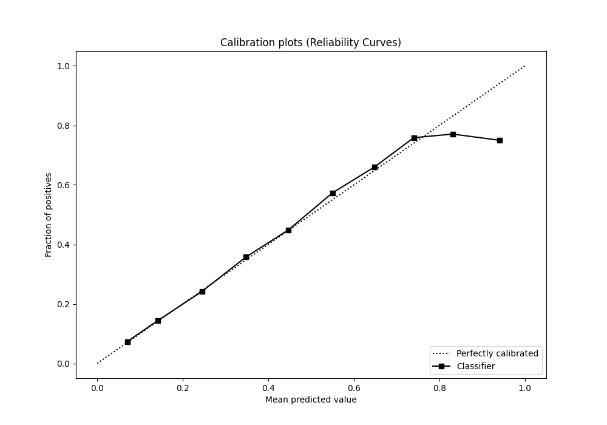
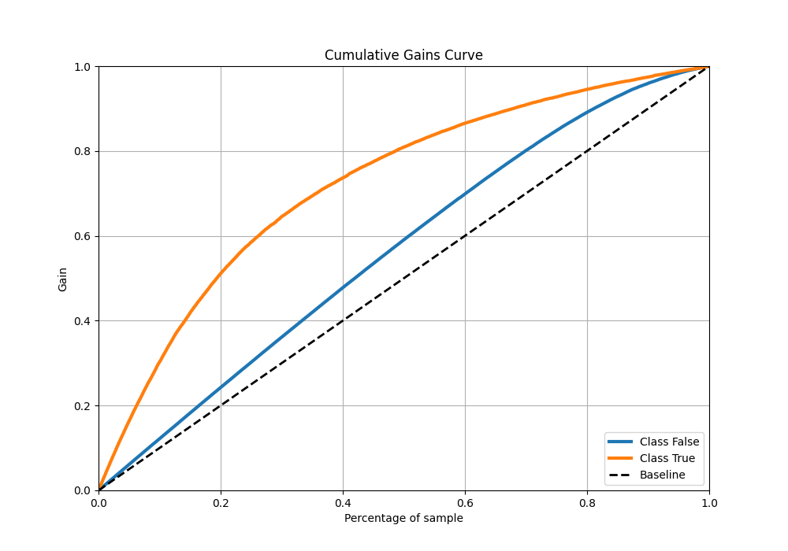
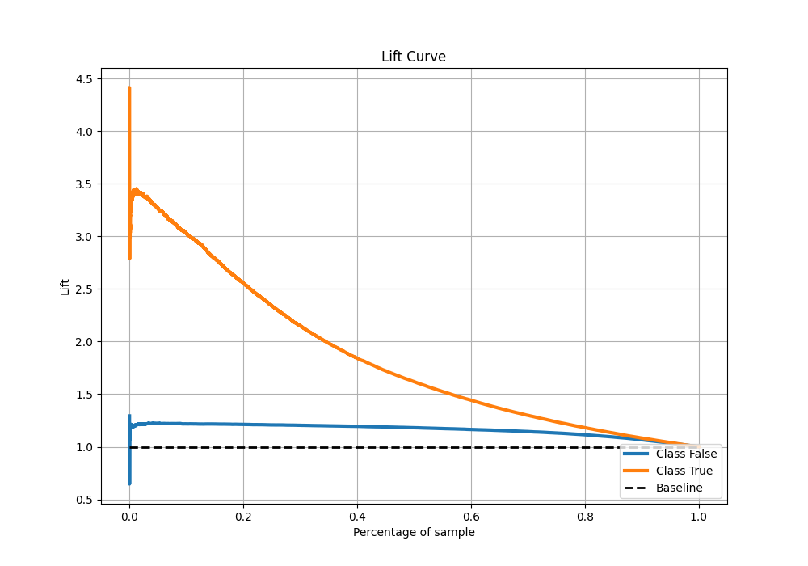

# Summary of 56_NeuralNetwork

[<< Go back](../README.md)

## Neural Network
- **n_jobs**: -1
- **dense_1_size**: 64
- **dense_2_size**: 16
- **learning_rate**: 0.01
- **explain_level**: 0

## Validation
 - **validation_type**: kfold
 - **shuffle**: True
 - **stratify**: True
 - **k_folds**: 10

## Optimized metric
auc

## Training time

279.6 seconds

## Metric details
|           |    score |     threshold |
|:----------|---------:|--------------:|
| logloss   | 0.432479 | nan           |
| auc       | 0.787653 | nan           |
| f1        | 0.557082 |   0.277519    |
| accuracy  | 0.814068 |   0.500413    |
| precision | 0.772424 |   0.732272    |
| recall    | 1        |   1.80315e-19 |
| mcc       | 0.421777 |   0.324823    |

## Metric details with threshold from accuracy metric
|           |    score |   threshold |
|:----------|---------:|------------:|
| logloss   | 0.432479 |  nan        |
| auc       | 0.787653 |  nan        |
| f1        | 0.479434 |    0.500413 |
| accuracy  | 0.814068 |    0.500413 |
| precision | 0.655951 |    0.500413 |
| recall    | 0.377775 |    0.500413 |
| mcc       | 0.397312 |    0.500413 |

## Confusion matrix (at threshold=0.500413)
|                  |   Predicted as False |   Predicted as True |
|:-----------------|---------------------:|--------------------:|
| Labeled as False |                74129 |                4570 |
| Labeled as True  |                14351 |                8713 |

## Learning curves

## Confusion Matrix

## Normalized Confusion Matrix

## ROC Curve

## Kolmogorov-Smirnov Statistic

## Precision-Recall Curve

## Calibration Curve

## Cumulative Gains Curve

## Lift Curve

[<< Go back](../README.md)
