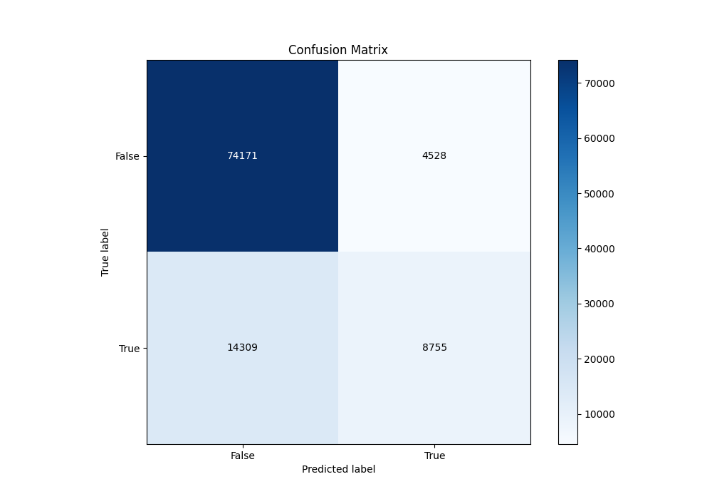
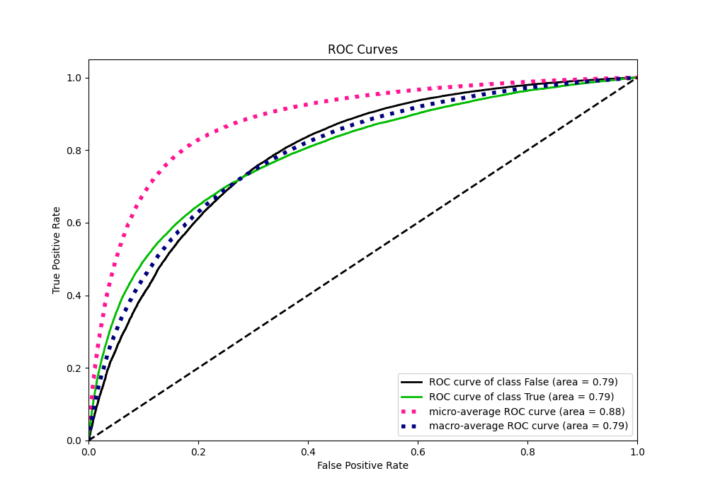
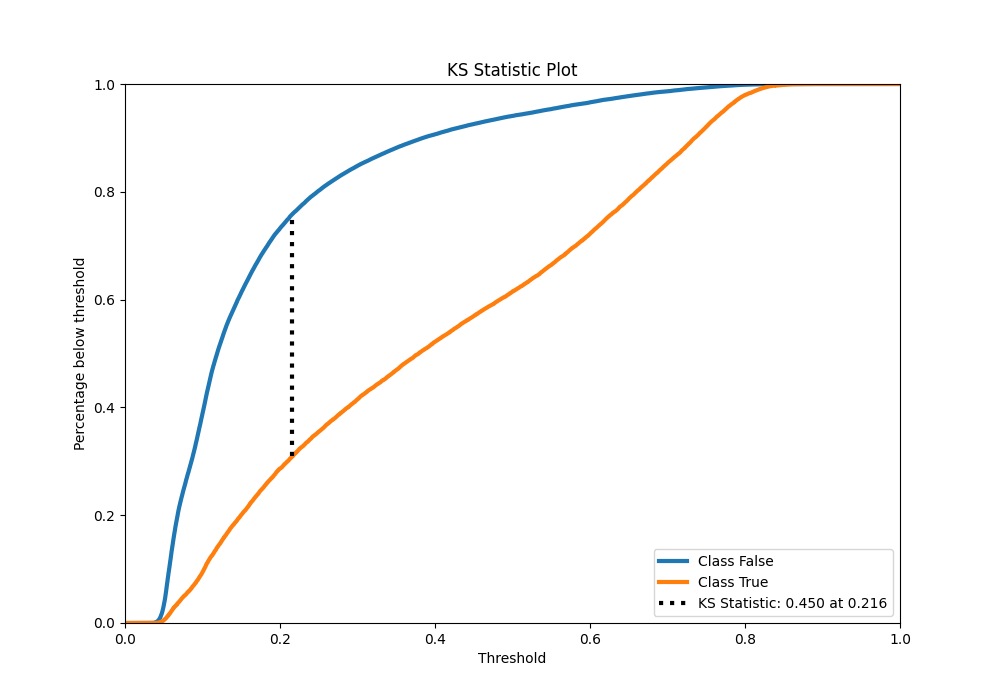
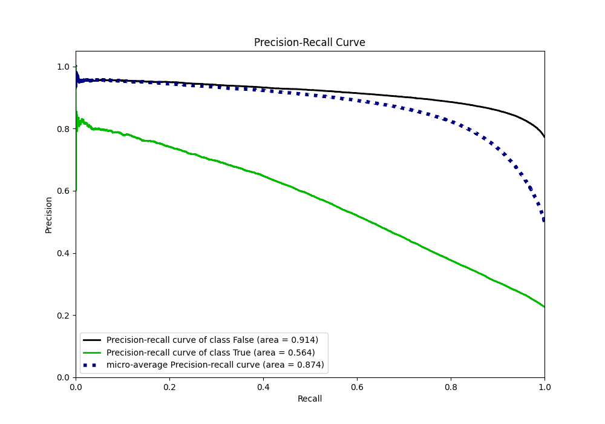
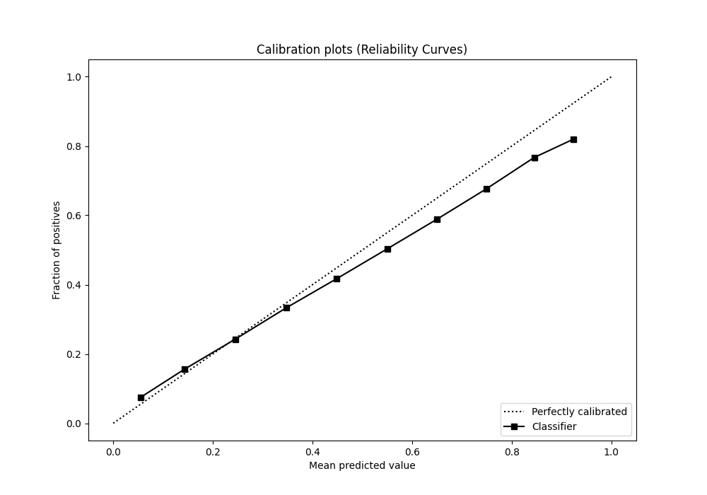
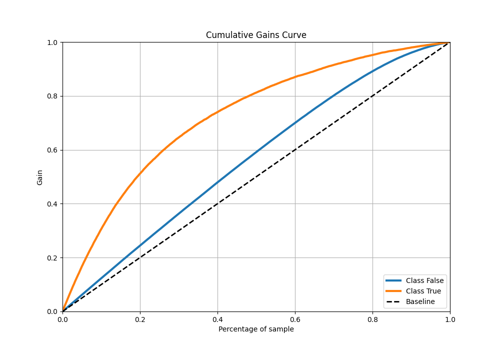
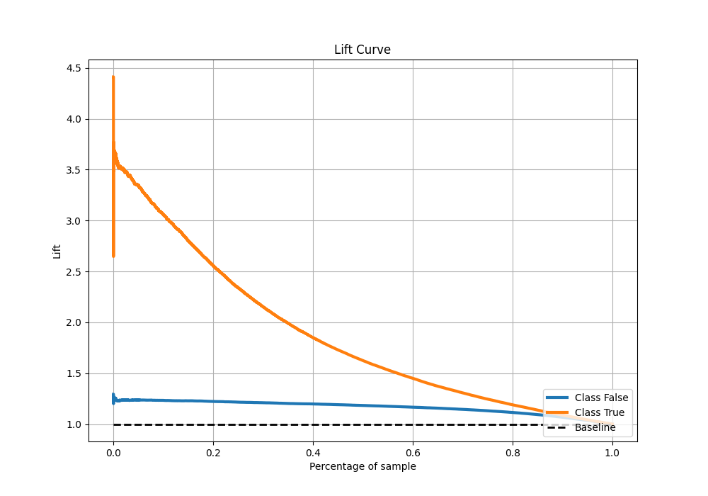

# Summary of 57_Xgboost

[<< Go back](../README.md)

## Extreme Gradient Boosting (Xgboost)
- **n_jobs**: -1
- **objective**: binary:logistic
- **eta**: 0.1
- **max_depth**: 7
- **min_child_weight**: 25
- **subsample**: 0.8
- **colsample_bytree**: 0.6
- **eval_metric**: auc
- **explain_level**: 0

## Validation
 - **validation_type**: kfold
 - **shuffle**: True
 - **stratify**: True
 - **k_folds**: 10

## Optimized metric
auc

## Training time

41.6 seconds

## Metric details
|           |    score |   threshold |
|:----------|---------:|------------:|
| logloss   | 0.428876 | nan         |
| auc       | 0.792257 | nan         |
| f1        | 0.557537 |   0.288391  |
| accuracy  | 0.814893 |   0.50638   |
| precision | 0.797961 |   0.782823  |
| recall    | 1        |   0.0282888 |
| mcc       | 0.422599 |   0.35199   |

## Metric details with threshold from accuracy metric
|           |    score |   threshold |
|:----------|---------:|------------:|
| logloss   | 0.428876 |   nan       |
| auc       | 0.792257 |   nan       |
| f1        | 0.481745 |     0.50638 |
| accuracy  | 0.814893 |     0.50638 |
| precision | 0.659113 |     0.50638 |
| recall    | 0.379596 |     0.50638 |
| mcc       | 0.400238 |     0.50638 |

## Confusion matrix (at threshold=0.50638)
|                  |   Predicted as False |   Predicted as True |
|:-----------------|---------------------:|--------------------:|
| Labeled as False |                74171 |                4528 |
| Labeled as True  |                14309 |                8755 |

## Learning curves

## Confusion Matrix

## Normalized Confusion Matrix

## ROC Curve

## Kolmogorov-Smirnov Statistic

## Precision-Recall Curve

## Calibration Curve

## Cumulative Gains Curve

## Lift Curve

[<< Go back](../README.md)
