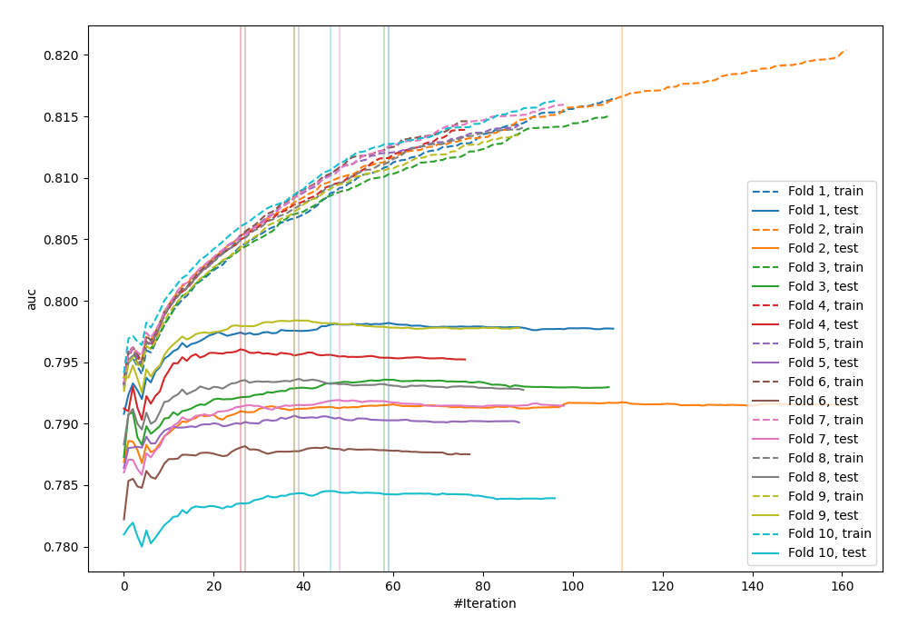
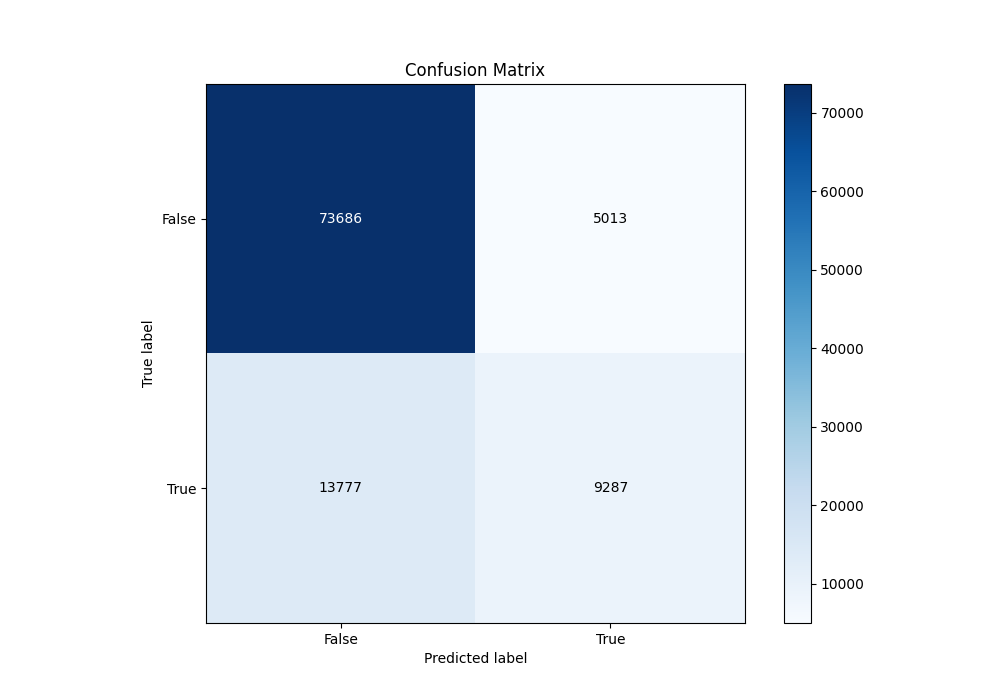
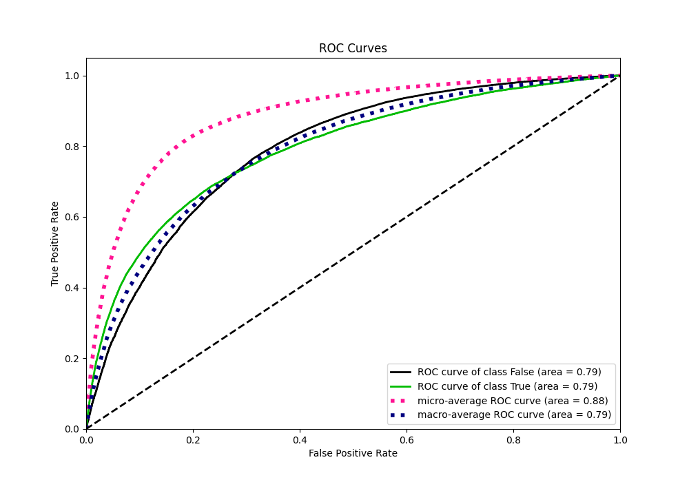
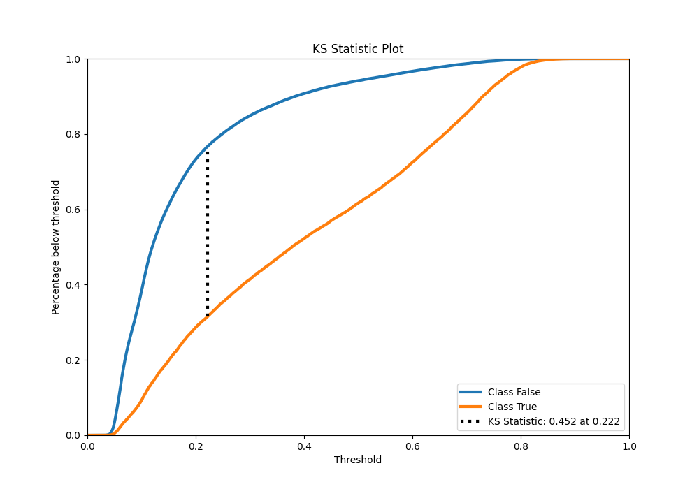
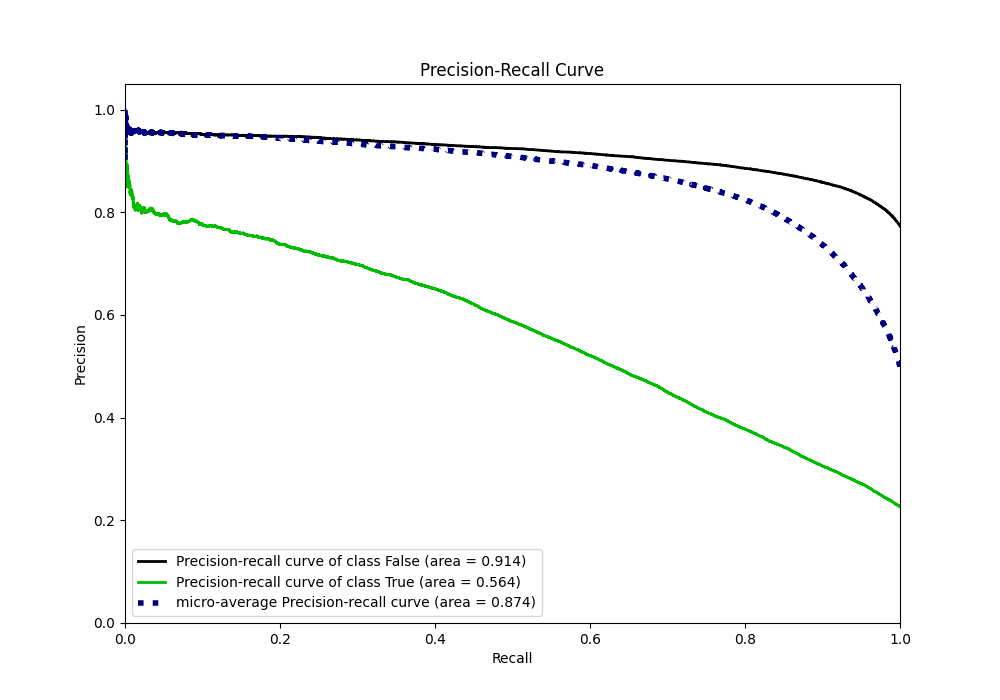
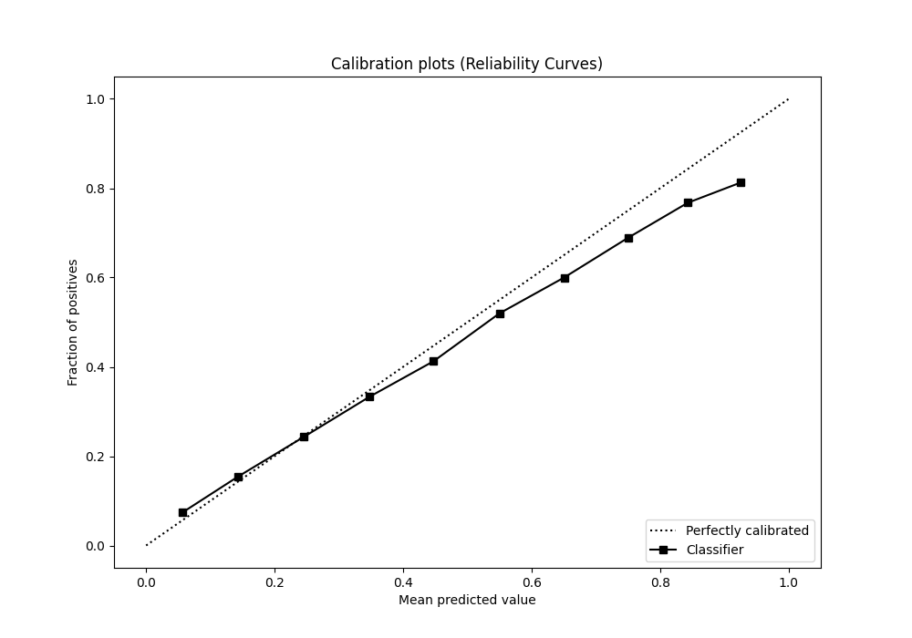
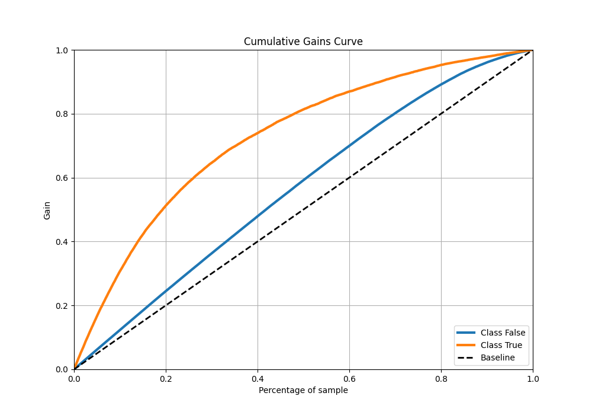
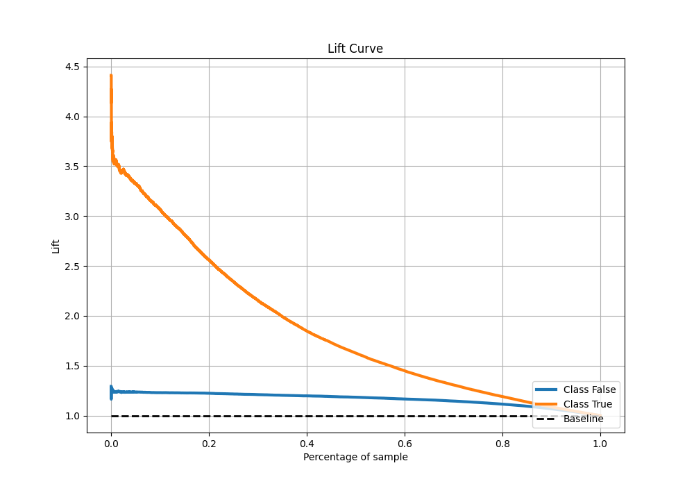

# Summary of 58_Xgboost

[<< Go back](../README.md)

## Extreme Gradient Boosting (Xgboost)
- **n_jobs**: -1
- **objective**: binary:logistic
- **eta**: 0.1
- **max_depth**: 7
- **min_child_weight**: 25
- **subsample**: 1.0
- **colsample_bytree**: 0.6
- **eval_metric**: auc
- **explain_level**: 0

## Validation
 - **validation_type**: kfold
 - **shuffle**: True
 - **stratify**: True
 - **k_folds**: 10

## Optimized metric
auc

## Training time

41.5 seconds

## Metric details
|           |    score |   threshold |
|:----------|---------:|------------:|
| logloss   | 0.428729 | nan         |
| auc       | 0.792388 | nan         |
| f1        | 0.55811  |   0.277856  |
| accuracy  | 0.815355 |   0.481308  |
| precision | 0.798888 |   0.782521  |
| recall    | 1        |   0.0262881 |
| mcc       | 0.422286 |   0.366477  |

## Metric details with threshold from accuracy metric
|           |    score |   threshold |
|:----------|---------:|------------:|
| logloss   | 0.428729 |  nan        |
| auc       | 0.792388 |  nan        |
| f1        | 0.49711  |    0.481308 |
| accuracy  | 0.815355 |    0.481308 |
| precision | 0.649441 |    0.481308 |
| recall    | 0.402662 |    0.481308 |
| mcc       | 0.408343 |    0.481308 |

## Confusion matrix (at threshold=0.481308)
|                  |   Predicted as False |   Predicted as True |
|:-----------------|---------------------:|--------------------:|
| Labeled as False |                73686 |                5013 |
| Labeled as True  |                13777 |                9287 |

## Learning curves

## Confusion Matrix

## Normalized Confusion Matrix

## ROC Curve

## Kolmogorov-Smirnov Statistic

## Precision-Recall Curve

## Calibration Curve

## Cumulative Gains Curve

## Lift Curve

[<< Go back](../README.md)
