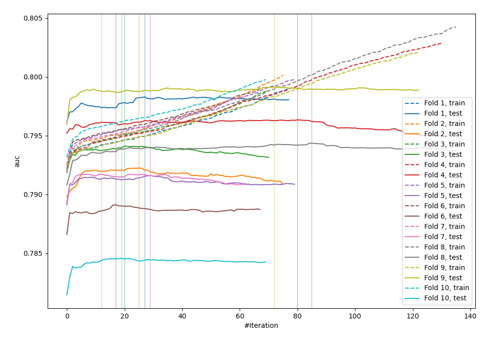
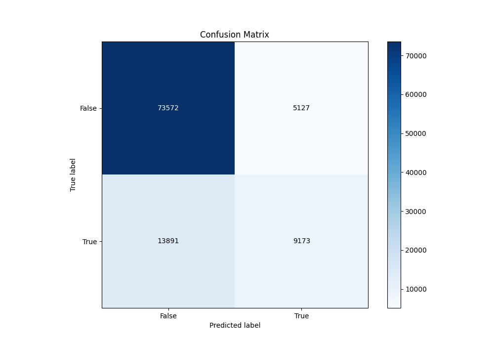
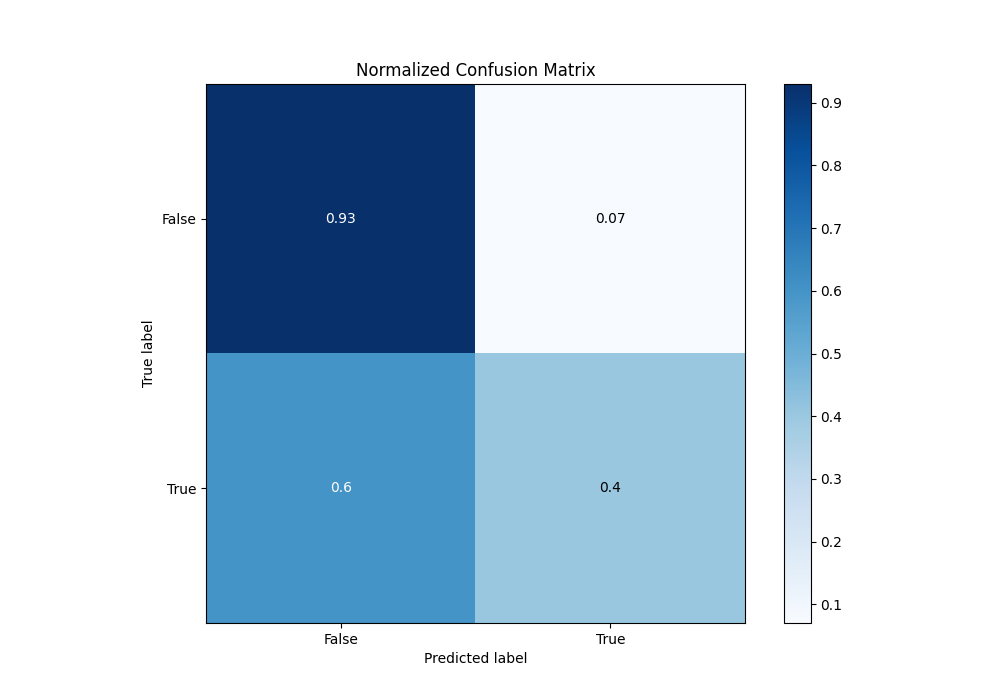
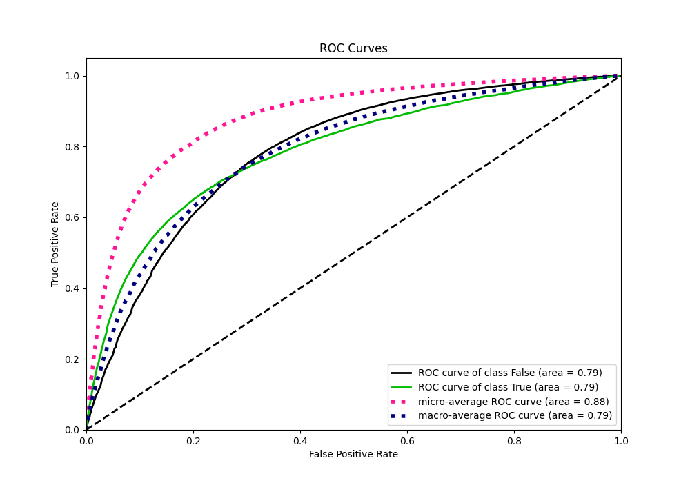
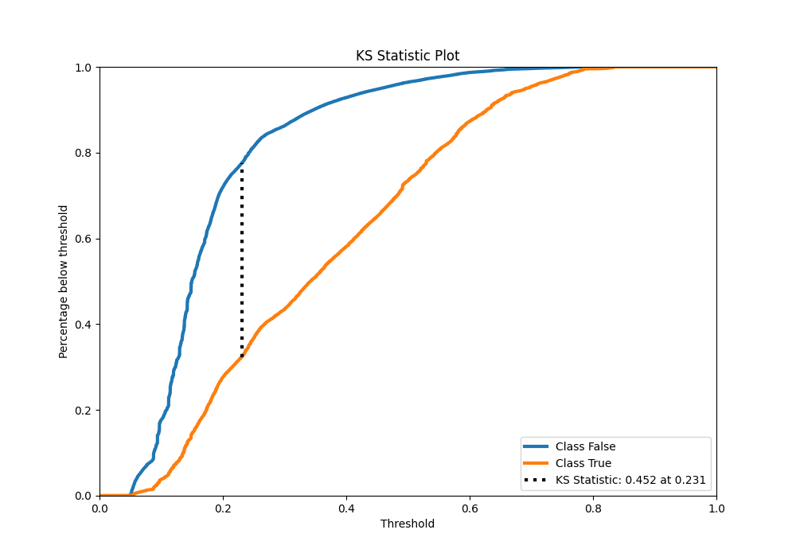
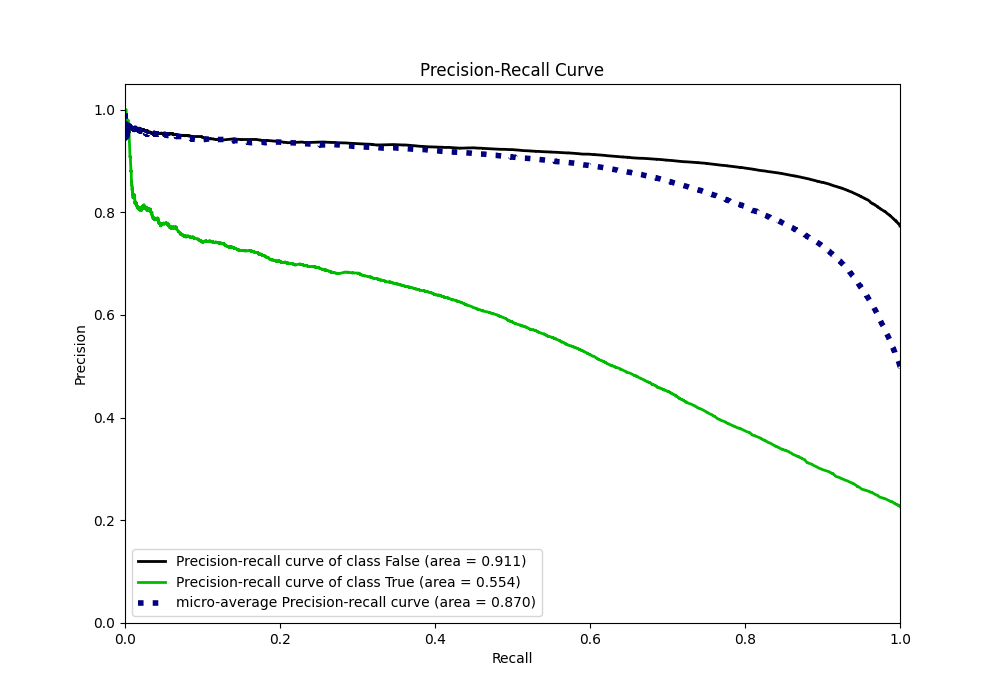
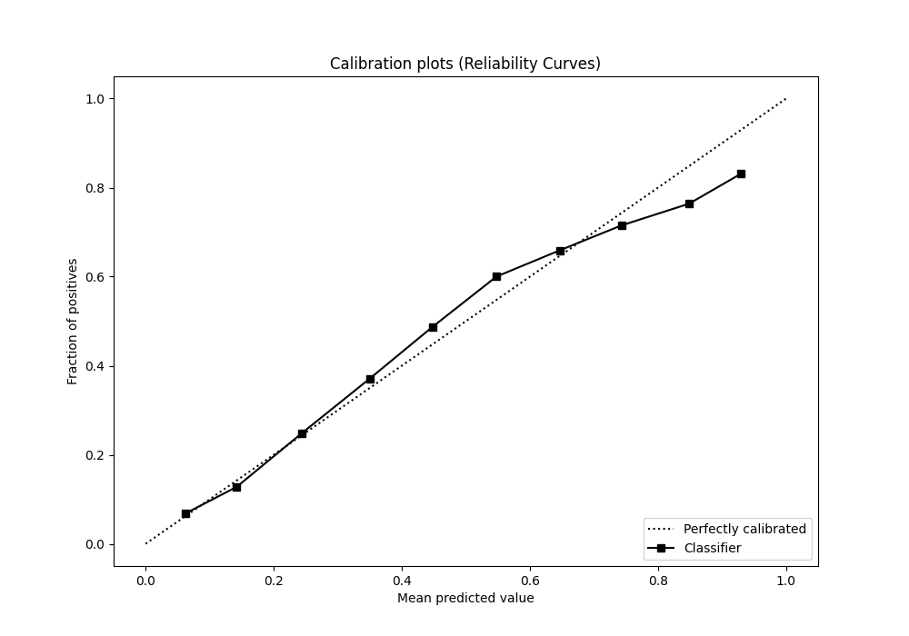
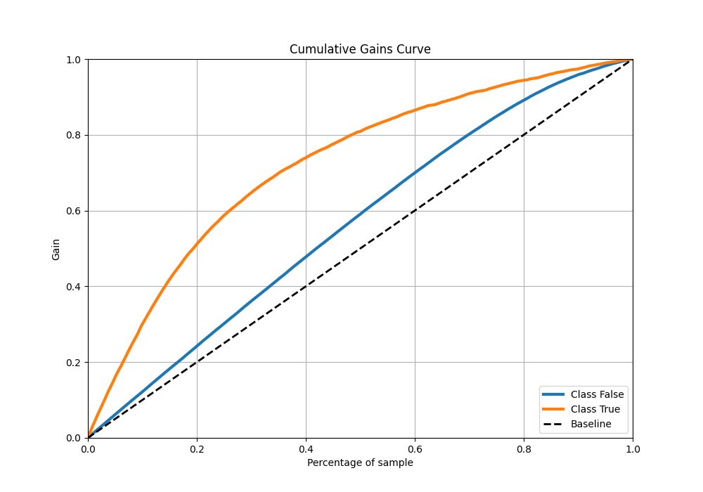
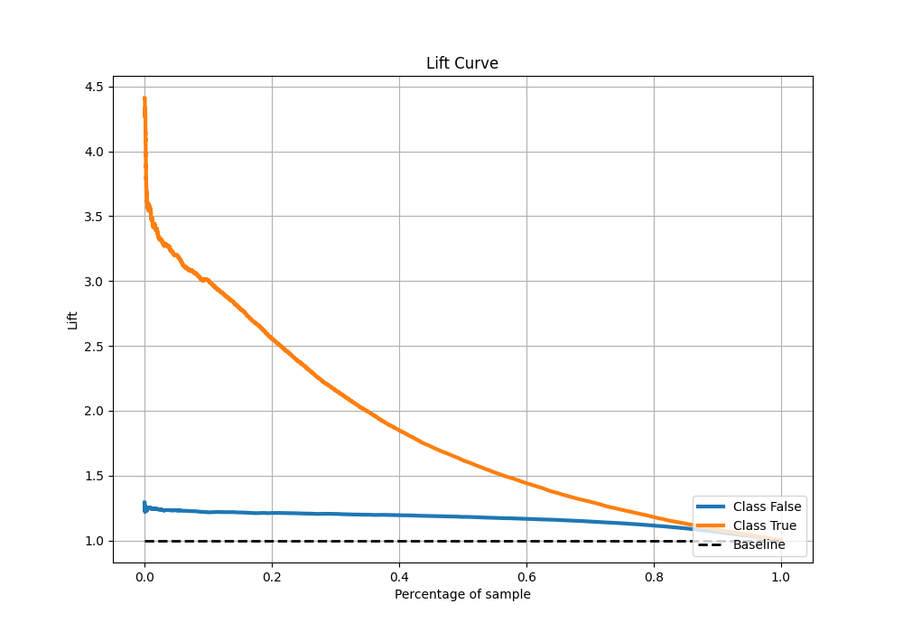

# Summary of 59_LightGBM_Stacked

[<< Go back](../README.md)

## LightGBM
- **n_jobs**: -1
- **objective**: binary
- **num_leaves**: 15
- **learning_rate**: 0.05
- **feature_fraction**: 0.8
- **bagging_fraction**: 0.8
- **min_data_in_leaf**: 50
- **metric**: auc
- **custom_eval_metric_name**: None
- **explain_level**: 0

## Validation
 - **validation_type**: kfold
 - **shuffle**: True
 - **stratify**: True
 - **k_folds**: 10

## Optimized metric
auc

## Training time

26.3 seconds

## Metric details
|           |    score |   threshold |
|:----------|---------:|------------:|
| logloss   | 0.438134 | nan         |
| auc       | 0.787846 | nan         |
| f1        | 0.55873  |   0.267138  |
| accuracy  | 0.813115 |   0.41484   |
| precision | 0.787766 |   0.716294  |
| recall    | 1        |   0.0410404 |
| mcc       | 0.423401 |   0.313848  |

## Metric details with threshold from accuracy metric
|           |    score |   threshold |
|:----------|---------:|------------:|
| logloss   | 0.438134 |   nan       |
| auc       | 0.787846 |   nan       |
| f1        | 0.491007 |     0.41484 |
| accuracy  | 0.813115 |     0.41484 |
| precision | 0.641469 |     0.41484 |
| recall    | 0.397719 |     0.41484 |
| mcc       | 0.400643 |     0.41484 |

## Confusion matrix (at threshold=0.41484)
|                  |   Predicted as False |   Predicted as True |
|:-----------------|---------------------:|--------------------:|
| Labeled as False |                73572 |                5127 |
| Labeled as True  |                13891 |                9173 |

## Learning curves

## Confusion Matrix

## Normalized Confusion Matrix

## ROC Curve

## Kolmogorov-Smirnov Statistic

## Precision-Recall Curve

## Calibration Curve

## Cumulative Gains Curve

## Lift Curve

[<< Go back](../README.md)
