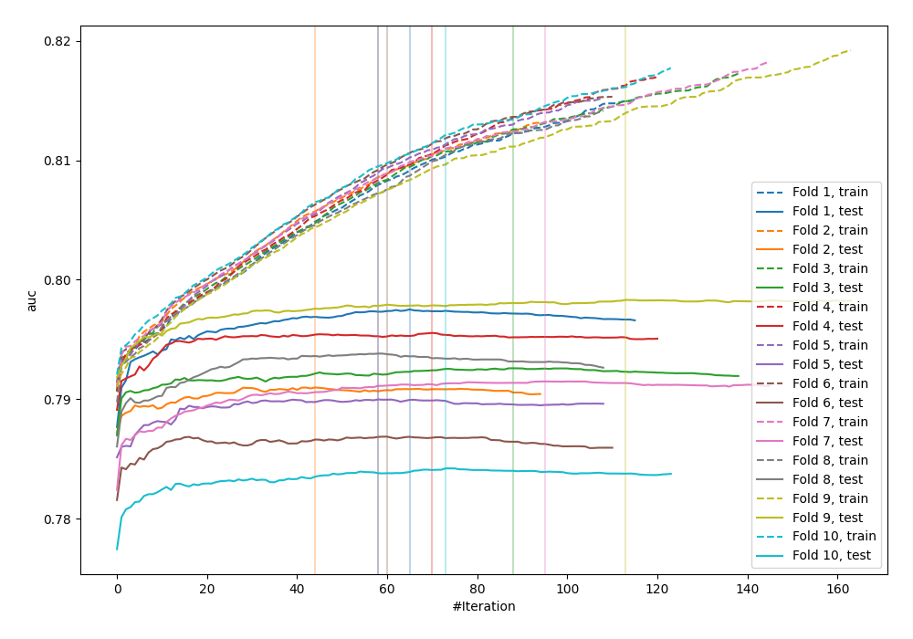
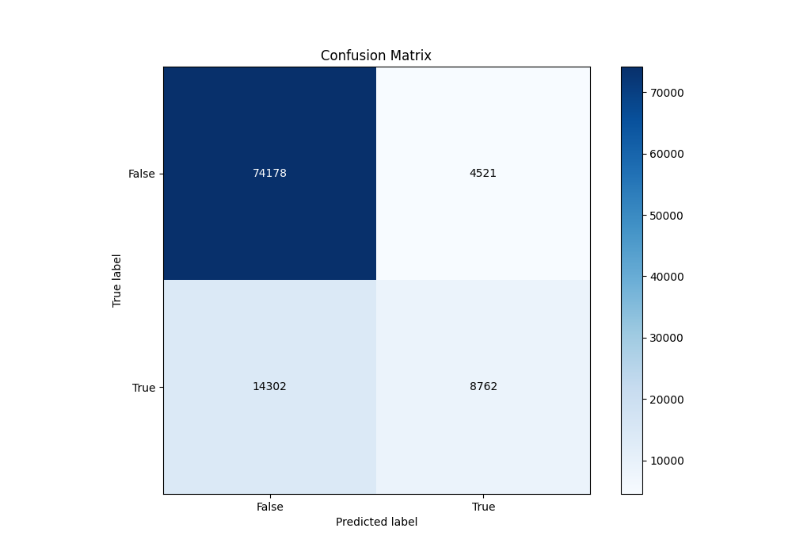
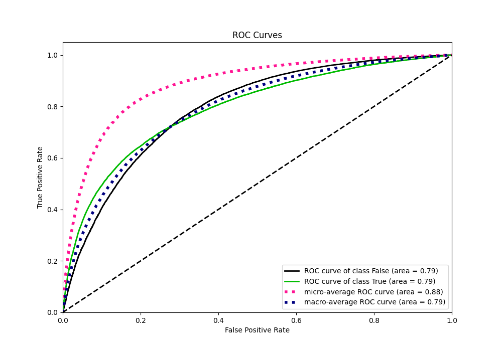
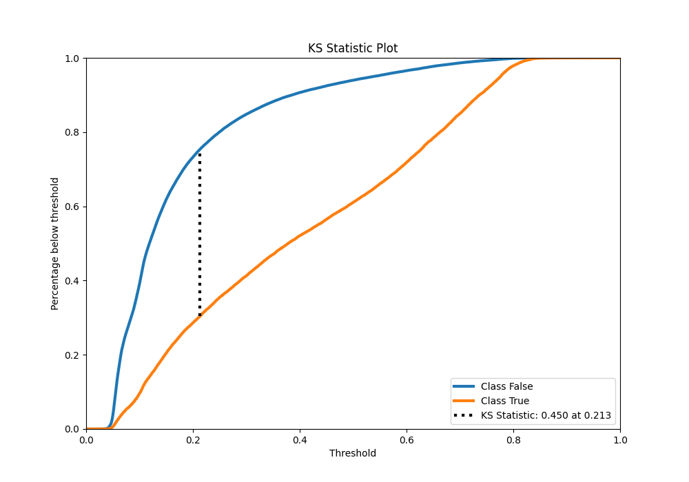
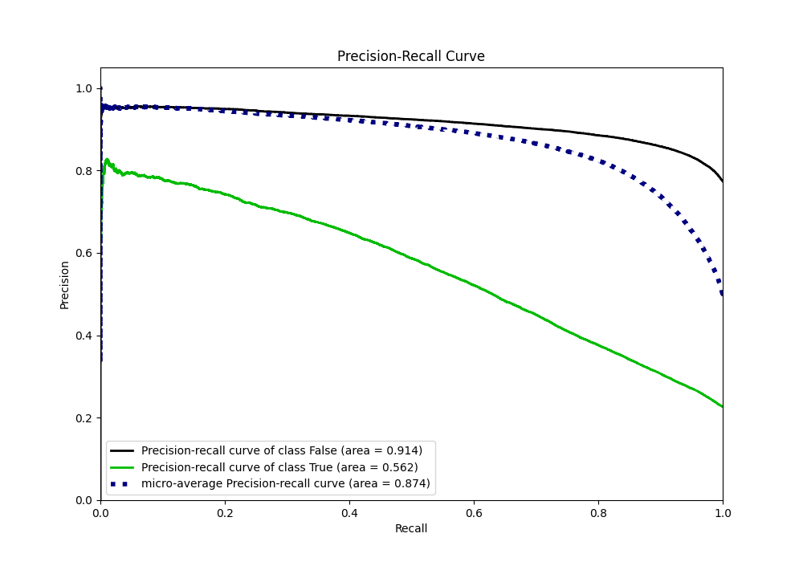
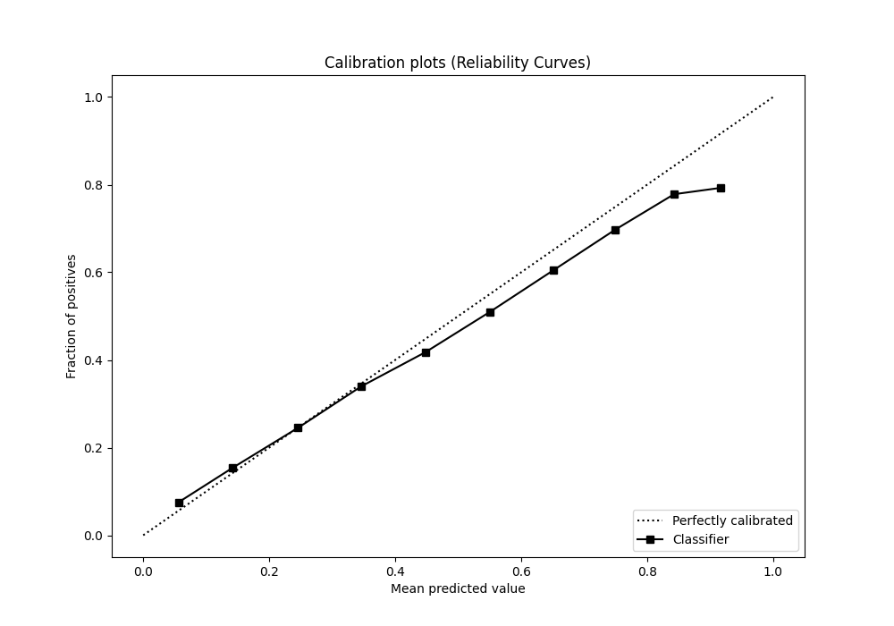
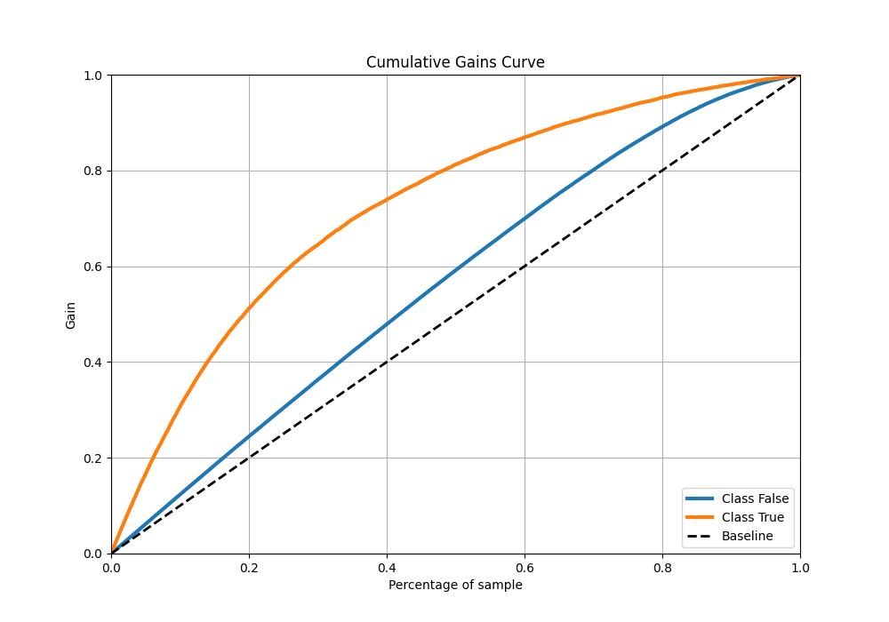
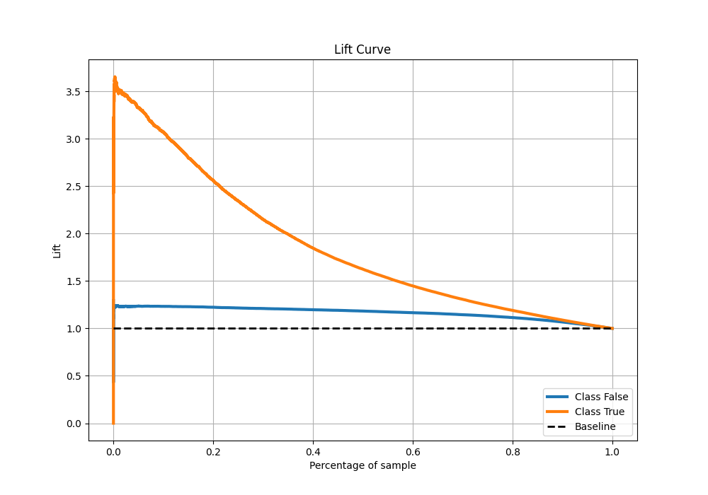

# Summary of 5_Default_Xgboost

[<< Go back](../README.md)

## Extreme Gradient Boosting (Xgboost)
- **n_jobs**: -1
- **objective**: binary:logistic
- **eta**: 0.075
- **max_depth**: 6
- **min_child_weight**: 1
- **subsample**: 1.0
- **colsample_bytree**: 1.0
- **eval_metric**: auc
- **explain_level**: 0

## Validation
 - **validation_type**: kfold
 - **shuffle**: True
 - **stratify**: True
 - **k_folds**: 10

## Optimized metric
auc

## Training time

32.0 seconds

## Metric details
|           |    score |   threshold |
|:----------|---------:|------------:|
| logloss   | 0.428963 | nan         |
| auc       | 0.792059 | nan         |
| f1        | 0.55811  |   0.278637  |
| accuracy  | 0.815031 |   0.510297  |
| precision | 0.790547 |   0.784936  |
| recall    | 1        |   0.0243165 |
| mcc       | 0.422599 |   0.351004  |

## Metric details with threshold from accuracy metric
|           |    score |   threshold |
|:----------|---------:|------------:|
| logloss   | 0.428963 |  nan        |
| auc       | 0.792059 |  nan        |
| f1        | 0.482131 |    0.510297 |
| accuracy  | 0.815031 |    0.510297 |
| precision | 0.65964  |    0.510297 |
| recall    | 0.379899 |    0.510297 |
| mcc       | 0.400726 |    0.510297 |

## Confusion matrix (at threshold=0.510297)
|                  |   Predicted as False |   Predicted as True |
|:-----------------|---------------------:|--------------------:|
| Labeled as False |                74178 |                4521 |
| Labeled as True  |                14302 |                8762 |

## Learning curves

## Confusion Matrix

## Normalized Confusion Matrix

## ROC Curve

## Kolmogorov-Smirnov Statistic

## Precision-Recall Curve

## Calibration Curve

## Cumulative Gains Curve

## Lift Curve

[<< Go back](../README.md)
