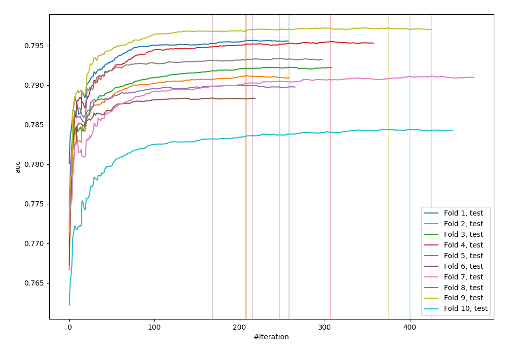
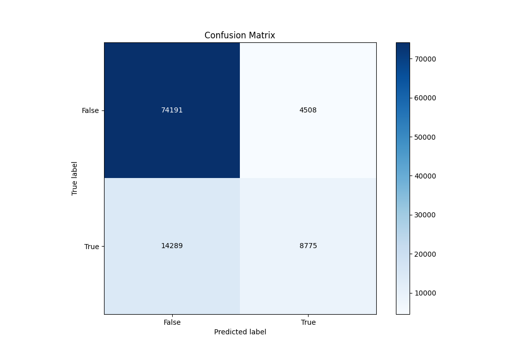
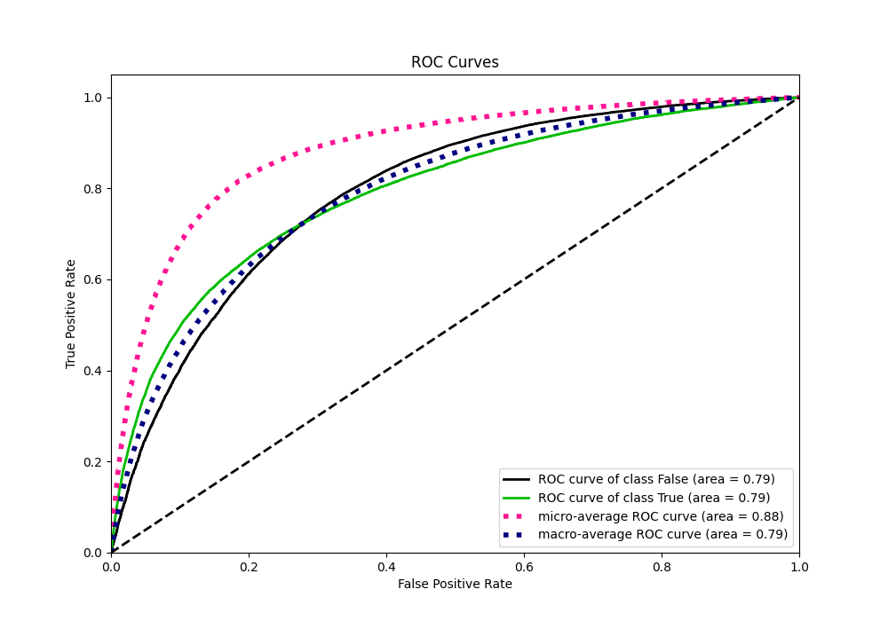
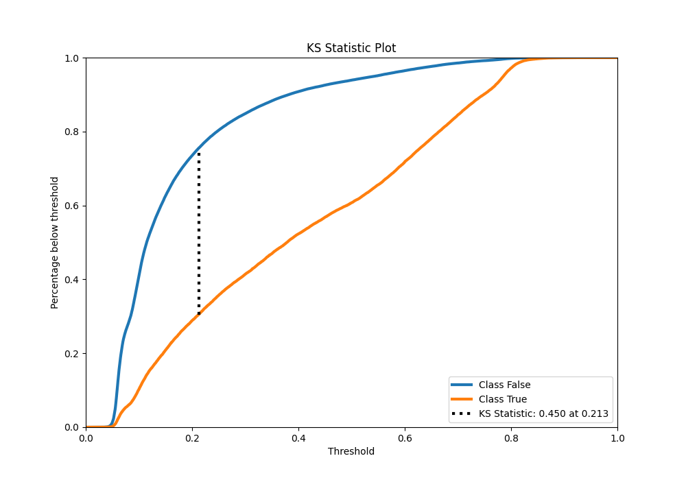
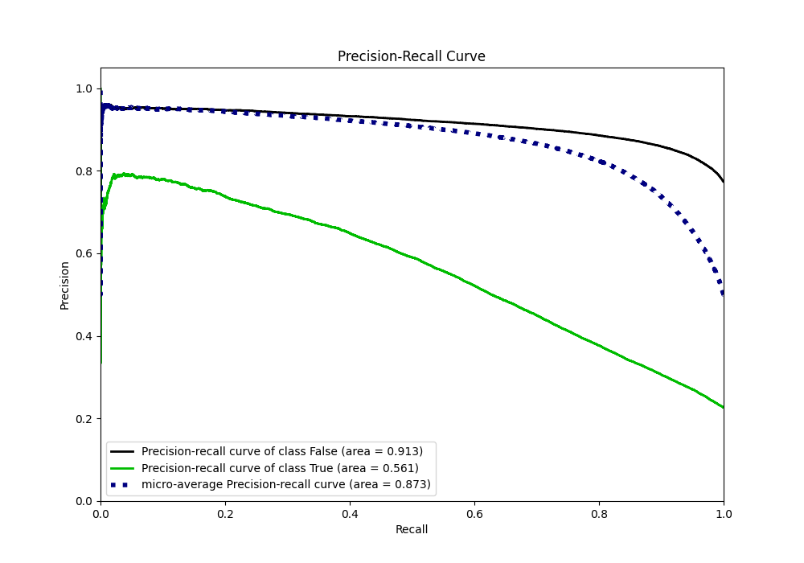
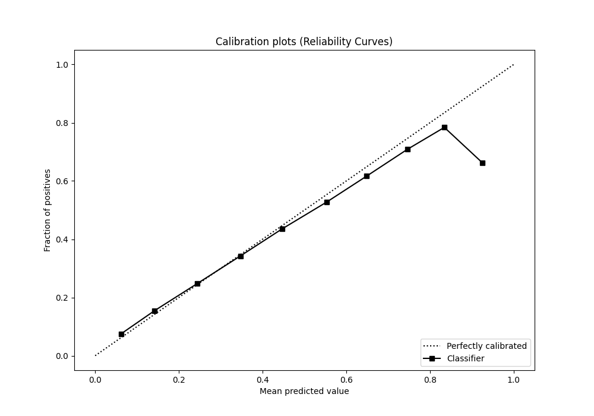
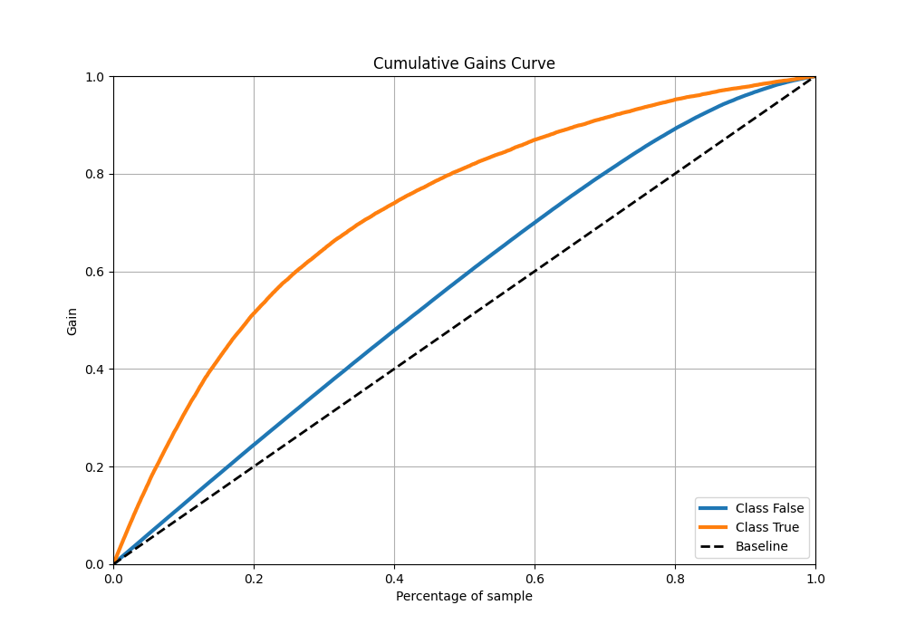
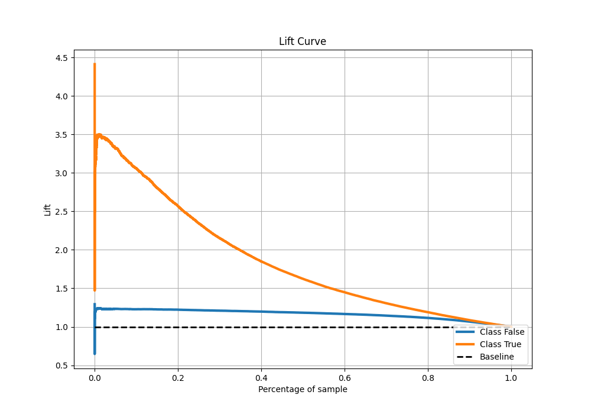

# Summary of 60_CatBoost

[<< Go back](../README.md)

## CatBoost
- **n_jobs**: -1
- **learning_rate**: 0.05
- **depth**: 8
- **rsm**: 0.7
- **loss_function**: Logloss
- **eval_metric**: AUC
- **explain_level**: 0

## Validation
 - **validation_type**: kfold
 - **shuffle**: True
 - **stratify**: True
 - **k_folds**: 10

## Optimized metric
auc

## Training time

124.5 seconds

## Metric details
|           |    score |   threshold |
|:----------|---------:|------------:|
| logloss   | 0.429166 | nan         |
| auc       | 0.791885 | nan         |
| f1        | 0.557941 |   0.287459  |
| accuracy  | 0.815286 |   0.51488   |
| precision | 0.793327 |   0.793488  |
| recall    | 1        |   0.0180043 |
| mcc       | 0.424384 |   0.350268  |

## Metric details with threshold from accuracy metric
|           |    score |   threshold |
|:----------|---------:|------------:|
| logloss   | 0.429166 |   nan       |
| auc       | 0.791885 |   nan       |
| f1        | 0.482846 |     0.51488 |
| accuracy  | 0.815286 |     0.51488 |
| precision | 0.660619 |     0.51488 |
| recall    | 0.380463 |     0.51488 |
| mcc       | 0.401632 |     0.51488 |

## Confusion matrix (at threshold=0.51488)
|                  |   Predicted as False |   Predicted as True |
|:-----------------|---------------------:|--------------------:|
| Labeled as False |                74191 |                4508 |
| Labeled as True  |                14289 |                8775 |

## Learning curves

## Confusion Matrix

## Normalized Confusion Matrix

## ROC Curve

## Kolmogorov-Smirnov Statistic

## Precision-Recall Curve

## Calibration Curve

## Cumulative Gains Curve

## Lift Curve

[<< Go back](../README.md)
