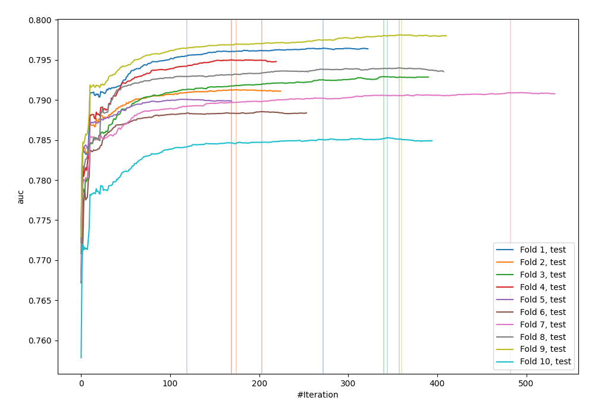
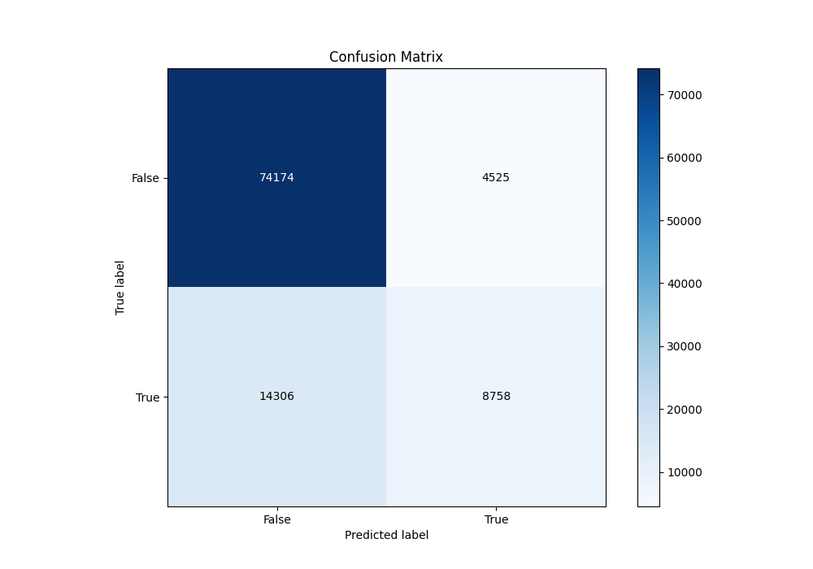
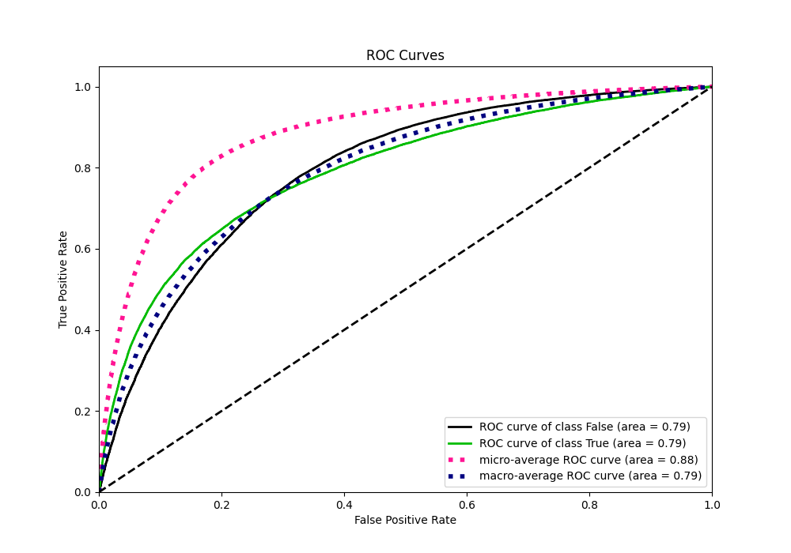
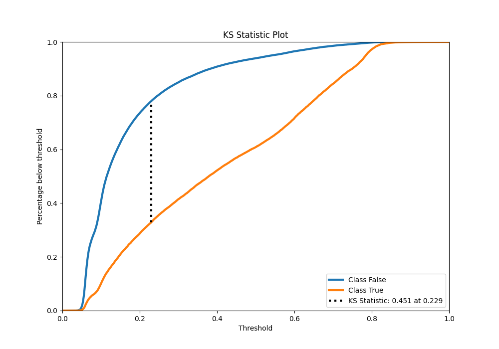
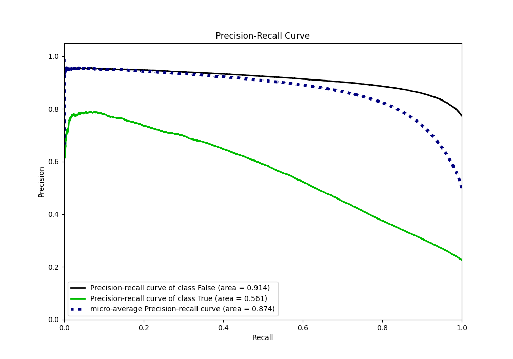
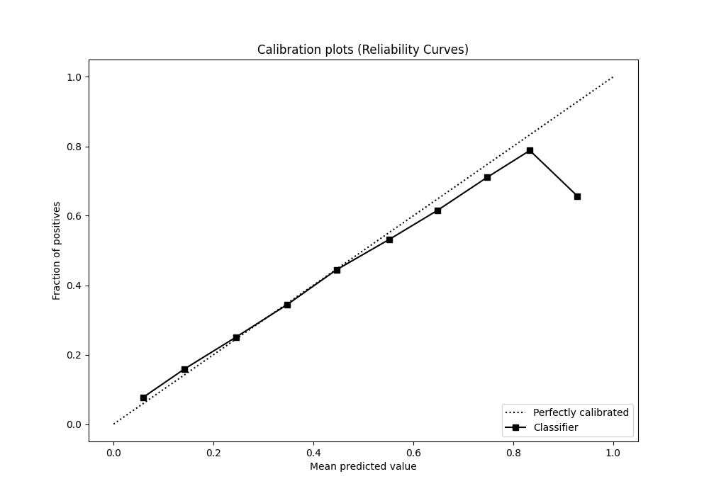
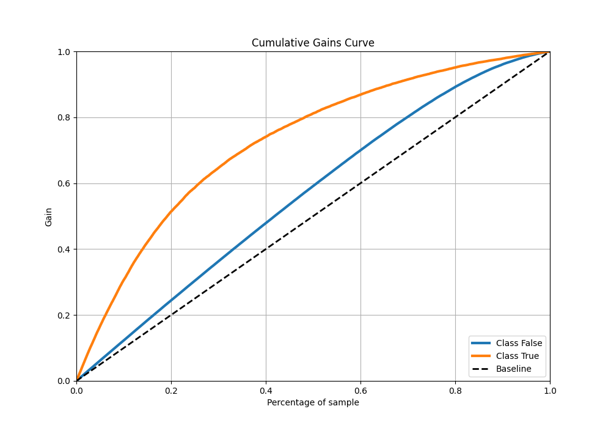
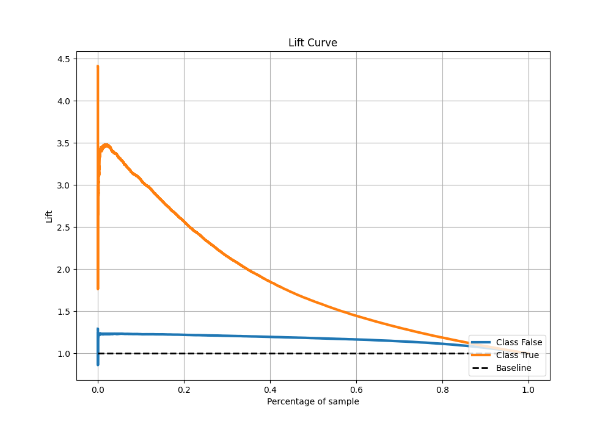

# Summary of 61_CatBoost

[<< Go back](../README.md)

## CatBoost
- **n_jobs**: -1
- **learning_rate**: 0.05
- **depth**: 8
- **rsm**: 0.9
- **loss_function**: Logloss
- **eval_metric**: AUC
- **explain_level**: 0

## Validation
 - **validation_type**: kfold
 - **shuffle**: True
 - **stratify**: True
 - **k_folds**: 10

## Optimized metric
auc

## Training time

130.3 seconds

## Metric details
|           |    score |   threshold |
|:----------|---------:|------------:|
| logloss   | 0.428979 | nan         |
| auc       | 0.792192 | nan         |
| f1        | 0.559494 |   0.275999  |
| accuracy  | 0.814952 |   0.513906  |
| precision | 0.785782 |   0.771822  |
| recall    | 1        |   0.0219308 |
| mcc       | 0.424866 |   0.36507   |

## Metric details with threshold from accuracy metric
|           |    score |   threshold |
|:----------|---------:|------------:|
| logloss   | 0.428979 |  nan        |
| auc       | 0.792192 |  nan        |
| f1        | 0.48191  |    0.513906 |
| accuracy  | 0.814952 |    0.513906 |
| precision | 0.659339 |    0.513906 |
| recall    | 0.379726 |    0.513906 |
| mcc       | 0.400447 |    0.513906 |

## Confusion matrix (at threshold=0.513906)
|                  |   Predicted as False |   Predicted as True |
|:-----------------|---------------------:|--------------------:|
| Labeled as False |                74174 |                4525 |
| Labeled as True  |                14306 |                8758 |

## Learning curves

## Confusion Matrix

## Normalized Confusion Matrix

## ROC Curve

## Kolmogorov-Smirnov Statistic

## Precision-Recall Curve

## Calibration Curve

## Cumulative Gains Curve

## Lift Curve

[<< Go back](../README.md)
