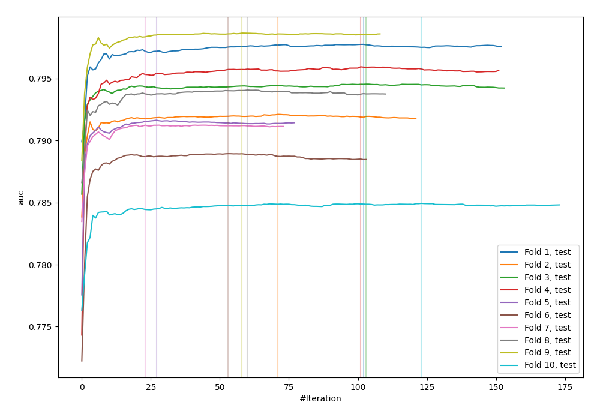
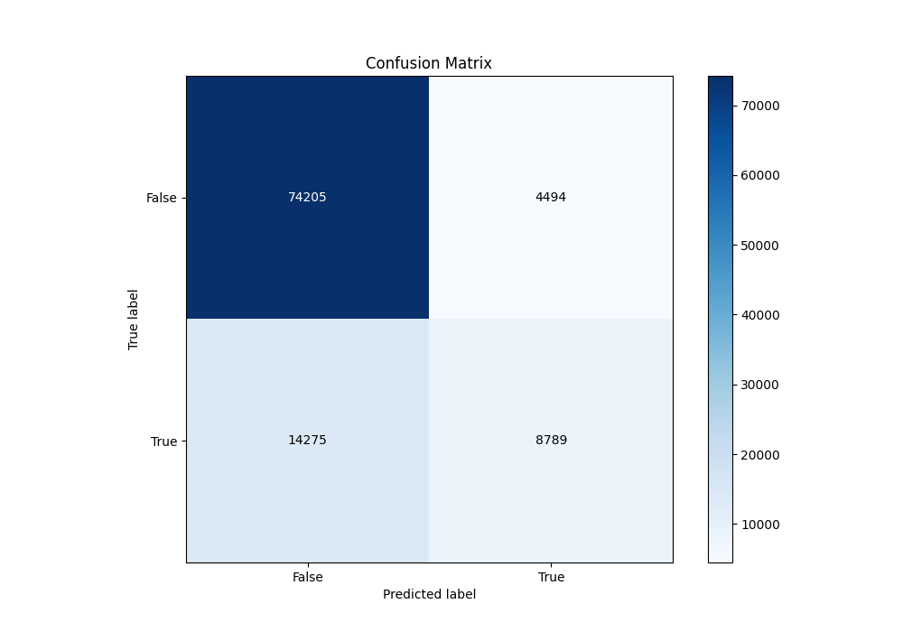
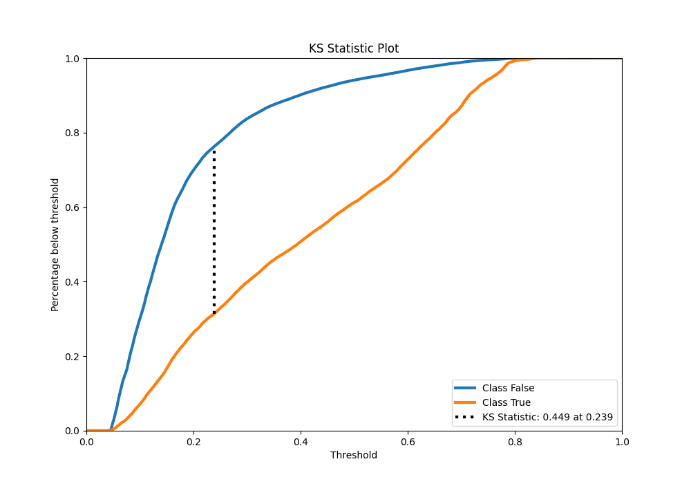
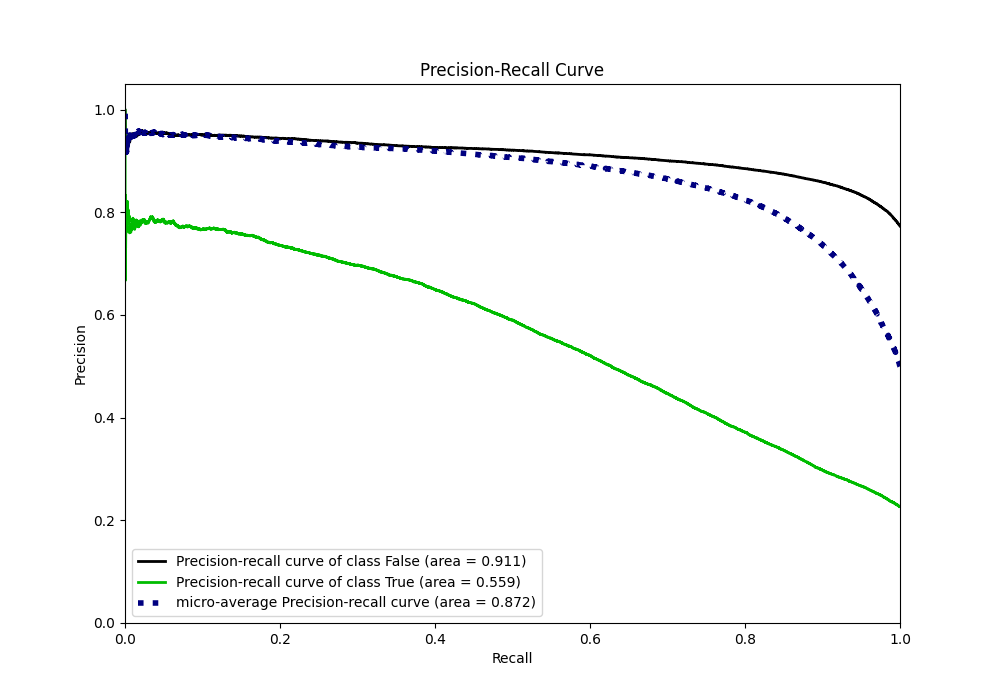
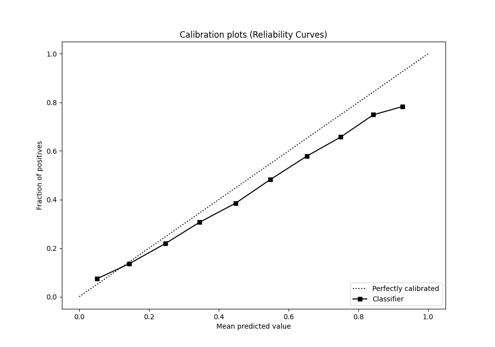
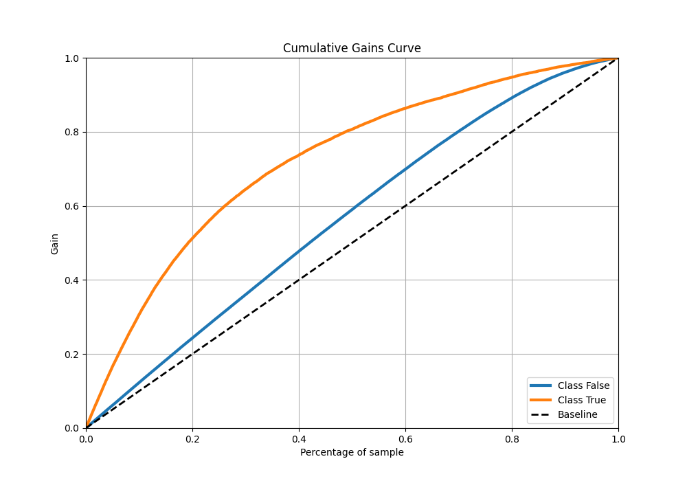
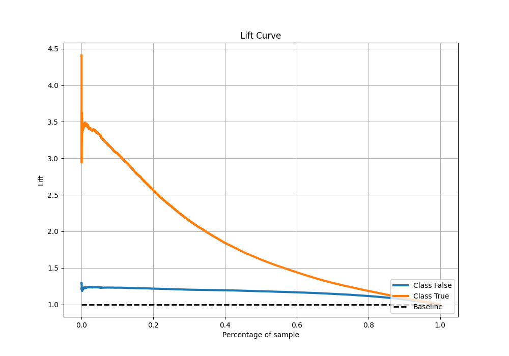

# Summary of 61_CatBoost_Stacked

[<< Go back](../README.md)

## CatBoost
- **n_jobs**: -1
- **learning_rate**: 0.05
- **depth**: 8
- **rsm**: 0.9
- **loss_function**: Logloss
- **eval_metric**: AUC
- **explain_level**: 0

## Validation
 - **validation_type**: kfold
 - **shuffle**: True
 - **stratify**: True
 - **k_folds**: 10

## Optimized metric
auc

## Training time

67.3 seconds

## Metric details
|           |    score |   threshold |
|:----------|---------:|------------:|
| logloss   | 0.431548 |  nan        |
| auc       | 0.788579 |  nan        |
| f1        | 0.557618 |    0.301809 |
| accuracy  | 0.815562 |    0.507716 |
| precision | 0.785913 |    0.772263 |
| recall    | 1        |    0.03821  |
| mcc       | 0.42258  |    0.38063  |

## Metric details with threshold from accuracy metric
|           |    score |   threshold |
|:----------|---------:|------------:|
| logloss   | 0.431548 |  nan        |
| auc       | 0.788579 |  nan        |
| f1        | 0.483616 |    0.507716 |
| accuracy  | 0.815562 |    0.507716 |
| precision | 0.661673 |    0.507716 |
| recall    | 0.38107  |    0.507716 |
| mcc       | 0.402607 |    0.507716 |

## Confusion matrix (at threshold=0.507716)
|                  |   Predicted as False |   Predicted as True |
|:-----------------|---------------------:|--------------------:|
| Labeled as False |                74205 |                4494 |
| Labeled as True  |                14275 |                8789 |

## Learning curves

## Confusion Matrix

## Normalized Confusion Matrix

## ROC Curve

## Kolmogorov-Smirnov Statistic

## Precision-Recall Curve

## Calibration Curve

## Cumulative Gains Curve

## Lift Curve

[<< Go back](../README.md)
