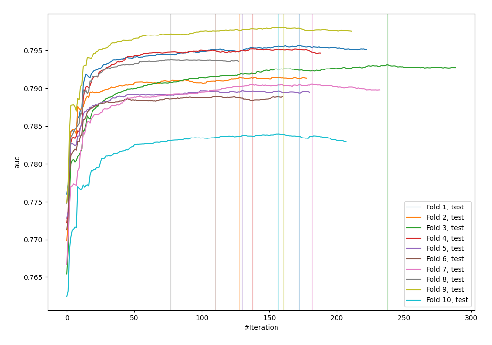
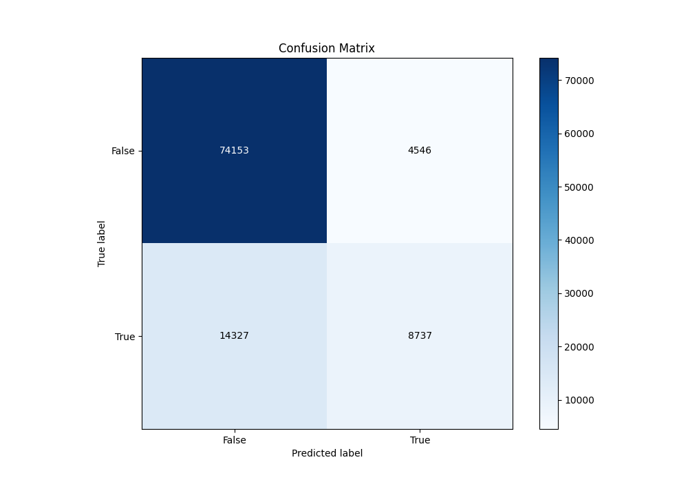
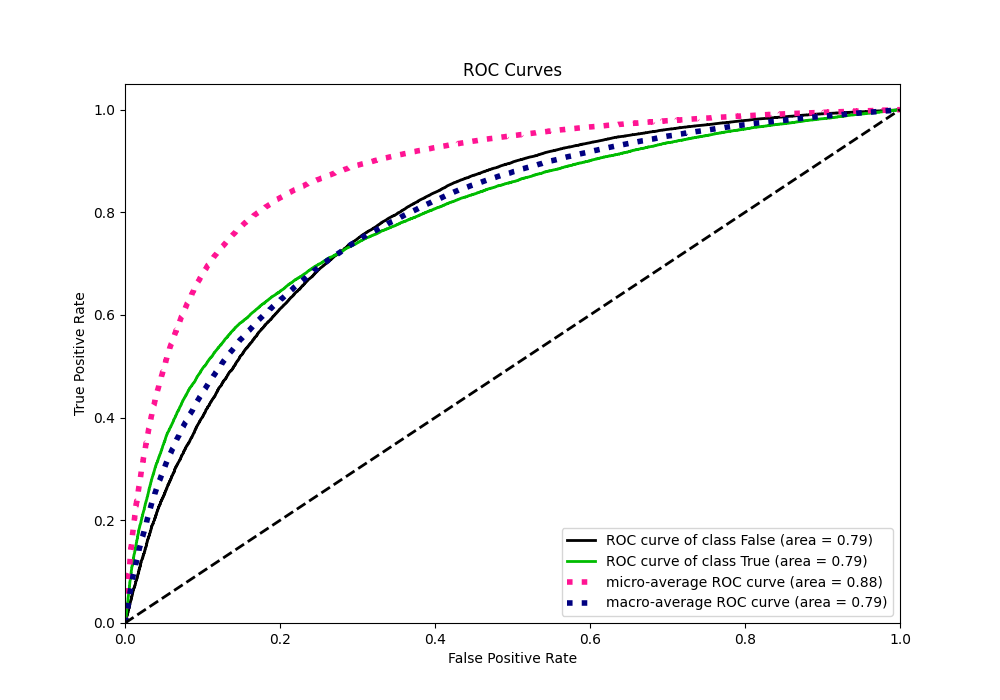
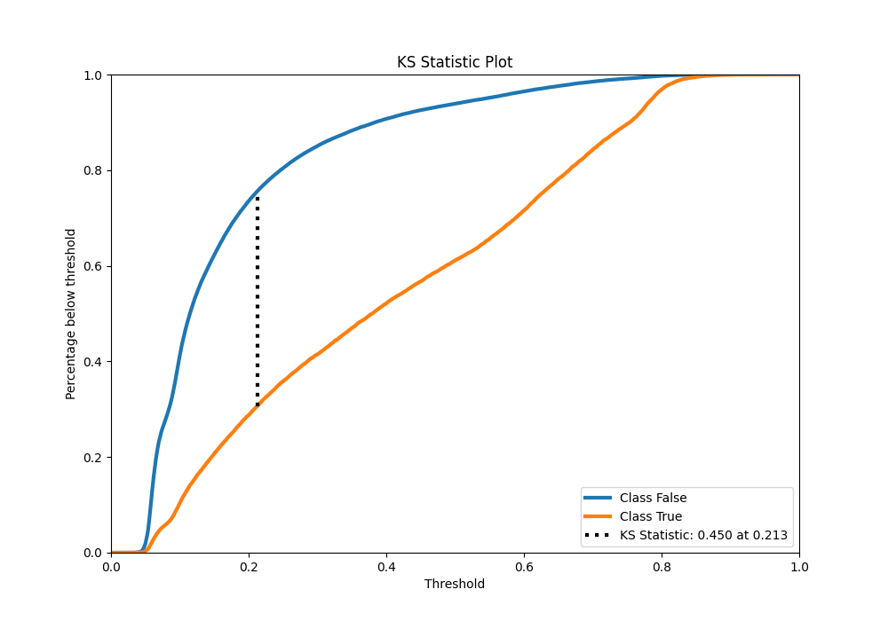
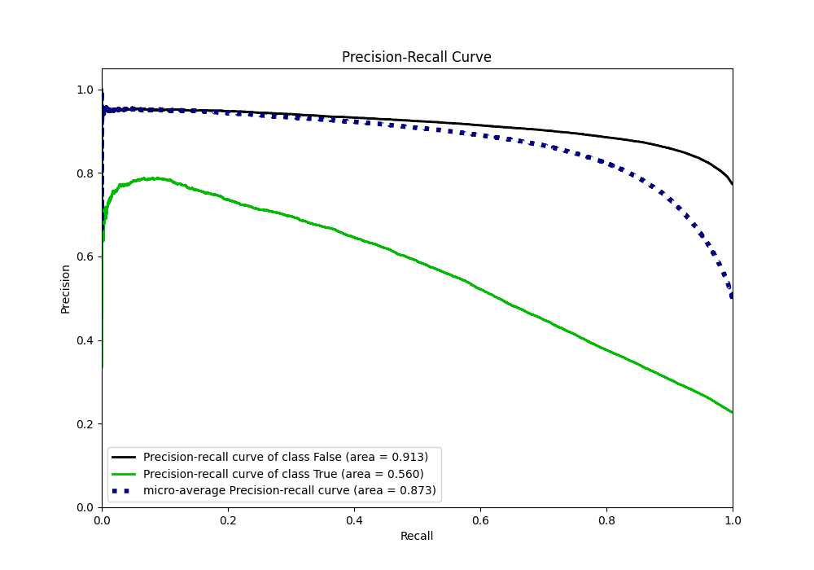
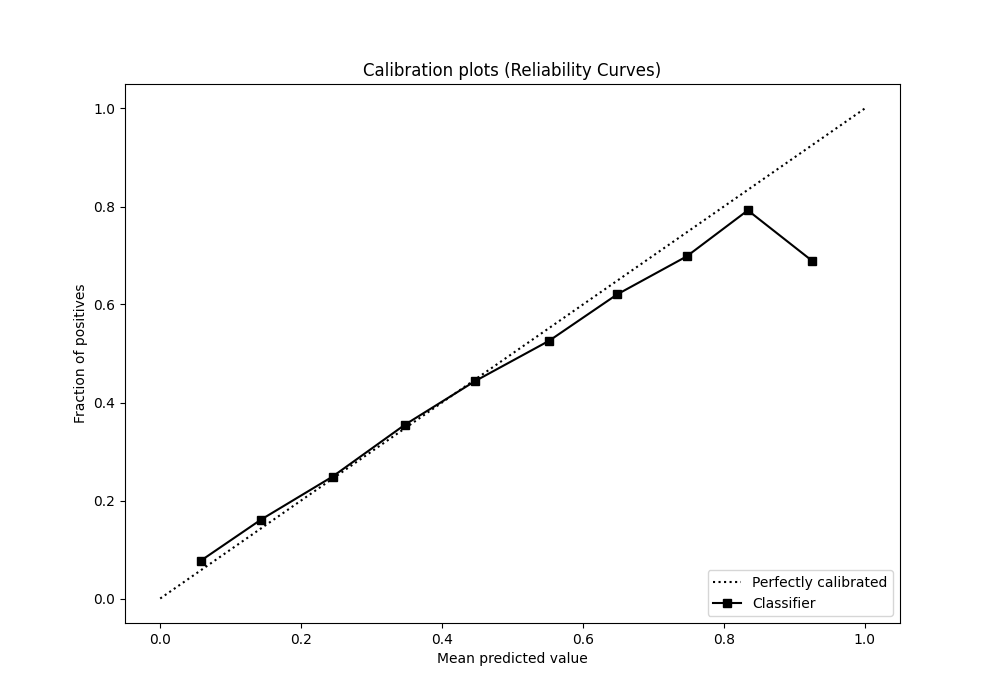
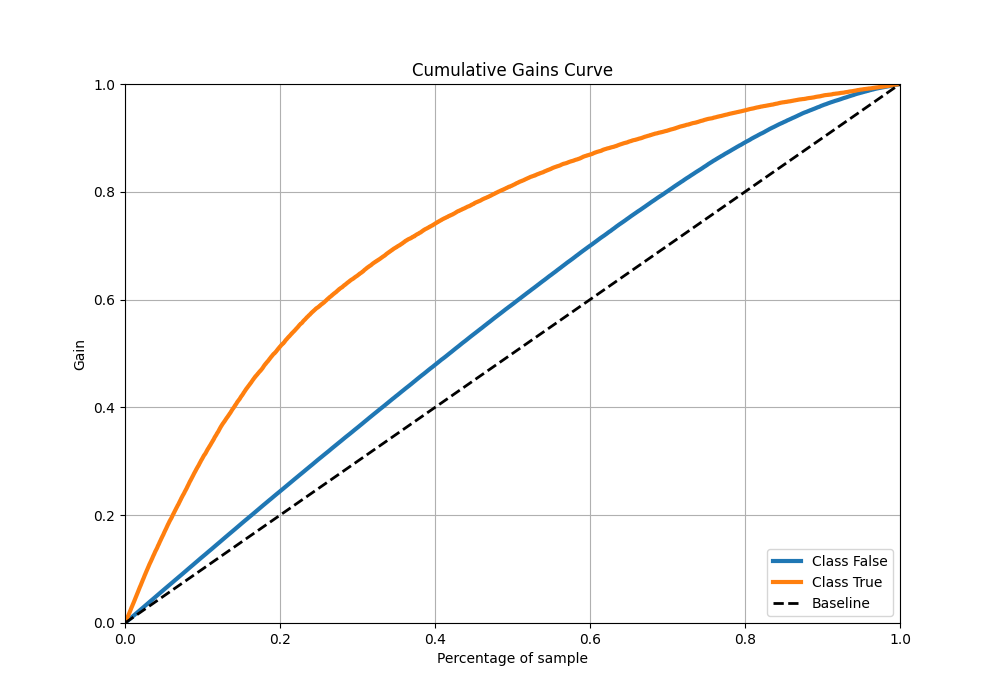
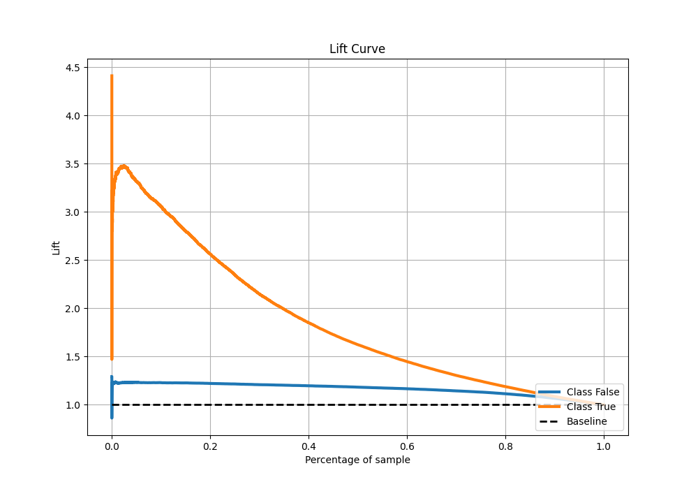

# Summary of 62_CatBoost

[<< Go back](../README.md)

## CatBoost
- **n_jobs**: -1
- **learning_rate**: 0.1
- **depth**: 8
- **rsm**: 0.9
- **loss_function**: Logloss
- **eval_metric**: AUC
- **explain_level**: 0

## Validation
 - **validation_type**: kfold
 - **shuffle**: True
 - **stratify**: True
 - **k_folds**: 10

## Optimized metric
auc

## Training time

78.9 seconds

## Metric details
|           |    score |   threshold |
|:----------|---------:|------------:|
| logloss   | 0.429247 | nan         |
| auc       | 0.791969 | nan         |
| f1        | 0.558253 |   0.309343  |
| accuracy  | 0.81454  |   0.512832  |
| precision | 0.783874 |   0.773924  |
| recall    | 1        |   0.0231646 |
| mcc       | 0.424508 |   0.322452  |

## Metric details with threshold from accuracy metric
|           |    score |   threshold |
|:----------|---------:|------------:|
| logloss   | 0.429247 |  nan        |
| auc       | 0.791969 |  nan        |
| f1        | 0.480755 |    0.512832 |
| accuracy  | 0.81454  |    0.512832 |
| precision | 0.657758 |    0.512832 |
| recall    | 0.378815 |    0.512832 |
| mcc       | 0.398984 |    0.512832 |

## Confusion matrix (at threshold=0.512832)
|                  |   Predicted as False |   Predicted as True |
|:-----------------|---------------------:|--------------------:|
| Labeled as False |                74153 |                4546 |
| Labeled as True  |                14327 |                8737 |

## Learning curves

## Confusion Matrix

## Normalized Confusion Matrix

## ROC Curve

## Kolmogorov-Smirnov Statistic

## Precision-Recall Curve

## Calibration Curve

## Cumulative Gains Curve

## Lift Curve

[<< Go back](../README.md)
