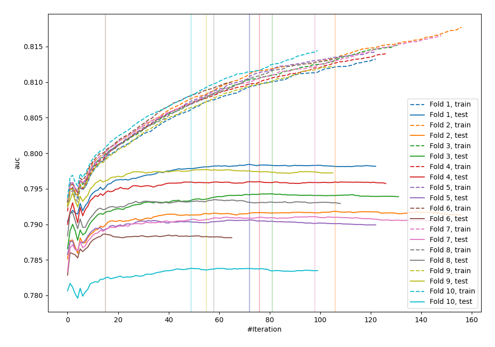
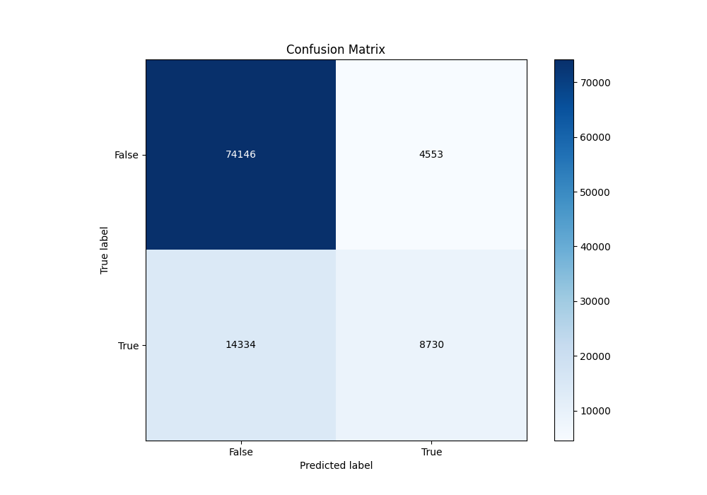
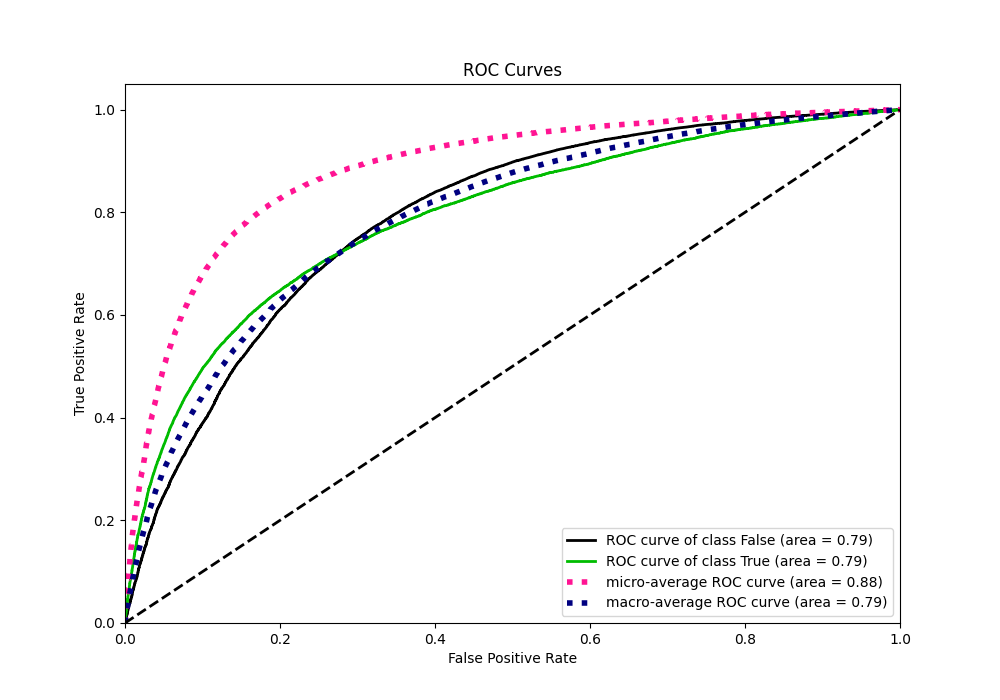
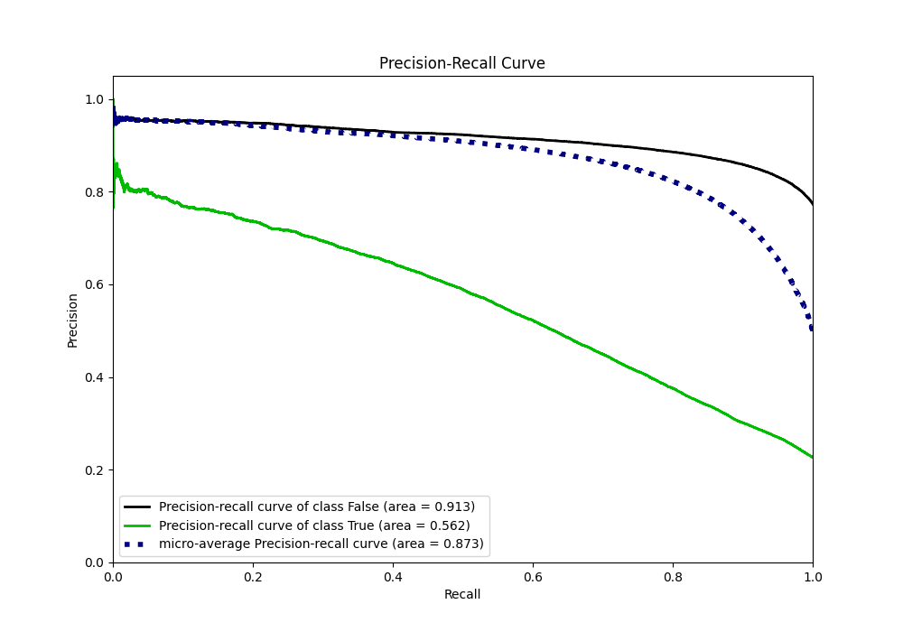
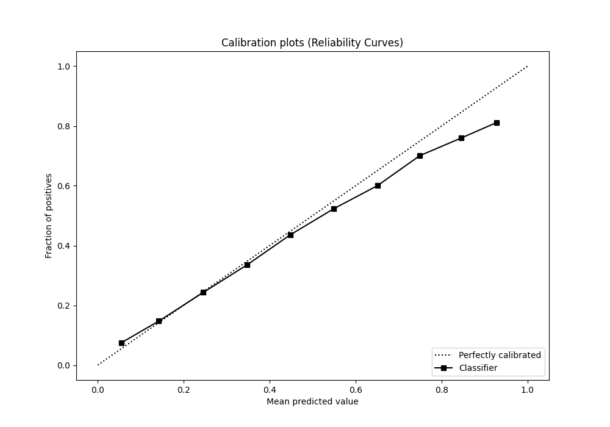
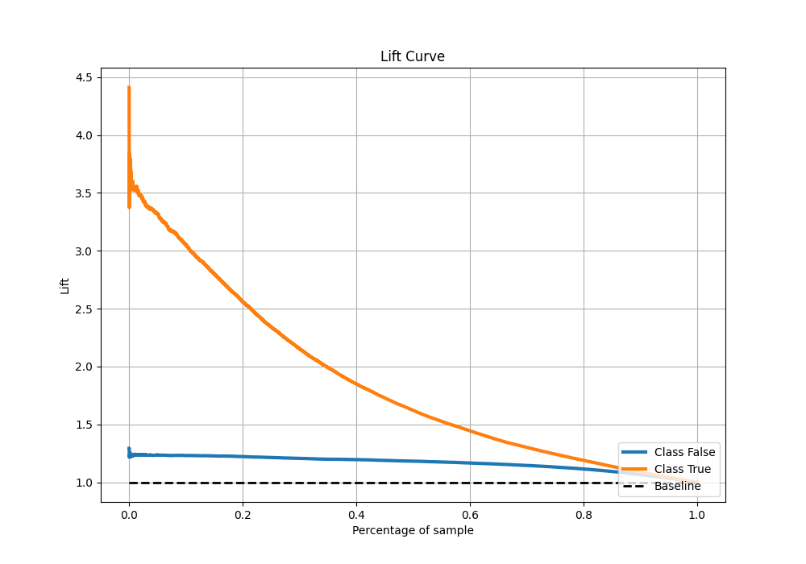

# Summary of 63_Xgboost

[<< Go back](../README.md)

## Extreme Gradient Boosting (Xgboost)
- **n_jobs**: -1
- **objective**: binary:logistic
- **eta**: 0.075
- **max_depth**: 7
- **min_child_weight**: 25
- **subsample**: 0.9
- **colsample_bytree**: 0.6
- **eval_metric**: auc
- **explain_level**: 0

## Validation
 - **validation_type**: kfold
 - **shuffle**: True
 - **stratify**: True
 - **k_folds**: 10

## Optimized metric
auc

## Training time

40.3 seconds

## Metric details
|           |    score |   threshold |
|:----------|---------:|------------:|
| logloss   | 0.429768 | nan         |
| auc       | 0.790828 | nan         |
| f1        | 0.558667 |   0.287247  |
| accuracy  | 0.814402 |   0.49628   |
| precision | 0.801668 |   0.786547  |
| recall    | 1        |   0.0279358 |
| mcc       | 0.424442 |   0.348323  |

## Metric details with threshold from accuracy metric
|           |    score |   threshold |
|:----------|---------:|------------:|
| logloss   | 0.429768 |   nan       |
| auc       | 0.790828 |   nan       |
| f1        | 0.48037  |     0.49628 |
| accuracy  | 0.814402 |     0.49628 |
| precision | 0.657231 |     0.49628 |
| recall    | 0.378512 |     0.49628 |
| mcc       | 0.398496 |     0.49628 |

## Confusion matrix (at threshold=0.49628)
|                  |   Predicted as False |   Predicted as True |
|:-----------------|---------------------:|--------------------:|
| Labeled as False |                74146 |                4553 |
| Labeled as True  |                14334 |                8730 |

## Learning curves

## Confusion Matrix

## Normalized Confusion Matrix

## ROC Curve

## Kolmogorov-Smirnov Statistic

## Precision-Recall Curve

## Calibration Curve

## Cumulative Gains Curve

## Lift Curve

[<< Go back](../README.md)
