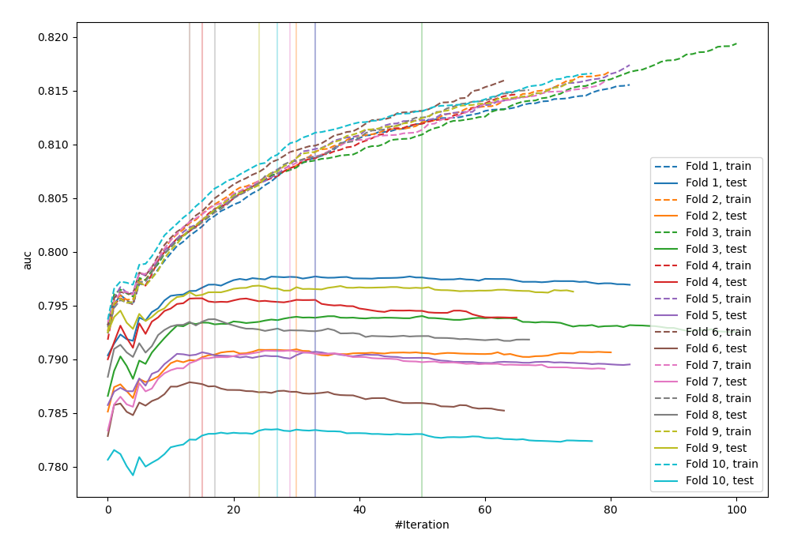
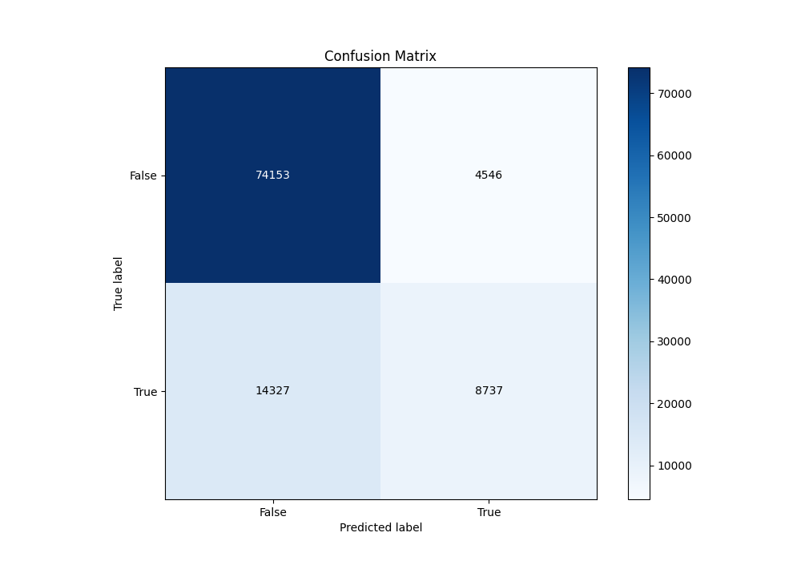
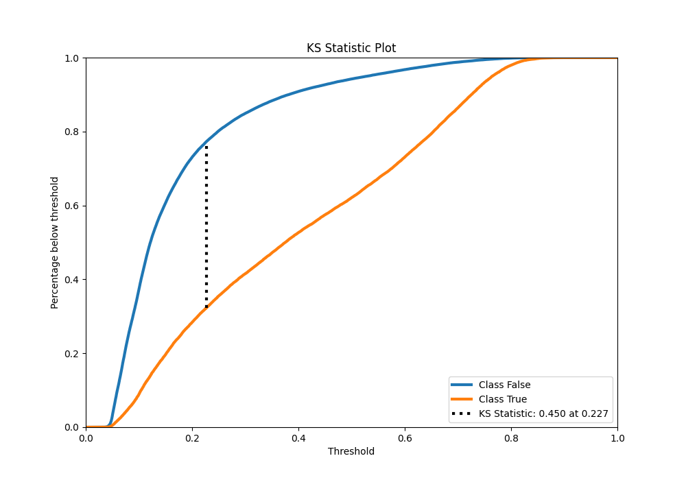
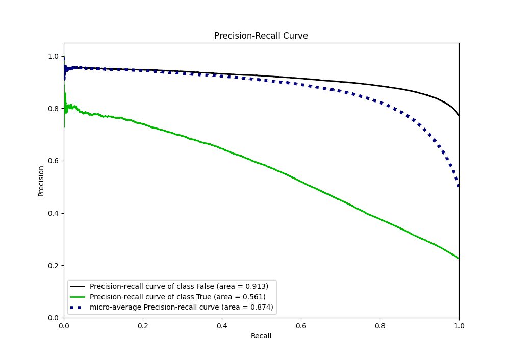
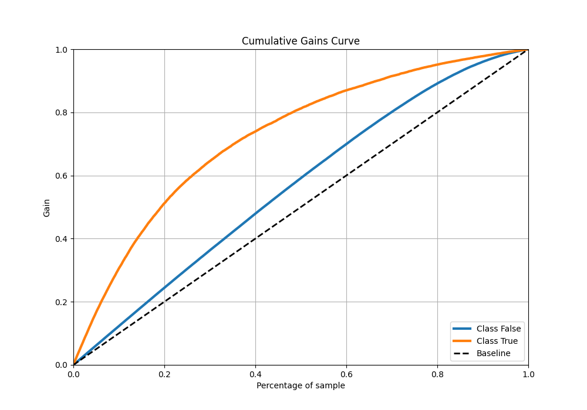
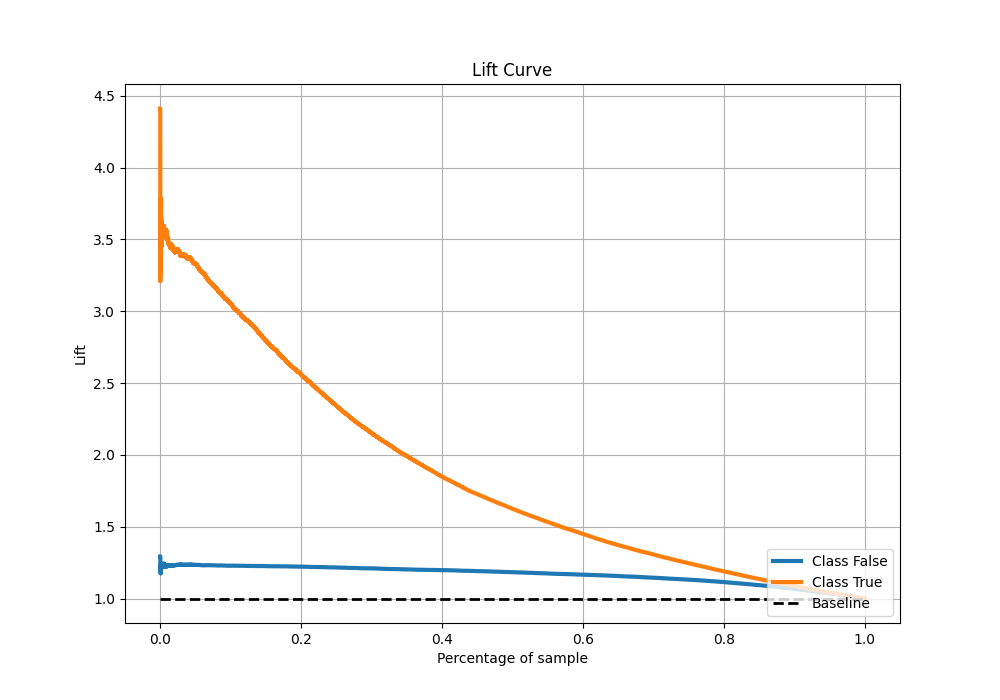

# Summary of 64_Xgboost

[<< Go back](../README.md)

## Extreme Gradient Boosting (Xgboost)
- **n_jobs**: -1
- **objective**: binary:logistic
- **eta**: 0.15
- **max_depth**: 7
- **min_child_weight**: 25
- **subsample**: 0.9
- **colsample_bytree**: 0.6
- **eval_metric**: auc
- **explain_level**: 0

## Validation
 - **validation_type**: kfold
 - **shuffle**: True
 - **stratify**: True
 - **k_folds**: 10

## Optimized metric
auc

## Training time

33.0 seconds

## Metric details
|           |    score |   threshold |
|:----------|---------:|------------:|
| logloss   | 0.429527 | nan         |
| auc       | 0.791663 | nan         |
| f1        | 0.556924 |   0.276837  |
| accuracy  | 0.81454  |   0.500178  |
| precision | 0.794254 |   0.779176  |
| recall    | 1        |   0.0273444 |
| mcc       | 0.42306  |   0.349565  |

## Metric details with threshold from accuracy metric
|           |    score |   threshold |
|:----------|---------:|------------:|
| logloss   | 0.429527 |  nan        |
| auc       | 0.791663 |  nan        |
| f1        | 0.480755 |    0.500178 |
| accuracy  | 0.81454  |    0.500178 |
| precision | 0.657758 |    0.500178 |
| recall    | 0.378815 |    0.500178 |
| mcc       | 0.398984 |    0.500178 |

## Confusion matrix (at threshold=0.500178)
|                  |   Predicted as False |   Predicted as True |
|:-----------------|---------------------:|--------------------:|
| Labeled as False |                74153 |                4546 |
| Labeled as True  |                14327 |                8737 |

## Learning curves

## Confusion Matrix

## Normalized Confusion Matrix

## ROC Curve

## Kolmogorov-Smirnov Statistic

## Precision-Recall Curve

## Calibration Curve

## Cumulative Gains Curve

## Lift Curve

[<< Go back](../README.md)
