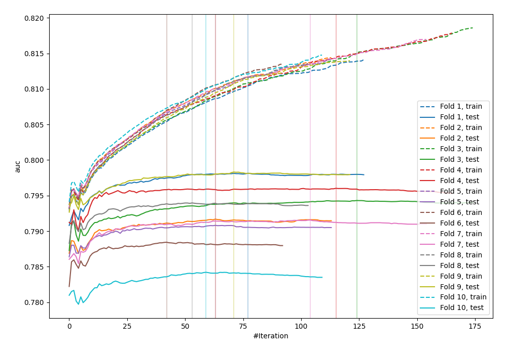
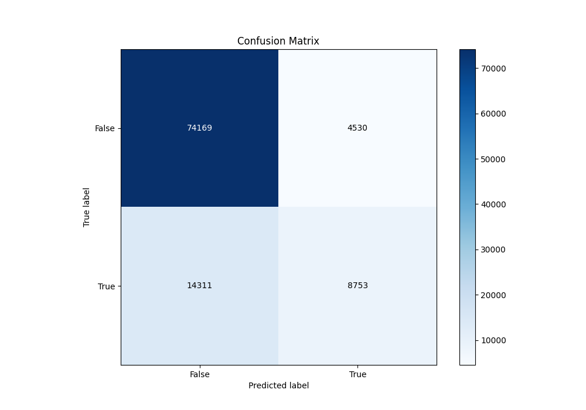
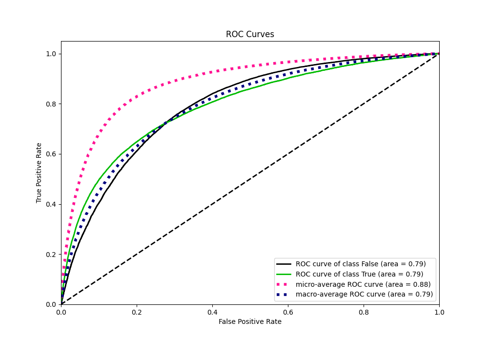
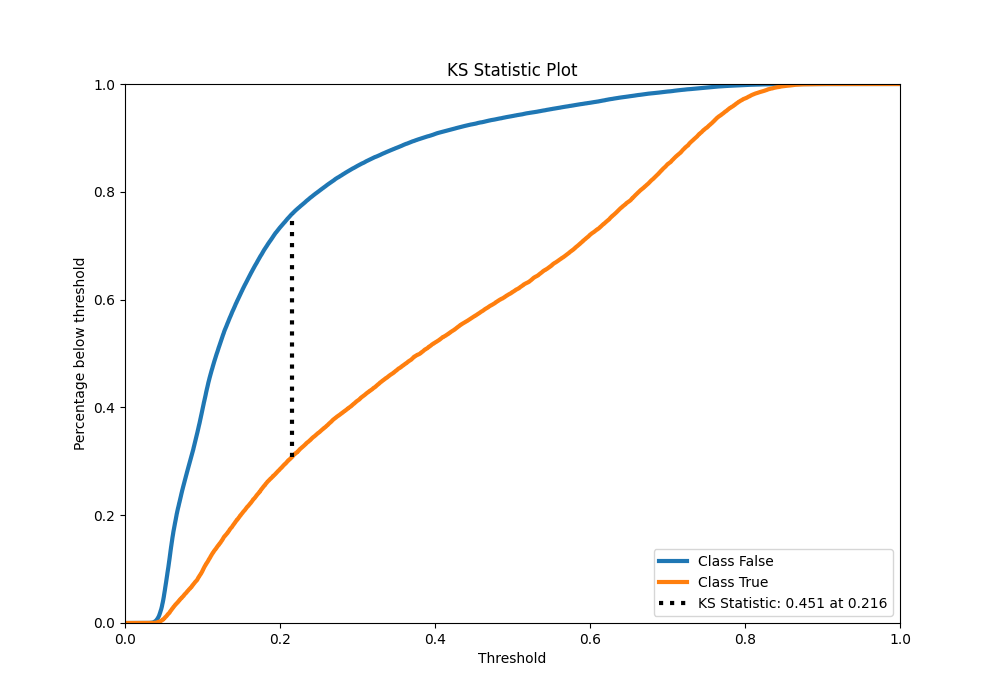
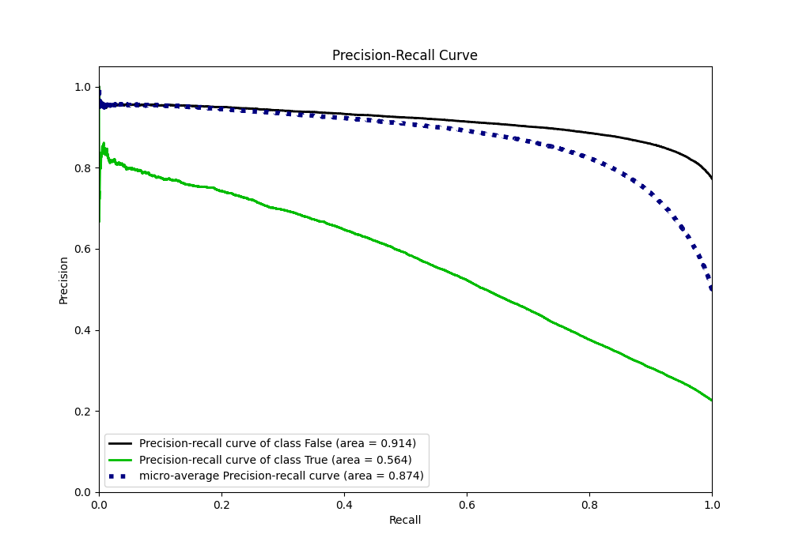
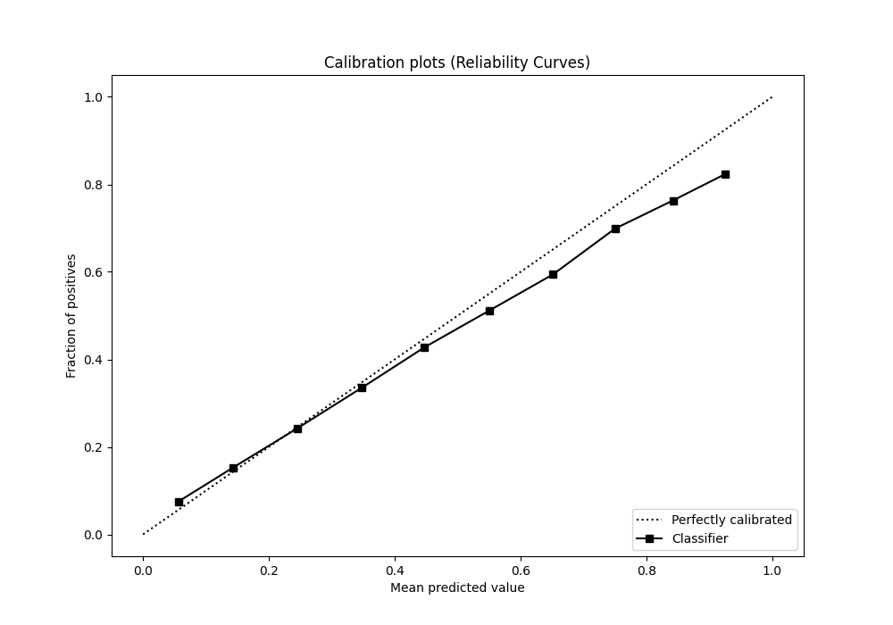
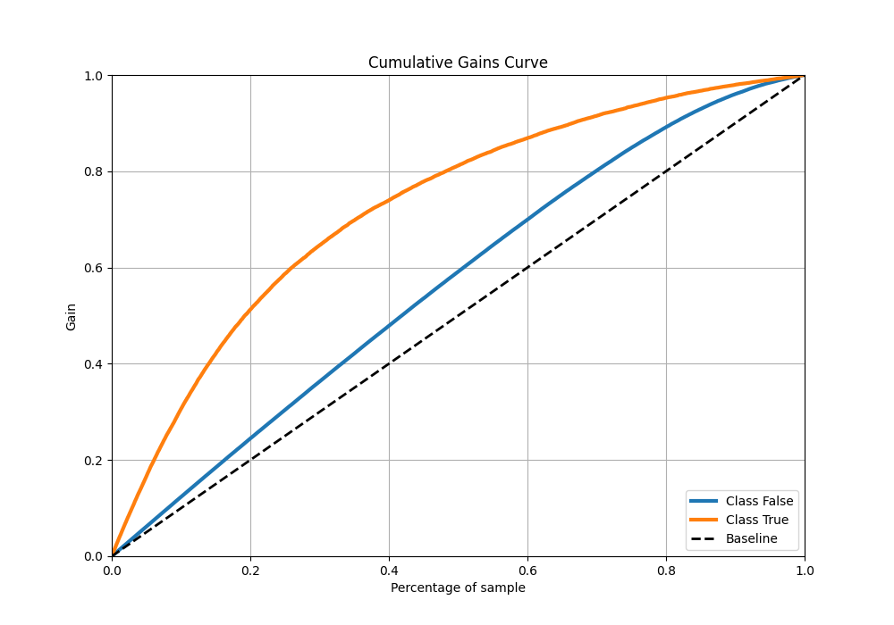
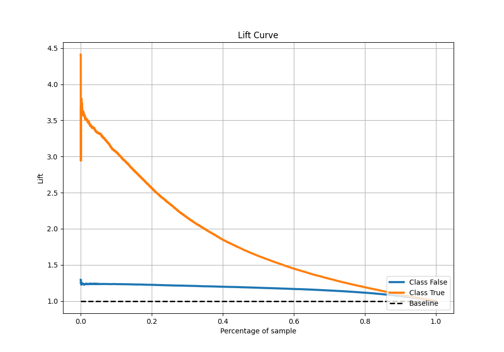

# Summary of 65_Xgboost

[<< Go back](../README.md)

## Extreme Gradient Boosting (Xgboost)
- **n_jobs**: -1
- **objective**: binary:logistic
- **eta**: 0.075
- **max_depth**: 7
- **min_child_weight**: 25
- **subsample**: 1.0
- **colsample_bytree**: 0.6
- **eval_metric**: auc
- **explain_level**: 0

## Validation
 - **validation_type**: kfold
 - **shuffle**: True
 - **stratify**: True
 - **k_folds**: 10

## Optimized metric
auc

## Training time

42.0 seconds

## Metric details
|           |    score |   threshold |
|:----------|---------:|------------:|
| logloss   | 0.428537 | nan         |
| auc       | 0.792645 | nan         |
| f1        | 0.558828 |   0.289007  |
| accuracy  | 0.814854 |   0.507437  |
| precision | 0.810009 |   0.787506  |
| recall    | 1        |   0.0246417 |
| mcc       | 0.423038 |   0.383101  |

## Metric details with threshold from accuracy metric
|           |    score |   threshold |
|:----------|---------:|------------:|
| logloss   | 0.428537 |  nan        |
| auc       | 0.792645 |  nan        |
| f1        | 0.481635 |    0.507437 |
| accuracy  | 0.814854 |    0.507437 |
| precision | 0.658963 |    0.507437 |
| recall    | 0.379509 |    0.507437 |
| mcc       | 0.400099 |    0.507437 |

## Confusion matrix (at threshold=0.507437)
|                  |   Predicted as False |   Predicted as True |
|:-----------------|---------------------:|--------------------:|
| Labeled as False |                74169 |                4530 |
| Labeled as True  |                14311 |                8753 |

## Learning curves

## Confusion Matrix

## Normalized Confusion Matrix

## ROC Curve

## Kolmogorov-Smirnov Statistic

## Precision-Recall Curve

## Calibration Curve

## Cumulative Gains Curve

## Lift Curve

[<< Go back](../README.md)
