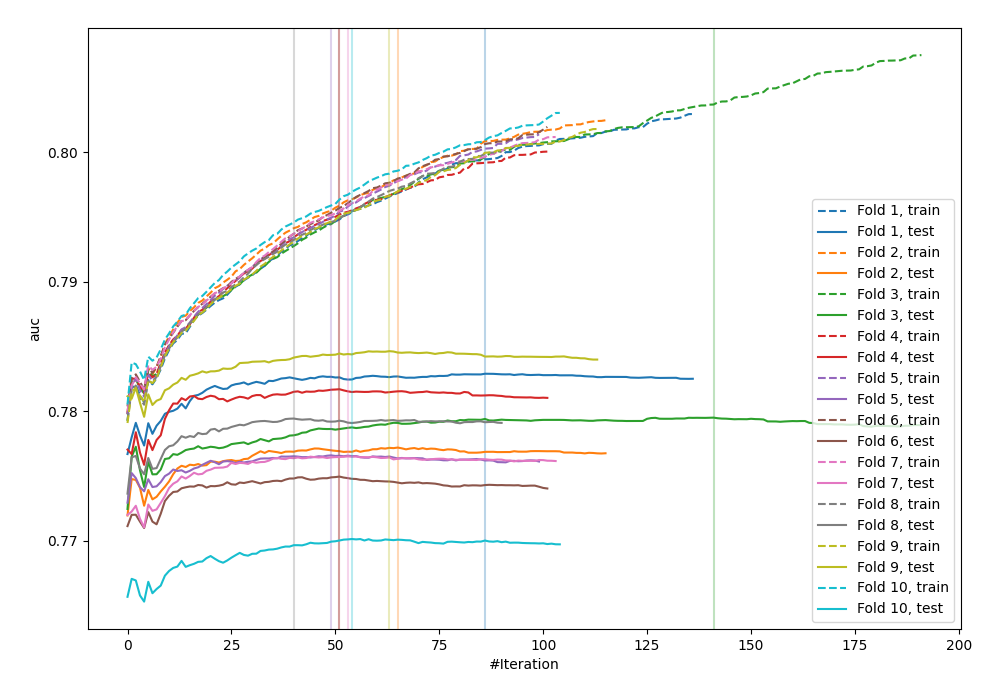
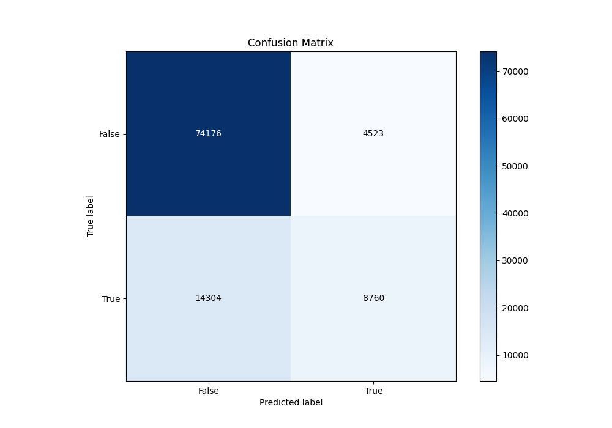
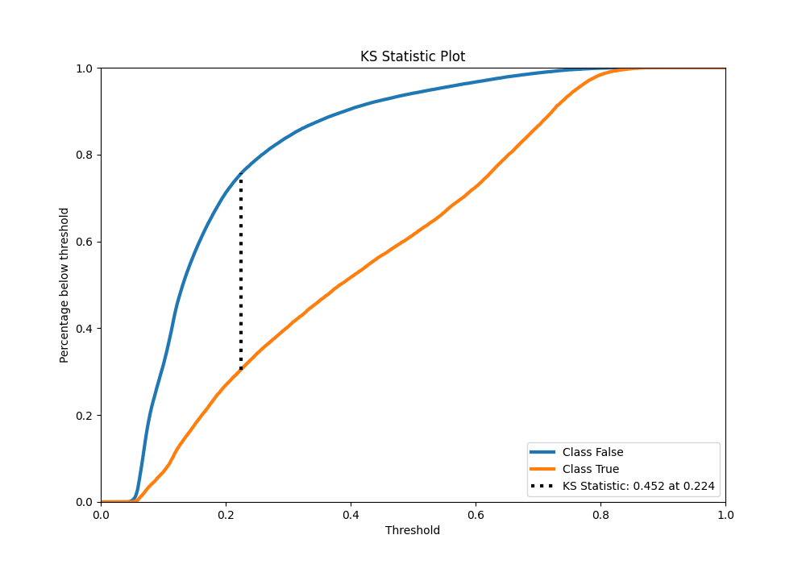
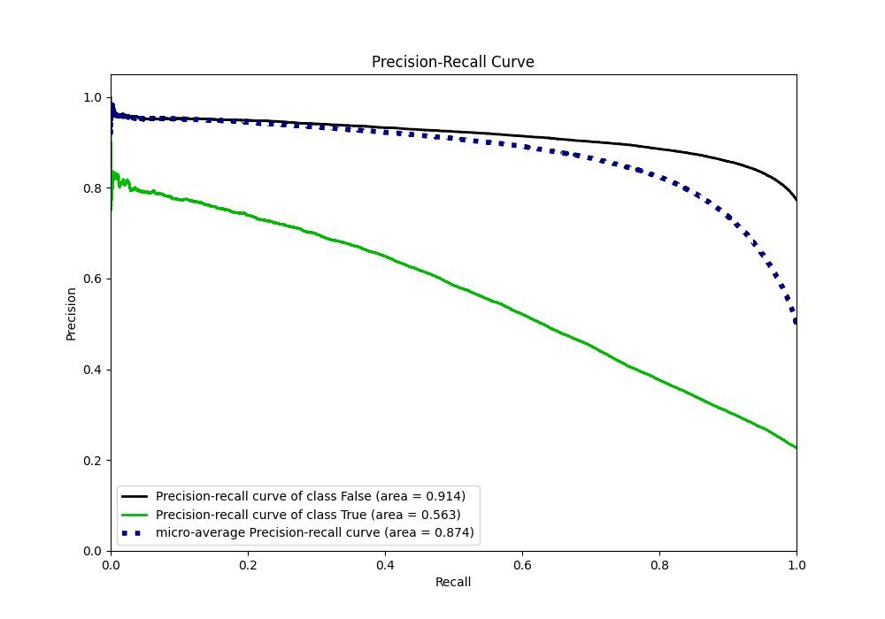
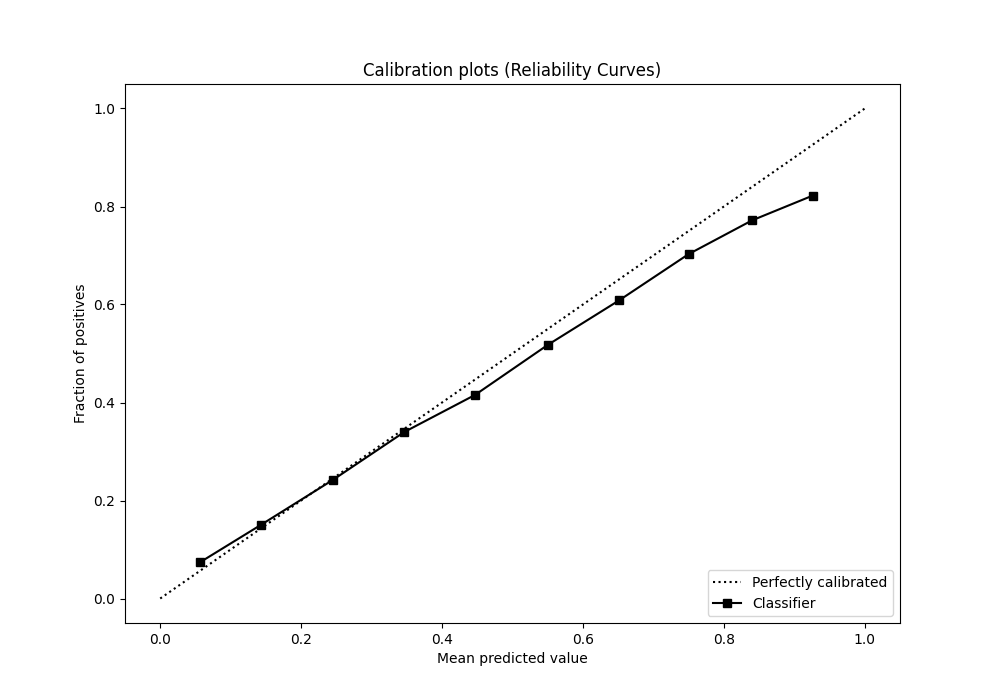
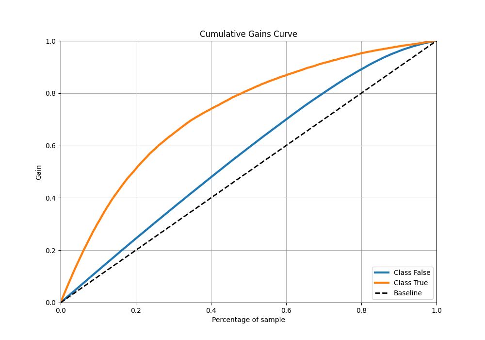
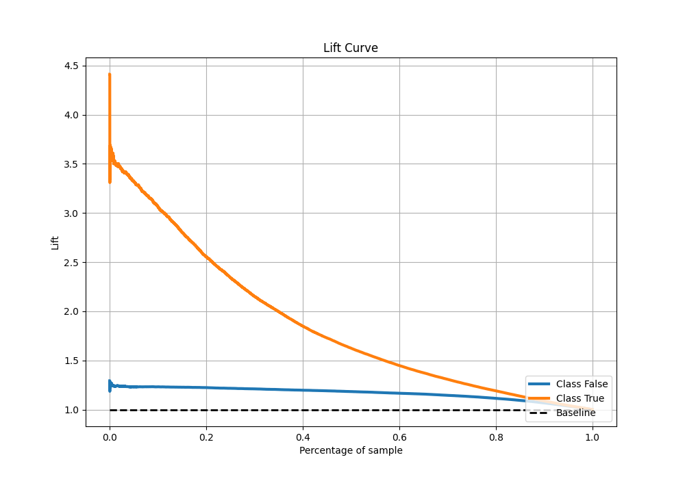

# Summary of 65_Xgboost_BoostOnErrors

[<< Go back](../README.md)

## Extreme Gradient Boosting (Xgboost)
- **n_jobs**: -1
- **objective**: binary:logistic
- **eta**: 0.075
- **max_depth**: 7
- **min_child_weight**: 25
- **subsample**: 1.0
- **colsample_bytree**: 0.6
- **eval_metric**: auc
- **explain_level**: 0

## Validation
 - **validation_type**: kfold
 - **shuffle**: True
 - **stratify**: True
 - **k_folds**: 10

## Optimized metric
auc

## Training time

36.6 seconds

## Metric details
|           |    score |   threshold |
|:----------|---------:|------------:|
| logloss   | 0.429568 | nan         |
| auc       | 0.792226 | nan         |
| f1        | 0.558062 |   0.297141  |
| accuracy  | 0.814992 |   0.505284  |
| precision | 0.796108 |   0.773481  |
| recall    | 1        |   0.0355089 |
| mcc       | 0.421851 |   0.358033  |

## Metric details with threshold from accuracy metric
|           |    score |   threshold |
|:----------|---------:|------------:|
| logloss   | 0.429568 |  nan        |
| auc       | 0.792226 |  nan        |
| f1        | 0.482021 |    0.505284 |
| accuracy  | 0.814992 |    0.505284 |
| precision | 0.65949  |    0.505284 |
| recall    | 0.379813 |    0.505284 |
| mcc       | 0.400586 |    0.505284 |

## Confusion matrix (at threshold=0.505284)
|                  |   Predicted as False |   Predicted as True |
|:-----------------|---------------------:|--------------------:|
| Labeled as False |                74176 |                4523 |
| Labeled as True  |                14304 |                8760 |

## Learning curves

## Confusion Matrix

## Normalized Confusion Matrix

## ROC Curve

## Kolmogorov-Smirnov Statistic

## Precision-Recall Curve

## Calibration Curve

## Cumulative Gains Curve

## Lift Curve

[<< Go back](../README.md)
