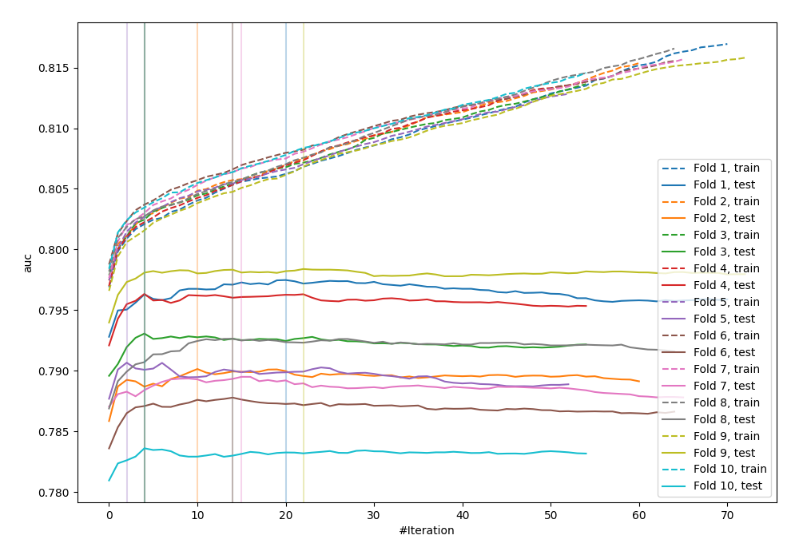
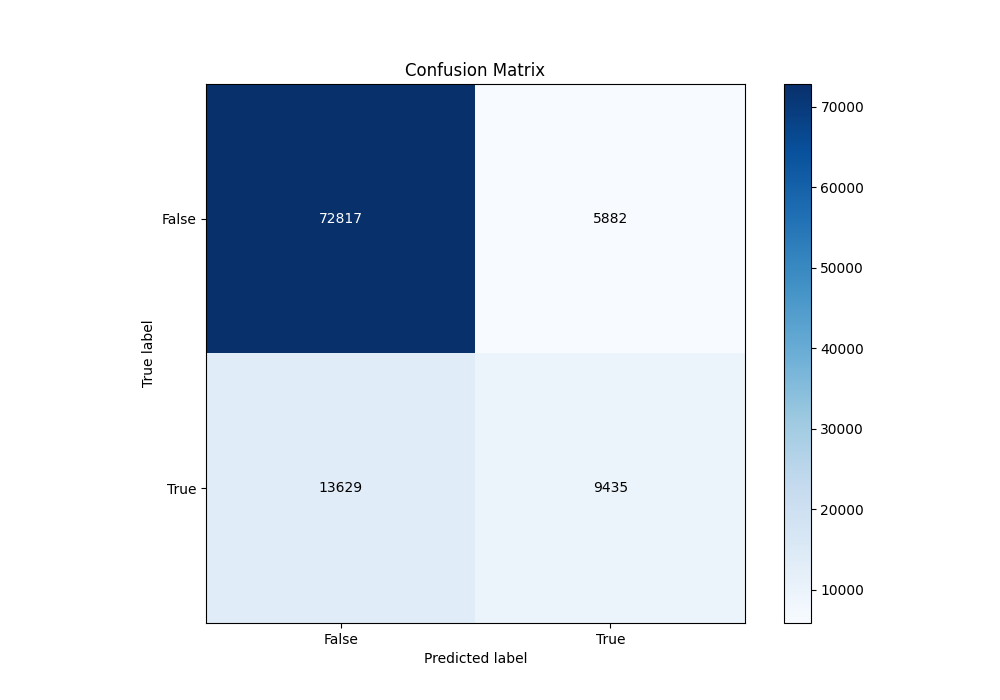
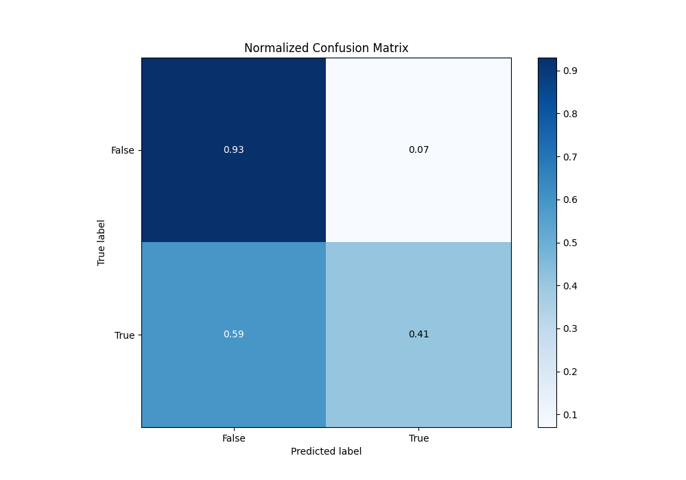
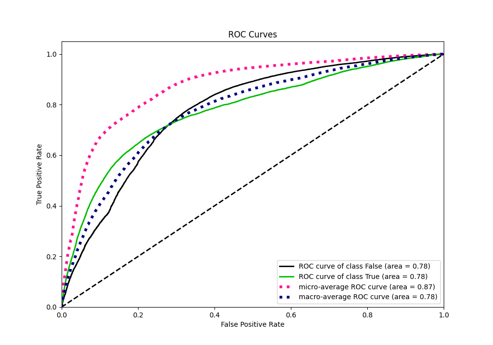
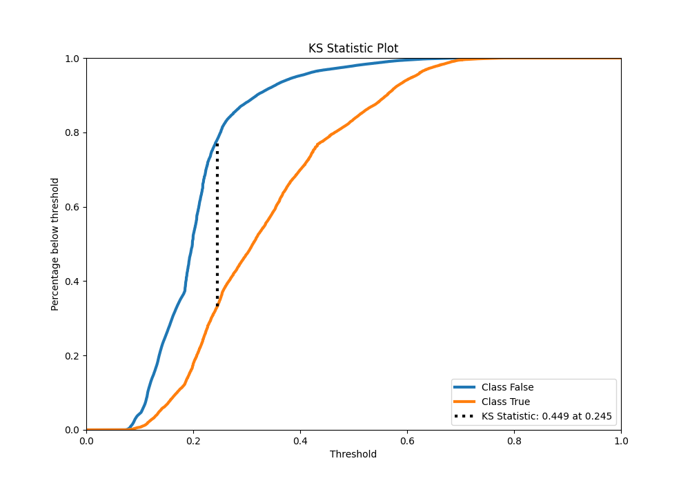
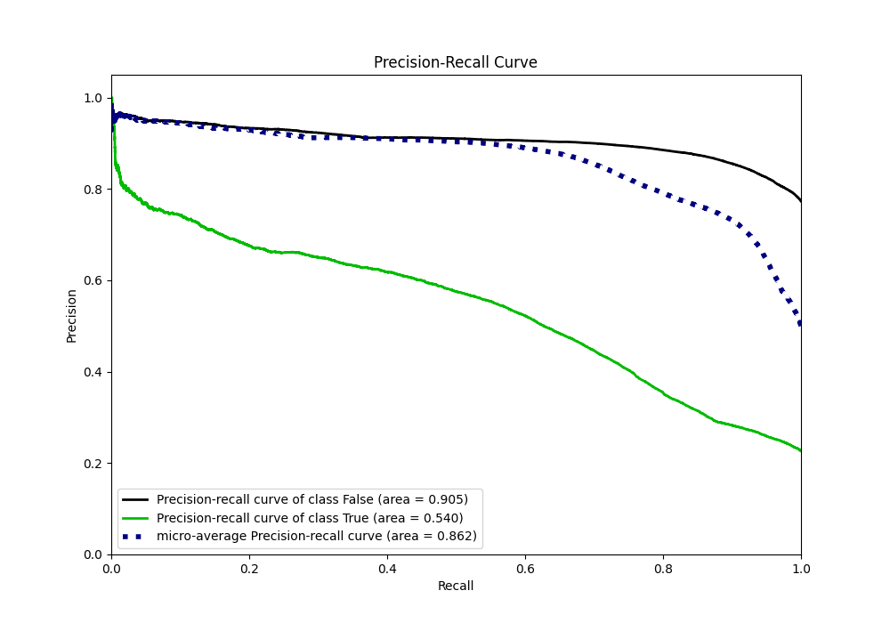
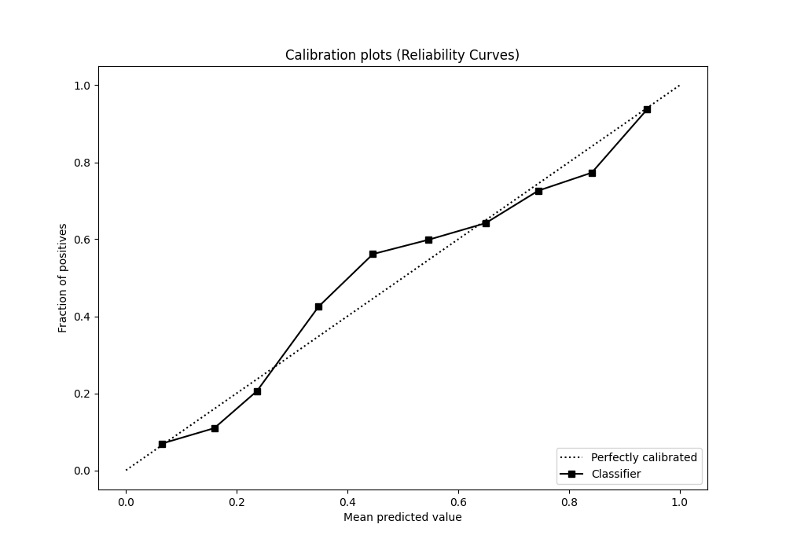
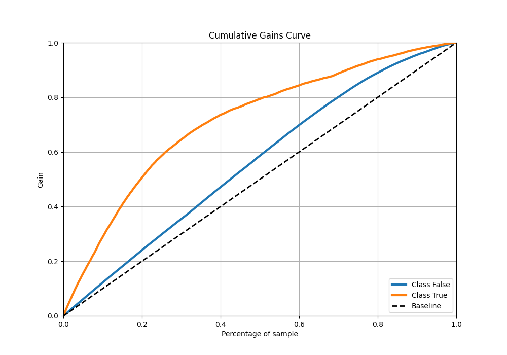
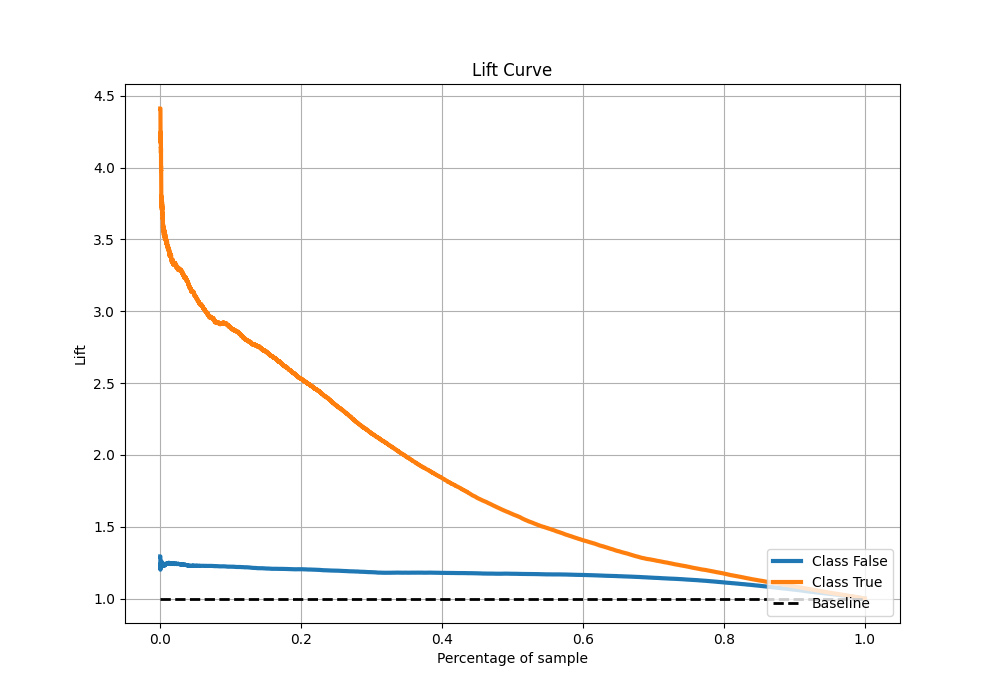

# Summary of 65_Xgboost_Stacked

[<< Go back](../README.md)

## Extreme Gradient Boosting (Xgboost)
- **n_jobs**: -1
- **objective**: binary:logistic
- **eta**: 0.075
- **max_depth**: 7
- **min_child_weight**: 25
- **subsample**: 1.0
- **colsample_bytree**: 0.6
- **eval_metric**: auc
- **explain_level**: 0

## Validation
 - **validation_type**: kfold
 - **shuffle**: True
 - **stratify**: True
 - **k_folds**: 10

## Optimized metric
auc

## Training time

34.2 seconds

## Metric details
|           |    score |   threshold |
|:----------|---------:|------------:|
| logloss   | 0.457952 | nan         |
| auc       | 0.776885 | nan         |
| f1        | 0.558568 |   0.266555  |
| accuracy  | 0.80827  |   0.351864  |
| precision | 0.782931 |   0.627599  |
| recall    | 1        |   0.0633979 |
| mcc       | 0.421443 |   0.285928  |

## Metric details with threshold from accuracy metric
|           |    score |   threshold |
|:----------|---------:|------------:|
| logloss   | 0.457952 |  nan        |
| auc       | 0.776885 |  nan        |
| f1        | 0.49165  |    0.351864 |
| accuracy  | 0.80827  |    0.351864 |
| precision | 0.615982 |    0.351864 |
| recall    | 0.409079 |    0.351864 |
| mcc       | 0.391453 |    0.351864 |

## Confusion matrix (at threshold=0.351864)
|                  |   Predicted as False |   Predicted as True |
|:-----------------|---------------------:|--------------------:|
| Labeled as False |                72817 |                5882 |
| Labeled as True  |                13629 |                9435 |

## Learning curves

## Confusion Matrix

## Normalized Confusion Matrix

## ROC Curve

## Kolmogorov-Smirnov Statistic

## Precision-Recall Curve

## Calibration Curve

## Cumulative Gains Curve

## Lift Curve

[<< Go back](../README.md)
