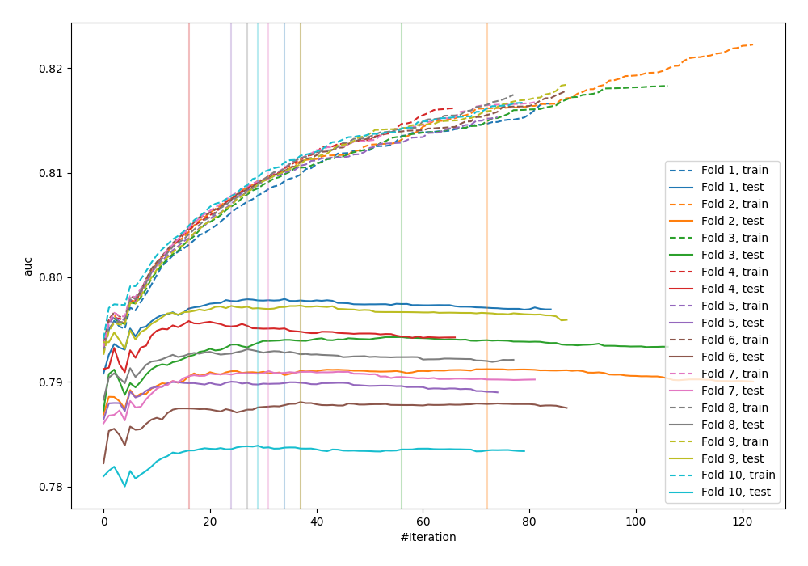
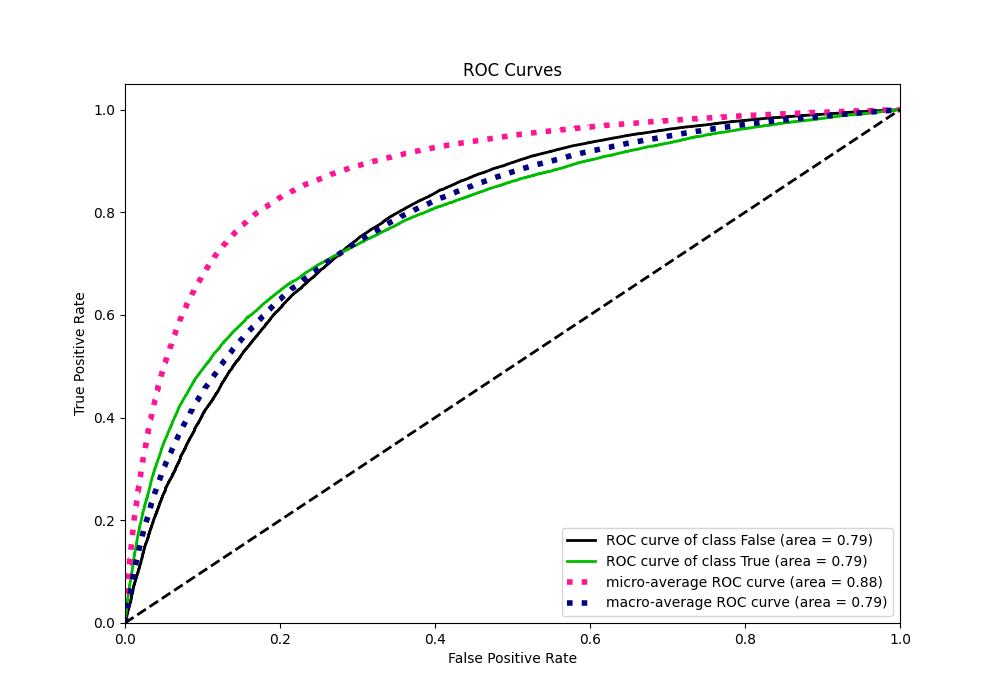
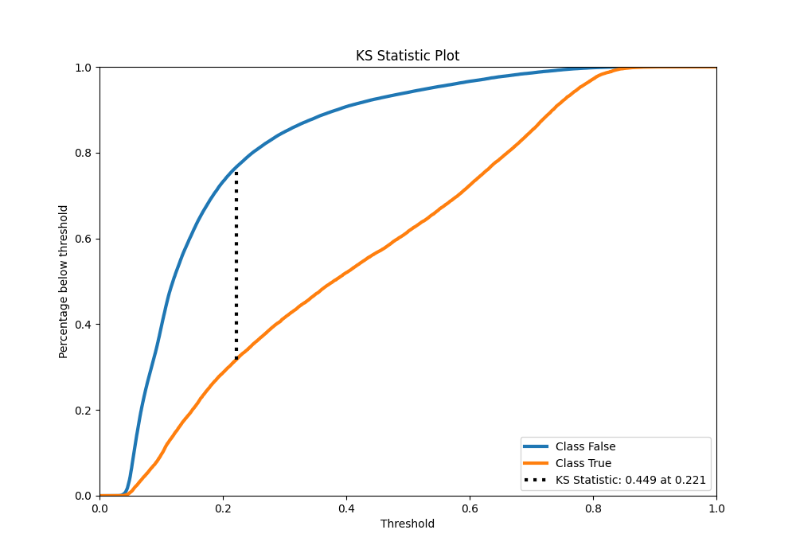
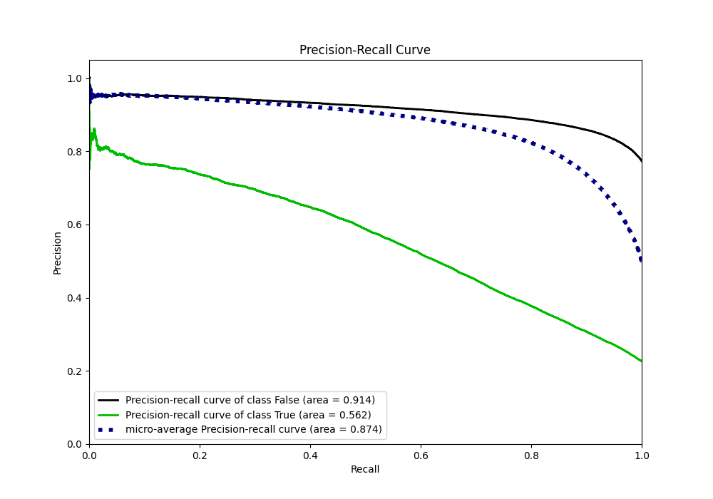
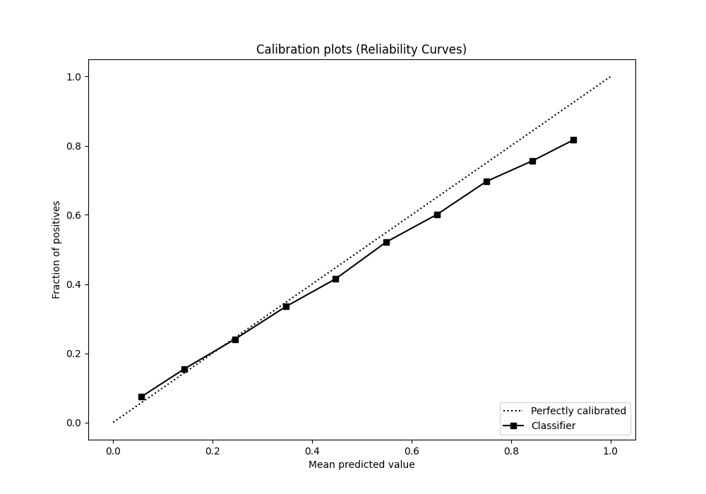
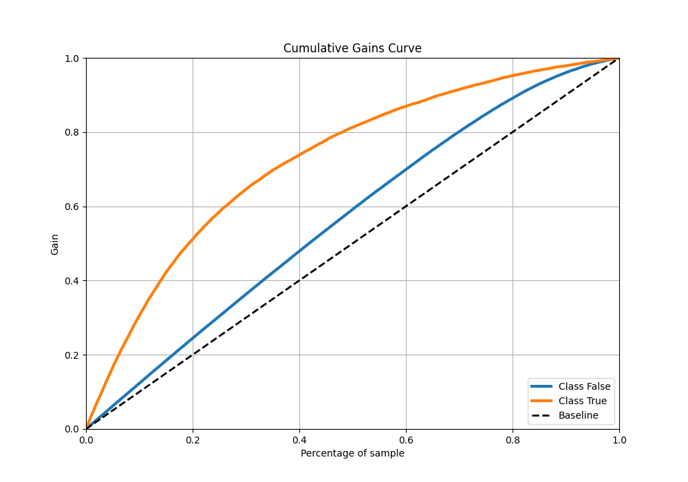
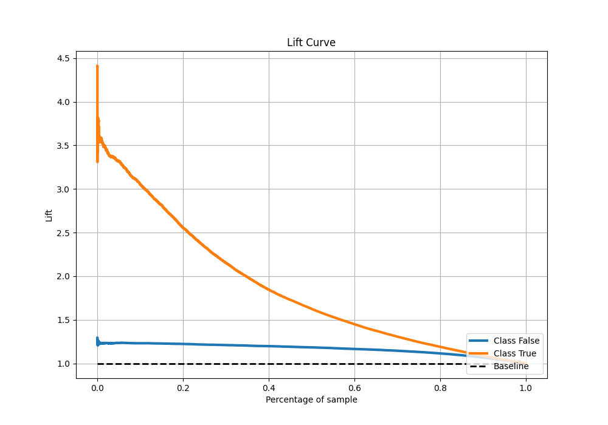

# Summary of 66_Xgboost

[<< Go back](../README.md)

## Extreme Gradient Boosting (Xgboost)
- **n_jobs**: -1
- **objective**: binary:logistic
- **eta**: 0.15
- **max_depth**: 7
- **min_child_weight**: 25
- **subsample**: 1.0
- **colsample_bytree**: 0.6
- **eval_metric**: auc
- **explain_level**: 0

## Validation
 - **validation_type**: kfold
 - **shuffle**: True
 - **stratify**: True
 - **k_folds**: 10

## Optimized metric
auc

## Training time

33.4 seconds

## Metric details
|           |    score |   threshold |
|:----------|---------:|------------:|
| logloss   | 0.429154 | nan         |
| auc       | 0.79198  | nan         |
| f1        | 0.557188 |   0.267772  |
| accuracy  | 0.814707 |   0.483271  |
| precision | 0.802595 |   0.790355  |
| recall    | 1        |   0.0241715 |
| mcc       | 0.422541 |   0.338168  |

## Metric details with threshold from accuracy metric
|           |    score |   threshold |
|:----------|---------:|------------:|
| logloss   | 0.429154 |  nan        |
| auc       | 0.79198  |  nan        |
| f1        | 0.495343 |    0.483271 |
| accuracy  | 0.814707 |    0.483271 |
| precision | 0.647133 |    0.483271 |
| recall    | 0.401231 |    0.483271 |
| mcc       | 0.406114 |    0.483271 |

## Confusion matrix (at threshold=0.483271)
|                  |   Predicted as False |   Predicted as True |
|:-----------------|---------------------:|--------------------:|
| Labeled as False |                73653 |                5046 |
| Labeled as True  |                13810 |                9254 |

## Learning curves

## Confusion Matrix

## Normalized Confusion Matrix

## ROC Curve

## Kolmogorov-Smirnov Statistic

## Precision-Recall Curve

## Calibration Curve

## Cumulative Gains Curve

## Lift Curve

[<< Go back](../README.md)
