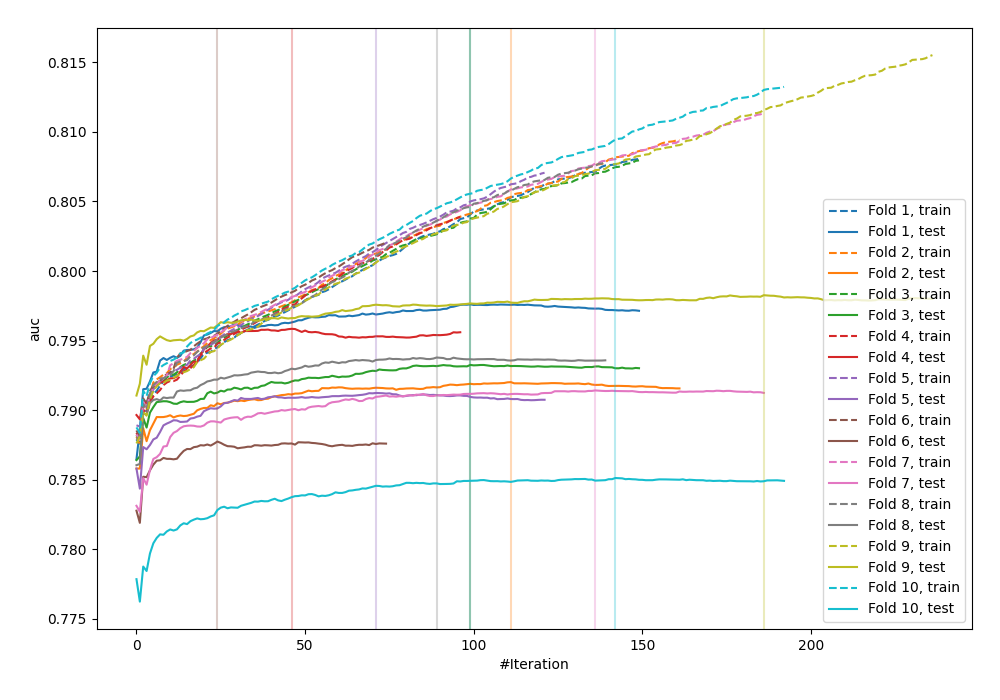
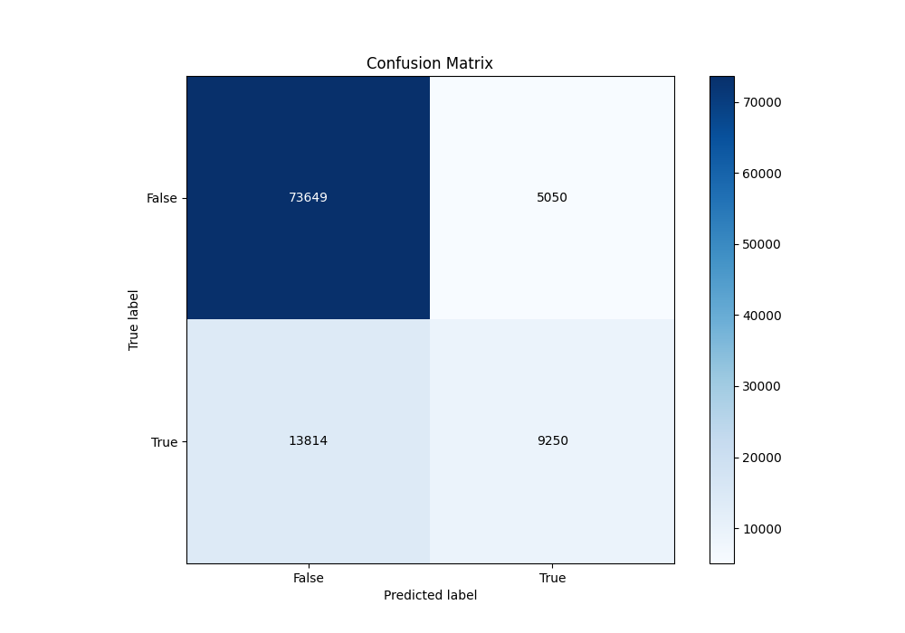
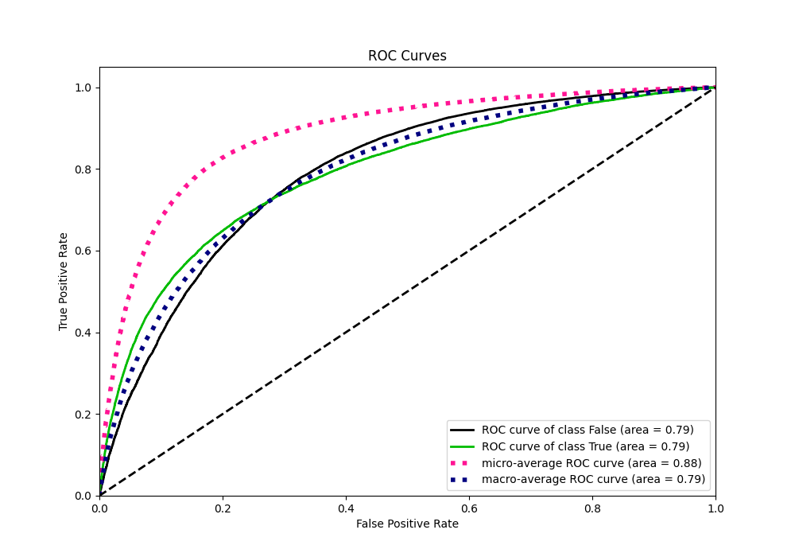
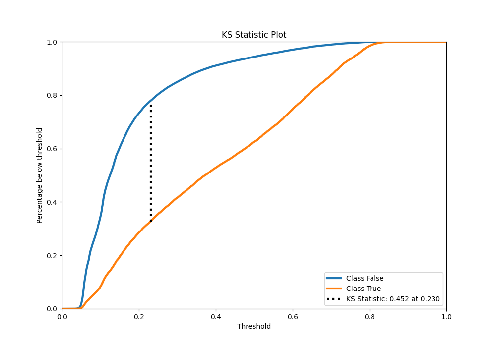
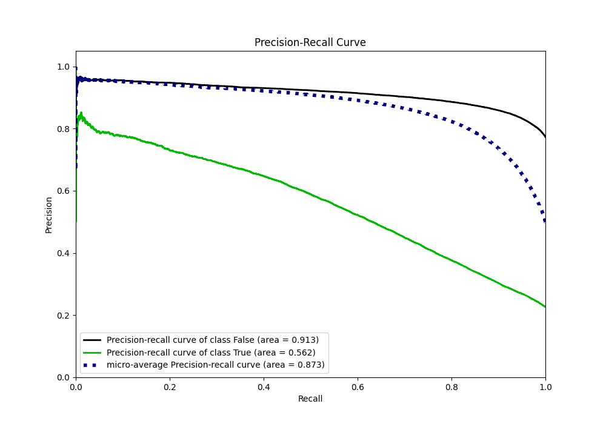
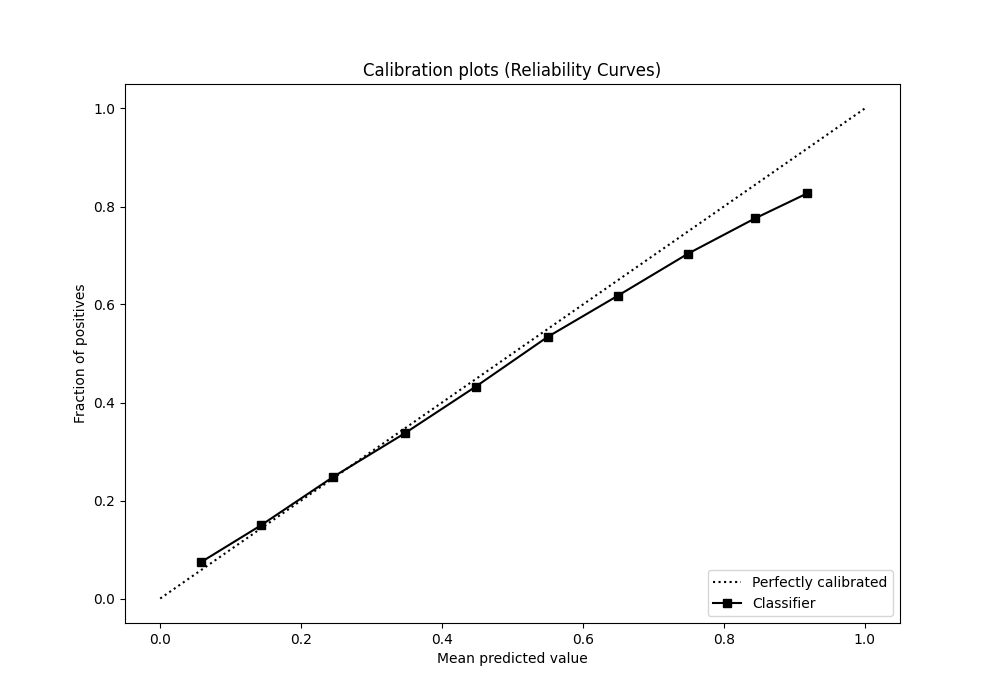
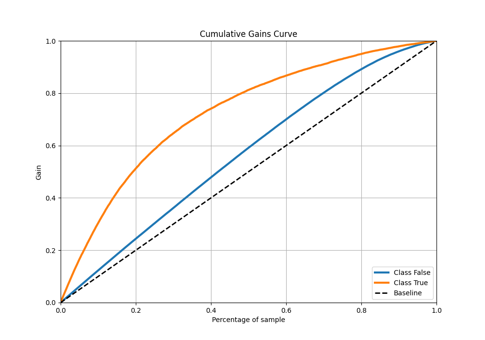
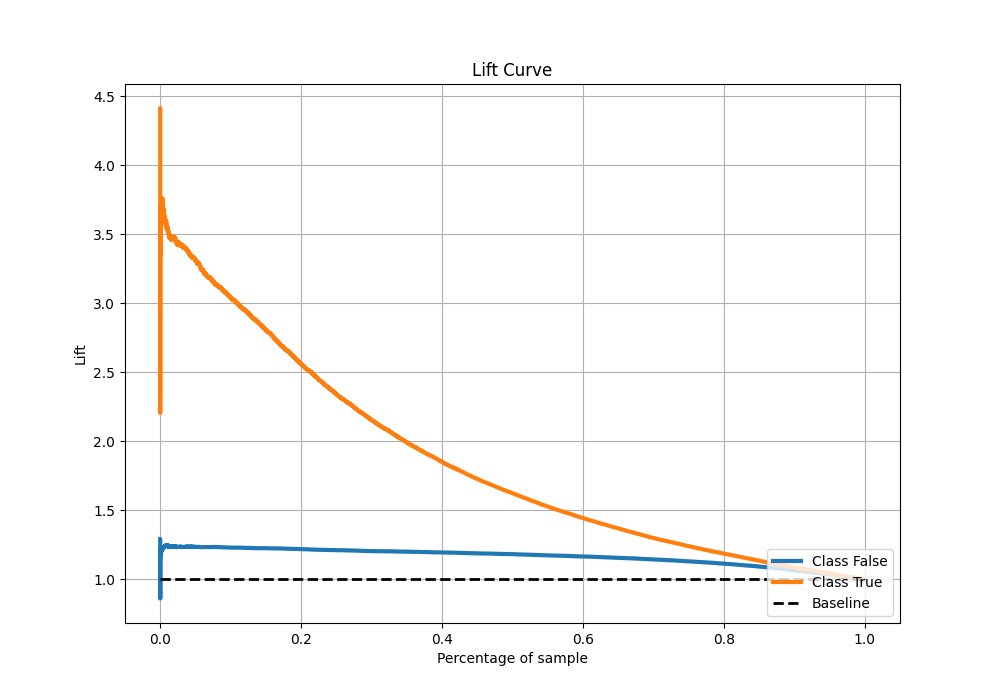

# Summary of 68_LightGBM

[<< Go back](../README.md)

## LightGBM
- **n_jobs**: -1
- **objective**: binary
- **num_leaves**: 31
- **learning_rate**: 0.05
- **feature_fraction**: 0.8
- **bagging_fraction**: 0.5
- **min_data_in_leaf**: 50
- **metric**: auc
- **custom_eval_metric_name**: None
- **explain_level**: 0

## Validation
 - **validation_type**: kfold
 - **shuffle**: True
 - **stratify**: True
 - **k_folds**: 10

## Optimized metric
auc

## Training time

28.4 seconds

## Metric details
|           |    score |   threshold |
|:----------|---------:|------------:|
| logloss   | 0.429641 | nan         |
| auc       | 0.791207 | nan         |
| f1        | 0.559336 |   0.276     |
| accuracy  | 0.814628 |   0.475293  |
| precision | 0.800557 |   0.777056  |
| recall    | 1        |   0.0264018 |
| mcc       | 0.423673 |   0.333483  |

## Metric details with threshold from accuracy metric
|           |    score |   threshold |
|:----------|---------:|------------:|
| logloss   | 0.429641 |  nan        |
| auc       | 0.791207 |  nan        |
| f1        | 0.495129 |    0.475293 |
| accuracy  | 0.814628 |    0.475293 |
| precision | 0.646853 |    0.475293 |
| recall    | 0.401058 |    0.475293 |
| mcc       | 0.405844 |    0.475293 |

## Confusion matrix (at threshold=0.475293)
|                  |   Predicted as False |   Predicted as True |
|:-----------------|---------------------:|--------------------:|
| Labeled as False |                73649 |                5050 |
| Labeled as True  |                13814 |                9250 |

## Learning curves

## Confusion Matrix

## Normalized Confusion Matrix

## ROC Curve

## Kolmogorov-Smirnov Statistic

## Precision-Recall Curve

## Calibration Curve

## Cumulative Gains Curve

## Lift Curve

[<< Go back](../README.md)
