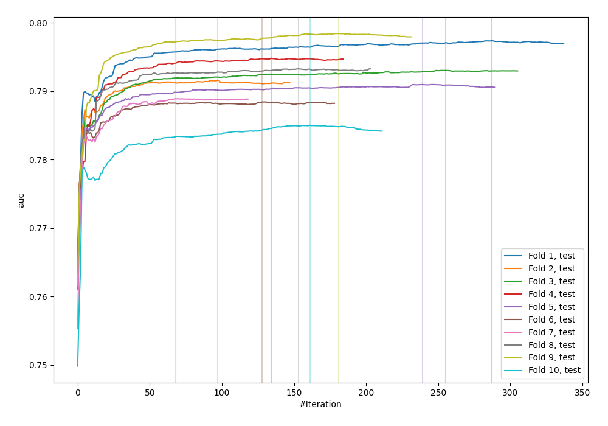
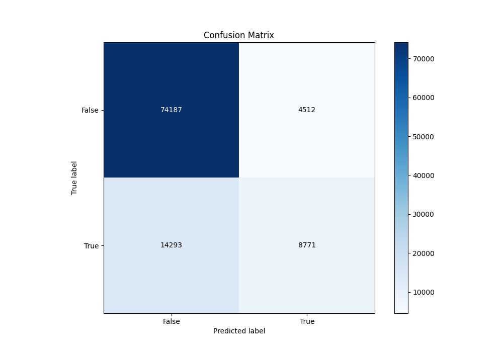
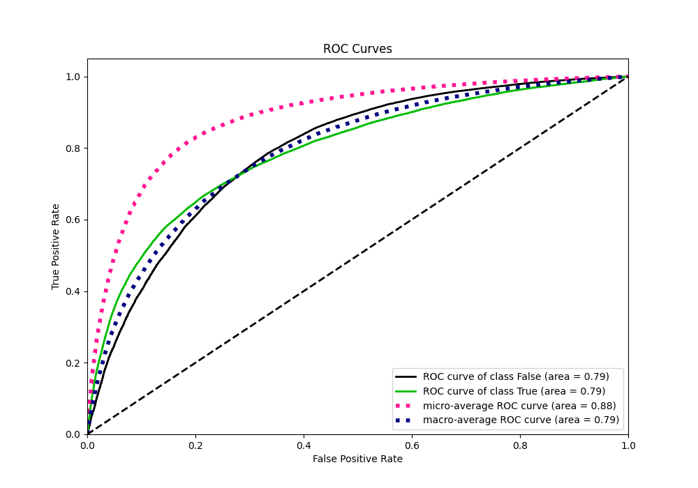
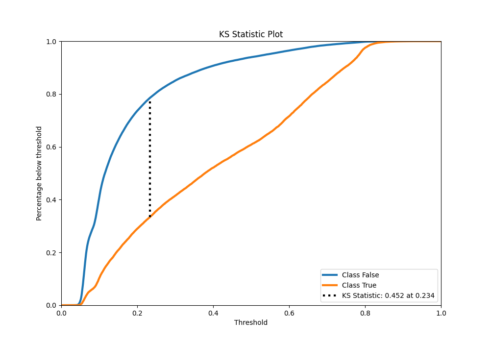
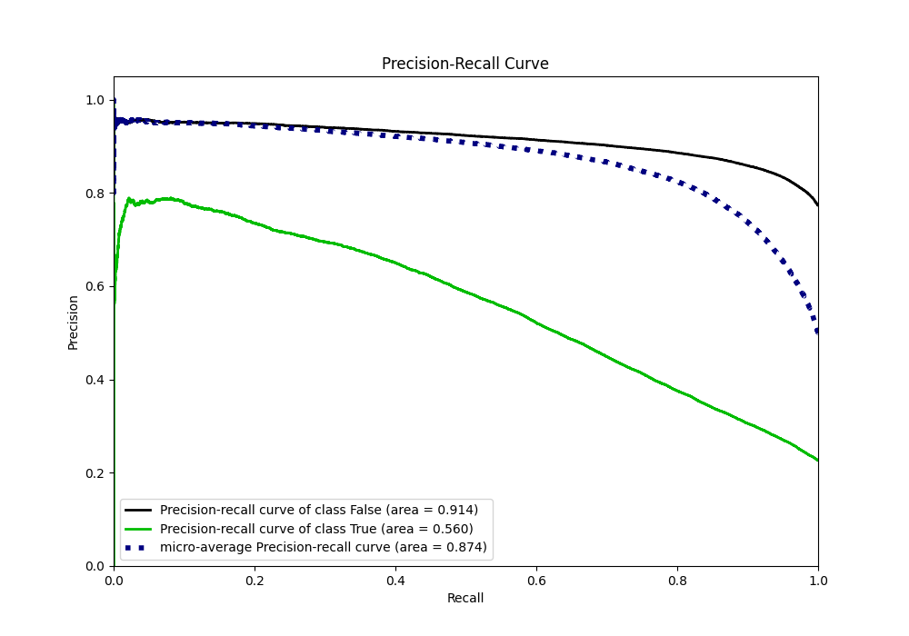
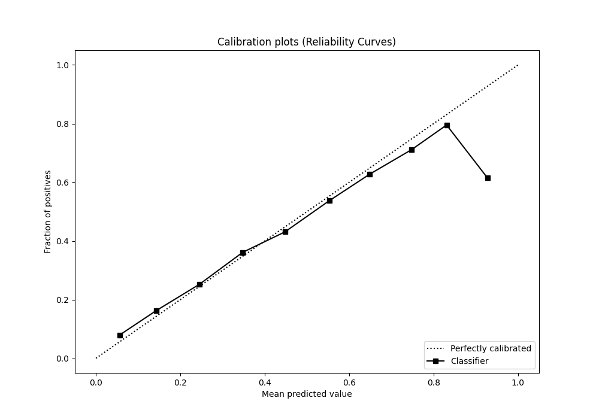
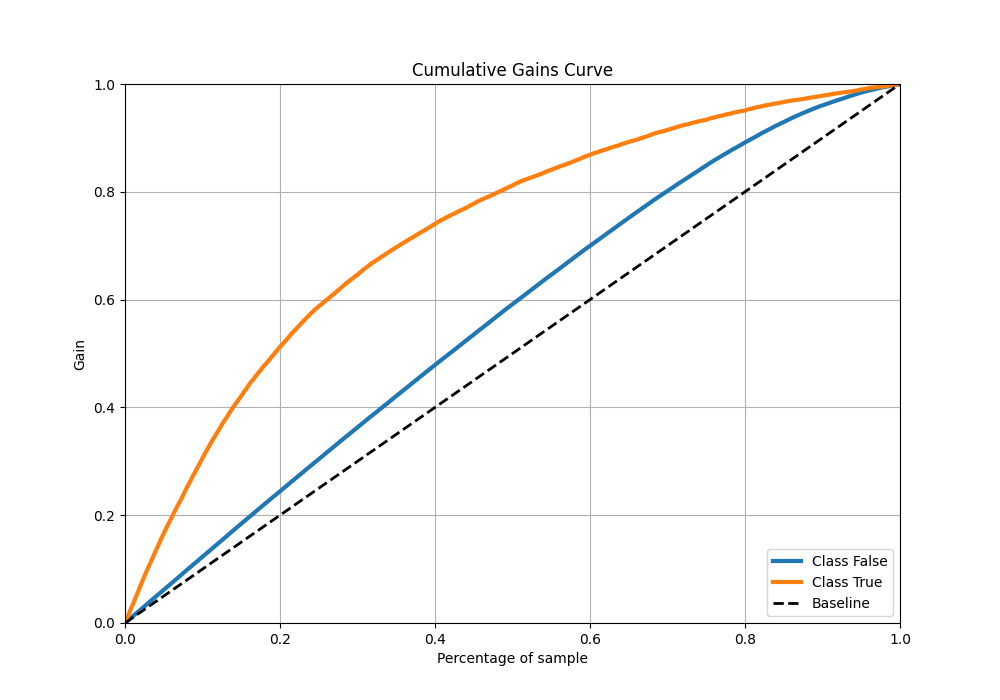
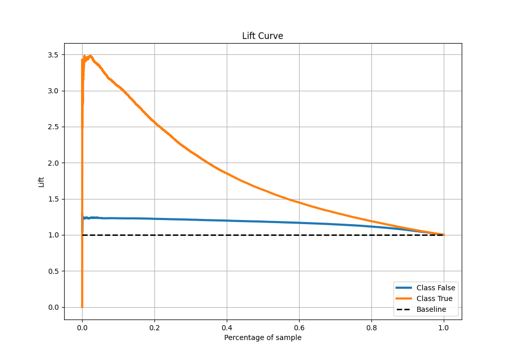

# Summary of 6_Default_CatBoost

[<< Go back](../README.md)

## CatBoost
- **n_jobs**: -1
- **learning_rate**: 0.1
- **depth**: 6
- **rsm**: 1
- **loss_function**: Logloss
- **eval_metric**: AUC
- **explain_level**: 0

## Validation
 - **validation_type**: kfold
 - **shuffle**: True
 - **stratify**: True
 - **k_folds**: 10

## Optimized metric
auc

## Training time

46.6 seconds

## Metric details
|           |    score |   threshold |
|:----------|---------:|------------:|
| logloss   | 0.429086 | nan         |
| auc       | 0.792043 | nan         |
| f1        | 0.558588 |   0.297572  |
| accuracy  | 0.815208 |   0.514418  |
| precision | 0.786737 |   0.771226  |
| recall    | 1        |   0.0257025 |
| mcc       | 0.424223 |   0.309448  |

## Metric details with threshold from accuracy metric
|           |    score |   threshold |
|:----------|---------:|------------:|
| logloss   | 0.429086 |  nan        |
| auc       | 0.792043 |  nan        |
| f1        | 0.482626 |    0.514418 |
| accuracy  | 0.815208 |    0.514418 |
| precision | 0.660318 |    0.514418 |
| recall    | 0.38029  |    0.514418 |
| mcc       | 0.401353 |    0.514418 |

## Confusion matrix (at threshold=0.514418)
|                  |   Predicted as False |   Predicted as True |
|:-----------------|---------------------:|--------------------:|
| Labeled as False |                74187 |                4512 |
| Labeled as True  |                14293 |                8771 |

## Learning curves

## Confusion Matrix

## Normalized Confusion Matrix

## ROC Curve

## Kolmogorov-Smirnov Statistic

## Precision-Recall Curve

## Calibration Curve

## Cumulative Gains Curve

## Lift Curve

[<< Go back](../README.md)
