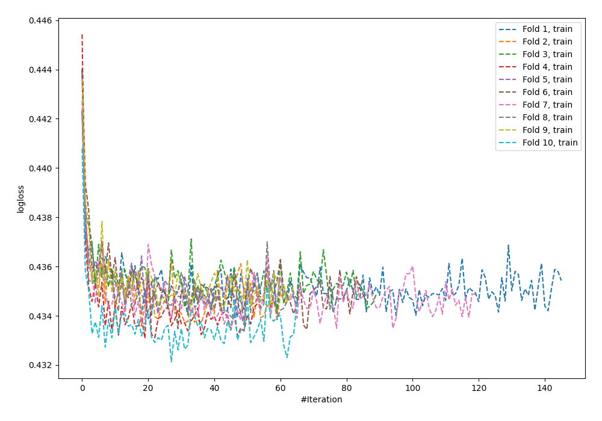
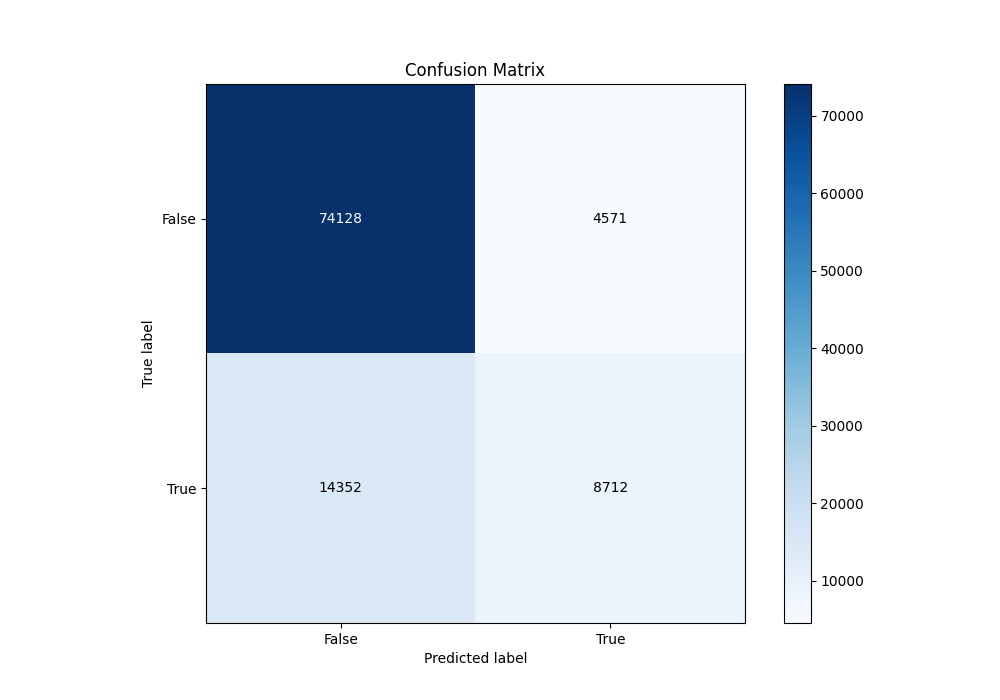
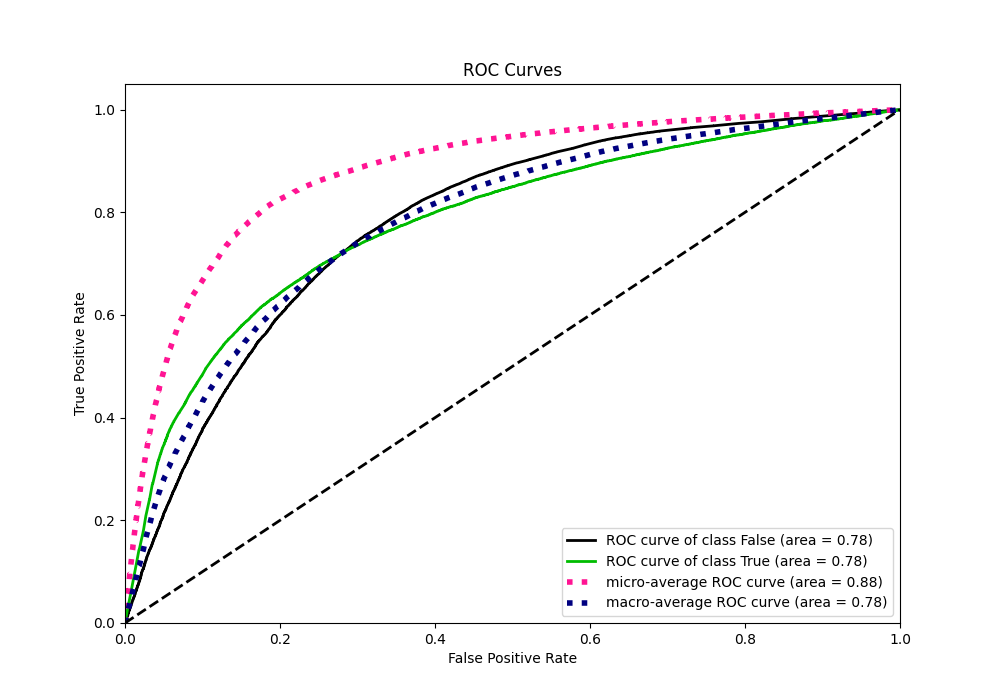
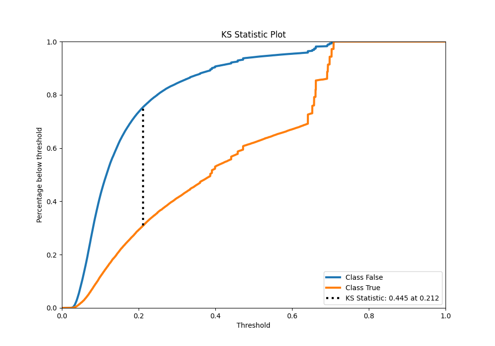
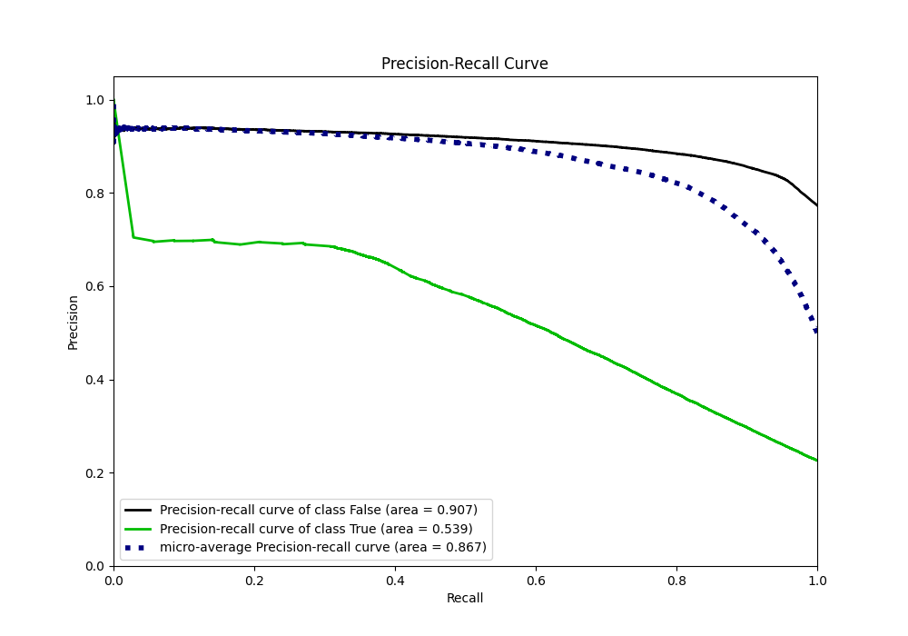
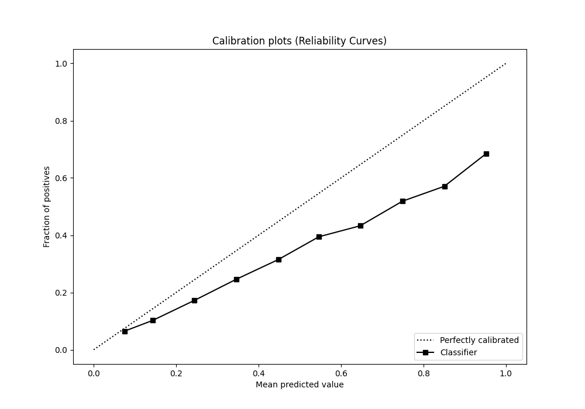
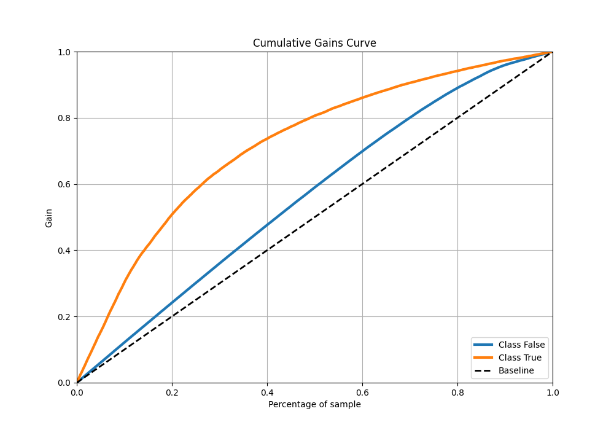
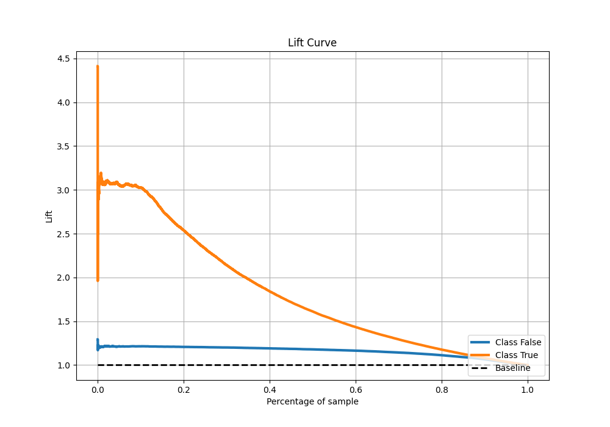

# Summary of 7_Default_NeuralNetwork

[<< Go back](../README.md)

## Neural Network
- **n_jobs**: -1
- **dense_1_size**: 32
- **dense_2_size**: 16
- **learning_rate**: 0.05
- **explain_level**: 0

## Validation
 - **validation_type**: kfold
 - **shuffle**: True
 - **stratify**: True
 - **k_folds**: 10

## Optimized metric
auc

## Training time

135.7 seconds

## Metric details
|           |    score |     threshold |
|:----------|---------:|--------------:|
| logloss   | 0.434668 | nan           |
| auc       | 0.783989 | nan           |
| f1        | 0.555382 |   0.279264    |
| accuracy  | 0.814048 |   0.503715    |
| precision | 0.704545 |   0.703206    |
| recall    | 1        |   7.74913e-09 |
| mcc       | 0.418068 |   0.348714    |

## Metric details with threshold from accuracy metric
|           |    score |   threshold |
|:----------|---------:|------------:|
| logloss   | 0.434668 |  nan        |
| auc       | 0.783989 |  nan        |
| f1        | 0.479379 |    0.503715 |
| accuracy  | 0.814048 |    0.503715 |
| precision | 0.655876 |    0.503715 |
| recall    | 0.377732 |    0.503715 |
| mcc       | 0.397242 |    0.503715 |

## Confusion matrix (at threshold=0.503715)
|                  |   Predicted as False |   Predicted as True |
|:-----------------|---------------------:|--------------------:|
| Labeled as False |                74128 |                4571 |
| Labeled as True  |                14352 |                8712 |

## Learning curves

## Confusion Matrix

## Normalized Confusion Matrix

## ROC Curve

## Kolmogorov-Smirnov Statistic

## Precision-Recall Curve

## Calibration Curve

## Cumulative Gains Curve

## Lift Curve

[<< Go back](../README.md)
