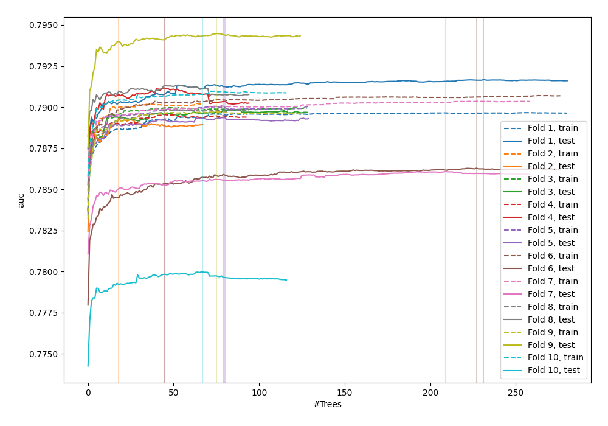
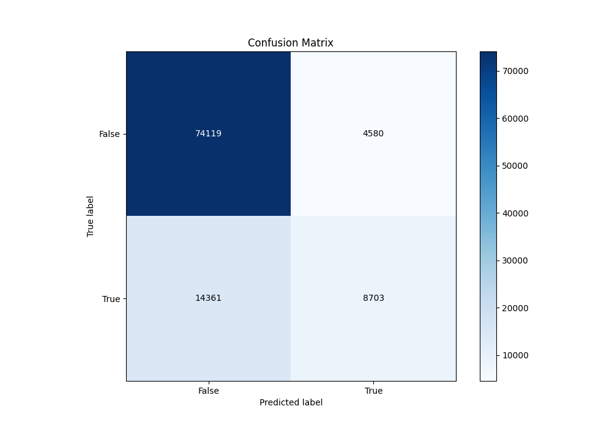
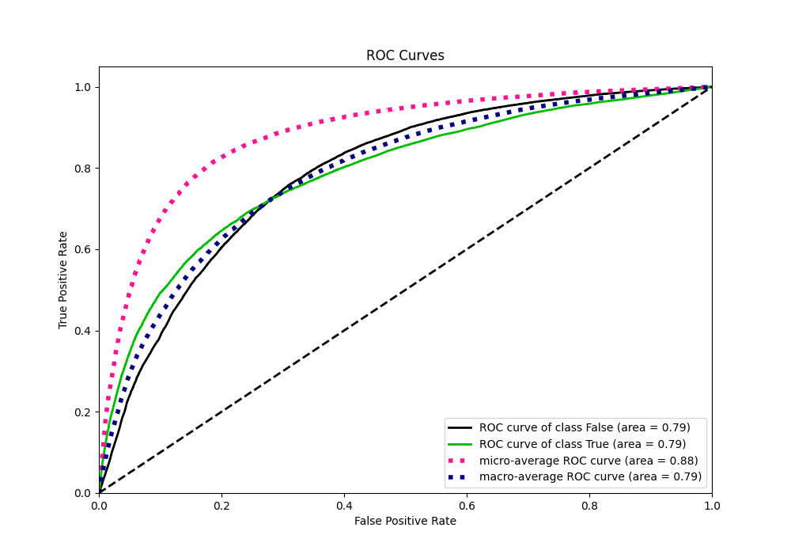
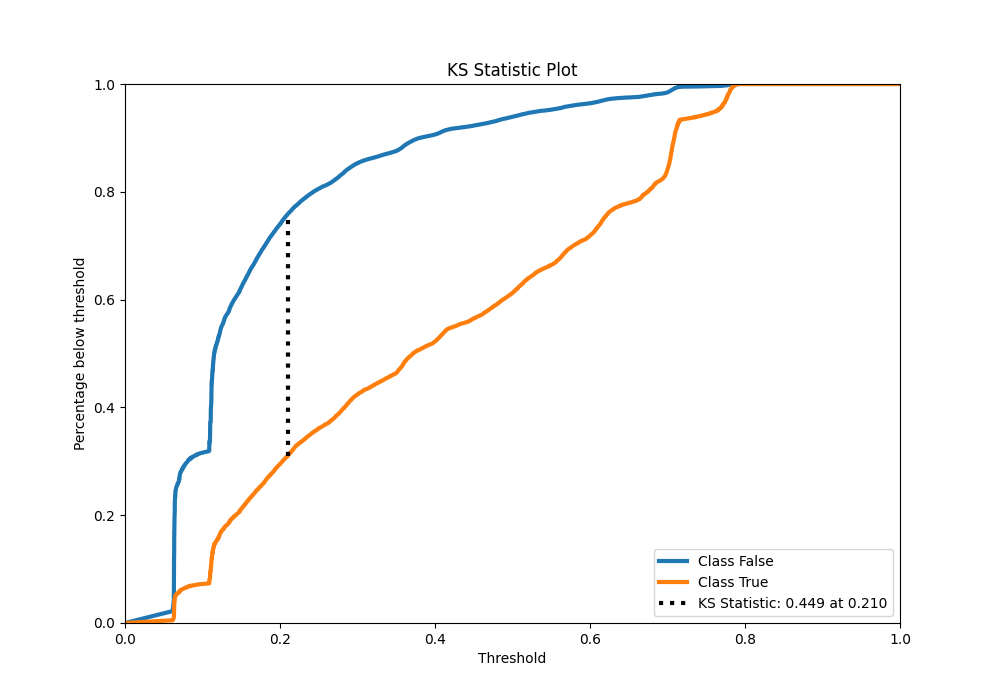
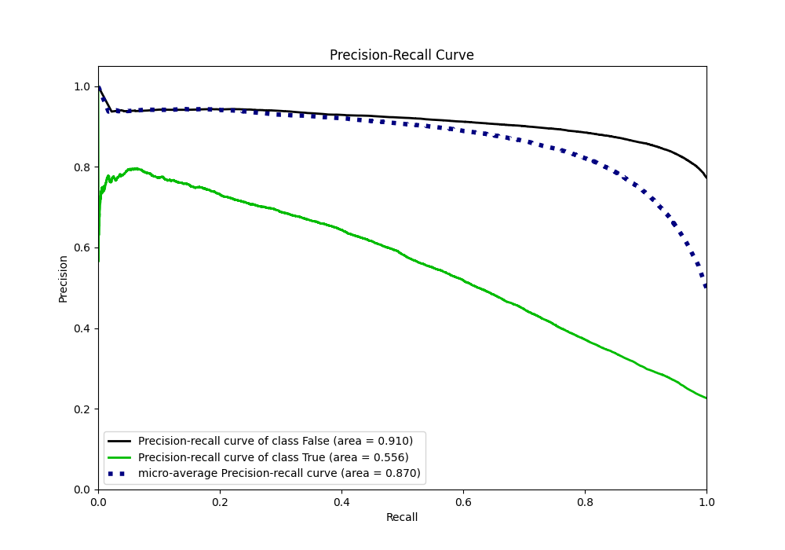
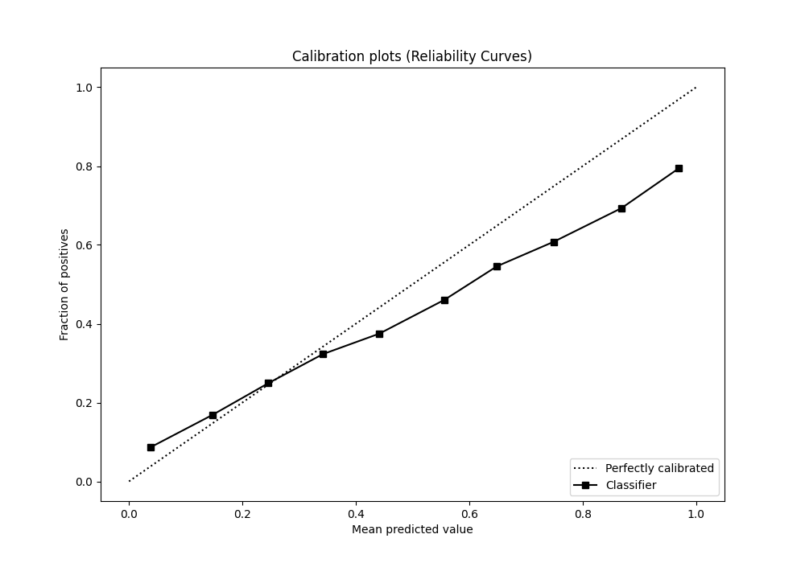
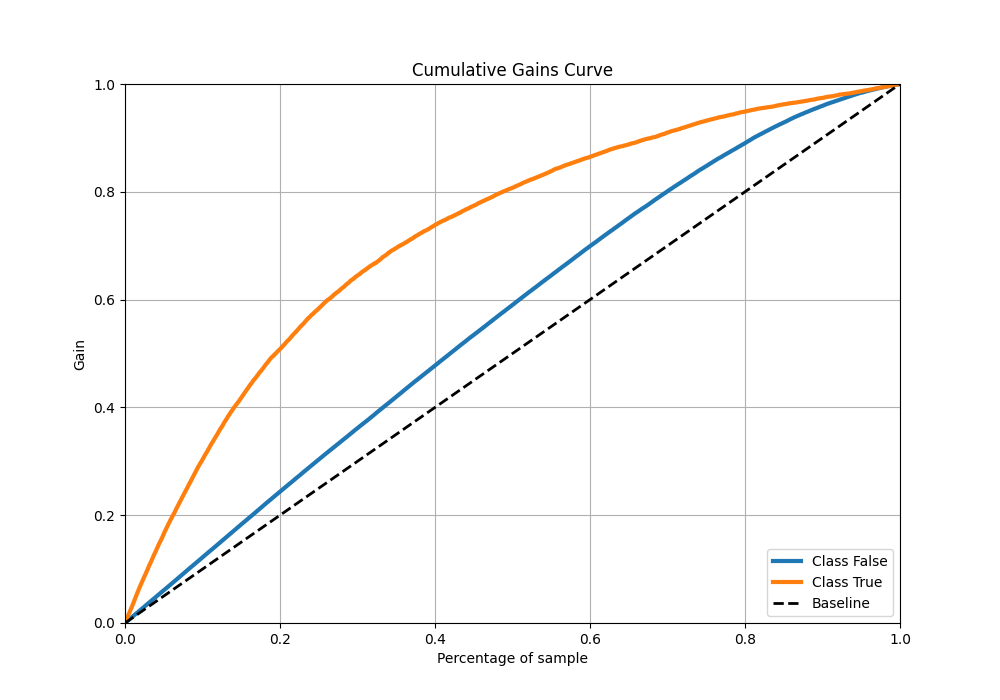
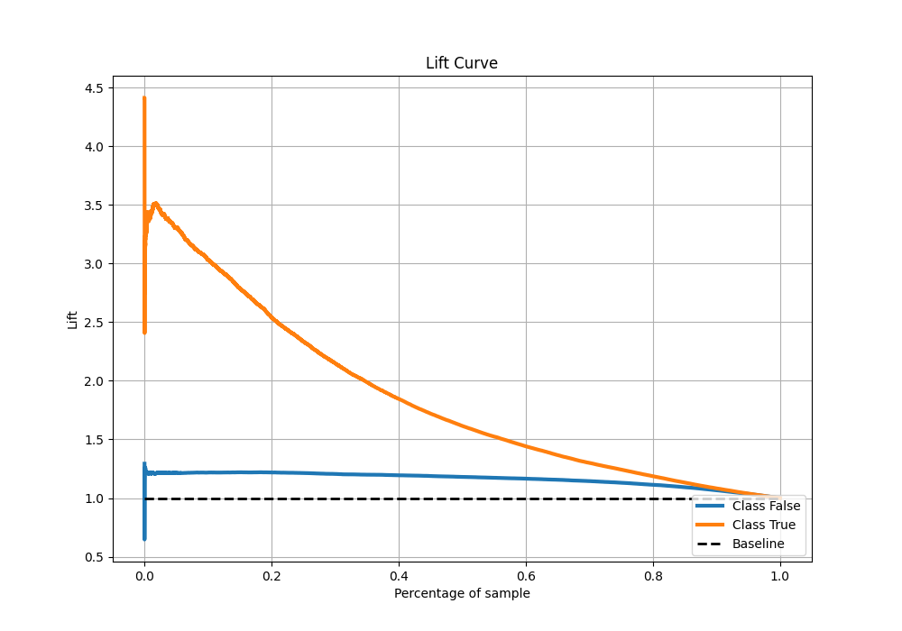

# Summary of 8_Default_RandomForest

[<< Go back](../README.md)

## Random Forest
- **n_jobs**: -1
- **criterion**: gini
- **max_features**: 0.9
- **min_samples_split**: 30
- **max_depth**: 4
- **eval_metric_name**: auc
- **explain_level**: 0

## Validation
 - **validation_type**: kfold
 - **shuffle**: True
 - **stratify**: True
 - **k_folds**: 10

## Optimized metric
auc

## Training time

106.4 seconds

## Metric details
|           |    score |   threshold |
|:----------|---------:|------------:|
| logloss   | 0.431469 | nan         |
| auc       | 0.788211 | nan         |
| f1        | 0.556609 |   0.284401  |
| accuracy  | 0.813871 |   0.507536  |
| precision | 0.791587 |   0.713802  |
| recall    | 1        |   0.0553754 |
| mcc       | 0.418974 |   0.377566  |

## Metric details with threshold from accuracy metric
|           |    score |   threshold |
|:----------|---------:|------------:|
| logloss   | 0.431469 |  nan        |
| auc       | 0.788211 |  nan        |
| f1        | 0.478884 |    0.507536 |
| accuracy  | 0.813871 |    0.507536 |
| precision | 0.655198 |    0.507536 |
| recall    | 0.377341 |    0.507536 |
| mcc       | 0.396615 |    0.507536 |

## Confusion matrix (at threshold=0.507536)
|                  |   Predicted as False |   Predicted as True |
|:-----------------|---------------------:|--------------------:|
| Labeled as False |                74119 |                4580 |
| Labeled as True  |                14361 |                8703 |

## Learning curves

## Confusion Matrix

## Normalized Confusion Matrix

## ROC Curve

## Kolmogorov-Smirnov Statistic

## Precision-Recall Curve

## Calibration Curve

## Cumulative Gains Curve

## Lift Curve

[<< Go back](../README.md)
