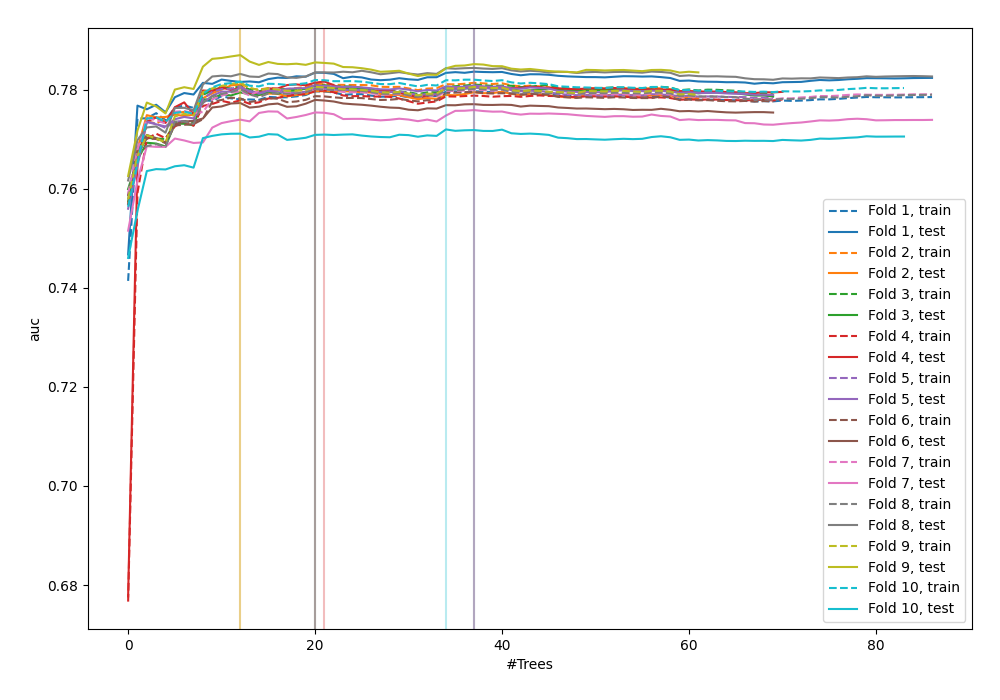
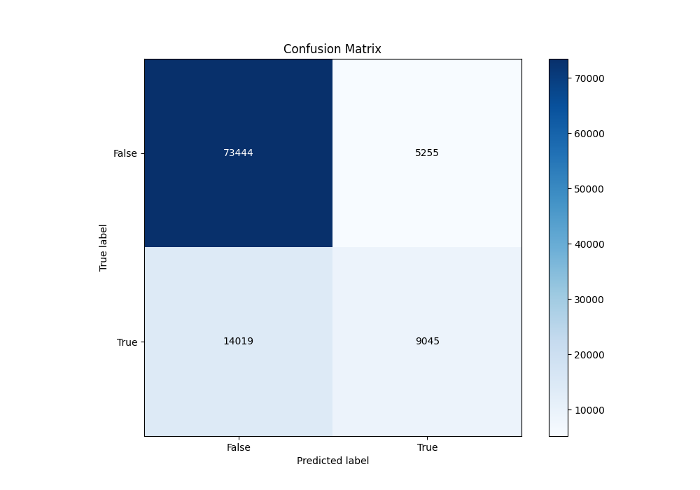
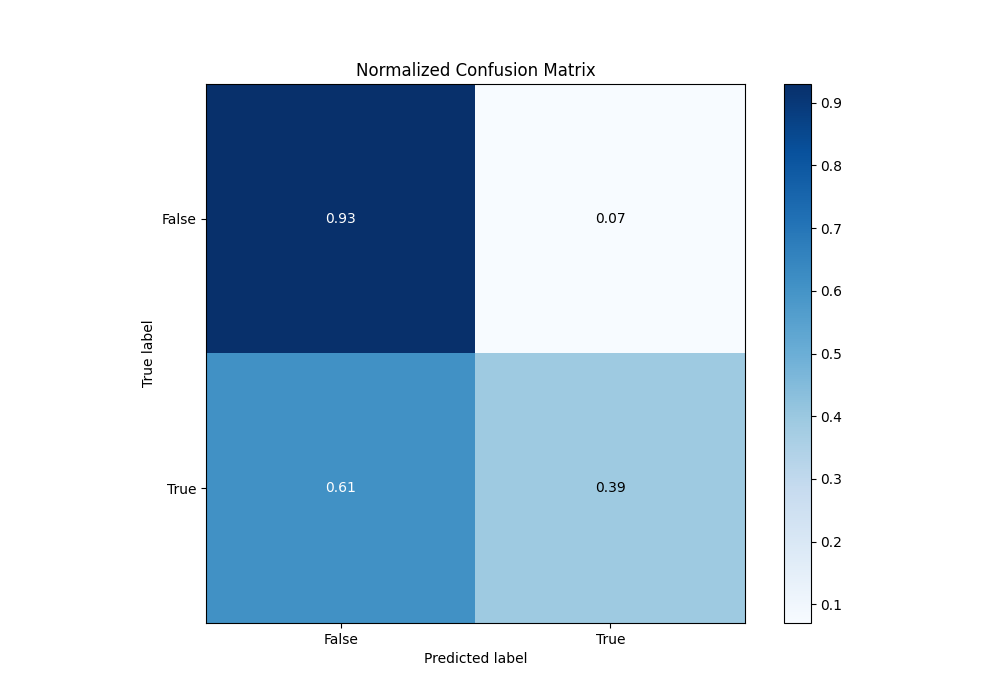
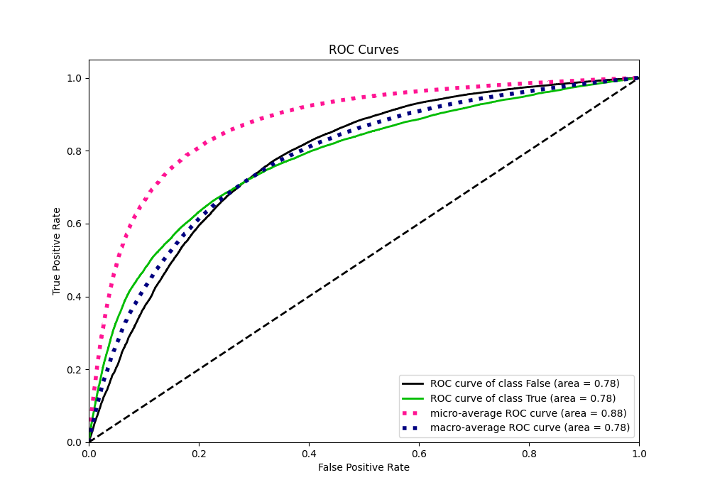
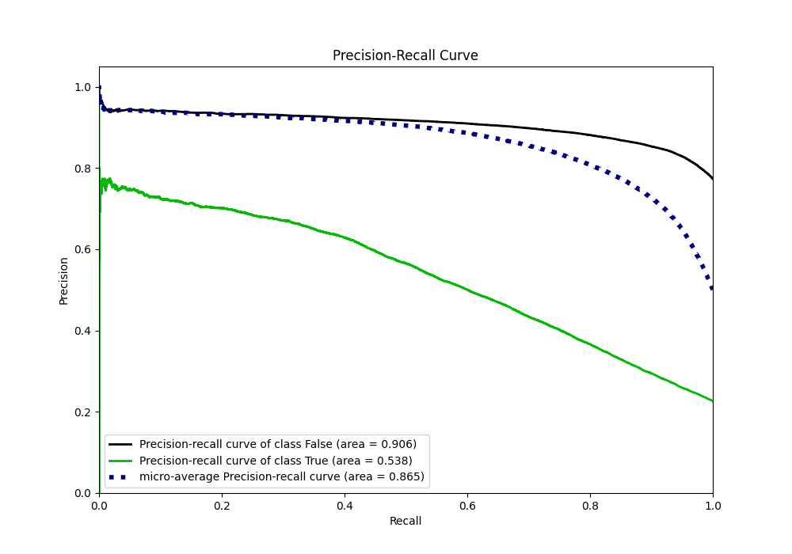
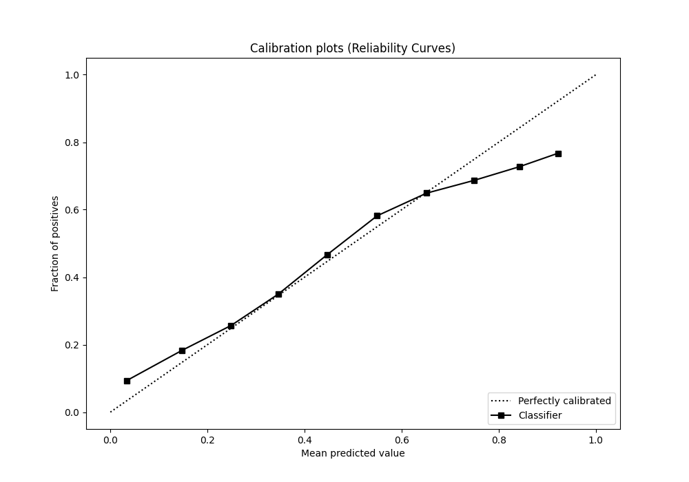
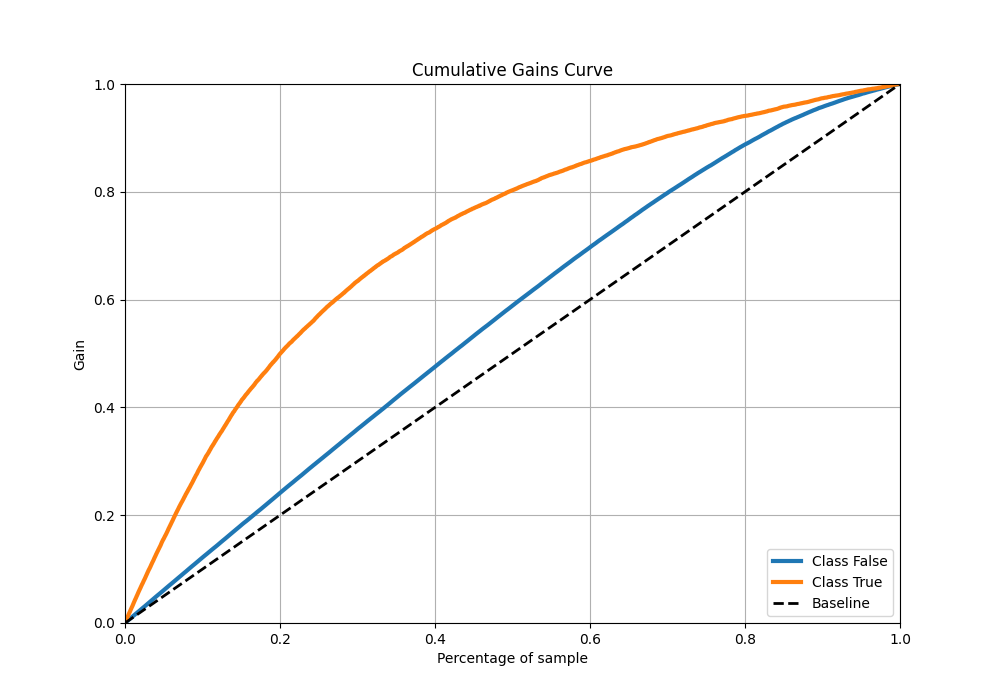
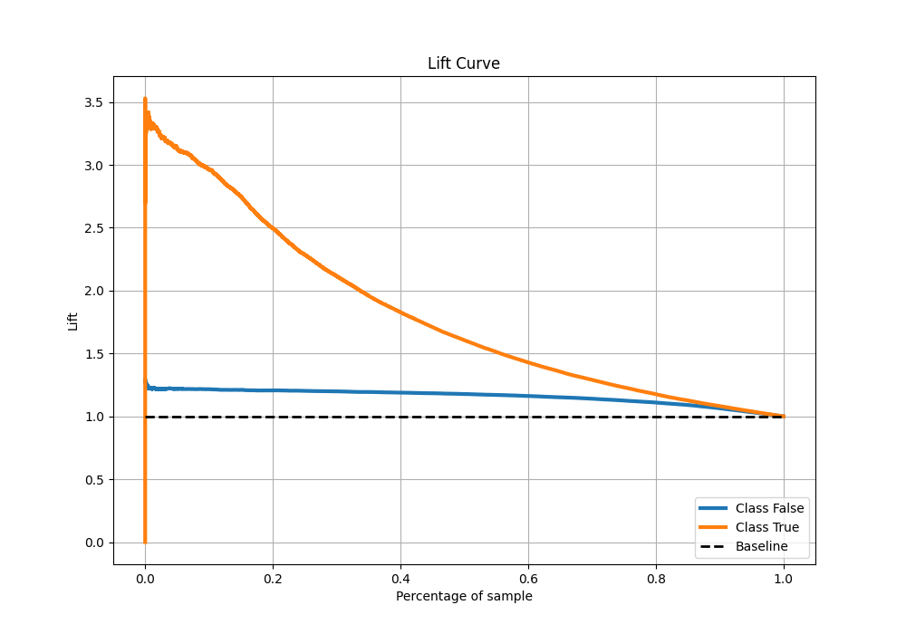

# Summary of 9_Default_ExtraTrees

[<< Go back](../README.md)

## Extra Trees Classifier (Extra Trees)
- **n_jobs**: -1
- **criterion**: gini
- **max_features**: 0.9
- **min_samples_split**: 30
- **max_depth**: 4
- **eval_metric_name**: auc
- **explain_level**: 0

## Validation
 - **validation_type**: kfold
 - **shuffle**: True
 - **stratify**: True
 - **k_folds**: 10

## Optimized metric
auc

## Training time

44.7 seconds

## Metric details
|           |    score |   threshold |
|:----------|---------:|------------:|
| logloss   | 0.443273 | nan         |
| auc       | 0.779589 | nan         |
| f1        | 0.545848 |   0.272731  |
| accuracy  | 0.810599 |   0.405601  |
| precision | 0.748842 |   0.680916  |
| recall    | 1        |   0.0855336 |
| mcc       | 0.405402 |   0.338057  |

## Metric details with threshold from accuracy metric
|           |    score |   threshold |
|:----------|---------:|------------:|
| logloss   | 0.443273 |  nan        |
| auc       | 0.779589 |  nan        |
| f1        | 0.484156 |    0.405601 |
| accuracy  | 0.810599 |    0.405601 |
| precision | 0.632517 |    0.405601 |
| recall    | 0.39217  |    0.405601 |
| mcc       | 0.391998 |    0.405601 |

## Confusion matrix (at threshold=0.405601)
|                  |   Predicted as False |   Predicted as True |
|:-----------------|---------------------:|--------------------:|
| Labeled as False |                73444 |                5255 |
| Labeled as True  |                14019 |                9045 |

## Learning curves

## Confusion Matrix

## Normalized Confusion Matrix

## ROC Curve

## Kolmogorov-Smirnov Statistic

## Precision-Recall Curve

## Calibration Curve

## Cumulative Gains Curve

## Lift Curve

[<< Go back](../README.md)
