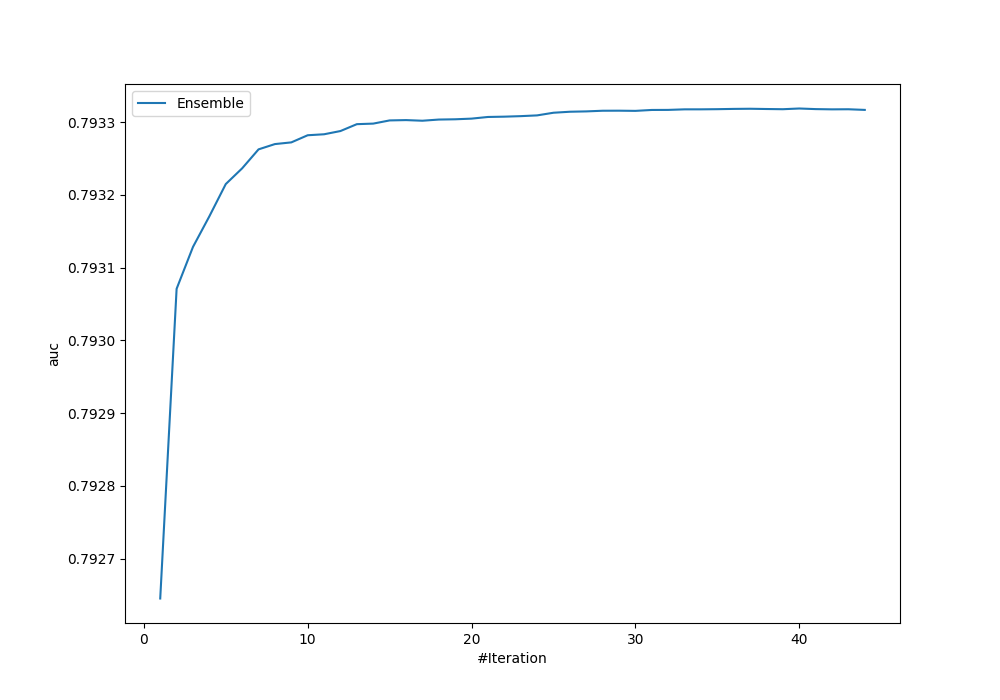
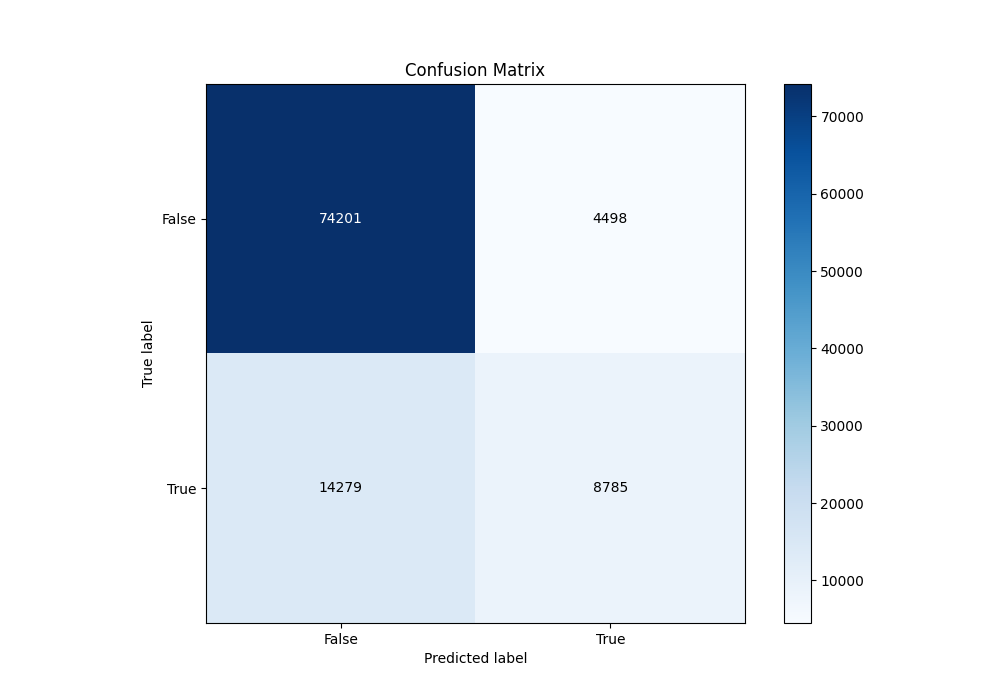
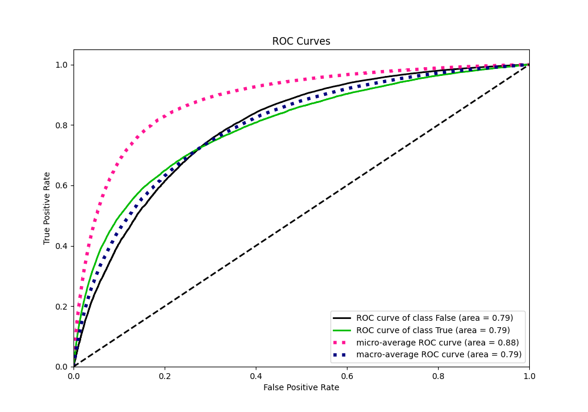
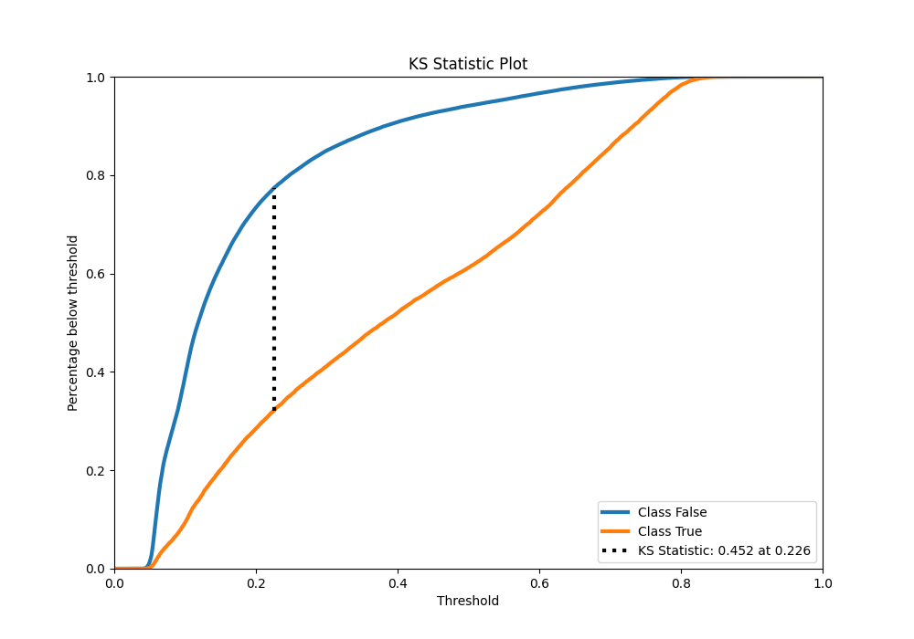
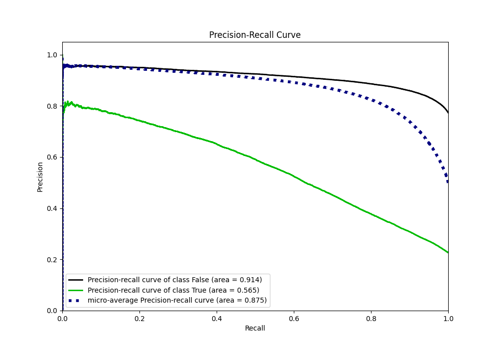
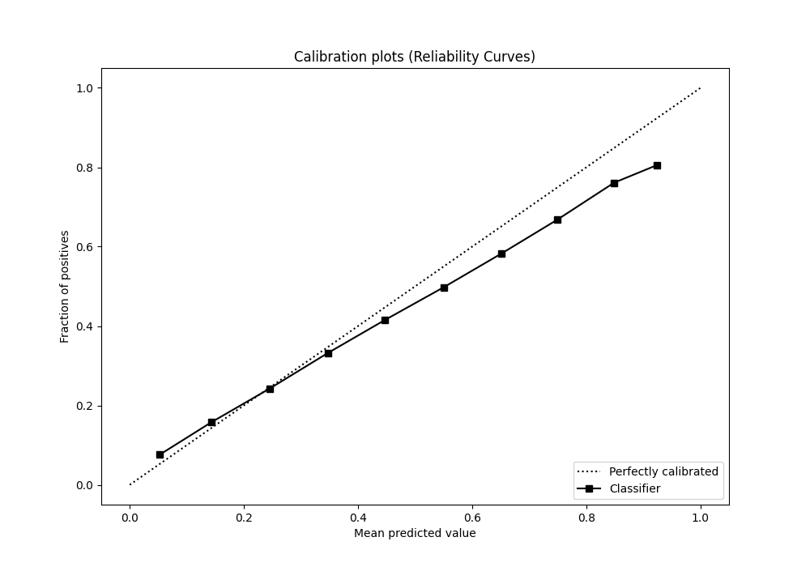
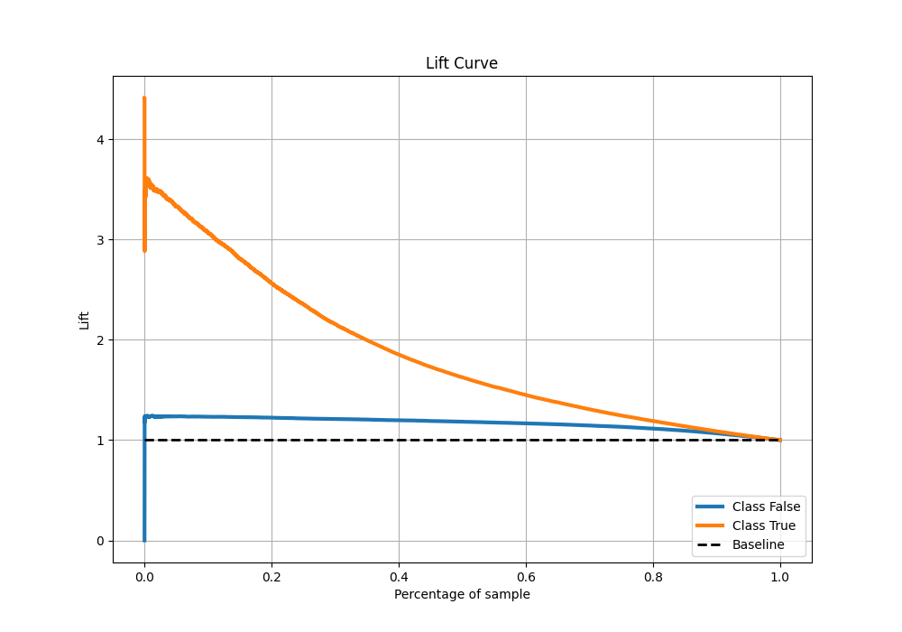

# Summary of Ensemble

[<< Go back](../README.md)

## Ensemble structure
| Model                     |   Weight |
|:--------------------------|---------:|
| 10_Xgboost                |        1 |
| 12_Xgboost                |        4 |
| 12_Xgboost_GoldenFeatures |        6 |
| 20_LightGBM               |        2 |
| 28_CatBoost               |        1 |
| 29_CatBoost               |        4 |
| 56_NeuralNetwork          |        1 |
| 58_Xgboost                |        2 |
| 61_CatBoost               |        1 |
| 62_CatBoost               |        4 |
| 65_Xgboost                |        9 |
| 66_Xgboost                |        1 |
| 6_Default_CatBoost        |        3 |
| 7_Default_NeuralNetwork   |        1 |

## Metric details
|           |    score |   threshold |
|:----------|---------:|------------:|
| logloss   | 0.42806  | nan         |
| auc       | 0.793319 | nan         |
| f1        | 0.559988 |   0.298694  |
| accuracy  | 0.815483 |   0.508282  |
| precision | 0.804449 |   0.780768  |
| recall    | 1        |   0.0330475 |
| mcc       | 0.424954 |   0.32424   |

## Metric details with threshold from accuracy metric
|           |    score |   threshold |
|:----------|---------:|------------:|
| logloss   | 0.42806  |  nan        |
| auc       | 0.793319 |  nan        |
| f1        | 0.483396 |    0.508282 |
| accuracy  | 0.815483 |    0.508282 |
| precision | 0.661372 |    0.508282 |
| recall    | 0.380897 |    0.508282 |
| mcc       | 0.402328 |    0.508282 |

## Confusion matrix (at threshold=0.508282)
|                  |   Predicted as False |   Predicted as True |
|:-----------------|---------------------:|--------------------:|
| Labeled as False |                74201 |                4498 |
| Labeled as True  |                14279 |                8785 |

## Learning curves

## Confusion Matrix

## Normalized Confusion Matrix

## ROC Curve

## Kolmogorov-Smirnov Statistic

## Precision-Recall Curve

## Calibration Curve

## Cumulative Gains Curve

## Lift Curve

[<< Go back](../README.md)
