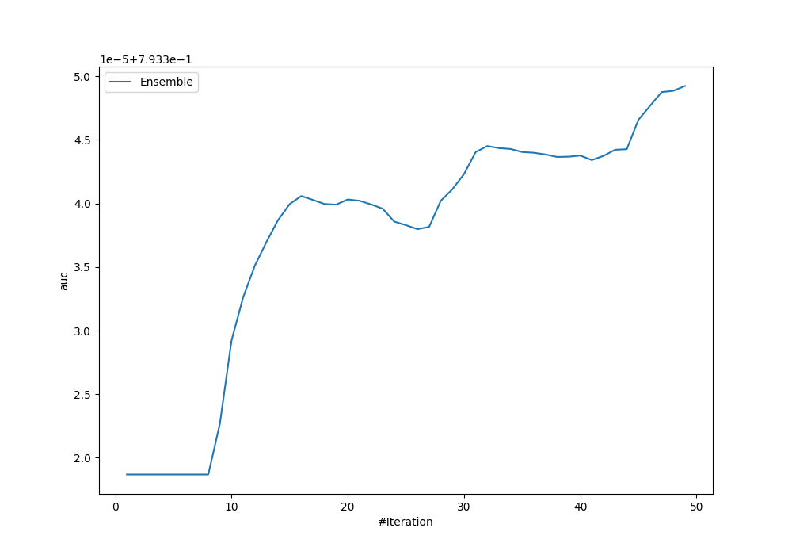
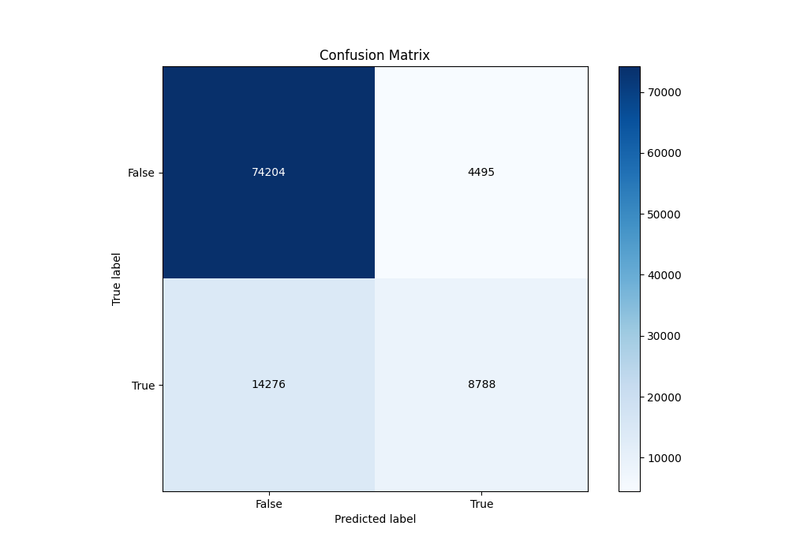
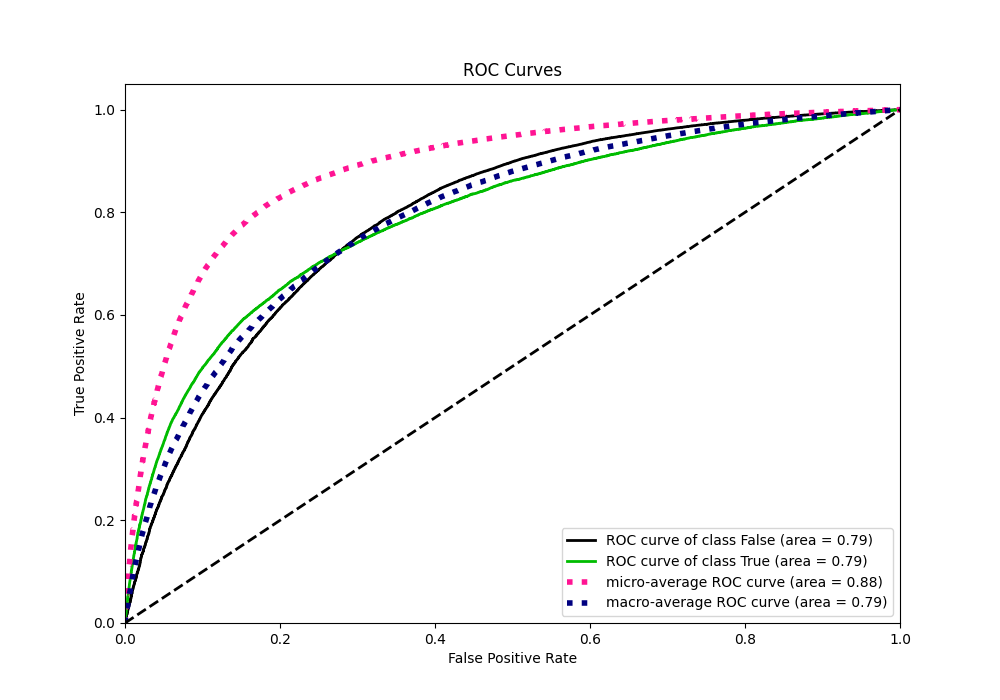
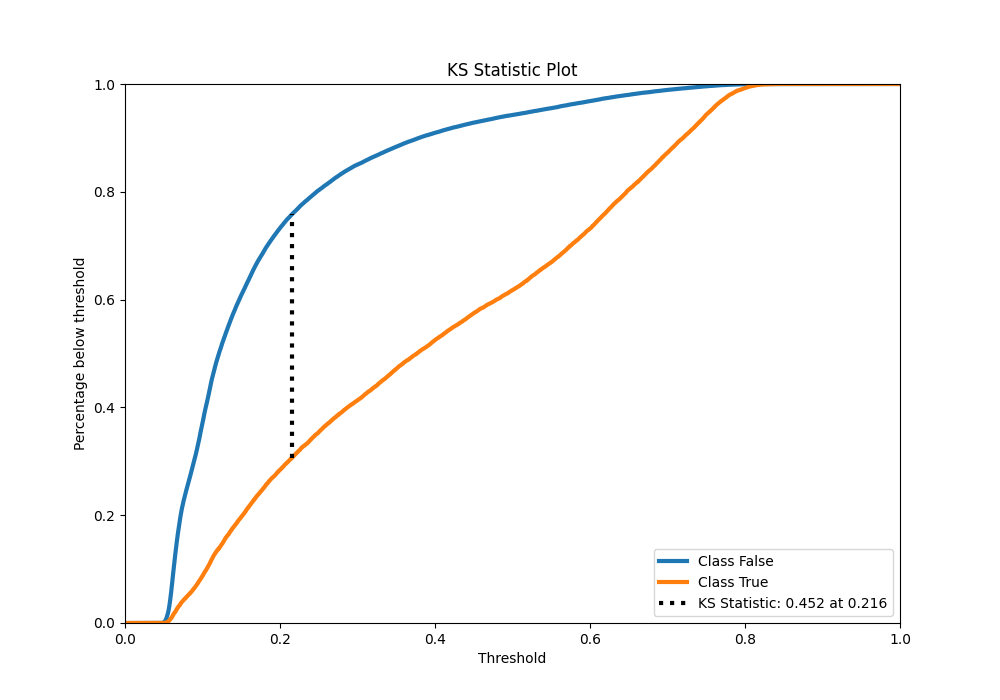
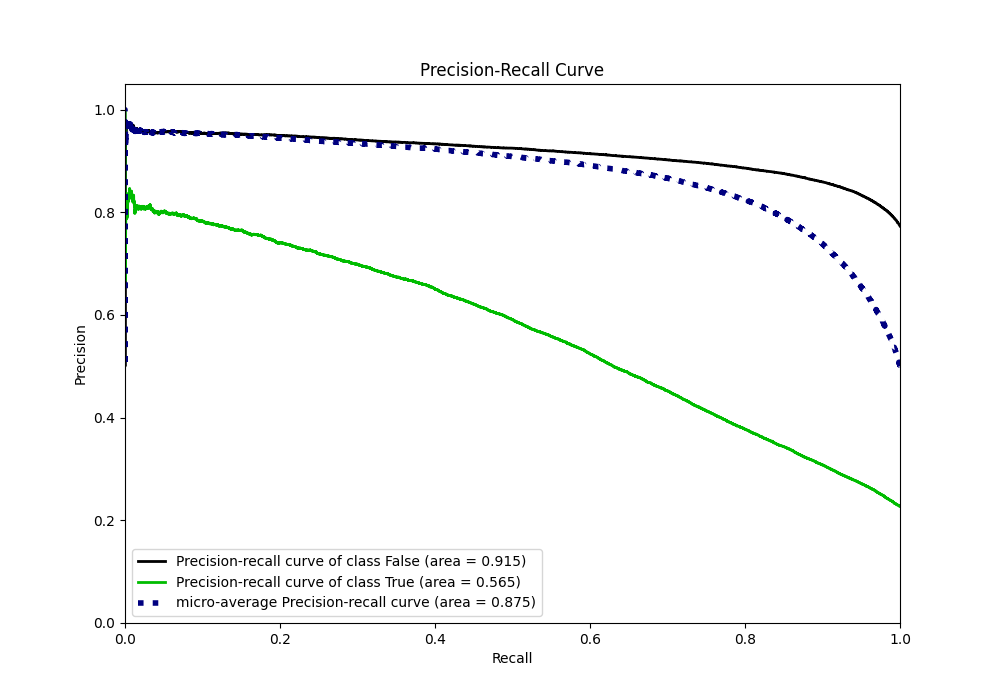
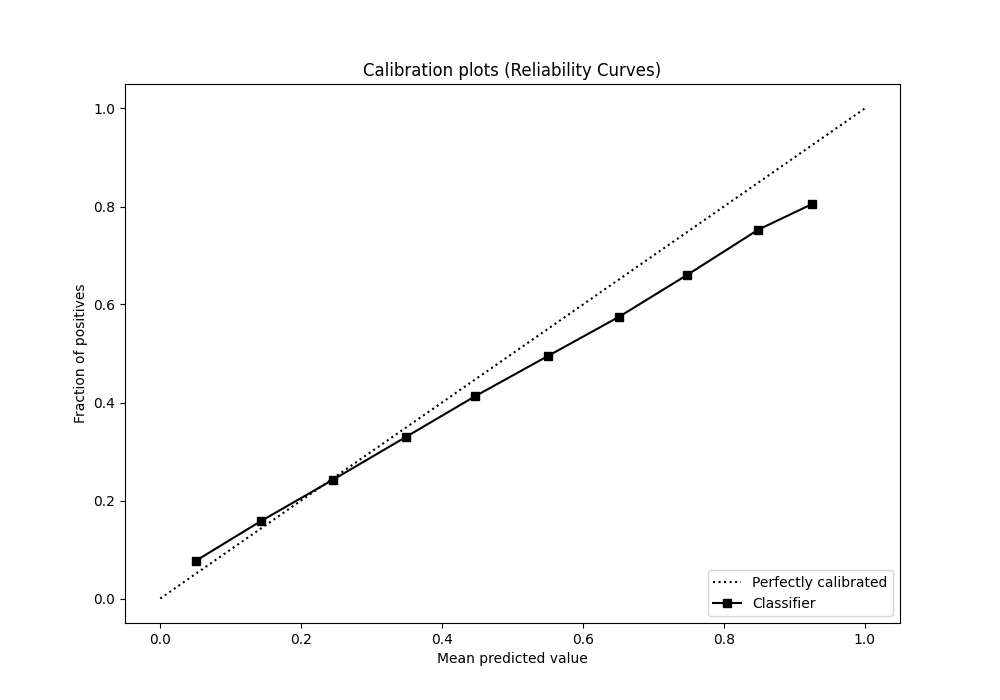
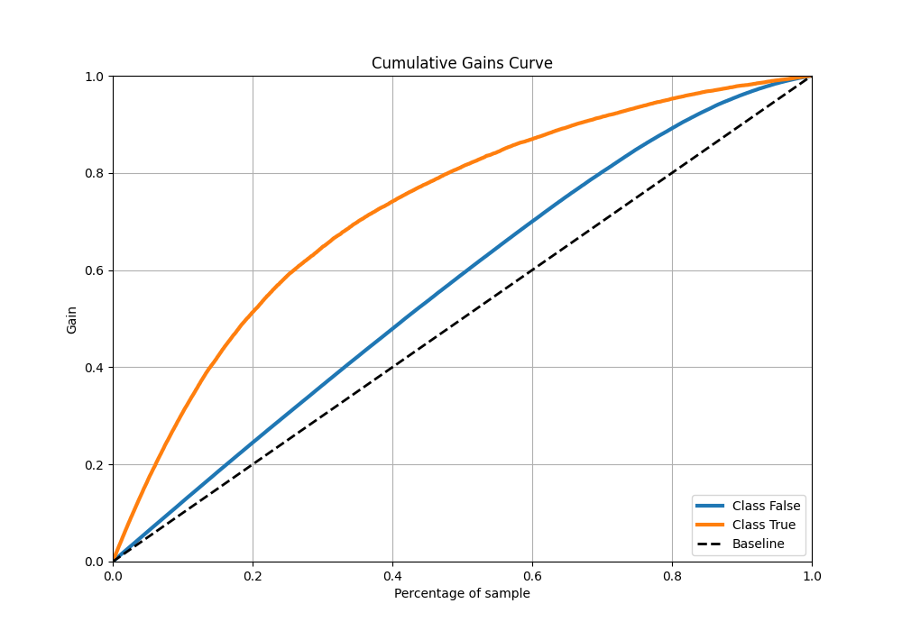
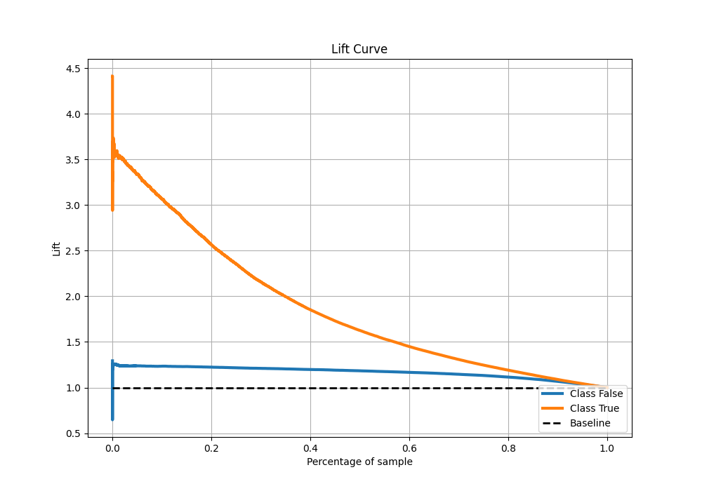

# Summary of Ensemble_Stacked

[<< Go back](../README.md)

## Ensemble structure
| Model                     |   Weight |
|:--------------------------|---------:|
| 12_Xgboost                |        1 |
| 12_Xgboost_GoldenFeatures |        1 |
| 20_LightGBM               |        2 |
| 29_CatBoost               |        2 |
| 56_NeuralNetwork          |        1 |
| 58_Xgboost                |        1 |
| 59_LightGBM_Stacked       |        3 |
| 65_Xgboost                |        2 |
| 65_Xgboost_Stacked        |        1 |
| 66_Xgboost                |        1 |
| 7_Default_NeuralNetwork   |        1 |
| Ensemble                  |       33 |

## Metric details
|           |    score |   threshold |
|:----------|---------:|------------:|
| logloss   | 0.428265 | nan         |
| auc       | 0.793349 | nan         |
| f1        | 0.559947 |   0.297489  |
| accuracy  | 0.815542 |   0.501712  |
| precision | 0.803522 |   0.764436  |
| recall    | 1        |   0.0399527 |
| mcc       | 0.425259 |   0.336032  |

## Metric details with threshold from accuracy metric
|           |    score |   threshold |
|:----------|---------:|------------:|
| logloss   | 0.428265 |  nan        |
| auc       | 0.793349 |  nan        |
| f1        | 0.483561 |    0.501712 |
| accuracy  | 0.815542 |    0.501712 |
| precision | 0.661598 |    0.501712 |
| recall    | 0.381027 |    0.501712 |
| mcc       | 0.402537 |    0.501712 |

## Confusion matrix (at threshold=0.501712)
|                  |   Predicted as False |   Predicted as True |
|:-----------------|---------------------:|--------------------:|
| Labeled as False |                74204 |                4495 |
| Labeled as True  |                14276 |                8788 |

## Learning curves

## Confusion Matrix

## Normalized Confusion Matrix

## ROC Curve

## Kolmogorov-Smirnov Statistic

## Precision-Recall Curve

## Calibration Curve

## Cumulative Gains Curve

## Lift Curve

[<< Go back](../README.md)
