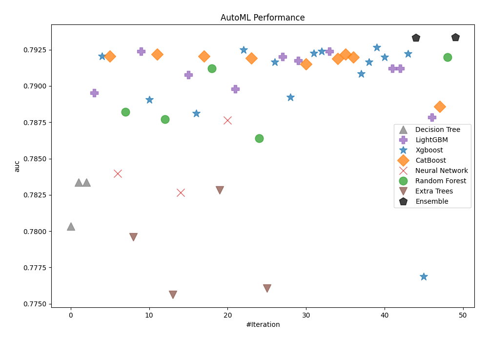
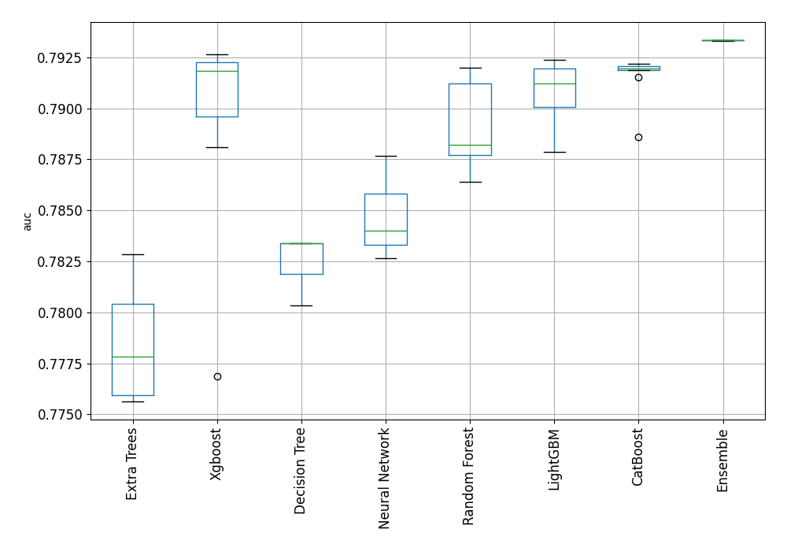
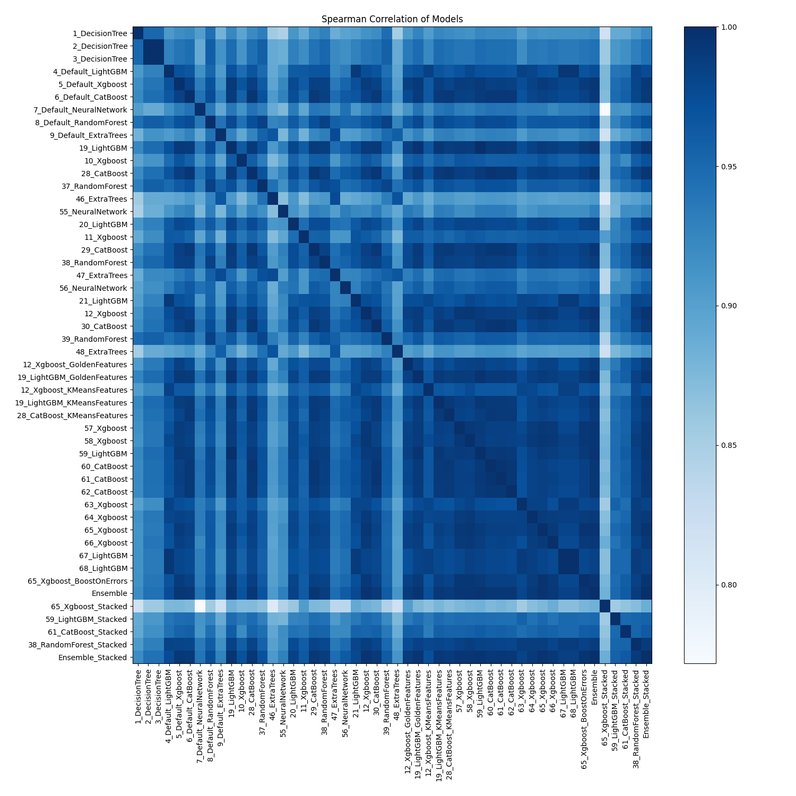

# AutoML Leaderboard

| Best model   | name                                                               | model_type     | metric_type   |   metric_value |   train_time |
|:-------------|:-------------------------------------------------------------------|:---------------|:--------------|---------------:|-------------:|
|              | [1_DecisionTree](1_DecisionTree/README.md)                         | Decision Tree  | auc           |       0.780351 |        16.51 |
|              | [2_DecisionTree](2_DecisionTree/README.md)                         | Decision Tree  | auc           |       0.783386 |        17.43 |
|              | [3_DecisionTree](3_DecisionTree/README.md)                         | Decision Tree  | auc           |       0.783386 |        17.03 |
|              | [4_Default_LightGBM](4_Default_LightGBM/README.md)                 | LightGBM       | auc           |       0.789536 |        24.91 |
|              | [5_Default_Xgboost](5_Default_Xgboost/README.md)                   | Xgboost        | auc           |       0.792059 |        33.12 |
|              | [6_Default_CatBoost](6_Default_CatBoost/README.md)                 | CatBoost       | auc           |       0.792043 |        47.67 |
|              | [7_Default_NeuralNetwork](7_Default_NeuralNetwork/README.md)       | Neural Network | auc           |       0.783989 |       136.77 |
|              | [8_Default_RandomForest](8_Default_RandomForest/README.md)         | Random Forest  | auc           |       0.788211 |       107.53 |
|              | [9_Default_ExtraTrees](9_Default_ExtraTrees/README.md)             | Extra Trees    | auc           |       0.779589 |        45.74 |
|              | [19_LightGBM](19_LightGBM/README.md)                               | LightGBM       | auc           |       0.792378 |        26.41 |
|              | [10_Xgboost](10_Xgboost/README.md)                                 | Xgboost        | auc           |       0.789057 |        30.95 |
|              | [28_CatBoost](28_CatBoost/README.md)                               | CatBoost       | auc           |       0.792188 |       101.21 |
|              | [37_RandomForest](37_RandomForest/README.md)                       | Random Forest  | auc           |       0.787705 |        73.83 |
|              | [46_ExtraTrees](46_ExtraTrees/README.md)                           | Extra Trees    | auc           |       0.775643 |        64.64 |
|              | [55_NeuralNetwork](55_NeuralNetwork/README.md)                     | Neural Network | auc           |       0.782657 |       133.9  |
|              | [20_LightGBM](20_LightGBM/README.md)                               | LightGBM       | auc           |       0.790772 |        21.78 |
|              | [11_Xgboost](11_Xgboost/README.md)                                 | Xgboost        | auc           |       0.788099 |        29.53 |
|              | [29_CatBoost](29_CatBoost/README.md)                               | CatBoost       | auc           |       0.792061 |        57.81 |
|              | [38_RandomForest](38_RandomForest/README.md)                       | Random Forest  | auc           |       0.791212 |       127.95 |
|              | [47_ExtraTrees](47_ExtraTrees/README.md)                           | Extra Trees    | auc           |       0.782846 |        96.48 |
|              | [56_NeuralNetwork](56_NeuralNetwork/README.md)                     | Neural Network | auc           |       0.787653 |       280.94 |
|              | [21_LightGBM](21_LightGBM/README.md)                               | LightGBM       | auc           |       0.789811 |        40.04 |
|              | [12_Xgboost](12_Xgboost/README.md)                                 | Xgboost        | auc           |       0.792478 |        42.3  |
|              | [30_CatBoost](30_CatBoost/README.md)                               | CatBoost       | auc           |       0.791918 |        66.2  |
|              | [39_RandomForest](39_RandomForest/README.md)                       | Random Forest  | auc           |       0.786385 |       127.83 |
|              | [48_ExtraTrees](48_ExtraTrees/README.md)                           | Extra Trees    | auc           |       0.776056 |        66.1  |
|              | [12_Xgboost_GoldenFeatures](12_Xgboost_GoldenFeatures/README.md)   | Xgboost        | auc           |       0.791649 |        58.31 |
|              | [19_LightGBM_GoldenFeatures](19_LightGBM_GoldenFeatures/README.md) | LightGBM       | auc           |       0.792034 |        52.02 |
|              | [12_Xgboost_KMeansFeatures](12_Xgboost_KMeansFeatures/README.md)   | Xgboost        | auc           |       0.789208 |        52.9  |
|              | [19_LightGBM_KMeansFeatures](19_LightGBM_KMeansFeatures/README.md) | LightGBM       | auc           |       0.791761 |        45.67 |
|              | [28_CatBoost_KMeansFeatures](28_CatBoost_KMeansFeatures/README.md) | CatBoost       | auc           |       0.791519 |       164.77 |
|              | [57_Xgboost](57_Xgboost/README.md)                                 | Xgboost        | auc           |       0.792257 |        42.99 |
|              | [58_Xgboost](58_Xgboost/README.md)                                 | Xgboost        | auc           |       0.792388 |        42.94 |
|              | [59_LightGBM](59_LightGBM/README.md)                               | LightGBM       | auc           |       0.792378 |        44.26 |
|              | [60_CatBoost](60_CatBoost/README.md)                               | CatBoost       | auc           |       0.791885 |       125.9  |
|              | [61_CatBoost](61_CatBoost/README.md)                               | CatBoost       | auc           |       0.792192 |       131.58 |
|              | [62_CatBoost](62_CatBoost/README.md)                               | CatBoost       | auc           |       0.791969 |        80.07 |
|              | [63_Xgboost](63_Xgboost/README.md)                                 | Xgboost        | auc           |       0.790828 |        41.57 |
|              | [64_Xgboost](64_Xgboost/README.md)                                 | Xgboost        | auc           |       0.791663 |        34.31 |
|              | [65_Xgboost](65_Xgboost/README.md)                                 | Xgboost        | auc           |       0.792645 |        43.25 |
|              | [66_Xgboost](66_Xgboost/README.md)                                 | Xgboost        | auc           |       0.79198  |        34.62 |
|              | [67_LightGBM](67_LightGBM/README.md)                               | LightGBM       | auc           |       0.791207 |        34.3  |
|              | [68_LightGBM](68_LightGBM/README.md)                               | LightGBM       | auc           |       0.791207 |        29.55 |
|              | [65_Xgboost_BoostOnErrors](65_Xgboost_BoostOnErrors/README.md)     | Xgboost        | auc           |       0.792226 |        37.73 |
|              | [Ensemble](Ensemble/README.md)                                     | Ensemble       | auc           |       0.793319 |        55.45 |
|              | [65_Xgboost_Stacked](65_Xgboost_Stacked/README.md)                 | Xgboost        | auc           |       0.776885 |        35.26 |
|              | [59_LightGBM_Stacked](59_LightGBM_Stacked/README.md)               | LightGBM       | auc           |       0.787846 |        27.4  |
|              | [61_CatBoost_Stacked](61_CatBoost_Stacked/README.md)               | CatBoost       | auc           |       0.788579 |        68.38 |
|              | [38_RandomForest_Stacked](38_RandomForest_Stacked/README.md)       | Random Forest  | auc           |       0.791996 |       678.54 |
| **the best** | [Ensemble_Stacked](Ensemble_Stacked/README.md)                     | Ensemble       | auc           |       0.793349 |        66.31 |

### AutoML Performance

### AutoML Performance Boxplot

### Spearman Correlation of Models

